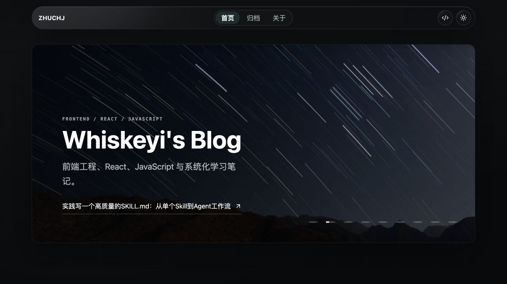
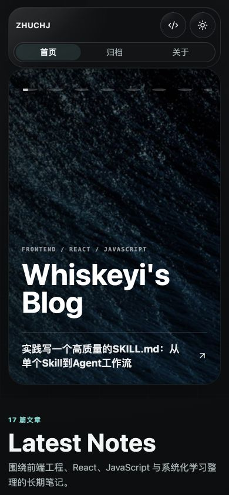

# Next Liquid Blog

[English](./README.md) | [简体中文](./README.zh-CN.md)

A static Next.js blog template for technical notes, long-form writing, and GitHub Pages publishing.

## Preview

### Home



### Article


### Mobile

<p align="center">
  
</p>

## Stack

- Next.js App Router with static export
- React 19 and TypeScript
- React Markdown with GFM, safe raw HTML, heading anchors, and Shiki highlighting
- GitHub Pages-friendly build output

## Global Configuration

Most site-level settings live in one file:

```text
lib/site.ts
```

Edit this file to change the site name, author, metadata, production URL, navigation, social links, homepage hero content, About page copy, timeline items, and hero images.

Common fields to update first:

- `name`, `title`, `author`, `description`, and `url`
- `links.github`
- `navigation`
- `home.heroImages`, `home.heroTitle`, and `home.feedDescription`
- `about.description`, `about.heroImage`, and `about.timeline`

This is the first place to update when cloning the template for a new blog. It controls the global brand, top navigation, homepage, About page, and reusable hero image assets.

## Language switching

Use the `EN` / `中` button in the navigation to switch the interface and articles between Simplified Chinese (the default) and English. The preference is stored under `locale` in browser `localStorage` and stays in sync across reloads, page navigation, and tabs on the same origin.

Interface messages and the English work timeline live in `lib/i18n.ts`. Client components use `useI18n()`; server pages render translations with `LocalizedText`, `LocalizedDate`, and related components. Dates, counts, and accessibility labels follow the selected language.

The publication time zone is configured by `siteConfig.timeZone` (default: `Asia/Shanghai`), keeping article dates consistent between static HTML and the browser.

All 18 historical articles have full English versions. Titles, summaries, article bodies, contents, and neighboring article links follow the selected language. Both versions share URLs, dates, tags, categories, and media. Static export stays supported; build-time SEO metadata uses the default language. An absent or draft English version falls back to Chinese with a notice.

## Commands

Use Node.js 22, matching the GitHub Pages workflow.

```bash
nvm use
pnpm install
pnpm new:post
pnpm dev
pnpm build
```

`pnpm build` writes the static site to `out/`.

## Create Posts From The Command Line

Use the built-in command to create a post folder, both language files, a review snapshot, and an image directory:

```bash
pnpm new:post
```

The interactive command asks for the article title and slug. You can also pass options directly:

```bash
pnpm new:post -- --title "我的文章" --title-en "My Post" --slug 2026-07-05-my-post --subtitle "简短介绍" --subtitle-en "Short summary" --tags React,Next.js --categories Frontend
```

Useful options:

- `--title`: article title
- `--slug`: folder name under `content/posts`
- `--subtitle`: Chinese article subtitle
- `--title-en`, `--subtitle-en`: English title and subtitle (English starts as a draft)
- `--tags`: comma-separated tags
- `--categories`: comma-separated categories
- `--cover`: cover path in the post folder, defaulting to `imgs/head.jpg`
- `--dry-run`: print the paired file paths without writing files

## Content

Each article lives in its own folder under `content/posts`:

```text
content/posts/my-post-slug/
  index.md          # Simplified Chinese
  index.en.md       # English
  translations.json # Hashes of the reviewed pair
  imgs/
    head.jpg
    example.png
```

Use paths like `imgs/example.png` in markdown and `header-img: imgs/head.jpg` in frontmatter. The source images stay beside the article; `pnpm dev` and `pnpm build` sync them to `public/post-assets` so the static export can serve them.

`pnpm new:post` creates `index.md`, `index.en.md`, `translations.json`, and `imgs/`. Write complete articles in both language files. The English template has `translation-status: draft`; change it to `published` after finishing and reviewing the translation. Both versions reference the same image files.

When creating or revising articles, update both versions in the same change, keeping facts, examples, titles, summaries, and section order aligned. `AGENTS.md` also requires this of AI authoring workflows. Translate directly; do not send article content to an external translation service without explicit authorization.

After reviewing the pair, record that review and run the checks:

```bash
pnpm sync:translations --slug my-post-slug
pnpm check:translations
pnpm test:translations
pnpm build
```

The checker requires an English file for every article folder. It rejects changes to either file after the last review snapshot, conflicting shared metadata, and differing heading levels/order in published versions. The build runs it automatically. Synchronization records file hashes; it does not translate content or prove semantic equivalence, so review both versions before recording it.

## Mobile Video

Keep article media close to the post source. Put mobile video assets in the article's `imgs/` folder, for example:

```text
content/posts/my-post-slug/
  index.md          # Simplified Chinese
  index.en.md       # English
  translations.json # Hashes of the reviewed pair
  imgs/
    demo-mobile.mp4
    demo-poster.jpg
```

Recommended mobile video rules:

- Prefer short, compressed MP4 clips with a poster image.
- Use vertical or near-vertical crops for phone-first demos.
- Avoid autoplay with sound; let readers choose when to play.
- Keep captions or surrounding text outside the video so they remain readable on small screens.
- For large videos, link to the video file or an external hosting page instead of forcing it into the article body.

The current Markdown renderer is optimized for images and code blocks. If you need inline HTML5 video players, extend `components/markdown-renderer.tsx` to allow and render `video` and `source` tags before using inline `<video>` in articles.

## Interaction Experience Design

The template is designed around long-form reading rather than a marketing landing page. Keep interactions subtle, fast, and helpful:

- Desktop articles use a sticky table of contents for scanning long posts.
- Mobile articles expose a floating reader bar for the table of contents, font-size adjustment, and quick scroll-to-top.
- Heading anchors make deep links easy to copy and share.
- Images open with a zoom/lightbox interaction for detail inspection.
- Motion respects `prefers-reduced-motion` and should degrade gracefully.
- Mobile controls should keep comfortable tap targets and avoid covering the article text.

## GitHub Pages

This repository includes `.github/workflows/deploy.yml`. After pushing your copy of the project, enable Pages in the repository settings:

1. Go to `Settings` -> `Pages`.
2. Set `Source` to `GitHub Actions`.
3. Push to the `main` branch.

The workflow installs dependencies with pnpm, runs `pnpm build`, uploads `out/`, and deploys it to GitHub Pages.

For a project page, the workflow can infer the base path from the repository name. For a custom domain or a custom base path, add repository variables under `Settings` -> `Secrets and variables` -> `Actions`:

- `NEXT_PUBLIC_SITE_URL`: the public site URL, for example `https://example.com`
- `GITHUB_PAGES_CUSTOM_DOMAIN`: set to `true` when deploying to a custom domain
- `GITHUB_PAGES_BASE_PATH`: optional override for the generated base path

If you use a custom domain, configure it in GitHub Pages settings. You can also add a `public/CNAME` file with the domain name if your Pages setup requires it.

## License

Licensed under the Apache License, Version 2.0. See [LICENSE](./LICENSE).
