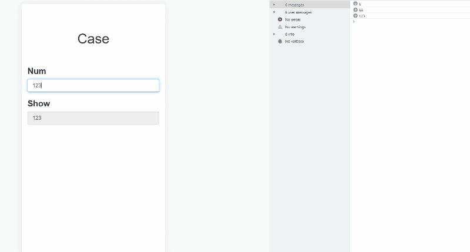
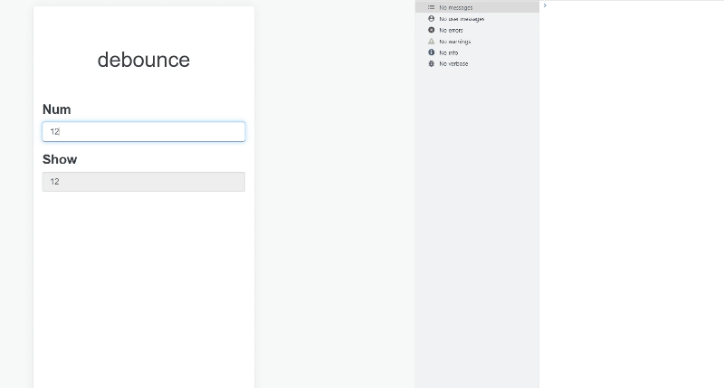
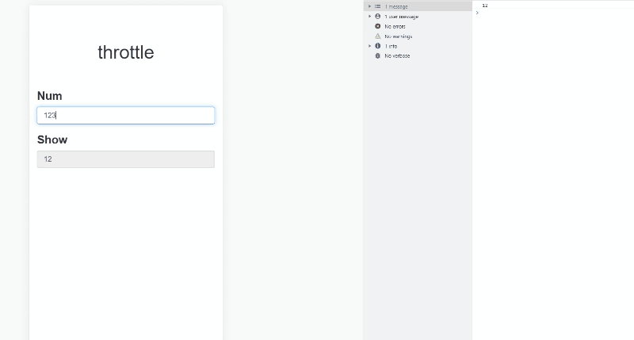

<!-- toc -->

## Debounce & Throttle

### What are debouncing and throttling?

#### Debounce

&emsp;&emsp;An action runs only after n milliseconds have elapsed since it was invoked. If it is invoked again during that interval, the waiting period starts over.
&emsp;&emsp;In other words, continuous triggering postpones execution; the action runs after triggering stops for a while.

#### Throttle

&emsp;&emsp;Set an execution interval in advance. When an invocation falls at or beyond that interval, run the action and begin the next interval.
&emsp;&emsp;In other words, allow an event to run once per specified interval.

### Practical scenarios

#### debounce

1. `scroll` events (loading resources)
2. `mousemove` events (dragging)
3. `resize` events (responsive layout styles)
4. `keyup` events (validating input after the user stops typing)

#### throttle

1. `click` events (reducing repeated rapid button clicks)
2. `scroll` events (showing or hiding a back-to-top button)
3. `keyup` events (synchronizing input with a display field)
4. Reducing the frequency of `ajax` requests

### Example analysis

&emsp;&emsp;Consider an example that synchronizes text between an input field and a display field. We attach a listener to the `input` with id num; when its contents change, the listener updates the `input` with id show.
&emsp;&emsp;Typing into the input invokes the `DOM` update function many times. DOM operations can be expensive, as shown below:


```html
<!DOCTYPE html>
<html lang="en">
  <head>
    <meta charset="UTF-8" />
    <meta http-equiv="X-UA-Compatible" content="IE=edge" />
    <meta name="viewport" content="width=device-width, initial-scale=1.0" />
    <link rel="stylesheet" href="../public/css/bootstrap.min.css" />
    <title>Document</title>
    <style>
      .label {
        color: #000;
        margin-right: 20px;
      }
      .inline-block {
        display: inline-block;
      }
      .container {
        margin-top: 50px;
      }

      .section {
        margin-bottom: 100px;
      }
      .title {
        margin-bottom: 50px;
      }
      .boxes {
        font-size: 22px;
      }
    </style>
  </head>
  <body>
    <div class="container">
      <h1 class="title text-center">Case</h1>
      <div class="boxes">
        <div class="form-group">
          <label>Num</label>
          <input type="text" class="form-control" id="num" />
        </div>
        <div class="form-group">
          <label>Show</label>
          <input
            type="text"
            class="form-control"
            id="show"
            disabled="disabled"
          />
        </div>
      </div>
    </div>
    <script>
      var numElmt = document.getElementById("num");
      function myFunction() {
        console.log(numElmt.value);
        document.getElementById("show").value = numElmt.value;
      }
      numElmt.addEventListener("input", myFunction, false);
    </script>
  </body>
</html>
```

### Implementing debounce

&emsp;&emsp;We can debounce the preceding code with the `Window` object's `setTimeout()`. Execution is delayed, and another invocation resets that delay with clearTimeout. The target code runs when the delay has elapsed.


```html
<!DOCTYPE html>
<html lang="en">
  <head>
    <meta charset="UTF-8" />
    <meta http-equiv="X-UA-Compatible" content="IE=edge" />
    <meta name="viewport" content="width=device-width, initial-scale=1.0" />
    <link rel="stylesheet" href="../public/css/bootstrap.min.css" />
    <title>debounce</title>
    <style>
      .label {
        color: #000;
        margin-right: 20px;
      }
      .inline-block {
        display: inline-block;
      }
      .container {
        margin-top: 50px;
      }

      .section {
        margin-bottom: 100px;
      }
      .title {
        margin-bottom: 50px;
      }
      .boxes {
        font-size: 22px;
      }
    </style>
  </head>
  <body>
    <div class="container">
      <h1 class="title text-center">Case</h1>
      <div class="boxes">
        <div class="form-group">
          <label>Num</label>
          <input type="text" class="form-control" id="num" />
        </div>
        <div class="form-group">
          <label>Show</label>
          <input
            type="text"
            class="form-control"
            id="show"
            disabled="disabled"
          />
        </div>
      </div>
    </div>
    <script>
      function debounce(fn, delay) {
        let timer = null; //闭包
        return function () {
          if (timer) {
            clearTimeout(timer);
          }
          timer = setTimeout(fn, delay);
        };
      }
      var numElmt = document.getElementById("num");
      function myFunction() {
        console.log(numElmt.value);
        document.getElementById("show").value = numElmt.value;
      }
      numElmt.addEventListener("input", debounce(myFunction, 1000), false);
    </script>
  </body>
</html>
```

### Implementing throttle

&emsp;&emsp;After the function runs, prevent it from running again until the specified interval has passed. There are several ways to implement throttling; this simple implementation uses setTimeout and a valid flag to indicate whether the function can run.


```html
<!DOCTYPE html>
<html lang="en">
  <head>
    <meta charset="UTF-8" />
    <meta http-equiv="X-UA-Compatible" content="IE=edge" />
    <meta name="viewport" content="width=device-width, initial-scale=1.0" />
    <link rel="stylesheet" href="../public/css/bootstrap.min.css" />
    <title>throttle</title>
    <style>
      .label {
        color: #000;
        margin-right: 20px;
      }
      .inline-block {
        display: inline-block;
      }
      .container {
        margin-top: 50px;
      }

      .section {
        margin-bottom: 100px;
      }
      .title {
        margin-bottom: 50px;
      }
      .boxes {
        font-size: 22px;
      }
    </style>
  </head>
  <body>
    <div class="container">
      <h1 class="title text-center">throttle</h1>
      <div class="boxes">
        <div class="form-group">
          <label>Num</label>
          <input type="text" class="form-control" id="num" />
        </div>
        <div class="form-group">
          <label>Show</label>
          <input
            type="text"
            class="form-control"
            id="show"
            disabled="disabled"
          />
        </div>
      </div>
    </div>
    <script>
      function throttle(fn, delay) {
        let valid = false;
        return function () {
          setTimeout(() => {
            fn();
            valid = true;
          }, delay);
        };
      }
      var numElmt = document.getElementById("num");
      function myFunction() {
        console.log(numElmt.value);
        document.getElementById("show").value = numElmt.value;
      }
      numElmt.addEventListener("input", throttle(myFunction, 1000), false);
    </script>
  </body>
</html>
```

### Summary

&emsp;&emsp;Choose debouncing or throttling for high-frequency events according to the actual scenario to improve performance and the user experience.
