## JavaEE

### Lecture 1

#### Structure

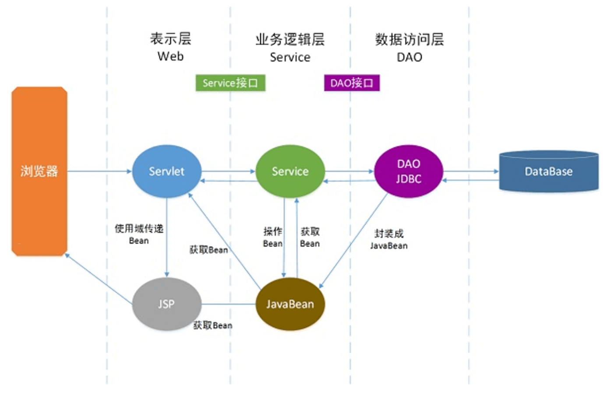

### Lecture 2

#### Spring

- A sophisticated yet concise `JavaBean` factory that manages the creation and dependencies of `beans`
- A practical framework that abstracts many common design ideas and patterns used in real application development
- A lightweight, nonintrusive application framework that does not require dependencies on the `Spring API`
- Integrates mature application solutions to make development simpler and more efficient

Advantages:

1. Minimally intrusive design
2. Independence from application servers
3. Spring's `DI` container reduces coupling between components
4. `Spring AOP` centralizes common tasks such as security, transactions, and logging, improving code reuse
5. Spring's `ORM and DAO` support integrates well with third-party persistence frameworks
6. An open design lets you use some or all of the `Spring` framework

##### An Overview of the Bean Container

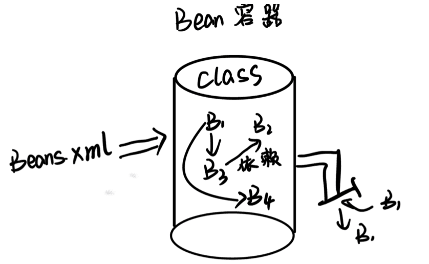

```java
<bean id="group" class="zust.se.Group">
    <property name="id" value="100"/>
    <property name="name" value="GroupA/>
</bean>
```

```java
BeanFactory ac=new BeanFactory("bean.xml");
Group group=(Group) ac.getBean("group");
System.out.printIn(JSON.toJSONString(group));
```

##### IoC and DI

The container manages dependencies between objects through inversion of control or dependency injection.

`IoC` (Inversion of Control): the container controls object lifecycles and relationships between objects.
`DI` (Dependency Injection): while the system runs, the container dynamically supplies an object with the other objects it needs.

**Two approaches to dependency injection:**

- Setter injection
  The `IoC` container uses property `setter` methods to inject dependency instances.

```java
<property name="userDao" ref="userDao"/>
```

- Constructor injection
  The `IoC` container injects dependency instances through the constructor. Specify values in constructor-parameter order, using the `index` attribute to indicate the position, starting at 0.

```java
<constructor-arg ref="db"/>
```

### Lecture 3

#### IOC

`Spring` uses the `IoC` container to manage instantiation, initialization, and the entire object lifecycle from creation to destruction.

#### Creating Bean Instances

- The `BeanFactory` container
  `BeanFactory` manages beans, primarily initializing them and invoking their lifecycle methods.

```java
Resource resource = new ClassPathResource("applicationContext.xml");
BeanFactory factory = new XmlBeanFactory(resource);
```

- The `ApplicationContext` container
  `ApplicationContext` extends the `BeanFactory` interface with features such as AOP, internationalization, and event support.

```java
ApplicationContext applicationContext = new ClassPathXmlApplicationContext(String configLocation);
```

- Instantiation in a web server
  The `ApplicationContext` container is typically initialized through `ContextLoaderListener`.

```java
<context-param>
  <param-name>contextConfigLocation</param-name>
  <!--加载spring目录下的applicationContext.xml文件-->
  <param-value>
      classpath:spring/applicationContext.xml
  </param-value>
</context-param>
<!--指定以ContextLoaderListener方式启动Spring容器-->
<listener>
  <listener-class>
      org.springframework.web.context.ContextLoaderListener
  </listener-class>
</listener>
```

#### Injection

- Injecting ordinary properties
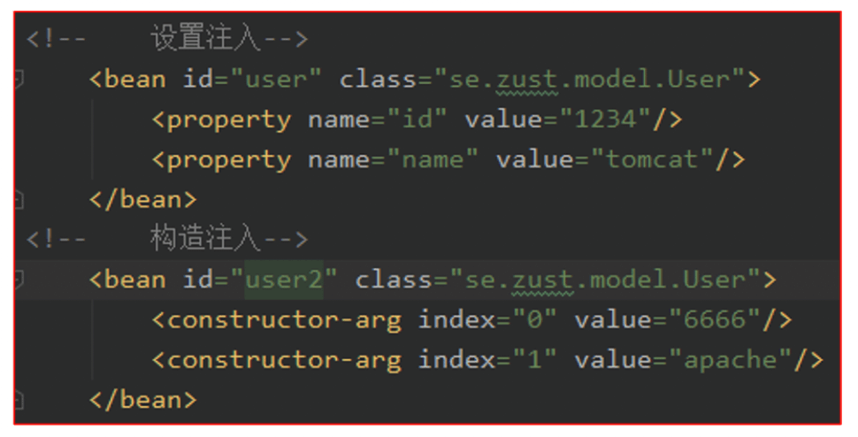

- Injecting bean references
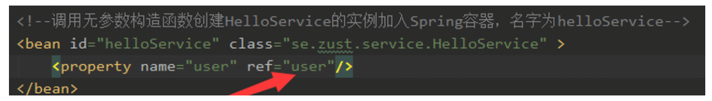

- Autowiring beans
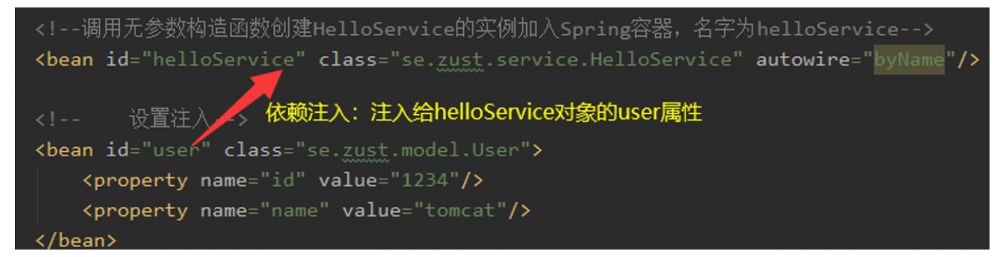

- Injecting nested beans: inject the nested bean into a property; it is not accessed independently through Spring.

- Injecting collection values:
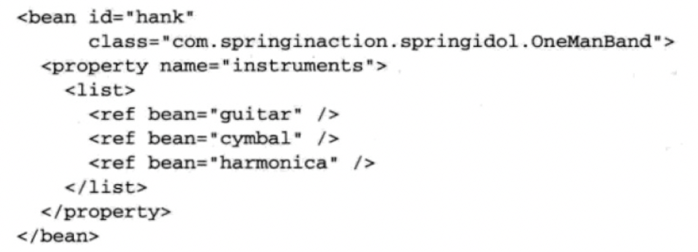

#### Bean Scope

1. `singleton` (default): one instance in the entire container, whose lifecycle the container can track and manage
2. `prototype`: a new instance is created each time `getBean` is called

3. `request`: a new instance for each HTTP request in a web application; configure the corresponding listener or filter in `web.xml`
4. `session`: a new instance for each HTTP session in a web application

#### The Bean Lifecycle

- After injection: `init-method`

```java
<bean id="chinese" class="org.j2ee.service.impl.Chinese"
init-method="init">
<property name="axe" ref="steelAxe"/>
</bean>
```

- Before destruction: `destroy-method`

```java
<bean id="chinese" class="org.j2ee.service.impl.Chinese"
destroy-method="destroy">
<property name="axe" ref="steelAxe"/>
</bean>
```

#### Spring Internationalization

Use the `MessageSource` interface.

#### Configuring Beans with Annotations

1. `@Component`: identifies a Spring bean. It is a general annotation for a component and can be used at any layer.
2. `@Repository`: identifies a data access layer (DAO) class as a Spring bean, serving the same basic role as `@Component`.
3. `@Service`: typically identifies a business layer (service) class as a Spring bean, serving the same basic role as `@Component`.
4. `@Controller`: typically identifies a controller class as a Spring bean, serving the same basic role as `@Component`.
5. `@Autowired`: can be applied to bean fields, setter methods, other methods, and constructors. Together with the corresponding annotation processor, it performs automatic bean configuration. By default, it autowires by bean type.
6. `@Resource`: similar to `@Autowired`, but `@Autowired` wires by bean type while `@Resource` wires by bean instance name.

```java
<!--使用context命名空间，通知spring扫描指定目录，进行注解的解析 -->
    <context:component-scan
        base-package="net.biancheng" />
```

```java
@Value("${u.id}") // 通过@Value将配置文件中u.id的值注入给user的id属性
<contect:component-scan base-package="se.zust" />
```

Lifecycle annotations (placed before the declaration of an instance method):

- `@PostConstruct`: the annotated method is called automatically after construction and dependency injection are complete.
- `@PreDestroy`: the annotated method is called automatically before the bean is destroyed.

#### Configuring Java Logging with log4j

Create `log4j.properties` in `resources`.
Add the dependency to `pom.xml`.
Add a static `logger` field to the class.

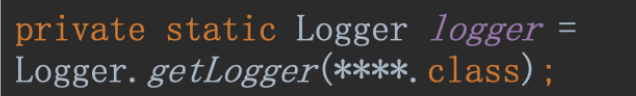

Log messages using `logger.debug`, `logger.info`, `logger.warn`, `logger.error`, and `logger.fatal`.

#### Spring Testing

- JUnit: a unit testing framework for Java
  Add the `@Test` annotation before a test method.

- Container testing

  1. Add `@RunWith` and `@ContextConfiguration` annotations to the test class.
  2. Use `@Resource` to inject a bean from the container into the test class.

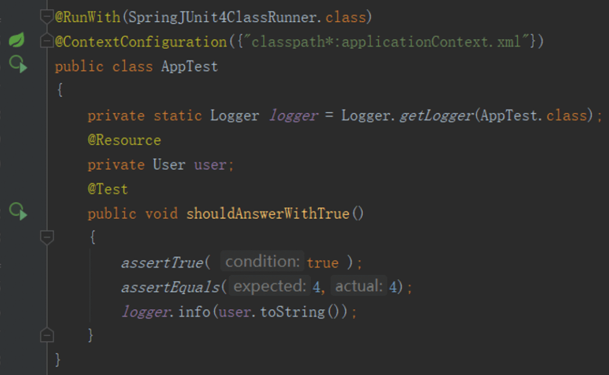

### Lecture 4

#### AOP

- Extracts cross-cutting logic through dynamic proxies, avoiding the repeated code of traditional inheritance-based approaches
- Can add functionality consistently without modifying source code, using compile-time weaving or runtime dynamic proxies
- Separates functional and nonfunctional requirements so developers can focus on a particular concern or cross-cutting logic, reducing intrusion into business code and improving readability and maintainability
- Suitable for logging, transaction processing, access control, exception handling, and similar tasks

**Concepts:**

| Name | Description |
| ----------------------- | ---------------------------------------------------- |
| Join point | A target-class method that a dynamic proxy can intercept: where the behavior occurs |
| Pointcut | Selects which join points to intercept |
| Advice | The behavior added at a pointcut: what to do, such as before or after |
| Target | The object being proxied |
| Weaving | The process of applying advice to a target to produce a proxy |
| Proxy | The generated proxy object |
| Aspect | A modularized concern that cuts across multiple objects, combining pointcuts and advice |
| Concern | A shared function to implement, such as transaction management |

| Advice | Description |
| ------------------------------ | ---------------------------------- |
| before | Runs before the target method is called |
| after | Runs after the target method returns or throws an exception |
| after-returning | Runs after the target method returns successfully |
| after-throwing | Runs after the target method throws an exception |
| around | Wraps the target method invocation |

##### Developing AOP with XML

1. Import the `Spring AOP` namespace into `XML`.
2. Define an aspect by turning a bean into an aspect.

```java
<aop:config>
    <aop:aspect id="myAspect" ref="aBean">
        ...
    </aop:aspect>
</aop:config>
```

> Here, `id` defines the unique name of the aspect, and `ref` references a regular Spring bean.

3. Define a pointcut.

```java
<aop:config>
    <aop:pointcut id="myPointCut"
        expression="execution(* net.biancheng.service.*.*(..))"/>
</aop:config>
```

> `id` specifies the pointcut's unique name; `execution` specifies the associated pointcut expression.

4. Define advice.

`AspectJ` supports five types of `advice`.

```java
<aop:aspect id="myAspect" ref="aBean">
    <!-- 前置通知 -->
    <aop:before pointcut-ref="myPointCut" method="..."/>
    <!-- 后置通知 -->
    <aop:after-returning pointcut-ref="myPointCut" method="..."/>
    <!-- 环绕通知 -->
    <aop:around pointcut-ref="myPointCut" method="..."/>
    <!-- 异常通知 -->
    <aop:after-throwing pointcut-ref="myPointCut" method="..."/>
    <!-- 最终通知 -->
    <aop:after pointcut-ref="myPointCut" method="..."/>
    ....
</aop:aspect>
```

##### Developing AOP with Annotations

| Name | Description |
| --------------- | ----------------------------------------------------- |
| @Aspect | Defines an aspect |
| @Pointcut | Defines a pointcut |
| @Before | Defines before advice, equivalent to BeforeAdvice |
| @AfterReturning | Defines after-returning advice, equivalent to AfterReturningAdvice |
| @Around | Defines around advice, equivalent to MethodInterceptor |
| @AfterThrowing | Defines after-throwing advice, equivalent to ThrowAdvice |
| @After | Defines final advice, which runs whether or not an exception occurs |

1. Add the following to the `XML` file to enable `@AspectJ`.

```java
<aop:aspectj-autoproxy>
```

2. Define an aspect.

```java
@Aspect
public class AspectModule {
}
```

3. Define a pointcut.

```java
// 要求：方法必须是private，返回值类型为void，名称自定义，没有参数
@Pointcut("execution(*net.biancheng..*.*(..))")
private void myPointCut() {
}
```

4. Define advice.

```java
@Before("myPointCut()")
public void beforeAdvice(){
    ...
}
```

### Lecture 5

#### ORM

`ORM` stands for Object Relational Mapping. It addresses interaction between objects and relational databases.

| Database | Class/Object |
| ---------------------------- | ------------------------- |
| Table | Class |
| Record (row) | Object |
| Field (column) | Object attribute |

ORM uses mappings between objects and the database to persist objects from a Java program automatically in a relational database.

In the business logic and presentation layers, we work with objects. When object information changes, we need to save it in the relational database.

> This avoids repeated data access code.

#### JPA

The `Java Persistence API` is an ORM-based specification for Java persistence.

**Development steps:**

- Create a `Maven` project.
- Add the `hibernate-entitymanager` dependency.
- Add the `mysql-connector-java` database dependency.
- Add `persistence.xml` under `resources/META-INF` to configure JPA and entity package scanning; create a corresponding entity for each table in the entity package.

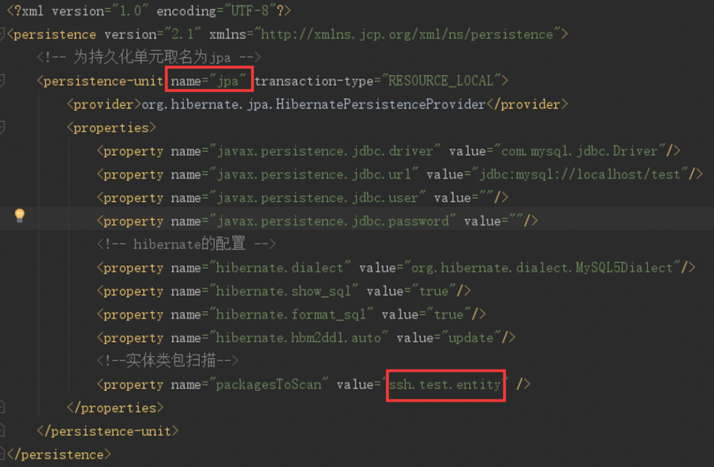

- Create an entity class (`JavaBean`).
- Create the JavaBean.
- Add properties corresponding to database fields.
- Add `@Entity` and `@Table("...")` annotations before the class declaration.
- Add the appropriate annotations to the properties.

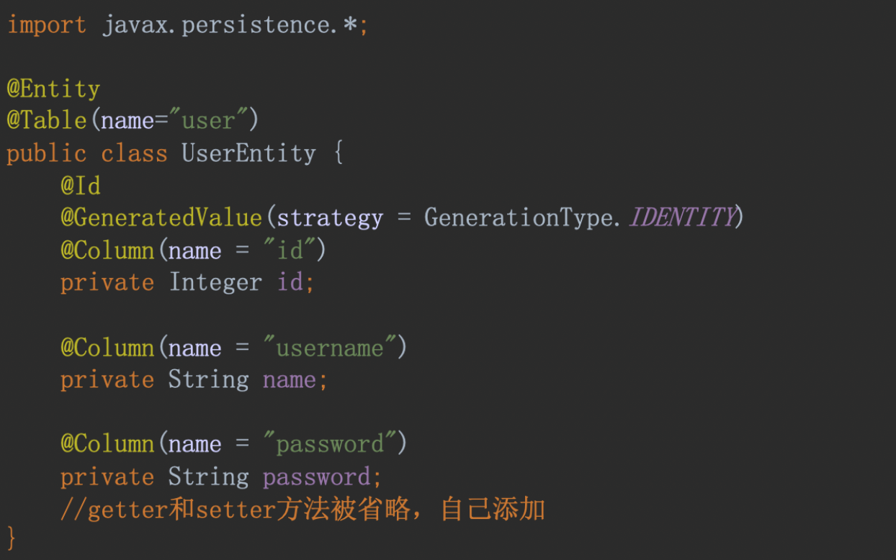

1. Table annotations: placed before the entity class declaration

```java
@Entity
​@Table(name="tableName")
```

2. Primary key: annotations placed before the corresponding property's getter

```java
@Id
@GeneratedValue(strategy=GenerationType.IDENTITY)
@Column(name = "keyName")
```

3. Ordinary properties: annotations placed before the corresponding getter

```java
​@Column(name = "propName")
```

```java
@Basic(fetch=FetchType.LAZY|EAGER)
// LAZY：懒加载
// EAGER：立即加载，默认值
```

**Database Operations with JPA:**

- Create an `EntityManager` using the JPA configuration.
- Use the `EntityManager` interface methods to operate on the database.

| Unit | Description |
| -------------------- | ---------------------------------------------------------------------------------- |
| EntityManagerFactory | A factory that creates and manages multiple EntityManager instances |
| EntityManager | An interface that manages persistence operations on objects |
| Entity | A persistent object corresponding to a record stored in the database |
| EntityTransaction | Has a one-to-one relationship with EntityManager and maintains its transaction |
| Persistence | A class with static methods for obtaining an EntityManagerFactory instance |
| Query | An interface implemented by JPA providers for retrieving matching objects |

```java
/**
 * 通过Persistence获取EntityManagerFactory，
 * 传入参数对应配置文件中持久化单元persistence-unit的name
 * 通过EntityManagerFactory创建EntityManager
 * 获取EntityTransaction
 * 开启事务
 */
EntityManagerFactory entityManagerFactory;
EntityManager entityManager;
entityManagerFactory =
        Persistence.createEntityManagerFactory("jpa");
entityManager = entityManagerFactory.createEntityManager();
entityManager.getTransaction().begin();
//数据操作代码
/**
 * 提交事务
 * 关闭entityManager
 * 关闭entityManagerFactory
 */
entityManager.getTransaction().commit();
entityManager.close();
entityManagerFactory.close();
```

**Persistent Object States:**

- **New objects:** an object initialized with `new` is not immediately persistent. It is transient, with no association to a database table. Once the application no longer references it, its state is lost and it can be garbage-collected.
- **Managed objects:** persistent instances have database identities and are managed by `EntityManager`. They are operated on within transactions, and their state is synchronized with the database when the transaction finishes. On commit, SQL `INSERT`, `UPDATE`, and `DELETE` statements synchronize in-memory state to the database.
- **Detached objects:** after `EntityManager` is closed, persistent objects become detached. They can no longer stay synchronized with the database and are no longer managed by JPA.

**The Persistent Object Lifecycle:**

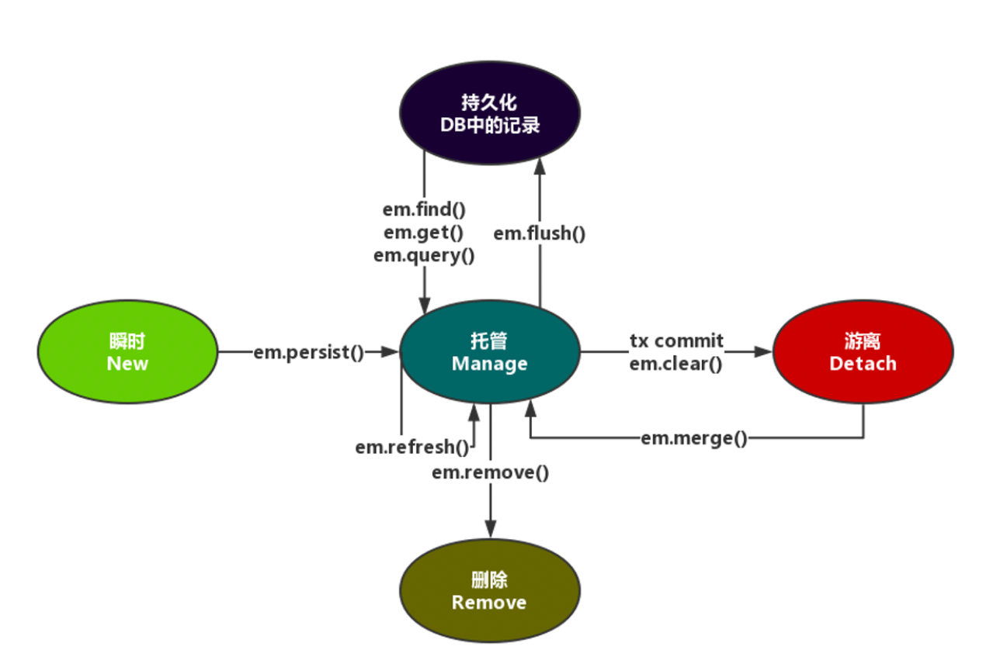

### Lecture 6

#### Lombok

The `@Data` annotation generates methods such as `getters/setters` for entity properties.

Use `@Setter` and `@Getter` instead of `@Data`.

> Besides generating getters and setters, `@Data` overrides `equals(Object other)` and `hashCode()`. Lombok includes the Project class's `List projects` in the hash calculation; `equals` and `toString` can have similar problems. Circular references can therefore cause infinite recursion and eventually a `StackOverflowError`.

#### Single-Table Mapping

A bidirectional one-to-one relationship

```java
@OneToOne(optional = true, cascade = CascadeType.ALL)
@JoinColumn(name="id_card_id")
private TidCard tidCard;
```

```java
@OneToOne(cascade = CascadeType.ALL, mappedBy = "tidCard")
private Tuser tuser;
```

#### Multi-Table Mapping

A bidirectional one-to-many relationship

```java
@OneToMany(cascade = CascadeType.ALL,fetch =FetchType.LAZY,mappedBy = "tuser")
private Set<TcreditCard> tcreditCards;
```

```java
@ManyToOne(fetch = FetchType.LAZY)
@JoinColumn(name="user_id",insertable = false,updatable = false)
private Tuser tuser;
```

#### Cascading

Cascading links operations between two objects: when an operation is performed on one object, the same operation is also performed on its designated cascade targets.

`CascadeType.PERSIST`: cascade persistence (save)
`CascadeType.MERGE`: cascade updates (merge)
`CascadeType.REFRESH`: cascade refresh operations, which only retrieve data
`CascadeType.REMOVE`: cascade deletion
`CascadeType.ALL`: cascade all of the above operations

### Lecture 7

#### hql

```java
Query query = entityManager.createQuery(
    "from User user where user.name like 'J%'");
List<User> users = query. getResultList();
```

**HQL steps:**

1. Obtain the JPA `EntityManager`.
2. Write the `HQL` statement.
3. Create a `Query` using `entityManager.createQuery(HQL)`.
4. Set query parameters using `query.setXXX`.
5. Obtain the results (persistent entities) using `query.getResultList()`.

### Lecture 8

**Steps:**

- Create a Maven project.
- Add the `MyBatis` dependency.
- Create `jdbc.properties` under `resources` (the filename can be different).
- Create `SqlMapper.xml` under `resources` (the filename can be different).
- Create a `POJO` in the `entity` package; it does not have to map directly to a table.
- Create a mapper interface in the `dao` package.
- Create a mapper configuration file in the `mapper` package. Each select statement's `id` corresponds to a method in the mapper interface.
- Write a test class to verify it.

**MyBatis Interface Methods:**

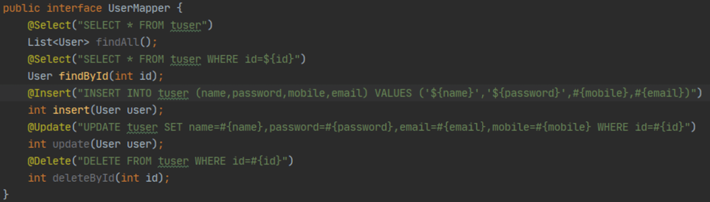

**Configuration:**

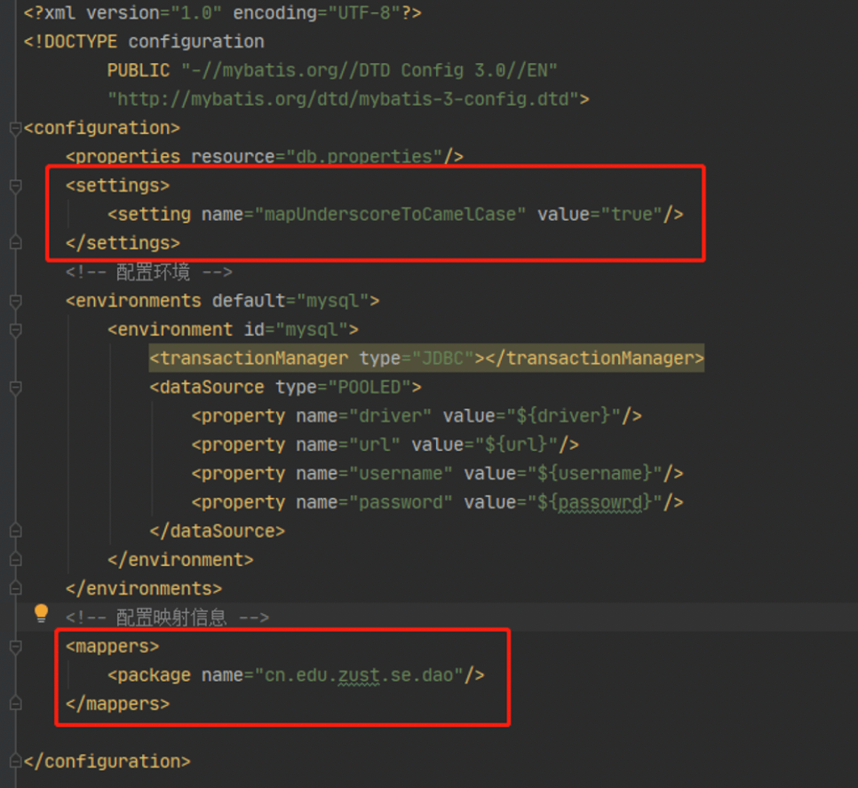

**Testing:**

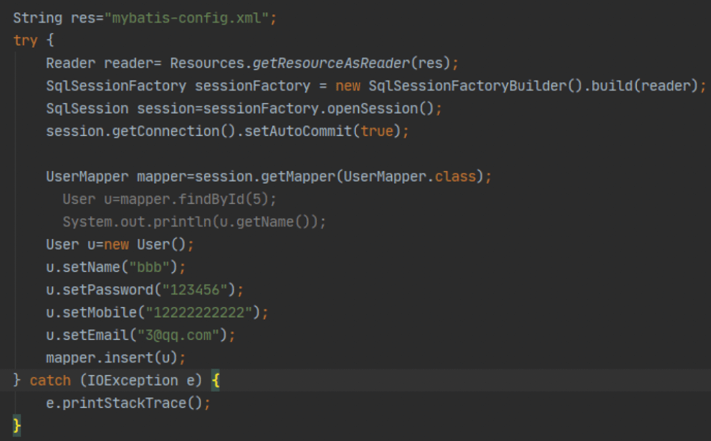

**The `#{}` Placeholder and `${}` Substitution:**

- `#{}` becomes a `?` parameter placeholder in a prepared SQL statement, preventing SQL injection. String values are handled with quotes; prefer this approach.
- `${}` performs string replacement by concatenating SQL. It does not prevent SQL injection and does not add quotes. It is needed for identifiers such as table names and `ORDER BY` clauses.

#### Comparing JPA and MyBatis

**Hibernate：**

> A popular ORM framework with a thoughtful design and extensive documentation, providing fully automatic operations. Performance can be harder to control. Hibernate is a complete ORM framework: ordinary CRUD operations do not require writing SQL. ORM frameworks implement the JPA specification, and automatic table creation is supported.

**MyBatis:**

> Allows developers to write SQL directly for greater flexibility. It is not a complete ORM framework because developers still write all the SQL. This enables finer SQL optimization. It is lightweight, relatively easy to learn, and gives direct control over performance. It does not create tables automatically.
> An SQL mapping framework that maps SQL results to objects.
> Semiautomatic: developers write SQL, and iBatis maps the results to objects.

**Comparison:** `MyBatis` is a small, convenient, efficient, simple, direct, semiautomatic persistence framework. `JPA` is a powerful, convenient, efficient, complex, indirect, fully automatic persistence framework specification.

### Lecture 8-2

#### Spring Data

A Spring subproject that simplifies database access, supporting both NoSQL and relational data stores. Its main goal is to make database access convenient and efficient.

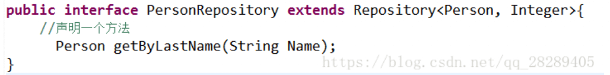

##### JpaRepository

- `List findAll();` // Find all entities
- `List findAll(Sort sort);` // Sort and retrieve all entities
- `List save(Iterable<? extends T> entities);` // Save a collection
- `void flush();` // Synchronize the persistence context with the database
- `T saveAndFlush(T entity);` // Force persistence and flush
- `void deleteInBatch(Iterable entities);` // Delete a collection of entities

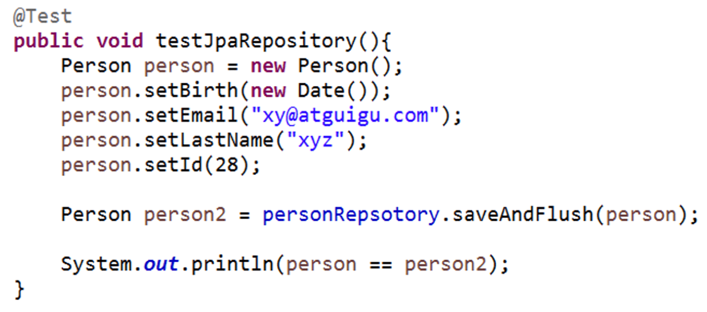

### Lecture 9

#### The Evolution of Web MVC

1. `jsp+bean`
2. Standard `MVC`
3. `Web MVC`: request-response with a separate frontend and backend

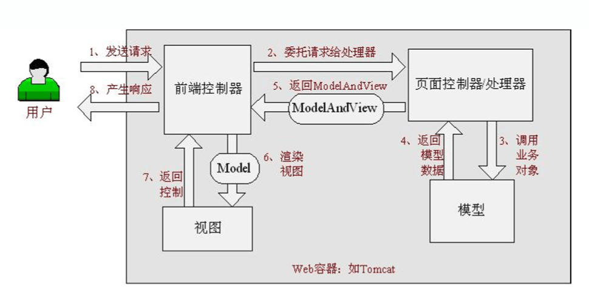

#### MVC

A lightweight, request-driven Java web framework implementing the Web MVC design pattern. It uses MVC to decouple responsibilities in the web layer; request-driven means using the request-response model. `Spring Web MVC` simplifies everyday web development with locale resolution, theme resolution, and file uploads. It provides flexible validation, formatting, and data binding, as well as strong support for contract-based programming through convention over configuration.

- Front controller: `DispatcherServlet`
- Application controller: `HandlerMapping` + `ViewResolver`
- Page controller: `Controller` (either an implementation of the Controller interface or a POJO)

**Development steps:**

1. Create a Maven project and complete its directory structure.
2. Add Spring MVC dependencies and Jetty configuration.
3. Modify `web.xml` to configure the Spring MVC front controller.
4. Add the Spring MVC configuration under `WEB-INF`, including package scanning and resolver configuration.

**Planning User Requests:**

1. Develop the controller.
2. Develop the view (JSP).
3. Build and start the website with `clean jetty:run -Djetty.port=8088`.
4. Test the website.

### Lecture 10

#### Spring MVC

**web.xml:**
`Spring MVC` is based on `Servlet`. `DispatcherServlet` is its core component, primarily intercepting requests and dispatching them to the appropriate handlers. Configuring Spring MVC therefore starts with defining `DispatcherServlet`.

- Deploy `DispatcherServlet`.
- Load the servlet immediately when the container starts.
- Handle all URLs.

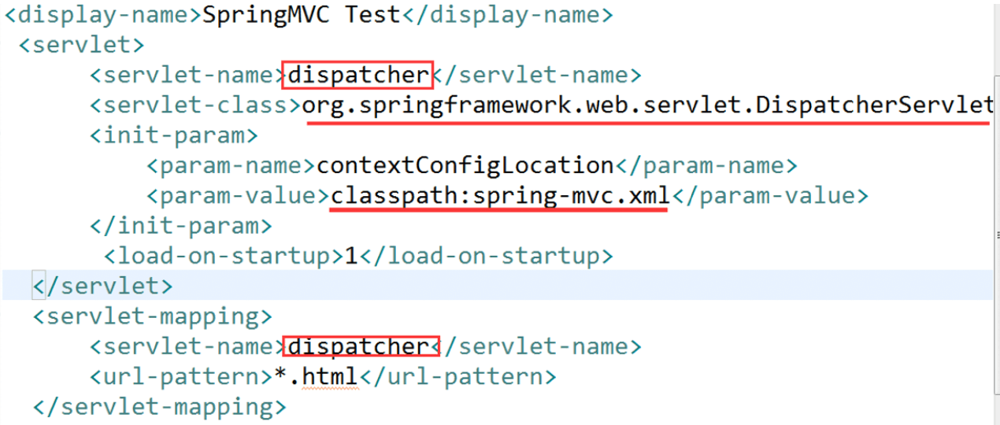

**controller:**

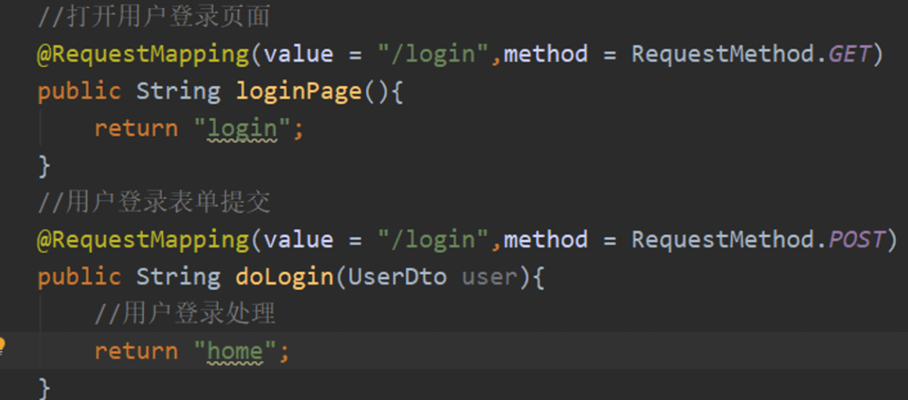

| Request method | Description |
| -------- | --------------------------------------------------------------------------------------------------------- |
| GET | Repeated execution of the same GET request does not change the system. It is idempotent and makes use of client-side caching. |
| POST | Typically creates a new resource. It is neither safe nor idempotent: repeated operations may create multiple resources. |

**Binding Parameter Types:**

- `@RequestParam`: bind request parameters
- `@RequestHeader`: bind request headers
- `@CookieValue`: bind cookie values
- `@PathVariable`: bind URL variables

```java
@RequestMapping(value="/handle1")
public String handle1(@RequestParam("userName") String userName,
    @RequestParam("password") String password,
    @RequestParam("realName") String realName){
    ...
}
```

**Binding Command/Form Objects:**

```java
@RequestMapping(value = "/handle14")
public String handle14(User user) {
…
}
```

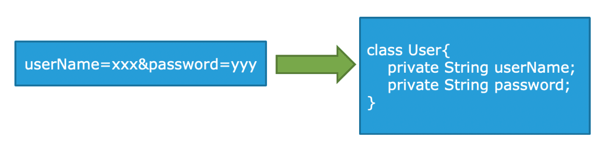

**Servlet API Objects as Parameters:**
If the handler writes the response using `HttpServletResponse` directly, its return type can be `void`.

```java
@RequestMapping(value = "/handle21")
public void handle21(HttpServletRequest request,HttpServletResponse response) {
    String userName = WebUtils.findParameterValue(request, "userName");
    response.addCookie(new Cookie("userName", userName));
}
```

or

```java
@Autowired
HttpServletRequest request;
@Autowired
HttpServletResponse response;
@RequestMapping(value = "/handle21")
public void handle21()
```

**View Resolution:**

> jstl

```java
<!-- 视图解析器 -->
    <bean class="org.springframework.web.servlet.view.InternalResourceViewResolver"
          id="viewResolver"
          p:prefix="/WEB-INF/jsp/" p:suffix=".jsp">
    </bean>
```

1. A request reaches the front controller (`DispatcherServlet`).
2. The front controller asks `HandlerMapping` to locate a handler using XML configuration or annotations.
3. `HandlerMapping` returns the handler to the front controller.
4. The front controller calls a handler adapter to execute the handler.
5. The handler adapter executes the handler.
6. The handler returns `ModelAndView` to the adapter.
7. The adapter returns `ModelAndView` to the front controller. This is a Spring MVC object containing the model and view.
8. The front controller asks the view resolver to resolve the logical view name into the actual view (JSP).
9. The view resolver returns the `View` to the front controller.
10. The front controller renders the view, populating the request scope with model data from `ModelAndView`.
11. The front controller sends the result to the user.

**JSON:**

- JSON output: `@ResponseBody`
- JSON input: `@RequestBody`

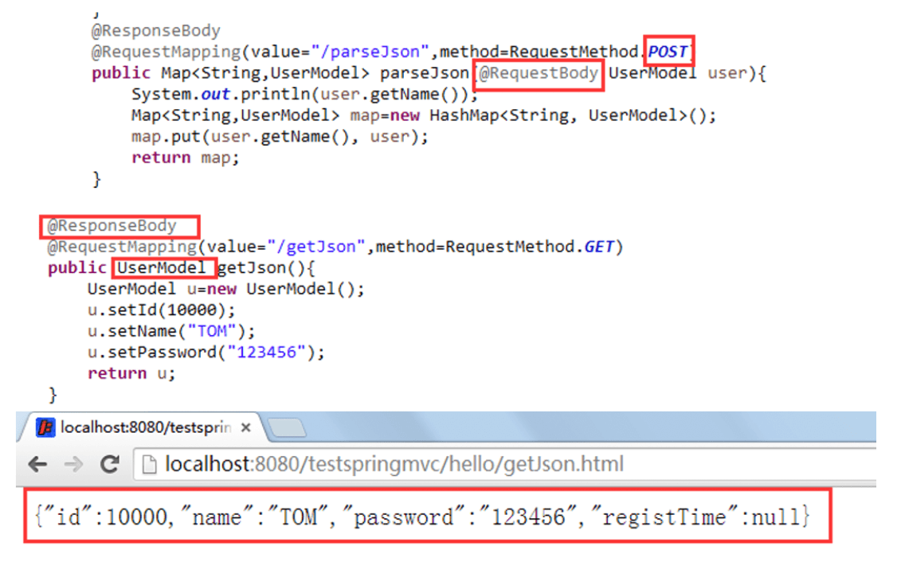

```java
// 让Spring MVC不处理静态资源
<mvc:default-servlet-handler />
<mvc:annotation-driven />
```

### Lecture 11

#### SSH

**Layers:**

- Web layer (`controller`): handles user requests and responses, relying on business layer beans for business functionality.
- Business layer: provides business methods for web controllers, relying on data layer beans for data access.
- Database layer: provides data support for business layer methods and uses `sessionFactory` to manage mapped objects.

**Basic Integration Approach:**

- Spring MVC integrates naturally with Spring.
- Integrate JPA/Hibernate into Spring.
  1. The key component is `entityManagerFactory`.
  2. Configure `datasource` and `entityManagerFactory` as Spring beans.
  3. Inject `entityManagerFactory` into the DAO.
  4. Add the DAO to the Spring container with `@Repository`.

**Containers in an SSH Java Web Project:**

- Spring's container: started by the listener; it is the parent container.
- Spring MVC's container: started by `DispatcherServlet`; it is the child container.
- When configuring controllers in Spring MVC, you can reference service classes configured in Spring directly.
- In `web.xml`, configure Spring before Spring MVC; otherwise, the Spring MVC child container cannot use the parent container's resources.
- Beans in the parent container cannot reference beans in the child container.

**Integrated Startup Configuration:**

**Integration Steps:**

- Start the Spring container in the web application.
- Configure the listener.
- Deploy business beans into the container using annotations.

1. Package scanning

- Annotate controllers with `@Controller`.
  - Annotate services with `@Service` and `@Transactional`.
- Annotate DAOs with `@Repository`.

2. Bean configuration (`datasource`, `entityManagerFactory`)

> Analysis and design of an SSH architecture project
