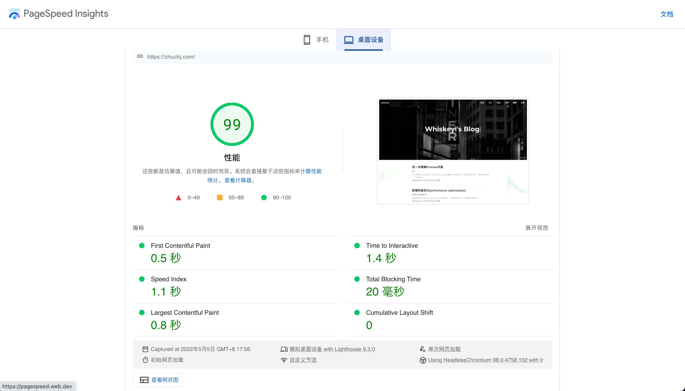

## Frontend Performance Optimization

### Before We Begin

Performance is an important part of frontend development. Unlike installed applications, web pages initially need to transfer their resources over the network, making efficient network delivery a major factor in frontend performance. Browser rendering also offers opportunities for optimization. From the user's perspective, loading or transition animations provide feedback while they wait instead of presenting a blank screen; this can be considered another form of performance improvement. This article focuses on optimizing network delivery and browser rendering to create a better experience. **Because frontend performance covers many topics, this is a long article. I hope you find it useful!**

### Introduction

Before discussing frontend performance optimization, we need to revisit a familiar question:

> What happens between entering a URL and the page finishing loading?

This matters because the optimization techniques below follow that process. Here is a brief overview. It involves computer networking, but since performance is our focus, I will not go into those details here:

1. Enter a URL in the browser's address bar and navigate to it.
2. The browser checks whether a usable, unexpired cache entry exists for the URL.
3. DNS resolves the domain to an IP address.
4. A TCP connection is established with that IP address through a three-way handshake.
5. An HTTP request is sent.
6. The server handles the request, and the browser receives the HTTP response.
7. The browser builds the DOM tree and renders the page.
8. The TCP connection closes through a four-way termination sequence.

If you are unfamiliar with this process, I recommend these articles on [network communication](https://juejin.cn/post/6844904132071915527) and [page rendering](https://juejin.cn/post/6844904132071915527) before continuing.

### Optimization: DNS Prefetching

**An introduction to DNS prefetching:**

`DNS` (Domain Name System) is a distributed database that maps domain names to IP addresses. A DNS lookup converts a domain name into an IP address. It might take only 1 ms with a local cache and be imperceptible to the user, or it might take several seconds.
When a browser visits a domain, it needs to resolve its IP address. Resolution proceeds through browser, system, router, and ISP DNS caches, then root, top-level, and authoritative name servers until the address is obtained.
`DNS prefetching` resolves domains that may be needed later ahead of time, following browser rules. Caching the results reduces subsequent DNS lookup time and improves access speed.

DNS prefetching does two things:

- After the HTML source is downloaded, the browser examines link-containing elements and looks up their domains in advance.
- For previously visited pages, the browser records a list of domains. On a later visit, it can resolve them while the HTML downloads.

**Using DNS prefetching:**

There are two approaches:

1. **Automatic resolution:** the browser discovers hostnames from hyperlink `href` attributes. When it encounters an anchor, it can resolve the domain in parallel with browsing. For security reasons, automatic prefetching may be disabled on HTTPS pages. The following code explicitly enables it:

```html
<!-- 当content为off是则为关闭 -->
<meta http-equiv="x-dns-prefetch-control" content="on" />
```

2. **Manual resolution:** add a `link` element with `rel="dns-prefetch"` to the page.

```html
<link rel="dns-prefetch" href="www.baidu.com" />
```

**DNS prefetching summary:**

`DNS prefetching` can reduce lookup time effectively. It is especially useful for websites that load many resources from other domains.

### Optimization: Sending HTTP Requests

Visiting a web page generates many HTTP requests. We can optimize this in two ways: **reduce the number of requests** and **reduce the amount of data transferred** to shorten individual requests. Let's examine both approaches.

#### Reducing the Number of Requests

**Combine requested resources:**

##### Webpack

- Use `webpack`, a static module bundler, to bundle JavaScript and CSS resources and avoid excessive numbers of separate files.

##### CSS Sprites

- Use **CSS sprites**: combine small images into one and select each image with `background-position`. Compared with one file per icon, a sprite requires fewer HTTP requests and can use memory and bandwidth more efficiently.

> Like sprites, Base64-encoded images aim to improve performance by reducing image requests to the server.

##### WebStorage

Use `Web Storage`: `sessionStorage` and `localStorage` store key-value pairs, typically with capacities around 5–10 MB. Saving fetched data can avoid repeated requests for the same information. Their lifetimes differ: `sessionStorage` ends when the tab closes, while `localStorage` persists until explicitly removed.

##### IndexDB

Use `IndexedDB`: a nonrelational database in the browser that can store much larger amounts of data than Web Storage.

##### HTTP Cache

- Use `HTTP caching`: a fresh cache entry takes priority; if it is no longer fresh, the browser can revalidate it with the server.
  - **Freshness-based caching** uses the `Expires` and `Cache-Control` HTTP headers. On a subsequent request, the browser checks these headers. If the cached resource is still fresh, it is used directly without communicating with the server, reducing requests.
    > `Expires` is a timestamp. When requesting a resource again, the browser compares its local time with that timestamp. If the resource has not expired, it uses the cache. Incorrect local time can therefore produce unexpected results. HTTP/1.1 introduced `Cache-Control`; for example, `Cache-Control: max-age=1000` specifies that the resource remains fresh for 1,000 seconds. This duration-based approach avoids the problems of an absolute timestamp.
  - **Cache revalidation:** the browser asks the server whether its cached resource is still valid. It either downloads a complete response or reuses the local resource. If the server reports `Not Modified`, the browser uses its cache and the response status is `304`.
    > `Last-Modified` is also a timestamp, returned in the first response's headers, for example `Last-Modified: Thu, 3 Mar 2022 23:22:57 GMT`. Subsequent requests include `If-Modified-Since` with that value. The server compares it with the resource's last modification time. If the resource changed, it returns the complete content with an updated `Last-Modified`; otherwise, it returns `304`. Modification time alone may not reflect whether content actually changed, and rapid changes can fall within its timestamp resolution. `ETag` addresses this with a resource identifier that can be based on content, so different content has a different tag.

#### Reducing Transfer Size

##### Cookie

- **Avoid excessive cookies:** cookies primarily maintain state rather than serve as general local storage. A cookie is limited to about `4 KB` and is typically set through `Set-Cookie` response headers. Applicable requests to the same domain include cookies, so excessive cookie data wastes bandwidth and affects performance.

##### Gzip Compression

**Use Gzip:** enable compression on the server. The client advertises support with `Accept-Encoding: gzip` in the request headers, and the response uses `Content-Encoding: gzip`. This can significantly reduce transferred file sizes.

> `Content-Encoding: br` uses Brotli, which can achieve a higher compression ratio than Gzip. Compression itself takes time: it trades server CPU and compression time, plus browser decompression work, for less time spent transferring data.

##### Code Minification

- **Minify code:** use tools to remove unnecessary comments and blank lines and shorten identifiers, reducing transfer size.

##### Image Optimization

- **Optimize images:** images often account for a large share of page traffic, so optimizing them can make a substantial difference. Two common approaches are compression, accepting some loss of quality, and cropping:
  - **Compression:** reduce image size when losing some color information or pixels does not noticeably affect the user experience.
  - **Cropping:** if the full image is unnecessary, crop or resize it to reduce its size.
    > Choosing the right image format also helps. Common formats include PNG, JPG, SVG, and WebP. SVG is vector-based, scales without losing quality, and suits simple graphics. WebP generally compresses better than PNG and JPG and supports transparency. Where compatibility is a concern, use WebP in supported browsers with JPG or PNG fallbacks.

### Optimization: Page Rendering

Earlier, we outlined what happens from entering a URL to loading a page. The rendering and DOM construction step can be broken down as follows:

1. The browser parses the HTML document from top to bottom.
2. The HTML parser converts it into the DOM (Document Object Model). Once parsing completes, the `DOMContentLoaded` event is triggered.
3. The CSS parser creates the CSSOM (CSS Object Model), a tree containing style information.
4. The DOM and CSSOM are combined into a render tree whose nodes have concrete styles.
5. The positions of render-tree nodes are calculated during layout.
6. The laid-out render tree is painted on screen.

How can we optimize these steps? After downloading page resources—HTML, JavaScript, CSS, and images—the browser constructs the DOM and render tree. The DOM describes page structure; the render tree describes how visible DOM nodes are displayed. The following techniques target that work.

#### Reducing Rendering Work

- **Reduce rendering work:** minimize reflows and repaints. Reflow occurs when geometry such as size or position changes and the browser must recalculate layout; repaint occurs when visual styles such as color change. For elements that repeatedly affect layout, such as animations, `position: absolute` or `fixed` removes them from normal flow so they do not alter the layout of surrounding elements. Flow layout often needs only one traversal, but tables and their contents may require multiple passes to determine node properties, sometimes taking more than twice the work of equivalent elements. Avoid table-based layout when possible.

> More precisely, each visible DOM node has at least one corresponding render-tree node; `display: none` nodes do not. These render nodes are frames or boxes following the CSS box model, with padding, margins, borders, and positions. After constructing the DOM and render tree, the browser paints the page. When a DOM change affects geometry such as width or height, it may also affect other elements' positions and sizes. The browser invalidates and recalculates the affected layout. This is **reflow**. Painting the affected result back onto the screen is **repaint**.

#### Reducing the Number of Rendered Nodes

Lazy loading and virtual lists can reduce the number of nodes or resources rendered at once.

##### Lazy Loading

- **Lazy loading:** initially omit an image's real source or replace it with a `1 × 1 px` placeholder. Assign the real source only when the image enters the viewport. Why do this? Content-rich pages with many images, such as ecommerce pages and long articles, have many resources; loading them all immediately can take considerable time.

```html
<html lang="en">
  <head>
    <meta charset="UTF-8" />
    <meta name="viewport" content="width=device-width, initial-scale=1.0" />
    <title>Document</title>
    <style>
      img {
        height: 450px;
        display: block;
        margin-bottom: 20px;
      }
    </style>
  </head>
  <body>
    <!--这里不是用src，图片地址暂时先保存在data-src这个自定义属性上面-->
    
    
    
    
    
  </body>
</html>
```

Before reading the following code, understand these properties:
`clientHeight`: the height of the browser viewport (`document.documentElement.clientHeight`);
`scrollTop`: the distance the document has scrolled (`document.documentElement.scrollTop`);
`offsetTop`: an element's offset from the top of its offset parent, rather than the viewport (`img.offsetTop` in this example).

```js
const imgs = document.getElementsByTagName("img");
function lazyLoad(imgs) {
  // 视口的高度；
  const clientH = document.documentElement.clientHeight;
  // 滚动的距离，这里的逻辑判断是为了作兼容性处理；
  const clientT = document.documentElement.scrollTop || document.body.scrollTop;
  for (let i = 0; i < imgs.length; i++) {
    // 逻辑判断，若是视口高度 + 滚动距离 > 图片到浏览器顶部的距离就去加载；
    // !imgs[i].src 目的是避免重复请求
    if (clientH + clientT > imgs[i].offsetTop && !imgs[i].src) {
      // 使用data-xx的自定义属性能够经过dom元素的dataset.xx取得；
      imgs[i].src = imgs[i].dataset.src;
    }
  }
}
// 一开始可以加载显示在视口中的图片；
lazyLoad(imgs);
// 监听滚动事件，加载后面的图片；
window.onscroll = () => lazyLoad(imgs);
```

Frequent `scroll` events can put pressure on the browser. Combine lazy loading with a [throttle function](/blog/2021-10-12-debounce/) for further optimization.

##### Virtual Lists

- **Virtual lists:** some lists cannot use pagination, yet rendering all their data at once is expensive because each item may contain complex DOM nodes. Like lazy loading, virtualization renders on demand: it renders only the visible region, with little or no rendering outside it. Initially, only the items needed for the viewport are created. As scrolling occurs, the visible range is recalculated and offscreen items are removed. This can greatly improve rendering performance. Here is a useful article on [virtual lists](https://juejin.cn/post/6844903982742110216).

#### Reducing Blocking

##### CSS Blocks Rendering

- **CSS blocks rendering:** CSS is generally a render-blocking resource. The page waits for the CSSOM before rendering, so put stylesheets near the top to start loading them early. Placing stylesheet links at the bottom may allow content to appear first, but it will initially be unstyled and disordered. When the styles arrive, repainting can cause a visible flash.

##### JavaScript Blocks Document Parsing

- **JavaScript blocks document parsing:** when the HTML parser encounters a normal `script`, control passes to JavaScript. Parsing pauses until the script downloads and executes. A slow script at the top of the document can therefore leave the page blank for a long time, before the parser reaches the body. Use `async` or `defer` to control script loading and execution.
  - `async` allows downloading without blocking parsing, but executes the script as soon as it has downloaded.
  - `defer` executes after downloading and document parsing are complete, before `DOMContentLoaded` fires.

##### Improving Rendering Efficiency

**Improve rendering efficiency:**

###### Reduce DOM Operations

- **Reduce DOM operations:** the JavaScript and rendering engines need to communicate, so extensive DOM manipulation can harm overall performance. Batch DOM operations where possible, and use debouncing or throttling for frequently triggered updates.

###### The Event Loop and Asynchronous Updates

- **The event loop and asynchronous updates:** JavaScript is commonly described as single-threaded. If two threads changed the same DOM node simultaneously, their ordering would need coordination. Multithreading can solve this, but JavaScript's role as a browser scripting language favors a simpler model. Its event loop and asynchronous update strategy support this model. Asynchronous queues include macrotasks and microtasks. Macrotasks run one at a time; at a microtask checkpoint, microtasks are drained until the queue is empty. Using this scheduling model well can improve browser rendering efficiency.

### Additional Topics

#### Performance Metrics and Models

- **Performance metrics and models:**
  - **Metrics:**
    1. First Paint (FP): the time when the page first paints pixels.
    2. First Contentful Paint (FCP): the first rendering of text, an image, nonblank canvas content, or SVG.
    3. Largest Contentful Paint (LCP): when the largest visible content element is painted.
    4. First Input Delay (FID): the delay in responding to the user's first interaction with the page, between FCP and TTI.
    5. Time to Interactive (TTI): when the page becomes reliably usable.
    6. Total Blocking Time (TBT): the total blocking time from long tasks between FCP and TTI.
    7. Cumulative Layout Shift (CLS): unexpected shifts in page layout.
  - **The RAIL model, briefly:** Google introduced RAIL: response, animation, idle, and load. Consider your product from these four perspectives. Meeting performance targets in each area helps create an excellent overall experience.

#### First-Screen Display Time

- **First-screen display time:** the time until all resources in the first screen are displayed, roughly the blank-screen interval plus the initial rendering time. It is a direct measure of user experience but can be difficult for frontend developers to quantify. Many techniques above improve it. This reminds me of the campus QR code in our university's official account: a code needed immediately should appear quickly, yet our version loads many resources before showing it.

#### CDN

- **CDN acceleration:** a content delivery network is a group of web servers distributed across geographic locations. Greater distance from a server generally means greater latency. A CDN stores site content across locations and selects a nearby server based on the user's request, reducing congestion and improving access speed and cache hit rates. Its key technologies are content storage and distribution. In my tests, adding a CDN noticeably accelerated this blog.

#### Performance Monitoring

- **Performance monitoring:** to be added.

### Conclusion

While optimizing my blog, I used Google's [PageSpeed Insights](https://developers.google.com/speed) tool and improved its score from 68 to 99, as shown below:



This article introduces a range of frontend performance techniques. Many also reduce server load and bandwidth usage, providing benefits beyond faster pages.
