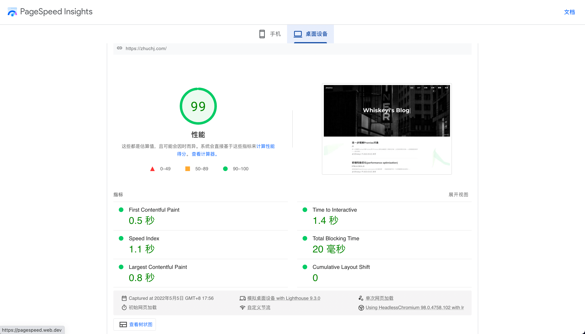

## 前端性能优化(performance optimization)

### 说在最前面

性能是前端开发一个非常重要的组成部分，与应用不同，网页的所有资源初始都需要通过网络传输，因此如何进行更好地进行网络传输对前端性能影响很大，此外还有浏览器渲染部分的优化。而在另一方面，对于用户来说，给网站添加加载或者过渡动画，让用户能够在等待中给予反馈(而不是生硬的白屏)，其实也可以看作为一种不一样的“性能优化”，下面文章将主要描述前端在网路传输和浏览器渲染等过程中如何进行性能优化，为用户带来更好的体验。另外，**由于前端性能优化涉及的知识点比较多，全文篇幅较长，希望你能有所收获～**

### 前言

在描述前端性能优化前，我们需要了解一个常谈的问题：

> 从输入 URL 到页面加载完成，发生了什么?

这个问题很重要，因为文章性能优化的各个点将由这个过程展开。下面我们来简单回顾一下整个过程(其中涉及到计算机网络的知识点，由于文章主要讲性能优化，这里不做具体展开：

1. 浏览器的地址栏输入 URL 并跳转访问
2. 浏览器查找当前 URL 是否存在缓存并且未清空和过期
3. DNS 解析 URL 对应的 IP
4. 根据 IP 建立 TCP 连接（三次握手）
5. HTTP 发起请求
6. 服务器处理请求，浏览器接收 HTTP 响应
7. 渲染页面，构建 DOM 树
8. 关闭 TCP 连接（四次挥手）

在进行下文阅读前，如果对过程不是很理解的话，推荐阅读[掘金文章-网络通信](https://juejin.cn/post/6844904132071915527)和[掘金文章-页面渲染](https://juejin.cn/post/6844904132071915527)两篇文章。

### 如何优化-DNS 预解析(DNS Prefetch)

**DNS 预解析介绍:**

`DNS(Domain Name System, 域名系统)`，是域名和 IP 地址相互映射的一个分布式数据库。DNS 查询就是将域名转换成 IP 的过程，这个过程短的话可能 1ms(本地缓存)对用户来说几乎无感，长则可能达到几秒钟。
   当浏览器访问一个域名的时候，需要解析一次 DNS，获得对应域名的 ip 地址。在解析过程中，按照浏览器缓存、系统缓存、路由器缓存、ISP(运营商) DNS 缓存、根域名服务器、顶级域名服务器、主域名服务器的顺序，逐步读取缓存，直到拿到该域名的 IP 地址。
  `DNS预解析(DNS Prefetch)`，就是根据浏览器定义的规则，提前解析之后可能会用到的域名，使解析结果缓存到系统缓存中，缩短 DNS 解析时间，来提高网站的访问速度。

DNS 预解析会做两件事：

- html 源码下载完成后，会解析页面的包含链接的标签，提前查询对应的域名。
- 对于访问过的页面，浏览器会记录一份域名列表，当再次打开时，会在 html 下载的同时去解析 DNS。

**DNS 预解析使用:**

下面介绍两种 DNS 预解析方式：

1. `自动解析`：浏览器使用超链接的 href 属性来查找要预解析的主机名。当遇到 a 标签，浏览器会自动将 href 中的域名解析为 IP 地址，这个解析过程是与用户浏览网页并行处理的。但是为了确保安全性，在 HTTPS 页面中不会自动解析。可以通过以下代码可以手动开启：

```html
<!-- 当content为off是则为关闭 -->
<meta http-equiv="x-dns-prefetch-control" content="on" />
```

2. `手动解析`：在页面添加标记，给 link 的 rel 设置`dns-prefetch`。

```html
<link rel="dns-prefetch" href="www.baidu.com" />
```

**DNS 预解析总结:**

`DNS Prefetch` 可以有效缩短了 DNS 的解析时间，在应用于一些大量引用很多其他域名资源的网站，能够明显提升访问的速度。

### 如何优化-发送 HTTP 请求

我们知道，在访问一个网页时，会产生很多 HTTP 请求，那么如何来优化这部分的性能呢？我们有两个思路：**减少请求次数**和**缩小请求体积**以减少单次请求时间，下面我们具体分析这两个思路有哪些方法：

#### 减少请求次数

**将要请求的`资源合并`：**

##### Webpack

- 使用 `webpack 静态模块打包工具`，借助 webpack 我们可以对项目 JS 和 CSS 资源进行打包，避免 JS 、 CSS 文件过多。

##### CSS Sprites

- 使用`雪碧图(CSS Sprites)，精灵图`。我们将多个小图合并为一张，在使用的时候利用 background-position 进行定位，相较于一个小图标一个图像文件，单独一张图片所需的 HTTP 请求更少，且对内存和带宽更加友好。

> 和雪碧图一样，Base64 也是为了减少加载网页图片时对服务器的请求次数，从而提升网页性能。

##### WebStorage

使用`WebStorage`：WebStorage 有两种， sessionStorage 和 localStorage ，大小在 5-10M 之间，都是以键值对的方式进行存储。我们可以将一些请求获得的数据存储在 WebStorage 中，这样可以避免同样的数据两次请求。要注意的是 sessionStorage 与 localStorage 的不同在于生命周期的不同， sessionStorage 在 tab 关闭后，就不再存在了，而 localStorage 的永久存储，除非主动删除。

##### IndexDB

使用`IndexDB`： IndexDB 是一个运行在浏览器上的非关系型数据库，相比 WebStorage，它可以存储大量的数据。

##### HTTP Cache

- 使用 `HTTP Cache`机制：HTTP 缓存分为强缓存和协商缓存。优先级较高的是强缓存，在未命中强缓存后下，走协商缓存。
  - `强缓存`利用 http 头中的 expires 和 cache-control 两个字段控制，当请求再次发出时，浏览器会根据这两个字段判断目标资源是否“命中”强缓存，若命中则直接从缓存中获取资源，不会再与服务端发生通信。以此减少请求的次数。
    > 强缓存的 expires 是一个时间戳，如果我们试图再次向服务器请求资源，浏览器对比本地时间和 expires 的时间戳，如果本地时间小于 expires 设定的过期时间，那么就直接去缓存中取这个资源。这样就会产生一个问题：如果本地时间不正确， expires 就无法达到我们预期的效果。 HTTP1.1，引入了 cache-control 字段，我们通过 `cache-control: max-age=1000` 来控制资源的有效期。 max-age 是一个时间长度。若 max-age 若为 1000 秒，则它指向的资源在 1000 秒以内都是有效的，规避了时间戳带来的潜在问题。
  - `协商缓存`：协商缓存下，浏览器向服务器去询问缓存的相关信息，判断是重新发起请求、下载完整的响应，还是从本地获取缓存的资源。如果服务端提示缓存资源未改动(Not Modified)，资源会被重定向到浏览器缓存，这种情况下网络请求对应的状态码是 `304`。
    > 协商缓存的字段 Last-Modified 也是一个时间戳，当我们启用协商缓存，它会在首次请求时随着 Response Headers 返回：`Last-Modified: Four, 3 Mar 2022 23:22:57 GMT`，随后每次请求时，会带上 If-Modified-Since 时间戳字段，它的值正是上一次 response 返回给它的 last-modified 值，服务器接时间戳后，会比对该时间戳和资源在服务器上的最后修改时间是否一致，从而判断资源是否发生了变化。如果发生了变化，会返回一个完整的响应内容，并在 Response Headers 中添加新的 Last-Modified 值；否则，返回 304 响应，并且不再添加 Last-Modified 字段。在使用 last-modified 时会有两个问题，无法检测我是否真的修改了文件和在很短时间里修改了文件，并未到 last-modified 检测时间间隔里。因此引入了 Etag，Etag 是由服务器为每个资源生成的唯一的标识字符串，这个标识字符串是基于文件内容编码的，只要文件内容不同，它们对应的 Etag 就是不同的。

#### 缩小请求体积

##### Cookie

- `不滥用Cookie`：Cookie 的本职工作并非本地存储，而是“维持状态“。Cookie 的体积上限只有`4KB`，一般来说存在于响应头里的 Set-Cookie 中，因此在同一个域名下的所有请求，都会携带 Cookie ，过量的 Cookie 会带来巨大的性能浪费。

##### Gzip 压缩

`使用Gzip`:传输的时候可以在服务器端开启 gzip 压缩(在响应头`request headers`加一句`accept-encoding:gzip`)，`content-encoding: gzip`可以有效减少传输文件的大小。

> 现今也有使用 Content-Encoding: br 的压缩方法的，它是一种比 Gzip 压缩率更高的算法。压缩文件这个过程本身是需要耗费时间的，这是一种以服务器压缩的时间开销和 CPU 开销（和浏览器解析压缩文件的开销）为代价，省下了传输过程中的时间开销的方法。

##### 代码压缩

- `代码压缩`：使用代码压缩工具，删除无用的注释、空行和缩减名称等以减少请求体积。

##### 图片优化

- `图片优化`：图片是网页上占用很多流量的一种资源。图片优化往往能将性能优化达到比较好的效果。一般我们有牺牲质量，压缩图片大小和裁剪图片两种方式：
  - `压缩图片`：如果在图片损失一些颜色和像素的情况下并不会对用户体验有太大影响，我们可以对图片进行压缩。
  - `裁剪图片`：在一些图片不用完全显示等情况下，我们可以对图片做一些裁切和缩小等操作，来减小图片的体积。
    > 图片选用正确的格式也可以算是一种图片优化等方法，网页图片的格式一般有 PNG、JPG、SVG、WEBP。SVG 为矢量图片，不失真，常用于简单图形；WEBP 压缩率一般比 PNG 和 JPG 更好，同时支持透明背景。缺点是兼容性不好，所以我们将 WEBP 可用于兼容性好的浏览器，并用 JPG 和 PNG 做回退机制。

### 如何优化-页面渲染

在上文，我们简单回答了从输入 URL 到页面加载完成，发生了什么这个问题，其中第七步页面渲染，构建 DOM 树有以下步骤：

1. 浏览器开始解析目标 HTML 文件,执行流的顺序为自上而下。
2. HTML 解析器将 HTML 结构转换为基础的 DOM (文档对象模型),构建 DOM 树完成后,触发 DomContendLoaded 事件。
3. CSS 解析器将 CSS 解析为 CSSOM (层叠样式表对象模型),一棵仅含有样式信息的树。
4. CSSOM 和 DOM 开始合并构成渲染(render)树,每个节点开始包含具体的样式信息。
5. 计算渲染树中个各个节点的位置信息,即布局阶段。
6. 将布局后的渲染树显示到界面上。

那么根据上述这些步骤，如何进行页面渲染的相关优化呢？下面介绍几块方法：浏览器下载完页面中的所有组件—— HTML 标记、JavaScript、CSS、图片之后会解析生成两个内部数据结构—— DOM 树和(render)渲染树。DOM 树表示页面结构，渲染树表示 DOM 节点如何显示。

#### 减少渲染次数

- `减少渲染次数`：我们通过尽量减少重排与重绘来减少渲染的次数。重排又称为回流，即通过某种手段改变了元素的位置大小等信息，导致浏览器需要重新计算和渲染的过程。而重绘是被改变了样式如颜色等。我们可以将将需要多次重排的元素(如动画等)，position 属性设为 absolute 或 fixed，这样元素就脱离了文档流，不会影响到其他元素。由于浏览器的流布局，对渲染树的计算通常只需要遍历一次就可以完成。但 table 及其内部元素除外，它可能需要多次计算才能确定好其在渲染树中节点的属性，通常要花 2 倍多于同等元素的时间。所以我们要尽量不用 table 布局。

> 重排重绘具体定义：DOM 树中的每一个需要显示的节点在渲染树种中至少存在一个对应的节点(隐藏的 DOM 元素 display 值为 none 在渲染树中没有对应的节点)。渲染树中的节点被称为“帧”或“盒”，符合 CSS 模型的定义，理解页面元素为一个具有填充，边距，边框和位置的盒子。一旦 DOM 和渲染树构建完成，浏览器就开始显示（绘制）页面元素。当 DOM 的变化影响了元素的几何属性（宽或高），浏览器需要重新计算元素的几何属性，同样其他元素的几何属性和位置也会因此受到影响。浏览器会使渲染树中受到影响的部分失效，并重新构造渲染树。这个过程称为`重排`。完成重排后，浏览器会重新绘制受影响的部分到屏幕，该过程称为`重绘`。

#### 减少渲染节点数量

减少渲染节点数量,可以用到懒加载、虚拟列表等方法。

##### 懒加载

- `懒加载`：当访问一个页面的时候，先不设或把 img 元素或是其他元素的图片路径替换成一张大小为 `1*1 px` 图片的路径（俗称占位图），当图片出现在浏览器的可视区域内时，才设置图片正真的路径，让图片显示出来，实现懒加载。那我们为什么要进行懒加载呢？在一些页面内容丰富、图片较多的场景下，如各种电商、长页面。这些页面的资源量很大，要是页面载入就一次性完成加载，需要不少的时间。

```html
<html lang="en">
  <head>
    <meta charset="UTF-8" />
    <meta name="viewport" content="width=device-width, initial-scale=1.0" />
    <title>Document</title>
    <style>
      img {
        height: 450px;
        display: block;
        margin-bottom: 20px;
      }
    </style>
  </head>
  <body>
    <!--这里不是用src，图片地址暂时先保存在data-src这个自定义属性上面-->
    
    
    
    
    
  </body>
</html>
```

在介绍下面代码前，需要掌握这几个属性：
`clientHeight`：浏览器视口的高度(img.offsetTop)；
`scrollTop`：滚动轴滚动的距离(document.documentElement.scrollTop)；
`offsetTop`：元素的头部距离浏览器顶部的高度（不是距离视口顶部的高度）(document.documentElement.clientHeight)；

```js
const imgs = document.getElementsByTagName("img");
function lazyLoad(imgs) {
  // 视口的高度；
  const clientH = document.documentElement.clientHeight;
  // 滚动的距离，这里的逻辑判断是为了作兼容性处理；
  const clientT = document.documentElement.scrollTop || document.body.scrollTop;
  for (let i = 0; i < imgs.length; i++) {
    // 逻辑判断，若是视口高度 + 滚动距离 > 图片到浏览器顶部的距离就去加载；
    // !imgs[i].src 目的是避免重复请求
    if (clientH + clientT > imgs[i].offsetTop && !imgs[i].src) {
      // 使用data-xx的自定义属性能够经过dom元素的dataset.xx取得；
      imgs[i].src = imgs[i].dataset.src;
    }
  }
}
// 一开始可以加载显示在视口中的图片；
lazyLoad(imgs);
// 监听滚动事件，加载后面的图片；
window.onscroll = () => lazyLoad(imgs);
```

有同学可能会发现，频繁触发的 scroll 事件会给浏览器形成很大的压力，这里我们可以对懒加载进行进一步优化，结合[节流函数](https://zhuchj.com/debounce.html)进行进一步优化。

##### 虚拟列表

- `虚拟列表`：在一些情况下，我们会遇到需要一些不能使用分页方式来加载列表数据，而一次性加载大量数据会极其浪费时间，因为在实际的工作中，列表项是由复杂 DOM 节点组成的。虚拟列表类似懒加载是按需显示的一种实现，即只对可见区域进行渲染，对非可见区域中的数据不渲染或部分渲染的技术，从而达到极高的渲染性能。虚拟列表的实现，实际上就是在首屏加载的时候，只加载可视区域内需要的列表项，当滚动发生时，动态通过计算获得可视区域内的列表项，并将非可视区域内存在的列表项删除。这里看到了一篇不错的文章可供学习[虚拟列表](https://juejin.cn/post/6844903982742110216)。

#### 减少阻塞

##### CSS 阻塞渲染

- `CSS阻塞渲染`：通常情况下 CSS 被认为是阻塞渲染的资源，在 CSSOM 构建完成之前，页面不会被渲染，放在顶部让样式表能够尽早开始加载。但如果把引入样式表的 link 放在文档底部，页面虽然能立刻呈现出来，但是页面加载出来的时候会是没有样式的，是混乱的。当后来样式表加载进来后，页面会立即进行重绘，会发生闪烁的问题。

##### JavaScript 阻塞文档解析

- `JavaScript 阻塞文档解析`：当在 HTML 文档中遇到 script 标签后控制权将交给 JS，在 JS 下载并执行完成之前，都不会解析 HTML。因此如果将 JS 放在文档顶部，恰好这个时候 JS 脚本加载的特别慢，用户将会等待很长一段时间，这段时间 HTML 文档还没有解析到 body 部分，页面会是空白的。我们可以人为指定，哪些元素进行延迟加载，通过为 script 标签指定 async 或 defer 来延迟脚本。
  - async 表示 JS 不会阻塞，但会在下载完成后立刻执行。
  - defer 则会在下载完成并且整个文档解析完成、DOMContentLoaded 事件被触发前开始执行。

##### 提高渲染效率

**提高渲染效率：**

###### 减少对 DOM 操作

- `减少对 DOM 操作`：因为 JS 引擎和渲染引擎需要交流，因此大量操作 DOM 很大程度上会影响整体的性能，这里建议除非遇到不可避免的情况下，除此之外我们尽量批量处理 DOM ,并且对于一些频繁操作 DOM 的可以结合防抖节流函数进行处理。

###### 事件循环、异步更新

- `事件循环、异步更新`：我们常说 JS 是单线程的，之所以是单线程，是因为在浏览器渲染的过程中如果两个线程同时操作一个 DOM 节点，那么该谁先谁后呢，虽然多线程也有办法解决，但是 JS 毕竟是浏览器脚本语言，不需要那么复杂。由于 JS 的单线程性，有了事件循环 (Event Loop) 与异步更新策略。事件循环中的异步队列分为：macro（宏任务）队列和 micro（微任务）队列。他们的区别是，当 macro-task 出队时，任务是一个一个执行的；而 micro-task 出队时，任务一队一队执行。所以，处理 micro 队列时会逐个执行队列中的任务并把它出队，直到队列被清空。良好的利用事件循环和异步更新，可以提高浏览器的渲染效率。

### 其它补充

#### 性能指标 & 模型

- **性能指标 & 模型**：
  - `性能指标`：
    1. First Paint 首次绘制(FP)：用于记录页面第一次绘制像素的时间。
    2. First contentful paint 首次内容绘制 (FCP)：用于记录页面首次绘制文本、图片、非空白 Canvas 或 SVG 的时间。
    3. Largest contentful paint 最大内容绘制 (LCP)：记录视窗内最大的元素绘制的时间。
    4. First input delay 首次输入延迟 (FID)：FCP 和 TTI 之间用户首次与页面交互时响应的延迟。
    5. Time to Interactive 可交互时间 (TTI)：指标代表着页面何时真正进入可用的状态。
    6. Total blocking time 总阻塞时间 (TBT)：记录在 FCP 到 TTI 之间所有长任务的阻塞时间总和。
    7. Cumulative layout shift 累积布局偏移 (CLS)：记录页面非预期的位移波动。
  - `RAIL 模型(简述)`：RAIL 模型由 Google 提出，RAIL 是 response （响应）、 animation（动画）、idle（浏览器空置状态）和 load（加载），从这四个模块角度来思考你的产品。如果在每个模块上，你都可以达到性能优化的目标值，那么最终用户感受到的将会是极致的体验。

#### 首屏时间

- **首屏时间**：首屏时间是指页面第一屏所有资源完整展示的时间(可以理解为白屏时间 + 第一次渲染的用时)。这是一个对用户来说非常直接的体验指标，但是对于前端却是一个非常难以统计衡量的指标。上文说到了很多优化首屏时间的方法，说到首屏时间让我想起了我们学校公众号的校园码，对于这种要及时展示使用的场景，特别需要优化首屏时间，而我们学校的校园码展示出来前却需要加载很多资源。

#### CDN

- **CDN 加速(内容分发网络)**：CDN(content delivery network)是一组分布在多个不同地理位置的 Web 服务器。我们都知道，当服务器离用户越远时，延迟越高。CDN 就是为了解决这一问题，在多个位置部署服务器，将用户网址的内容存储下来，根据用户请求的位置选择离用户近的服务器，降低网络拥塞，提高用户访问速度和命中率，从而缩短请求时间。它主要的关键技术是内容存储和分发技术。通过实测，我的博客配置了 CDN 加速后速度有明显的提升。

#### 性能监控

- **性能监控**：待补充

### 总结

在对于我的博客优化过程中，我使用到了 Google 的 [PageSpeed Insights](https://developers.google.com/speed) 工具，从初始的评分 68 优化到最终评分 99 分,如图:



这篇文章总体介绍了前端性能优化的种种方法，但同时在这些方法中，有些方法不仅仅能够提高前端的性能，同时还能为服务器降低压力、降低流量的使用等等，可以说是一劳多得。
