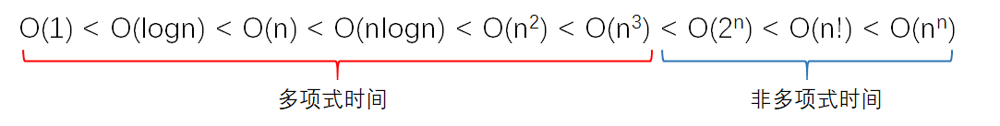
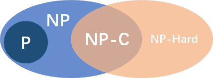

## Relearning algorithms

### Introduction

Data structures and algorithms are fundamental skills for programmers. Together with the developing `Relearning Data Structures` series, these notes revisit coursework and self-study and organize that knowledge again. Examples use `JavaScript`, and I will continue recording my progress with coding problems.

> This article is being updated continuously...

### An overview of algorithms

#### Definition

An algorithm is generally a finite sequence of instructions with five properties:

1. Definiteness: each instruction is clear and unambiguous.
2. Effectiveness: each instruction can be carried out.
3. Input: zero or more inputs are drawn from defined sets.
4. Output: one or more outputs have a specified relationship to the inputs.
5. Finiteness: each instruction is executed a finite number of times.

> A process meeting the first four conditions without finiteness is a computational process; an operating system is one example.

#### Evaluating an algorithm

A problem can have several algorithms, whose quality affects the efficiency of both the algorithm and the program. Analysis helps select and improve algorithms, primarily through `time complexity` and `space complexity`.

- Time complexity: the computational work needed to execute an algorithm. It is usually a function of input size; asymptotic time complexity describes how running time grows as the problem becomes larger.
- Space complexity: the memory required by an algorithm. It is expressed asymptotically in a similar way and is often easier to analyze than time complexity.
- Correctness: the most important criterion for judging an algorithm.
- Readability: how easy the algorithm is for people to read and understand.
- Robustness: its ability to respond to and handle unreasonable input, also called fault tolerance.

#### NP-completeness theory

**Polynomial and non-polynomial time:**



For sufficiently large problems, some algorithms run in polynomial time while others require non-polynomial time. Large problems with exponential growth can take a very long time to solve.

##### P(Polynomial-time)

A problem belongs to P if an algorithm can solve it in polynomial time, excluding growth such as exponentials and factorials.

##### NP(Nondeterministic Polynomial-time)

NP stands for nondeterministic polynomial time: problems for which a proposed solution can be verified in polynomial time.

If a problem can be solved in polynomial time, a proposed solution can also be verified in polynomial time. Thus P is a subset of NP.

##### NPC (NP-completeness): the hardest problems in NP

**Informally**, an NP problem is NP-complete if it is at least as hard as every other NP problem under reduction.

It must first belong to NP, and every NP problem must be reducible to it. Solving such a problem would therefore provide a way to solve all NP problems.

**Reduction:** problem A reduces to problem B if a solution to B can be used to solve A—in other words, A can be transformed into B.

Reducing one problem to another can increase the complexity of the resulting problem while broadening its applicability.



### Basic algorithms

#### Sorting algorithms

#### Search algorithms

#### Exhaustive search

Exhaustive search, also called brute force, enumerates all possible cases and checks which satisfy the requirements. It can also be used to try possible passwords one by one. A four-digit numeric password has 10,000 combinations, so at most 10,000 trials are needed to find it.

### Common algorithms

#### Iteration, recursion, and divide and conquer

- Iteration repeats a feedback process to approach a target or result.
- Recursion directly or indirectly invokes the same algorithm.
- Divide and conquer splits a complex problem into smaller, identical or similar subproblems until they can be solved directly.

**Conditions for divide and conquer:**

1. Base case: the problem becomes easy to solve once sufficiently small.
2. Decomposition property 1: the problem splits into smaller instances of the same problem and has optimal substructure; optimal subproblem solutions yield an optimal overall solution.
3. Decomposition property 2: the subproblems are independent and do not share subproblems. If they overlap, consider dynamic programming.
4. Combination: subproblem solutions can be combined into a solution to the original problem.

**Principle:**
Prefer subproblems of roughly equal size. Splitting a problem into k similarly sized parts balances the work and is usually better than highly unequal subdivisions.

**Relationship between the approaches:**
Divide-and-conquer subproblems are usually smaller instances of the original problem, making recursion natural. Repeated division preserves the problem type while reducing its size until direct solutions become easy.

##### T1. Sword Offer 24: Reverse Linked List

Link: [Reverse Linked List](https://leetcode.cn/problems/fan-zhuan-lian-biao-lcof/)

```js
/**
 * 反转链表——递归法
 */
function reverse(prev, head) {
    if(!head) return prev;
    let temp = head.next;
    head.next = prev;
    prev = head;
    return reverse(prev, temp);
}
// 主函数
function ReverseList(pHead)
{
    return reverse(null, pHead);
}

module.exports = {
    ReverseList : ReverseList
};
```

##### T2. 200: Number of Islands

Link: [Number of Islands](https://leetcode.cn/problems/number-of-islands/description/)

```js
var numIslands = function (grid) {
  let rz = 0;
  let flag = false;
  const dfs = (grid, i, j) => {
    if (i >= 0 && j >= 0 && i < grid.length && j < grid[0].length) {
      if (grid[i][j] !== '1') return
      grid[i][j] = '0';
      dfs(grid, i, j + 1);
      dfs(grid, i, j - 1);
      dfs(grid, i + 1, j);
      dfs(grid, i - 1, j);
    } else return
    flag = true;
  }
  for (let i = 0; i < grid.length; i++) {
    for (let j = 0; j < grid[0].length; j++) {
      dfs(grid, i, j);
      if (flag) {
        rz++;
        flag = false
      }
    }
  }
  return rz;
};
```

#### Dynamic programming

Like divide and conquer, dynamic programming decomposes a problem into subproblems. However, these subproblems often overlap, and the number of distinct subproblems is usually polynomial. A divide-and-conquer solution may compute the same subproblem many times.

Saving solved subproblems and reusing their answers avoids repeated computation and can produce a polynomial-time algorithm.

**Steps:**

1. Identify and characterize the structure of an optimal solution.
2. Define the optimal value recursively.
3. Compute optimal values from the bottom up.
4. Construct an optimal solution using the information collected during those computations.

Both approaches combine subproblem solutions. The difference is that divide and conquer uses independent subproblems, while dynamic programming addresses overlapping subproblems.

##### T1. 518: Coin Change II

Link: [Coin Change II](https://leetcode.cn/problems/coin-change-ii)

```js
/**
 * @param {number} amount
 * @param {number[]} coins
 * @return {number}
 */
const amount = 5, coins = [1, 2, 5];
const change = (amount, coins) => {
  let dp = Array(amount + 1).fill(0);
  dp[0] = 1;
  for (let i = 0; i < coins.length; i++) {
    for (let j = coins[i]; j <= amount; j++) {
      dp[j] += dp[j - coins[i]];
    }
  }
  return dp[amount];
}
console.log(change(amount, coins));
```

##### T2. Integer Break

Link: [Integer Break](https://leetcode.cn/problems/integer-break)

```js
/**
 * @param {number} n
 * @return {number}
 */
var integerBreak = function (n) {
  let dp = [];
  dp[0] = 0;
  dp[1] = 1;
  for (let i = 2; i <= n; i++) {
    let max = -Infinity;
    for (j = 1; j < i; j++) {
      max = Math.max(Math.max(dp[i - j] * j, (i - j) * j), max);
    }
    dp[i] = max;
  }
  return dp[n]
};
```

##### T3. Sword Offer II 099: Minimum Path Sum

Link: [Minimum Path Sum](https://leetcode.cn/problems/0i0mDW/description/)

```js
/**
 * @param {number[][]} grid
 * @return {number}
 */
var minPathSum = function (grid) {
  let dp = new Array(grid.length).fill(0).map(() => new Array(grid[0].length).fill(0))
  let row = 0;
  let column = 0;
  for (let i = 0; i < grid.length; i++) {
    row += grid[i][0]
    dp[i][0] = row;
  }
  for (let j = 0; j < grid[0].length; j++) {
    column += grid[0][j]
    dp[0][j] = column;
  }
  for (let i = 1; i < grid.length; i++) {
    for (let j = 1; j < grid[0].length; j++) {
      dp[i][j] = Math.min(dp[i - 1][j] + grid[i][j], dp[i][j - 1] + grid[i][j])
    }
  }
  return dp[grid.length - 1][grid[0].length - 1]
};
```

#### Greedy algorithms

**Basic idea:**

At each step, choose what currently appears best: a locally optimal choice.
When the greedy-choice property holds, a series of these local choices yields the globally optimal solution.
Dynamic programming usually solves subproblems from the bottom up. Greedy algorithms usually work from the top down, making successive choices that reduce the problem to a smaller one.

1. Build a mathematical model of the problem.
2. Divide it into subproblems.
3. Find a locally optimal solution for each subproblem.
4. Combine those local solutions into a solution to the original problem.

##### T1. 6221: Most Popular Video Creator

Link: [Most Popular Video Creator](https://leetcode.cn/problems/most-popular-video-creator/description)

```js
/**
 * 整体思路【贪心】，从末尾往前依次 加上 能进位的数字大小
 */
var makeIntegerBeautiful = function (n, target) {
  // 分隔n为数字数组
  let nArr = n.toString().split('').map(Number)
  // 数组求和
  let sum = nArr.reduce((pre, cur) => pre + cur)
  // 需要添加的数字
  let rz = 0
  // 记录当前执行到第 base + 1 次
  let base = 0
  for (let i = nArr.length - 1; i >= 0; i--) {
    // 每次执行判断是否符合结果，若符合直接输出
    if (sum <= target) return rz
    let currNum = nArr[i]
    // 更新结果
    sum = sum - currNum + 1
    rz += Math.pow(10, base) * (10 - currNum)
    // 每次操作前一位进一
    nArr[nArr.length - 2 - base]++
    base++
  }
  return rz
};
```

**Optimal substructure:**
A problem has optimal substructure when an optimal solution contains optimal solutions to its subproblems. This is a key property for dynamic programming and greedy algorithms.

#### Backtracking

**Basic idea:**

1. Define the solution space and a structure that is easy to search.
2. Search that space depth first.
3. Use pruning functions to avoid unproductive branches.

Backtracking searches a solution space and prunes invalid or unpromising paths. There are two types of pruning:

1. Constraint functions remove paths that violate constraints.
2. Bound functions remove paths that cannot yield an optimal solution.

The key is defining the solution space and representing it as a solution-space tree.

Solution-space trees can be subset trees or permutation trees. A subset tree represents selecting or not selecting items, as in 0/1 knapsack, or choosing a supplier for each part in minimum-weight machine design. Permutation trees represent choices without repetition, as in traveling-salesperson routes or optimal badminton pairings.

##### T1. 78: Subsets

Link: [Subsets](https://leetcode.cn/problems/subsets/)

```js
/**
 * @param {number[]} nums
 * @return {number[][]}
 */
var subsets = function (nums) {
  let rz = [[]];
  let path = [];
  let len = nums.length;
  const backTracking = (nums, startIndex, length) => {
    if (path.length === length) {
      rz.push([...path]);
      return;
    }
    for (let k = startIndex; k < len; k++) {
      path.push(nums[k]);
      backTracking(nums, k + 1, length);
      path.pop();
    }
  }
  for (let i = 1; i <= len; i++) {
    backTracking(nums, 0, i);
  }
  return rz;
};
```

#### Branch and bound

Like backtracking, branch and bound searches a problem's solution-space tree.

**Differences:**

1. Different objectives:
   - Backtracking usually finds all solutions satisfying the conditions.
   - Branch and bound seeks one feasible solution quickly, or an optimal solution among those satisfying the constraints.
2. Different search strategies:
   - Backtracking searches depth first.
   - Branch and bound uses breadth-first or least-cost-first search.
3. Different space requirements:
   - Branch and bound stores live nodes and therefore needs much more memory. Backtracking can be preferable when memory is limited. Each live node becomes an expansion node once and generates all its children. A maximum-clique problem can use a max heap, and a traveling-salesperson problem a min heap.

**Summary:** backtracking is more space-efficient; branch and bound often finds a result faster because it needs only one suitable solution.

#### Randomized algorithms

**Basic idea:**

Use random functions so that decisions depend on random events. Running the same randomized algorithm on the same input can produce different results.

- Numerical randomized algorithms
- Monte Carlo algorithms
- Las Vegas algorithms
- Sherwood algorithms
- …
