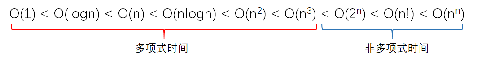
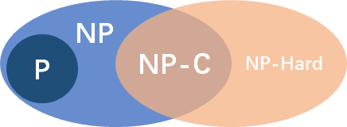

## 重拾算法(Re-learning Algorithm)

### 介绍

数据结构和算法是一名合格程序员的基本素质，本专栏与在构建的`重拾数据结构(Re-learning Data Structure)`专栏一起，旨在回顾课程及自我学习到的数据结构和算法内容的知识，对它们进行重新梳理。代码以`JavaScript`语言编写，后续会持续更新记录自己的刷题过程。

> 内容持续更新中…

### 算法概述

#### 定义

一般认为，算法是由若干条指令组成的有穷序列，具有下列五个特性：

1. 确定性：每条指令都是明确的、无二义的
2. 能行性：每条指令都必须是能够执行的
3. 输入：允许有 0 个或多个输入量，取自特定的集合
4. 输出：产生一个或多个输出，它（们）与输入量之间存在着某种特定的关系
5. 有穷性：每一条指令执行的次数都是有穷的

> 注：如果不满足有穷性，满足前 4 条，则称为计算过程，操作系统 OS 就是计算过程

#### 算法的评定

同一问题可用不同算法解决，而一个算法的质量优劣将影响到算法乃至程序的效率。算法分析的目的在于选择合适算法和改进算法。一个算法的评价主要从`时间复杂度`和`空间复杂度`来考虑。

- 时间复杂度:算法的时间复杂度是指执行算法所需要的计算工作量。一般来说，计算机算法是问题规模的函数，因此，问题的规模越大，算法执行的时间的增长率与的增长率正相关，称作渐进时间复杂度（Asymptotic Time Complexity）。
- 空间复杂度: 算法的空间复杂度是指算法需要消耗的内存空间。其计算和表示方法与时间复杂度类似，一般都用复杂度的渐近性来表示。同时间复杂度相比，空间复杂度的分析要简单得多。
- 正确性: 算法的正确性是评价一个算法优劣的最重要的标准。
- 可读性: 算法的可读性是指一个算法可供人们阅读的容易程度。
- 鲁棒性: 鲁棒性是指一个算法对不合理数据输入的反应能力和处理能力，也称为容错性。

#### NP 完全性理论

**多项式时间和非多项式时间：**



当问题的规模足够大的时候，有的问题的时间复杂度是多项式时间的，而有的是非多项式时间的。也就是说，对于规模很大的非多项式时间问题，要解决它的话需要很久的时间，时间呈现指数级增长。

##### P(Polynomial-time)

如果一个问题可以找到一个能在多项式的时间（有限，除 n 次方阶乘等）里解决它的算法，那么这个问题就属于 P 问题。

##### NP(Nondeterministic Polynomial-time)

即非确定性多项式时间，在多项式时间内可以被证明（验证）的问题（可以在多项式的时间里猜出一个解的问题）。

对于一个问题，如果我们能够在多项式时间内解决，那么我们肯定也能在多项式时间内验证某个猜测是否为这个问题的一个解，因此 P 问题也属于 NP 问题，或者说 P 问题是 NP 问题的一个子集。

##### NPC(NP Completeness)：NP 中最难的问题

**非形式化定义**，如果一个 NP 问题和其他任何 NP 问题一样“不易解决”（归约），那么我们认为这一问题是 NPC 类问题或称之为 NP 完全问题

首先，它得是一个 NP 问题；然后，所有的 NP 问题都可以约化到它。所有的 NP 问题都可以归约到它。也就是说，解决了这个问题，也就同时解决了所有的 NP 问题

**归约**：一个问题 A 可以约化为问题 B 的含义即是，可以用问题 B 的解法解决问题 A，或者说，问题 A 可以“变成”问题 B（B 的时间复杂度高于或者等于 A 的时间复杂度）

一个问题约化为另一个问题，时间复杂度增加了，问题的应用范围也增大了



### 基本算法

#### 排序算法

#### 搜索算法

#### 穷举法

穷举法，或称为暴力破解法，其基本思路是：对于要解决的问题，列举出它的所有可能的情况，逐个判断有哪些是符合问题所要求的条件，从而得到问题的解。它也常用于对于密码的破译，即将密码进行逐个推算直到找出真正的密码为止。例如一个已知是四位并且全部由数字组成的密码，其可能共有 10000 种组合，因此最多枚举 10000 次就能找到正确的密码。

### 常用算法

#### 迭代 & 递归 & 分治法

- 迭代：迭代是重复反馈过程的活动，逼近所需目标或结果
- 递归：直接或者间接调用自身的算法
- 分治：把一个复杂的问题分成两个或更多的相同或相似的子问题，再把子问题分成更小的子问题……直到最后子问题可以简单的直接求解

**分治条件：**

1. 边界条件：该问题的规模缩小到一定的程度就可以容易地解决
2. 问题分解性质 1：该问题可以分解为若干个规模较小的相同问题，即该问题具有最优子结构性质（子问题最优则原问题即最优
3. 问题分解性质 2：该问题所分解出的各个子问题是相互独立的，即子问题之间不包含公共的子问题；（不独立则使用动态规划）
4. 合并：利用该问题分解出的子问题的解可以合并为该问题的解

**原则：**
在用分治法设计算法时，最好使子问题的规模大致相同。即将一个问题分成大小相等的 k 个子问题的处理方法是行之有效的。这种使子问题规模大致相等的做法是出自一种平衡(balancing)子问题的思想，它几乎总是比子问题规模不等的做法要好

**两者关系：**
由分治法产生的子问题往往是原问题的较小模式，这就为使用递归技术提供了方便。在这种情况下，反复应用分治手段，可以使子问题与原问题类型一致而其规模却不断缩小，最终使子问题缩小到很容易直接求出其解。这自然导致递归过程的产生

##### T1. 剑指 Offer 24. 反转链表

链接：[反转链表](https://leetcode.cn/problems/fan-zhuan-lian-biao-lcof/)

```js
/**
 * 反转链表——递归法
 */
function reverse(prev, head) {
    if(!head) return prev;
    let temp = head.next;
    head.next = prev;
    prev = head;
    return reverse(prev, temp);
}
// 主函数
function ReverseList(pHead)
{
    return reverse(null, pHead);
}

module.exports = {
    ReverseList : ReverseList
};
```

##### T2：200. 岛屿数量

链接：[岛屿数量](https://leetcode.cn/problems/number-of-islands/description/)

```js
var numIslands = function (grid) {
  let rz = 0;
  let flag = false;
  const dfs = (grid, i, j) => {
    if (i >= 0 && j >= 0 && i < grid.length && j < grid[0].length) {
      if (grid[i][j] !== '1') return
      grid[i][j] = '0';
      dfs(grid, i, j + 1);
      dfs(grid, i, j - 1);
      dfs(grid, i + 1, j);
      dfs(grid, i - 1, j);
    } else return
    flag = true;
  }
  for (let i = 0; i < grid.length; i++) {
    for (let j = 0; j < grid[0].length; j++) {
      dfs(grid, i, j);
      if (flag) {
        rz++;
        flag = false
      }
    }
  }
  return rz;
};
```

#### 动态规划

动态规划算法与分治法类似，其基本思想也是将待求解问题分解成若干个子问题。但是经分解得到的子问题往往不是互相独立的。不同子问题的数目常常只有多项式量级。在用分治法求解时，有些子问题被重复计算了许多次

如果能够保存已解决的子问题的答案，而在需要时再找出已求得的答案，就可以避免大量重复计算，从而得到多项式时间算法

**步骤：**

1. 找出最优解的性质，并刻划其结构特征
2. 递归地定义最优值
3. 以自底向上的方式计算出最优值
4. 根据计算最优值时得到的信息，构造最优解

动态规划与分治法相似，都是组合子问题的解来解决原问题的解，与分治法的不同在于：分治法的子问题是相互独立存在的，而动态规划应用于子问题重叠的情况。

##### T1. 518. 零钱兑换 II

链接：[零钱兑换 II](https://leetcode.cn/problems/coin-change-ii)

```js
/**
 * @param {number} amount
 * @param {number[]} coins
 * @return {number}
 */
const amount = 5, coins = [1, 2, 5];
const change = (amount, coins) => {
  let dp = Array(amount + 1).fill(0);
  dp[0] = 1;
  for (let i = 0; i < coins.length; i++) {
    for (let j = coins[i]; j <= amount; j++) {
      dp[j] += dp[j - coins[i]];
    }
  }
  return dp[amount];
}
console.log(change(amount, coins));
```

##### T2：整数拆分

链接：[整数拆分](https://leetcode.cn/problems/integer-break)

```js
/**
 * @param {number} n
 * @return {number}
 */
var integerBreak = function (n) {
  let dp = [];
  dp[0] = 0;
  dp[1] = 1;
  for (let i = 2; i <= n; i++) {
    let max = -Infinity;
    for (j = 1; j < i; j++) {
      max = Math.max(Math.max(dp[i - j] * j, (i - j) * j), max);
    }
    dp[i] = max;
  }
  return dp[n]
};
```

##### T3：剑指 Offer II 099. 最小路径之和

链接：[最小路径之和](https://leetcode.cn/problems/0i0mDW/description/)

```js
/**
 * @param {number[][]} grid
 * @return {number}
 */
var minPathSum = function (grid) {
  let dp = new Array(grid.length).fill(0).map(() => new Array(grid[0].length).fill(0))
  let row = 0;
  let column = 0;
  for (let i = 0; i < grid.length; i++) {
    row += grid[i][0]
    dp[i][0] = row;
  }
  for (let j = 0; j < grid[0].length; j++) {
    column += grid[0][j]
    dp[0][j] = column;
  }
  for (let i = 1; i < grid.length; i++) {
    for (let j = 1; j < grid[0].length; j++) {
      dp[i][j] = Math.min(dp[i - 1][j] + grid[i][j], dp[i][j - 1] + grid[i][j])
    }
  }
  return dp[grid.length - 1][grid[0].length - 1]
};
```

#### 贪心

**基本思路：**

在对问题求解时，总是做出在当前看来是最好的选择（局部最优解）
所求问题的整体最优解可以通过一系列局部最优的选择，即贪心选择来达到。
动态规划算法通常以自底向上的方式解各子问题，而贪心算法则通常以自顶向下的方式进行，以迭代的方式作出相继的贪心选择，每作一次贪心选择就将所求问题简化为规模更小的子问题

1. 建立数学模型来描述问题
2. 把求解的问题分成若干个子问题
3. 对每一子问题求解，得到子问题的局部最优解
4. 把子问题的解局部最优解合成原来解问题的一个解

##### T1：6221. 最流行的视频创作者

链接：[最流行的视频创作者](https://leetcode.cn/problems/most-popular-video-creator/description)

```js
/**
 * 整体思路【贪心】，从末尾往前依次 加上 能进位的数字大小
 */
var makeIntegerBeautiful = function (n, target) {
  // 分隔n为数字数组
  let nArr = n.toString().split('').map(Number)
  // 数组求和
  let sum = nArr.reduce((pre, cur) => pre + cur)
  // 需要添加的数字
  let rz = 0
  // 记录当前执行到第 base + 1 次
  let base = 0
  for (let i = nArr.length - 1; i >= 0; i--) {
    // 每次执行判断是否符合结果，若符合直接输出
    if (sum <= target) return rz
    let currNum = nArr[i]
    // 更新结果
    sum = sum - currNum + 1
    rz += Math.pow(10, base) * (10 - currNum)
    // 每次操作前一位进一
    nArr[nArr.length - 2 - base]++
    base++
  }
  return rz
};
```

**最优子结构：**
当一个问题的最优解包含其子问题的最优解时，称此问题具有最优子结构性质。问题的最优子结构性质是该问题可用动态规划算法或贪心算法求解的关键特征

#### 回溯法

**基本思路：**

1. 针对所给问题，定义问题的解空间，确定易于搜索的解空间结构
2. 以深度优先方式搜索解空间
3. 在搜索过程中用剪枝函数避免无效搜索

回溯法的基本行为是搜索，搜索过程使用剪枝函数来为了避免无效的搜索。剪枝函数包括两类：

1. 使用约束函数，剪去不满足约束条件的路径
2. 使用限界函数，剪去不能得到最优解的路径

问题的关键在于如何定义问题的解空间，转化成树（即解空间树）

回溯法的构造解空间树分为排列树和子集树。当选项可以重复时，则解空间树为子集树，如 01 背包中，每项都可以选或者不选，最小重量机器设计中，每个零件都可以在所有供应商买到。当解空间不可以重复时，解空间树则为排列树，如旅行售货员问题中，每条道路不能重复走，羽毛球最佳配对问题中，队员不能重复选择

##### T1：78.子集

链接：[子集](https://leetcode.cn/problems/subsets/)

```js
/**
 * @param {number[]} nums
 * @return {number[][]}
 */
var subsets = function (nums) {
  let rz = [[]];
  let path = [];
  let len = nums.length;
  const backTracking = (nums, startIndex, length) => {
    if (path.length === length) {
      rz.push([...path]);
      return;
    }
    for (let k = startIndex; k < len; k++) {
      path.push(nums[k]);
      backTracking(nums, k + 1, length);
      path.pop();
    }
  }
  for (let i = 1; i <= len; i++) {
    backTracking(nums, 0, i);
  }
  return rz;
};
```

#### 分支限界法

与回溯法一样，分支限界法也是在问题的解空间树上搜索问题的解的一种算法

**区别：**

1. 求解目标不同：
   - 回溯法的求解目标一般是找出解空间树中满足条件的所有解
   - 分支限界法则是尽快找出满足约束条件的一个解，或是在满足约束条件的解中找出在某种意义下的最优解
2. 搜索方式不同：
   - 回溯法——>深度优先遍历结点搜索解空间树
   - 分支限界法——>广度优先或最小耗费优先搜索解空间树
3. 空间不同：
   - 分支限界法由于加入了活结点表，所以存储空间比回溯法大得多。因此当内存容量有限时，回溯法的成功率要大一些分支限界法中，每个活结点只有一次机会变成扩展结点，一旦成为扩展结点便一次性生成其所有子结点组织形式：最大团问题——最大堆，旅行商问题——最小堆

**小结**：回溯法空间效率更高，分支限界法由于只需要求到一个解，所以往往更“快”

#### 随机化算法

**算法思路：**

在算法中使用随机函数,其中决策依赖于某种随机事件,基本特征是同一个实例用统一随机化算法得到可能完全不同的结果

- 数值随机化算法
- 蒙特卡罗（Monte Carlo）算法
- 拉斯维加斯（Las Vegas）算法
- 舍伍德（Sherwood）算法
- …
