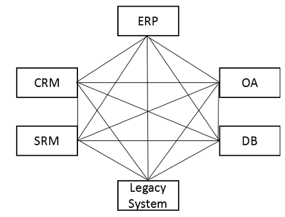
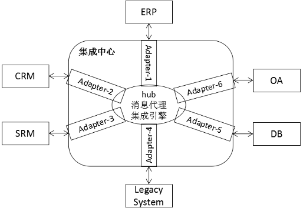
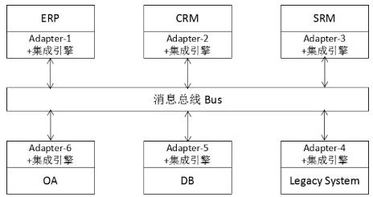
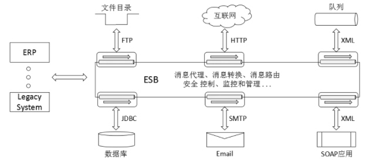
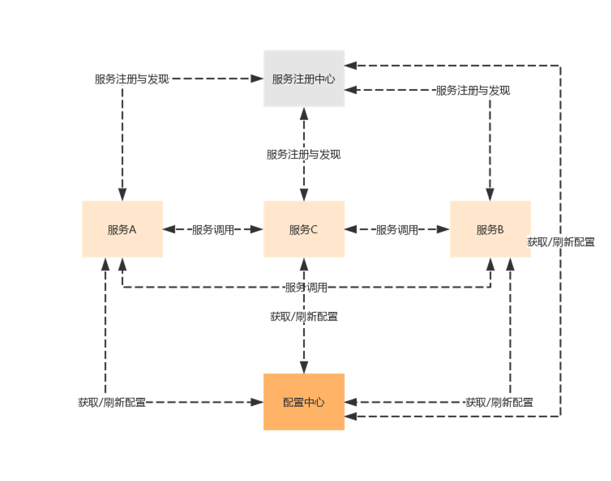
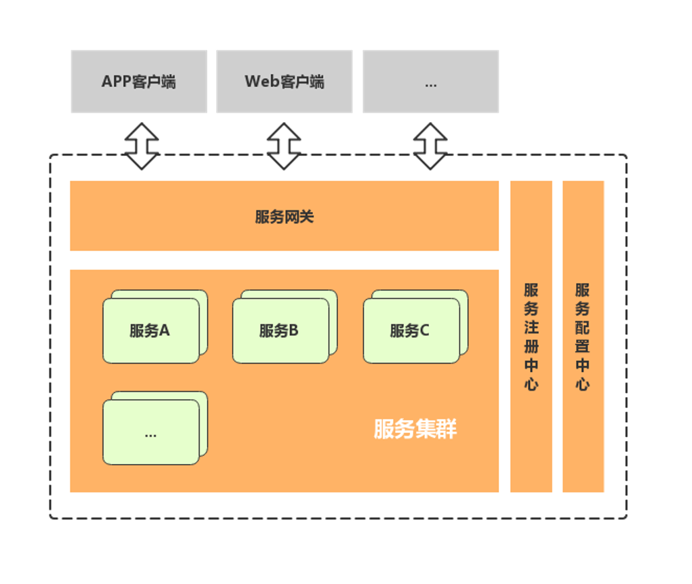
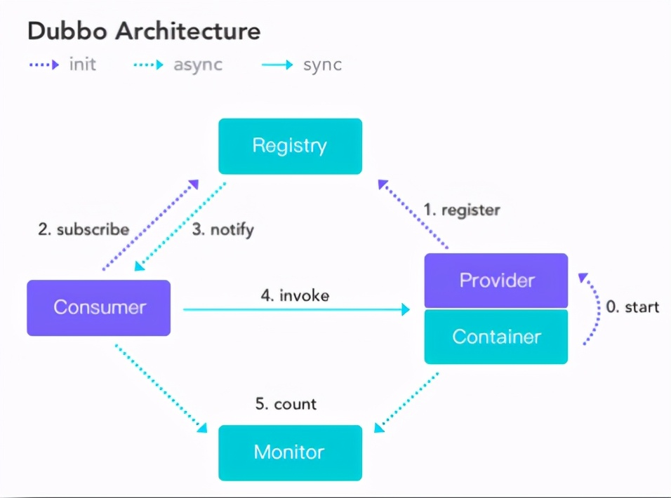
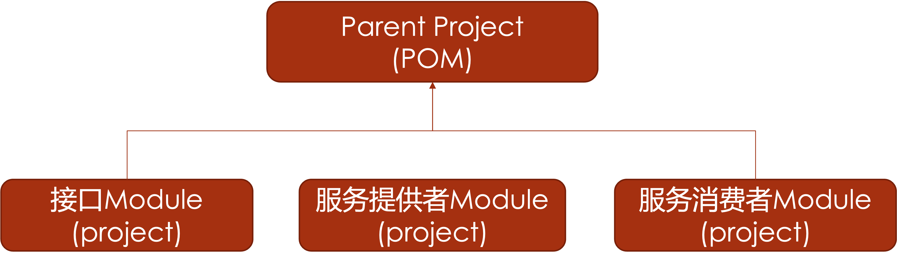
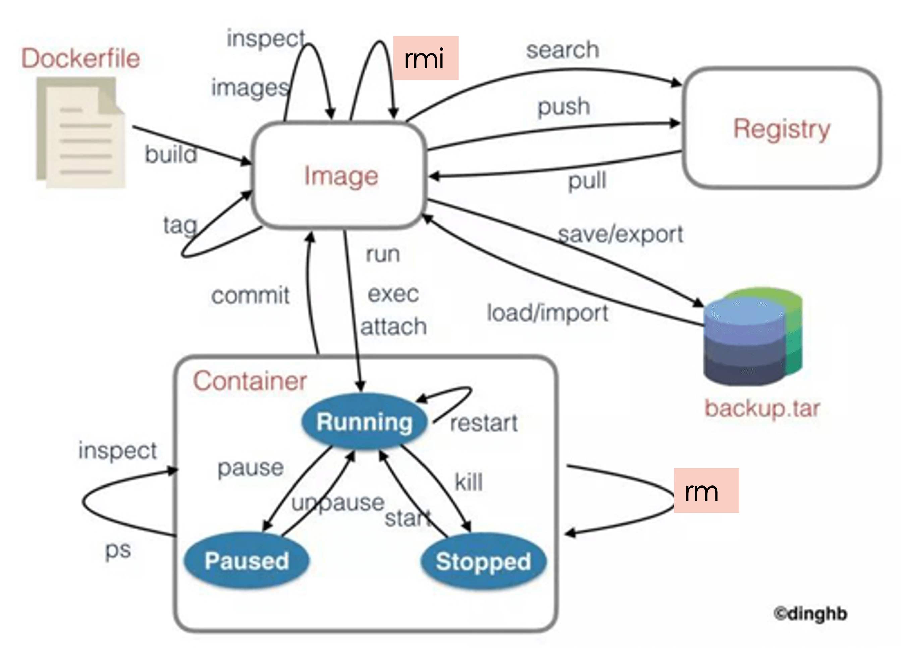

## System Integration and Optimization

### System Integration Fundamentals

#### What System Integration Means

System integration usually means combining software, hardware, and communication technologies to solve users' information-processing problems. The integrated components were originally independent systems. After integration, they work together coherently and in coordination, improving the effectiveness and optimization of the whole.

#### Main Approaches to System Integration

- **EAI (Enterprise Application Integration):** a middleware approach that connects heterogeneous enterprise applications built on different platforms and solutions, enabling data and information to be synchronized and shared across systems.



  - **Hub-and-spoke architecture:** a star topology with a central hub and adapters connecting it to applications. Adapters convert and transfer data between the hub and applications, translating application data into a format the hub recognizes. A message broker in the hub manages routing and forwards messages to the target application's adapter according to routing rules.



  - **Bus architecture:** a variation on hub-and-spoke. The hub's message-transfer function becomes a messaging bus, while adapters and integration engines reside on application platforms. Applications convert message formats through adapters and send messages onto the bus.



- **SOA:** as distributed systems acquire more services, capacity planning and wasted resources in small services become concerns. A scheduling center manages the cluster in real time. SOA connects application functions, called services, through well-defined interfaces and contracts.



- **Microservices:** in some respects, microservices are the next step in SOA's evolution, placing greater emphasis on thoroughly separating services.



### Spring Boot

#### Basic Project Development Steps

- Create a project: File → New → Project, then select Spring Initializr.
- Configure project information and select dependencies: Web → Spring Web; SQL → Spring Data JPA and MySQL Driver.
- Configure the startup class.
- Configure configuration classes.
- Develop the web layer.
- Develop the business layer.
- Develop the data layer.
- Test functionality.

#### Project Features and Basic Architecture

##### Project Features

1. **Standalone Spring applications:** Spring Boot applications can run independently as JAR files with `java -jar xx.jar`.

2. **Embedded servlet containers:** Spring Boot uses embedded containers such as Tomcat, Jetty, or Undertow, so applications do not need to be packaged as WAR files.

3. **Starters simplify Maven configuration:** Spring Boot supplies starter project object models (POMs) to simplify dependency configuration.

4. **Extensive autoconfiguration:** default configuration simplifies development, and developers can override it through configuration files.

5. **Convention over configuration:** it works out of the box without code generation or XML configuration; Spring configuration can be accomplished without XML.

##### Basic Architecture

- Startup class (`@SpringBootApplication`): an ordinary Java class in the project's root package, with the `main` entry point

```java
@SpringBootApplication
public class SpringBootP1Application {
    public static void main(String[] args) {
        SpringApplication.run(SpringBootP1Application.class, args);
    }
}
```

- Configuration file: `application.properties` or `application.yml`

```properties
spring:
  datasource:
    driver-class-name: com.mysql.cj.jdbc.Driver
    url: jdbc:mysql://localhost:3306/springbootp1
    username: root
    password: 123
```

- Web layer development:

  1. Add a `controller` package.

  2. Create a user controller class, an ordinary Java class, in that package.

  3. Add `@RestController` to the class so method results are returned as JSON, providing backend endpoints for a separate frontend.

  4. Annotate classes and methods with `@RequestMapping`.

     - `@GetMapping`: handles GET requests, equivalent to `method = RequestMethod.GET`.

     - `@PostMapping`: handles POST requests, equivalent to `method = RequestMethod.POST`.

  5. `@RequestBody`: handles JSON request bodies.

```java
@RestController
@RequestMapping("user")
public class UserController {
  @GetMapping("/{id}")
  public UserDto getUser (@PathVariable int id){
    return null;
  }
  @PostMapping("")
  public UserDto addUser (@RequestBody UserDto user){
    return null;
  }
  @GetMapping("list")
  public List<UserDto> allUsers(){
    return null:
  }
}
```

- Business layer development:

  1. Add `service` and `dto` packages, with an `impl` subpackage under `service`.

  2. Create a service interface in the `service` package.

  3. Add its implementation in `service.impl`, annotated with `@Service`.

```java
@Service
@Transactional
public class UserServiceImpl implements UserServicel {
  @Autowired
  UserDao userDao;
  @Override
  public List<UserDto> getAllUsers() {
    List<TuserEntity> tusers=userDao.findAll();
    return e2d (tusers);
  }
  @Override
  public UserDto getUser (Integer id) {
   return e2d (userDao.getOne(id));
  }
}
```

  4. Add the required DTO classes to the `dto` package.

- Data layer development:

  1. Add `dao` and `entity` packages.
  2. Create a DAO interface extending `JpaRepository` in the `dao` package.
  3. Add the required entity mappings in the `entity` package.

```java
@Setter
@Getter
@Entity
@Table (name = "tuser",schema = "test", catalog = "")
public class TuserEntity {
  @Id
  private Integer id;
  @Column
  private String name;
  @Column
  private String password;
  @Column
  private String email;
  @Column
  private String mobile;
}
```

#### Relationship with Spring

- Spring came first, followed by Spring Boot. Spring development required many tedious configuration files, so the Spring team built Spring Boot on top of Spring to reduce that burden. It embodies convention over configuration, provides many defaults, and integrates third-party frameworks to make component integration easier. Spring Boot extends Spring to simplify development, testing, and deployment.

- Spring provides comprehensive infrastructure for Java applications, including dependency injection and modules such as Spring JDBC, Spring MVC, Spring Security, Spring AOP, Spring ORM, and Spring Test. Spring Boot extends it and removes the need for XML setup, supporting faster and more efficient development.

#### Swagger's Role and Configuration

- **Purpose:** Swagger is a specification and framework for generating, describing, testing, and visualizing RESTful web services.

  - Automatically generate online API documentation.
  - Test functionality.
  - Connect frontend and backend developers through a shared API description.

- Configuration steps

  - Add dependencies to the POM (`swagger`, `swagger-ui`).

```xml
<dependency>
  <groupId>io.springfox</groupId>
  <artifactId>springfox-swagger2</artifactId>
  <version>2.9.2</version>
</dependency>
<dependency>
  <groupId>io.springfox</groupId>
  <artifactId>springfox-swagger-ui</artifactId>
  <version>2.9.2</version>
</dependency>
```

  - Create a `config` package and a `SwaggerConfig` class annotated with `@Configuration` and `@EnableSwagger2`.

```java
@Configuration
public class Knife4jConfig {
  @Bean
  public  Docket createRestApi() {
    return  new Docket(DocumentationType.SWAGGER_2)
      .useDefaultResponseMessages(false)
      .apiInfo(apiInfo())
      .select()
      .apis(RequestHandlerSelectors.basePackage("com.example.springbootp1.controller"))
      .paths(PathSelectors.any())
      .build();
  }
  private ApiInfo apiInfo() {
    return  new ApiInfoBuilder()
      .description("接口测试文档")
      .contact(new Contact("Whiskey", "https://zhuchj.com","825906196@qq.com"))
      .version("1.0.0")
      .description("测试API")
      .build();
  }
}
```

  - Swagger annotations

    - `@Api(tags="")`: annotate the controller class.

      - `tags`: the API module's name or description

    - `@ApiOperation(value="", notes="")`: annotate a controller method.

      - `value`: the endpoint's name
      - `notes`: the endpoint's description

    - `@ApiParam("")`: annotate a method parameter to explain its meaning.

```java
  @Api(tags="用户管理模块接口")
  @RestController
  @RequestMapping("user")
  public class UserController {
    @Autowired
    UserServicel userService;
    @ApiOperation(valve = "单个用户", notes="根据ID获取用户信息")
    @GetMapping("/(id}")
    public UserDto getUser (@ApiParam ("用户ID") @PathVariable int id) {
      return userService-getUser(id);
    }
    ...
  }
```

    - `@ApiModel`: annotate a DTO class to explain its purpose.

      - `@ApiModelProperty`: annotate a DTO field to explain its meaning.

```java
 @Data
 @ApiModel("系统用户")
 public class UserDto {
   @ApiModelProperty("用户ID")
   private Integer id;
   ...
 }
```

#### Multi-Module Maven Architecture: Parent and Child Modules

- **Concept:** as a monolithic application's functionality grows and becomes more detailed, complexity increases rapidly. Maven's multimodule configuration helps split the project, encourages reuse, avoids oversized POMs, and allows individual modules to be built without rebuilding everything. It also makes module-specific configuration easier.

- Steps

  - Create a parent project containing only `pom.xml`; add `<packaging>pom</packaging>` below its GAV configuration.

  - Add modules to the parent project.

```xml
<modules>
  <module>common</module>
  <module>user</module>
  <module>course</module>
  ...
</modules>
```

  - Create child modules and set their POM's parent GAV to that of the parent project.

### Microservices

#### Microservice Architecture



- **Service governance:** automated service management centered on automatic registration and discovery.

  - Registration: a service instance registers its information with the registry.
  - Discovery: an instance obtains information about registered instances from the registry and uses it to call their services.
  - Eviction: the registry removes faulty services from the available list so they are not called.

- **Service invocation:** microservice systems typically require remote calls between services.

  - REST (Representational State Transfer): an HTTP-based architectural style with a standard, broadly supported communication model; languages generally support HTTP.
  - RPC (Remote Procedure Call): interprocess communication that lets callers invoke remote services much like local ones. RPC frameworks aim to make remote calls simpler and more transparent.

| Comparison | RESTful | RPC |
| -------- | ---------- | ------------ |
| Communication protocol | HTTP | Usually TCP |
| Performance | Slightly lower | Higher |
| Flexibility | High | Low |
| Typical use | Microservices | SOA |

- **Service gateway:** as microservices grow in number, they usually have different network addresses. An external client may need several services to complete a business operation. Direct communication with every service can create problems:

  - Calling different URLs increases client complexity.
  - Some scenarios involve cross-origin requests.
  - Each service needs its own authentication mechanism.

  An API gateway provides one entry and exit layer for API calls. Basic capabilities include unified access, security, protocol adaptation, traffic control, support for persistent and short-lived connections, and fault tolerance. Service teams can focus on business logic while the gateway handles security, traffic, and routing.

- **Service fault tolerance:** one request often calls several services. Without fault tolerance, one unavailable service can trigger a chain of failures—the avalanche effect. Three core principles are:

  - Avoid being overwhelmed by upstream requests.
  - Avoid disruption from the external environment.
  - Avoid being dragged down by downstream responses.

- **Distributed tracing:** a request often spans multiple services. Internet applications consist of modules that may be developed by different teams, written in different languages, and deployed across thousands of servers and data centers. Logging and performance monitoring across the service path is therefore necessary: this is distributed tracing.

- **Load balancing**

- **Consumer:** the party actively invoking a service

- **Provider:** the party whose service is invoked

#### Comparing Monolithic and Microservice Applications

- Monolithic applications

  - Advantages

    1. Simple architecture, low initial development cost, and a short initial development cycle.
    2. Efficient development with local calls between modules.
    3. Easy deployment and low operational cost, with one complete package.
    4. A single application is easy to test.

  - Disadvantages

    1. Bloated code and long startup times.

    2. Long regression-testing cycles: even a small fix may require testing all critical business flows.
    3. Poor fault isolation: an error in a small feature can take down the entire system.
    4. Difficult scaling: scaling the whole application wastes computing resources.
    5. Difficult collaboration: with dozens or hundreds of developers maintaining one codebase, merge complexity increases sharply.

- Microservice applications

  - Advantages
    1. Finer-grained services promote resource reuse and development efficiency.
    2. Each service can be optimized precisely and scaled on demand.
    3. Suits the shorter product iteration cycles of internet applications.
  - Disadvantages
    1. Greater development complexity, because business processes require network interactions between services.
    2. Too many services increase governance costs and make maintenance harder.

#### Microservice Frameworks

- Dubbo

  - Primarily implements service governance; filters can extend its functionality.
  - Persistent RPC connections provide faster responses.
  - Heavy dependencies require thorough version management, with limited intrusion into application code.

- Spring Cloud
  - Covers many components of microservice architecture.
  - HTTP RESTful API
  - JSON communication and RESTful interfaces provide a cross-platform foundation.

### Dubbo & SpringCloud

#### RPC

- **Remote procedure call:** a program on one system (the client host) calls a function on another system (the server host).

#### Understanding Dubbo's Architecture



- **Provider:** the service provider.
- **Consumer:** the service consumer.
- **Registry:** the center for service registration and discovery, providing directory services.
- **Monitor:** logs invocation counts, call durations, and other service information. It can also support permissions and degradation policies as a service control center.

#### ZooKeeper's Role

- ZooKeeper is an open-source distributed coordination service. It wraps complex, error-prone distributed consistency mechanisms into efficient, reliable primitives exposed through simple interfaces. Distributed applications can use it for data publication/subscription, load balancing, naming, coordination and notifications, cluster management, leader election, distributed locks, and distributed queues.

#### Key Annotations in Dubbo Applications

- Service providers

  - The `Service` annotation

```java
import org.apache.dubbo.config.annotation.Service;
@Service(version = "${hello.service.version}",application="${dubbo.application.id}")
```

  - Startup class annotations

```java
@EnableDubbo
@SpringBootApplicaiton
public class DubboHelloworldApplication {
  ...
}
```

- Service consumers

  - The `Reference` annotation

```java
import org.apache.dubbo.config.annotation.Reference;
@Reference(version = "${hello.service.version}")
```

  - Startup class annotations

```java
@EnableDubbo
@SpringBootApplicaiton
public class DubboHelloworldRestApplication {
  ...
}
```

#### Developing, Deploying, and Testing Dubbo Microservices

- Download the ZooKeeper image and create its container.

```
docker pull zookeeper:3.6.0
docker run –d --name zookeeper –p 2181:2181 --net testnet zookeeper:3.6.0
```

- Download the `dubbo-admin` image and create its container.

```
docker pull apache/dubbo-admin
```

- Add dependencies.

  - The interface project
  - The Apache Dubbo dependency
  - The Dubbo–ZooKeeper dependency

- Configure the Dubbo provider (`application.properties`).

```properties
# dubbo
# Base packages to scan Dubbo Components (e.g @Service , @Reference)
dubbo.scan.basePackages = se.zust.edu.dubbohelloworld.service

# Dubbo Config properties
hello.service.version=1.0.0
## ApplicationConfig Bean
dubbo.application.id = helloworld-provider
dubbo. application.name = helloworld-provider

## ProtocolConfig Bean
dubbo.protocol.id = dubbo
dubbo.protocol.name = dubbo
dubbo.protocol.port = 11245

## RegistryConfig Bean
dubbo.registry.id = zk-helloworld-provider
#dubbo.registry.address = N/A
# zookeeper
dubbo.registry.protocol = zookeeper
dubbo.registry.address = 127.0.0.1:2181
```

- Configure the Dubbo consumer (`application.properties`).

```properties
hello.service.version = 1.0.0
# application.name
dubbo.application.name=hello-service-comsumer
# address
dubbo.registry.address = zookeeper://127.0.0.1:2181
```

- Convert to a multimodule project.



#### The Relationship Between Spring Boot and Spring Cloud

- Spring Cloud describes a microservice framework ecosystem rather than one specific framework.
- There is no inherent equivalence between the two.
- Spring Boot offers a fast way to develop microservices.
- Spring Cloud uses Spring Boot-style integration to hide complex configuration and implementation details, leaving developers with a straightforward, easily deployed toolkit for distributed systems.

#### Core Spring Cloud Components and Their Functions

##### Eureka

Cloud service discovery: a REST-based service for locating services, supporting discovery and failover in the cloud's middle tier.

##### Ribbon

Cloud load balancing with several strategies, usable alongside service discovery and circuit breakers.

- Add `@LoadBalanced` to the method that creates `RestTemplate`.

```java
@Bean
@LoadBalanced
public RestTemplate restTemplate() {
    return new RestTemplate();
}
```

- Modify the service invocation method.

```java
// 直接使用微服务名字， 从nacos中获取服务地址
String url = "service-product";
// 通过restTemplate调用商品微服务
Product product = restTemplate.getForObject...
```

##### Hystrix

A circuit breaker and fault-tolerance tool that uses circuit breaking to control calls to services and third-party libraries, improving resilience to latency and failures.

##### Feign

A REST client designed to simplify web service client development.

- Integrates Ribbon and Hystrix by default.
- Add the Feign dependency.

```xml
<!--fegin组件-->
<dependency>
  <groupId>org.springframework.cloud</groupId>
  <artifactId>spring-cloud-starter-openfeign</artifactId>
</dependency>
```

- Annotate the main class.

```java
@SpringBootApplication
@EnableDiscoveryClient
//开启Fegin
@EnableFeignClients
public class OrderApplication {}
```

- Create a service and use Feign to invoke microservices.

```java
@FeignClient("service-product")
//声明调用的提供者的name
public interface ProductService {
//指定调用提供者的哪个方法
//@FeignClient+@GetMapping 就是一个完整的请求路径 http://service- product/product/{pid}
    @GetMapping(value = "/product/{pid}")
    Product findByPid(@PathVariable("pid") Integer pid);
}
```

- Modify the controller and restart the microservices to verify the changes.

##### Zuul

Provides proxying, filtering, and routing for a microservice cluster.

##### Config

A distributed configuration center that stores configuration on a remote server and centrally manages cluster settings. It supports local storage as well as remote Git and SVN repositories.

##### gateway

A unified system entry point that encapsulates the application's internal structure and provides clients with a common interface.

Shared logic unrelated to individual business functions can live here, including authentication, authorization, monitoring, and request routing.

- Add dependencies.

```java
<artifactId>spring-cloud-starter-gateway</artifactId>
```

- Create the main class and configuration files.

```properties
server:
  port: 7000
spring:
  application:
    name: api-gateway
  cloud:
gateway:
  routes: # 路由数组[路由 就是指定当请求满足什么条件的时候转到哪个微服务]
    - id: product_route # 当前路由的标识, 要求唯一
      uri: http://localhost:8081 # 请求要转发到的地址
      order: 1 # 路由的优先级,数字越小级别越高
      predicates: # 断言(就是路由转发要满足的条件)
        - Path=/product-serv/** # 当请求路径满足Path指定的规则时,才进行路由转发
      filters: # 过滤器,请求在传递过程中可以通过过滤器对其进行一定的修改
        - StripPrefix=1 # 转发之前去掉1层路径
```

- Start the project and access services through the gateway.

#### Key Annotations in Spring Cloud Applications

##### nacos（eureka + config）:

1. Add the dependency `<artifactId>spring-cloud-starter-alibaba-nacos-discovery</artifactId>`.
2. Annotate the main class with `@EnableDiscoveryClient`.

```java
@SpringBootApplication
@EnableDiscoveryClient
public class OrderApplication {
  ...
}
```

3. Add the Nacos service address to `application.yml`.

```properties
spring:
  cloud:
    nacos:
      discovery:
        server-addr: 127.0.0.1:8848
```

4. Modify the microservices to invoke services, and start Nacos.

#### Spring Cloud Development Steps

- Prepare the multimodule project structure.

  - Create a parent project with POM packaging.

```
<packaging>pom</packaging>
```

  - Add the following modules to the parent project.

    - Eureka registry server: add the Eureka Server dependency.
    - Service provider (Eureka client): add Eureka Discovery and Web dependencies.
    - Service consumer (Eureka client): add Eureka Discovery and Web dependencies.

- Develop the Eureka server.

  - Annotate the startup class with `@EnableEurekaServer`.

```java
@SpringBootApplication
@EnableEurekaServer
public class CloudDemoServerApplication {
  ...
}
```

  - Create `application.yml`.

```properties
eureka:
  client:
    service-url:
      defaultZone: http://localhost:8761/eureka
spring:
  application:
    name: eureka
server:
  port: 8761
```

  - Run the Eureka server and test access.

- Develop the provider microservice.

  - Add a module to the parent project.

  - Add Eureka Discovery Client, Spring Web, and Lombok dependencies.

  - Annotate the startup class with `@EnableDiscoveryClient` (`@EnableEurekaClient`).

```java
@SpringBootApplication
@EnableDiscoveryClient
public class CloudDemoClient1Application {
  ...
}
```

  - Create `application.yml`.

```properties
eureka:
  client:
    service-url:
      defaultZone: http://localhost:8761/eureka
spring:
  application:
    name: springcloud-service1 # 服务提供方名称
server:
  port: 2222 #服务端口
```

  - Develop business functionality as in a Spring Boot application.

- Develop the consumer microservice.

  - Add a module to the parent project.

  - Add Eureka Discovery Client, OpenFeign, Spring Web, and Lombok dependencies.

  - Annotate the startup class with `@EnableDiscoveryClient` (`@EnableEurekaClient`).

    - Configure client calls using `RestTemplate` or a Feign client; either approach works, and they can coexist.

```java
@SpringBootApplication
@EnableDiscoveryClient
// 两种方式访问微服务
// 1、通过Feign客户端访问
@EnableFeignClients
public class SpringcloudDemoClient3Application {
  // 2、通过RestTemplate访问
  @Bean
  @LoadBalanced
  RestTemplate restTemplate() {
    return new RestTemplate();
  }
  public static void main(String[] args) {
    ...
  }
}
```

  - Configuration file

```properties
eureka:
  client:
    service-url:
      defaultZone: http://localhost:8761/eureka
spring:
  application:
    name: springcloud-client1
server:
  port: 5555 #消费者端口
```

  - Business functionality, approach 1: invoke microservices with `FeignClient`.

    - Create a `dto` package and DTO classes.

    - Create a `service` package and functional interfaces.

```java
@FeignClient("springcloud-service1")
public interface FeignUserService {
  @RequestMapping(value = "/user/{id}", method = RequestMethod.GET)
  public UserDto getUser(@PathVariable int id);
  @RequestMapping(value = "/user", method = RequestMethod.POST)
  public UserDto addUSer(@RequestParam int id, @RequestParam int name);
}
```

    - Create a `controller` package and controller classes.

```java
@RestController
@RequestMapping("/user")
public class UserAccessController {
  @Autowired
  FeignUserService userService;
  public UserDto getUser(int id) {
    return userService.getUser(id);
  }
}
```

  - Business functionality, approach 2: invoke microservices with `RestTemplate`.

    - Inject `RestTemplate` into the controller with `@Autowired`; the startup class has already registered it using `@Bean`.

    - Call provider endpoints using `restTemplate.getForObject`.

```java
@RestController
@RequestMapping("/user")
public class UserAccessController {
  @Autowired
  FeignUserService userService;
  @Autowired
  RestTemplate restTemplate;
  @RequestMapping("/{id}")
  public UserDto getUser(@PathVariable int id) {
    return userService.getUser(id);
  }
  @RequestMapping("/template/{id}")
  public UserDto getUserTemplate(@PathVariable int id) {
    // 通过服务名字访问api
    return restTemplate.getForObject("http://springcloud-service1/user/" + id, UserDto.class)
  }
}
```

    - Run the startup class and test the new endpoints.

### Containers and Docker

#### The Evolution of Computing Virtualization: Comparing Virtual Machines

- The early era
  - One operating system per physical machine
- The virtual machine era
  - Different platforms, software, and operating systems run on the same hardware.
- The container era

  - Operating system resources are shared, reducing resource usage.

- Similarities:

  1. Both virtual machines and containers run as processes or applications on a host.
  2. Both provide resource isolation, security isolation, and system resource allocation.

- Differences:

| Feature | Virtual machines | Containers |
| -------------- | ----------------------------------------------------------------- | -------------------------------------------------------------------------------------------- |
| Isolation | Full isolation from the host OS and other VMs, providing a strong security boundary | Lighter isolation from the host and other containers, with a weaker boundary than VMs |
| Size | Large (GB) | Small (MB) |
| Startup | Slow (minutes) | Fast (seconds), avoiding full guest OS startup |
| Operating system | A complete OS including its kernel, requiring more CPU, memory, and storage | User-space components that can be tailored to application needs, reducing resource usage |
| Instance capacity | Dozens of VMs | Potentially thousands of containers |
| Virtualization | Hardware platform virtualization | Software runtime virtualization |
| Delivery/deployment | Constrained by OS and environment variables | Consistent development, testing, and production environments |
| Migration/scaling | Constrained by OS and hardware resources | Easy |
| Performance | Higher overhead | Lower overhead |
| Hardware utilization | Lower | Higher |

- **The virtual machine era:** VMs let users run multiple independent, isolated systems on one physical machine. Abstracting resources enables effective reuse, but many independent systems add overhead and consume host resources. Resource contention can seriously affect responsiveness. Each new VM also needs environment setup, much like a physical machine, consuming development and operations time. The desire to reduce virtualization overhead while maintaining isolation and shortening deployment cycles led to container technology.

- **The container era:** containers provide lightweight, kernel-level virtualization using the host operating system. Sandboxing isolates containers from one another. They have become an important foundation for the microservice era.

- Linux implementation

  - Resource isolation: Linux namespaces allow multiple independent subsystems to run at the OS level.
  - Operating system and base images
  - Layered filesystems

#### Basic Container Concepts

Containers share OS resources to perform the same work with less overhead. They isolate applications and their dependencies into self-contained units that can run in different environments.

- **Dockerfile:** a text file containing instructions and descriptions for building an image. Instructions create image layers, and `docker build` executes them to produce the image.
- **Docker volumes:** a container's filesystem is isolated from the host. Removing the container removes its application and local data; the application can be redeployed, but the data cannot be recreated automatically. Volumes preserve data when application containers are deleted or rebuilt.
- **Docker networking:** the Docker engine creates a virtual container bridge (`docker0`) on the host to act as a network gateway for containers; container addresses are not directly reachable from external networks.

#### Docker Images and Containers

- **Image:** a special layered filesystem (UnionFS) containing the programs, libraries, resources, and configuration files needed at runtime. It also includes runtime settings such as anonymous volumes, environment variables, and users. An image is static: it contains no dynamic runtime data, and its contents do not change after creation.
- **Container:** running an image through the Docker engine creates a container—an image instance corresponding to an actual process. Unlike an image, a container is dynamic and has a writable layer added on top when it starts.

#### Common Docker Commands: MySQL, Logs, and Port Mapping



##### Working with Containers

- `docker pull ubuntu`: obtain an image.
- `docker run -itd --name ubuntu-test ubuntu /bin/bash`: start a container. `-i` enables interactive input, `-t` allocates a terminal, `-d` runs in the background, `exit` leaves the terminal, and `-P` maps container ports to randomly selected host ports.

```
docker run -p 3306:3306 --name mysql -e MYSQL_ROOT_PASSWORD=123456 -d mysql:5.7
docker run  --name nginx-test -p 8080:80 -d nginx
docker run --name tomcat -p 8081:8080 -d tomcat
```

- `docker stop`: stop a container.
- `docker ps -a`: list all containers.
- `docker start id`: start the container with that ID.
- `docker restart id`: restart the container with that ID.
- `docker attach` / `docker exec`: enter a container or execute commands inside it. Prefer `docker exec`, because leaving its terminal does not stop the container.
- `docker rm -f id`: remove the container with that ID.
- `docker top`: view processes running inside a container.
- `docker logs [ID or name]`: view a container's standard output (application logs).
- `docker port`: view the host-port mapping for a specified container port.

##### Working with Images

- `docker images`: list local images. `REPOSITORY` identifies the repository, `TAG` the tag, and `IMAGE ID` the image identifier;

  `CREATED` shows creation time, and `SIZE` shows image size.

- `docker pull`: download an image.

- `docker search`: search for images.

- `docker rmi`: remove an image.

- `apt-get update`: update package indexes inside an image or container environment.

- `docker build` (Dockerfile): build an image.

```
docker build -t runoob/centos:6.7 .
```

  - **`-t`**: specify the target image name.
  - **`.`**: the build directory containing the Dockerfile; a path can be specified instead.

- `docker tag id runoob/centos:dev`: add a new tag to an image.

##### Connecting Containers

- Network port mapping

  - `-P`: map container ports to randomly chosen host ports.

  - `-p`: bind a container port to a specified host port.

```
docker run -d -p 127.0.0.1:5000:5000/udp
```

- Create a network.

```
docker network create -d bridge test-net
```

- Connect containers.

```
docker run -itd --name test1 --network test-net ubuntu /bin/bash
docker run -itd --name test2 --network test-net ubuntu /bin/bash
```

- Specify container configuration.

```
docker run -it --rm -h host_ubuntu  --dns=114.114.114.114 --dns-search=test.com ubuntu
```

  `--rm`: automatically remove the container's filesystem when it exits.

  `-h HOSTNAME` or `--hostname=HOSTNAME`: set the container hostname.

  `--dns=IP_ADDRESS`: add a DNS server to the container's `/etc/resolv.conf`.

  `--dns-search=DOMAIN`: set the container's DNS search domain.

#### Packaging Spring Boot Applications with Docker

##### Building a JDK Image

- Download JDK 8 (`tar.gz`) from the [Oracle website](https://www.oracle.com/java/technologies/downloads/) onto the Docker host and extract it.
- Write a Dockerfile using `FROM`, `ADD`, `ENV`, and `JAVA_HOME`.
- Build the image with `docker build -t jdk:8 .` in the file's directory.

##### Packaging Spring Boot

- Create a Spring Boot application and implement its functionality.
- Update the data source configuration.
- Build a JAR with Maven, starting with `mvn clean`.
- Transfer the JAR to the Docker host using a file transfer tool or `scp`.
- Write a Dockerfile: `FROM` selects the base image, and `RUN` executes commands inside the image, such as installing dependencies.

```
ARG BUILD_FROM=arm64v8
FROM ubuntu:16.04
MAINTAINER whiskeyi
VOLUME ["/opt/jdk"]
ADD ./jdk8.tar.gz /opt/jdk
ENV JAVA_HOME /opt/jdk/jdk1.8.0_144
ENV CLASSPATH $JAVA_HOME/lib/dt.jar:$JAVA_HOME/lib/tools.jar
ENV PATH $JAVA_HOME/bin:$PATH
```

- Build the image and upload it to a registry.

  - Package the image.

```
docker build –t springboottest:1.0 .
```

  - Retag it to create a new image reference.

```
docker tag springboottest:1.0 registry.cn-hangzhou.aliyuncs.com/edu_zust/springboottest:1.0
```

  - Upload it to a private Alibaba Cloud registry.

```
Login: docker login --username=****** registry.cn-hangzhou.aliyuncs.com
docker push registry.cn-hangzhou.aliyuncs.com/edu_zust/springboottest:1.0
```

- Create a Docker network: `docker network create mynet`.
- Create containers.

  - mysql

```
docker run -d --name mysql -p 3336:3306 -e MYSQL_ROOT_PASSWORD=123456 --net mynet mysql:5.7
```

- Deploy containers.

  - Prepare dependencies, including a MySQL container and database.

  - Pull the image on the deployment host.

```
docker pull registry.cn-hangzhou.aliyuncs.com/edu_zust/springboottest:1.0
docker tag registry.cn-hangzhou.aliyuncs.com/edu_zust/springboottest:1.0 springboottest:v1
```

  - Run the image.

```
docker run –d –name test-app –p 8080:8080 –network mynet springboottest:v1
```

  - Open the browser and access the container's web application through port 8080 on the host's IP address, then test its functionality.

### OpenAPI

#### Basic RESTful Concepts

- REST is an **architectural style** for understanding and evaluating networked application designs against architectural principles to achieve effective, performant communication.

- REST stands for Representational State Transfer: resources transfer state through representations over a network.

- An architecture following REST principles is RESTful and resource-oriented.

  - Each URI identifies a resource.
  - Clients and servers exchange representations of that resource.
  - Clients use HTTP verbs to operate on server resources, accomplishing representational state transfer.

- URLs locate resources; HTTP verbs describe operations.

#### Rules

- A resource represents an entity. Use nouns rather than verbs in URIs. Database tables usually contain collections of similar records, so resource nouns should generally be plural.
- If an action cannot be expressed by an HTTP verb, model the action as a resource.
- Parameter design may include redundancy: API paths and URL parameters can occasionally overlap.
- Common parameters: `?limit`, `?offset`, `?page=`, `?sortby=`.

#### HTTP Verbs

- GET (SELECT): retrieve one or more resources from the server.

- POST (CREATE): create a resource on the server.

- PUT (UPDATE): update a resource with the complete replacement provided by the client.

- PATCH (UPDATE): update a resource with the changed properties provided by the client.

- DELETE (DELETE): remove a resource from the server.

- HEAD: retrieve a resource's metadata.

- OPTIONS: retrieve the request methods supported for a resource.

#### RESTful Best Practices

1. Use GET, POST, PUT, PATCH, and DELETE. Resource-oriented URIs such as `/articles/` combine with verbs to form endpoints: `GET /articles/`.
2. Generally avoid plain-text responses; specify `Content-Type: application/json`.
3. Avoid verbs in URIs: use `articles` rather than `createNewArticle`.
4. Use plural resource nouns where appropriate, such as `/articles/`.
5. Return error details in responses: `error` → `detail`.
6. Return meaningful status codes matching the error type rather than always `200`.
7. Keep status-code usage consistent.
8. Avoid unnecessary nesting: prefer `/articles/?author_id=12` over `/authors/12/articles/`.
9. Handle trailing slashes gracefully with redirects.
10. Use query strings for filtering and pagination: `GET /articles/?published=true&page=2&page_size=20`.
11. Distinguish 401 and 403: missing or invalid credentials produce `401 Unauthorized`; an authenticated user without resource permissions receives `403 Forbidden`.
12. Use `202 Accepted` where appropriate.
13. Use a dedicated REST API framework.

#### OAUTH

OAuth lets clients access protected resources on behalf of resource owners. Before accessing them, the client obtains authorization from the resource owner and exchanges the authorization grant for an access token. It then presents that token to the resource server.

### WebService

#### Basic Concepts

- An application that accepts XML-formatted requests
- Accessible over a network from other systems, as a development of distributed technology
- A lightweight, vendor-independent communication protocol based on open standards; security and transactions are handled through web service extensions

#### Related Terminology

- XML — **Extensible Markup Language:** transfers structured data and forms the foundation of web services. `namespace` identifies a namespace. `xmlns="http://itcast.cn"` specifies the default namespace; `xmlns:itcast="http://itcast.cn"` specifies a named namespace.
- WSDL — **Web Services Description Language:** uses XML to describe where a service is located and which methods it provides, including how to invoke them, their parameters, and return values.
- SOAP — **Simple Object Access Protocol:** an XML-based protocol for transferring data over a network, allowing web services to communicate with remote systems over HTTP.

#### Usage

- Find the required web service.

- Download its WSDL: open developer tools with F12, copy the response into `air.wsdl`, and remove `<s:element ref="s:schema" />`.

- Create a basic Spring Boot project and add `cxf-spring-boot-starter-jaxws` (web service client), `fastjson` (Java object/JSON conversion), `dom4j` (XML parsing), and `commons-lang` (Apache utilities for string handling).

- Place the prepared WSDL in `resources`.

- Invoke the service through a JAX client and analyze the response.

```java
// 创建web服务客户端
JaxWsDynamicClientFactory dcf = JaxWsDynamicClientFactory.newInstance();
Clinet client = dcf.createClient("air.wsdl");
Object[] objects;
try {
  // 调用web服务
  objects = client.invoke("getDomesticAirlinesTime", ...);
  // 处理服务返回的结果（提取结果xml字符串）
  String xmlStr = JSON.toJSONString(objects);
  System.out.printIn(xmlStr);
}
```

- Extract the result XML and parse it with dom4j.

- Wrap the web service data in your own API.

  - Create a `controller` package and an `AirController` class.
  - Add `List<AirDto> airSearch(String from, String to, String date)` to expose the query as a web endpoint and return results to the frontend through `AirDto`.
