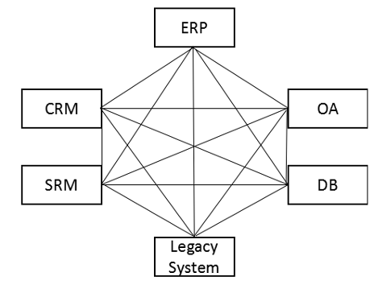
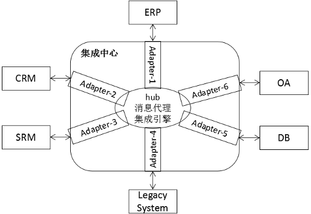
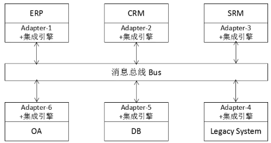
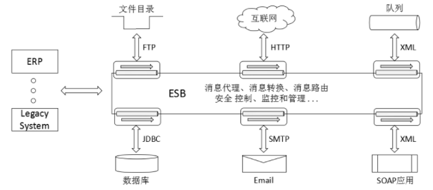
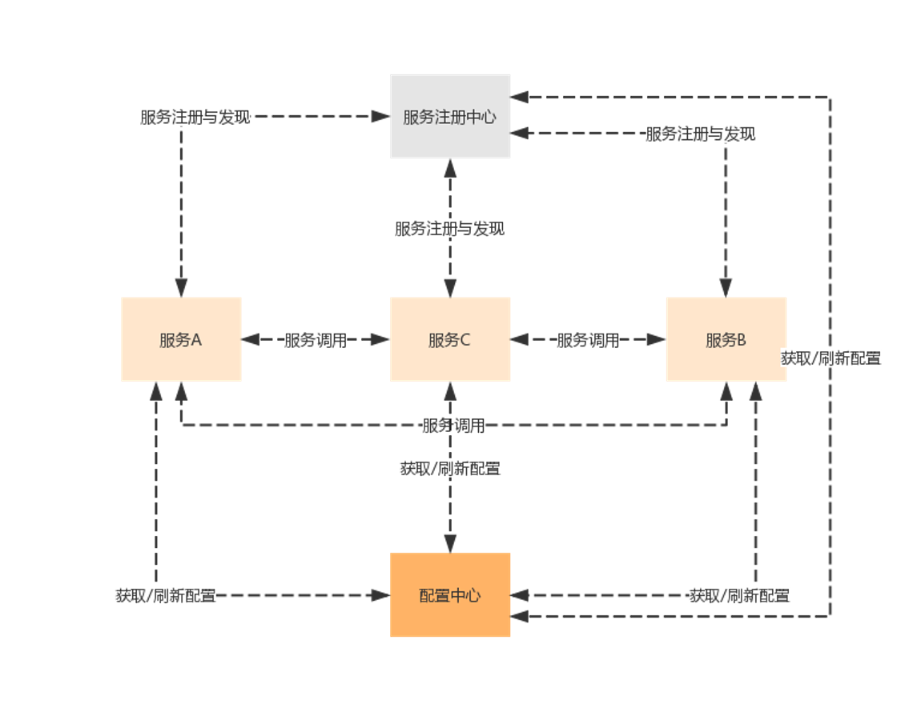
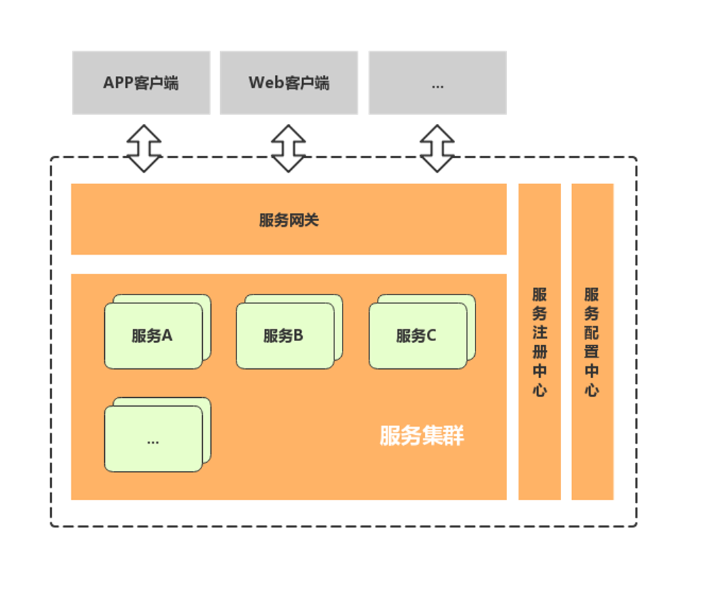
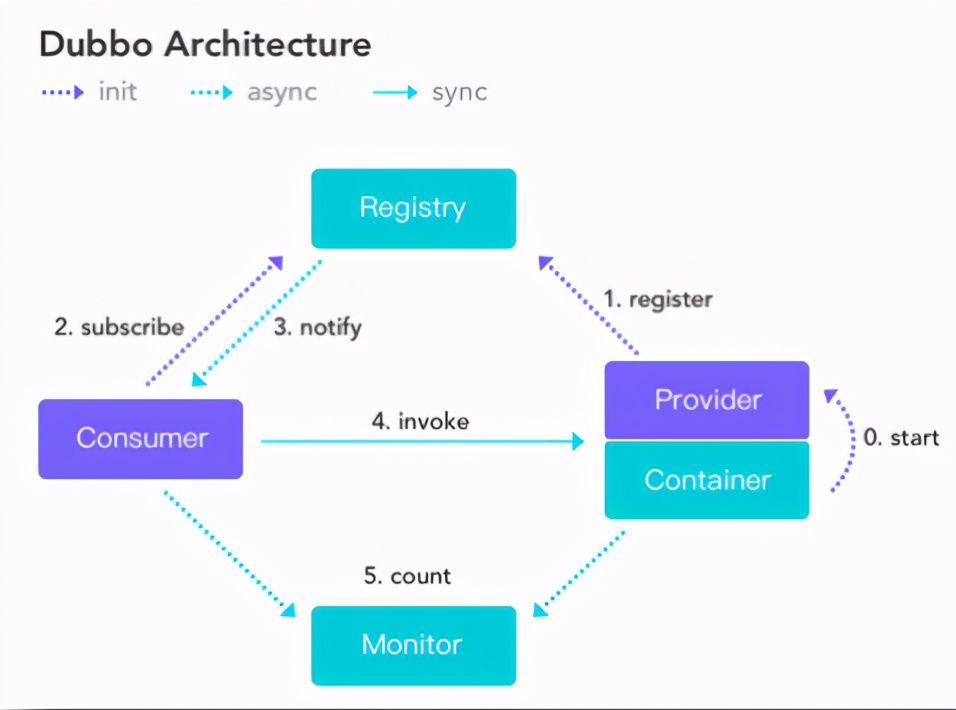
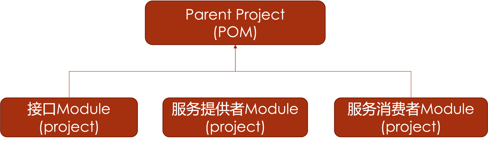
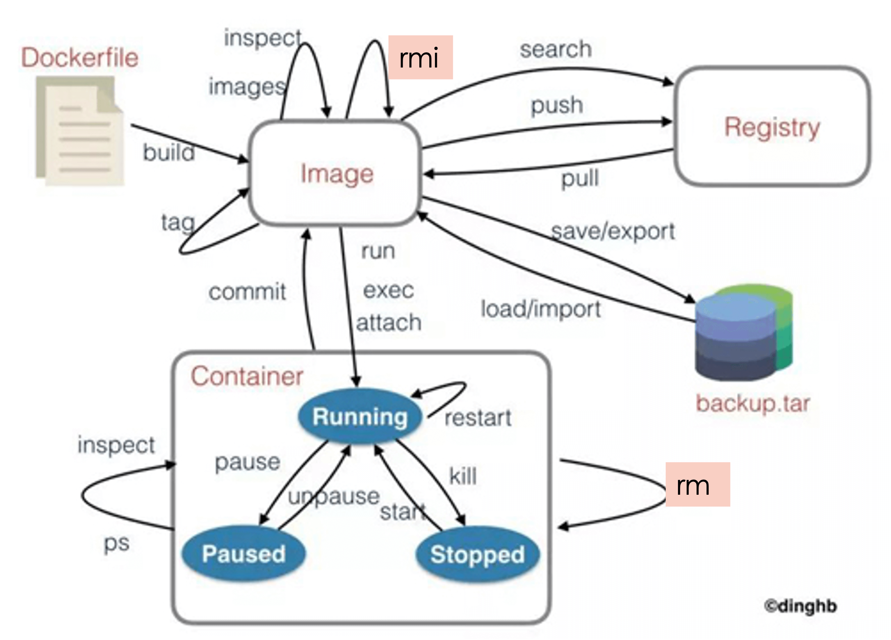

## 系统集成优化

### 系统集成基础

#### 系统集成基本含义

系统集成(system integration)：通常是指将软件、硬件与通信技术组合起来为用户解决信息处理问题的业务，集成的各个分离部分原本就是一个个独立的系统，集成后的整体的各部分之间能彼此有机地和协调地工作，以发挥整体效益，达到整体优化的目的。

#### 系统集成主要方案

- EAI：Enterprise Application Integration 企业应用集成，是中间件的一种，可完成企业内部基于各种不同平台、不同方案建立的异构应用集成互联，实现数据和信息在各个系统中同步和共享的一种方法和技术。



  - Hub/spoke （集线器架构）：Hub/Spoke 架构是星型拓扑结构，由处于系统中央的一个 Hub 和连接在 Hub 及应用系统的多个适配器(adapter)组成。适配器在 Hub 和应用系统之间，进行数据格式的转换与传输。适配器将应用系统的数据信息转化为 Hub 可以识别的格式并传递给 Hub, Hub 通过消息代理管理消息路由，并将这些来自应用系统的数据消息按其要求的路由规则传递给目标应用系统的适配器。



  - BUS（总线架构）：可以看作是 Hub/Spoke 星型架构的一种变形。将星型中心点 Hub 的传输消息的功能提炼成一条消息传递总线，而将适配器、集成引擎绑在了应用系统所在的平台。应用程序使用适配器转换消息格式，并将消息发送到总线上。



- SOA：在分布式架构下，当服务越来越多，容量的评估，小服务资源的浪费等问题逐渐显现，增加了一个调度中心对集群进行实时管理。它将应用程序的不同功能单元（称为服务）通过这些服务之间定义良好的接口和契约联系起来。



- 微服务：微服务架构在某种程度上是面向服务的架构 SOA 继续发展的下一步，它更加强调服务的"彻底拆分"。



### Spring Boot

#### 项目开发基本步骤

- 创建项目：File-New-Project，选择 Spring Initializer
- 项目信息配置，选择需要的依赖[Web-Spring Web；SQL-Spring Data JPA,Mysql Driver]
- 启动类配置
- 配置类配置
- Web 层配置开发
- 业务层配置开发
- 数据层配置开发
- 功能测试

#### 项目特点与基本架构

##### 项目特点

1. 独立运行的 Spring 项目：Spring Boot 可以以 jar 包的形式独立运行，Spring Boot 项目只需通过命令“ java–jar xx.jar” 即可运行。

2. 内嵌 Servlet 容器：Spring Boot 使用嵌入式的 Servlet 容器（例如 Tomcat、Jetty 或者 Undertow 等），应用无需打成 WAR 包 。

3. 提供 starter 简化 Maven 配置：Spring Boot 提供了一系列的 starter 项目对象模型（POMS）来简化 Maven 配置。

4. 提供了大量的自动配置：Spring Boot 提供了大量的默认自动配置，来简化项目的开发，开发人员也通过配置文件修改默认配置。

5. 约定大于配置，开箱即用，无代码生成和 xml 配置：Spring Boot 不需要任何 xml 配置即可实现 Spring 的所有配置。

##### 基本架构

- 启动类（@SpringBootApplication）：普通 java 类，位于项目根包下，main 函数入口

```java
@SpringBootApplication
public class SpringBootP1Application {
    public static void main(String[] args) {
        SpringApplication.run(SpringBootP1Application.class, args);
    }
}
```

- 配置文件：application.properties/.yml

```properties
spring:
  datasource:
    driver-class-name: com.mysql.cj.jdbc.Driver
    url: jdbc:mysql://localhost:3306/springbootp1
    username: root
    password: 123
```

- Web 层配置开发：

  1. 新增 controller 包

  2. 在 controller 包中创建用户控制器类（普通 java 类）

  3. 类上添加@RestController 注解，表示所有方法的处理结果都 JSON 对象响应，独立前端的后端接口

  4. @ReqestMapping 注解类和方法

     - @GetMapping 注解：处理 GET 请求，相当于 method= RequestMethod.GET

     - @PostMapping 注解：处理 POST 请求，相当于 method= RequestMethod.POST

  5. @RequestBody：JSON 请求

```java
@RestController
@RequestMapping("user")
public class UserController {
  @GetMapping("/{id}")
  public UserDto getUser (@PathVariable int id){
    return null;
  }
  @PostMapping("")
  public UserDto addUser (@RequestBody UserDto user){
    return null;
  }
  @GetMapping("list")
  public List<UserDto> allUsers(){
    return null:
  }
}
```

- 业务层开发：

  1. 新增 service 和 dto 包，在 service 下新增 impl 子包

  2. 在 service 包中新建 service 接口

  3. 在 server.impl 包中添加 service 接口的相应实现类，并用@Service 注解

```java
@Service
@Transactional
public class UserServiceImpl implements UserServicel {
  @Autowired
  UserDao userDao;
  @Override
  public List<UserDto> getAllUsers() {
    List<TuserEntity> tusers=userDao.findAll();
    return e2d (tusers);
  }
  @Override
  public UserDto getUser (Integer id) {
   return e2d (userDao.getOne(id));
  }
}
```

  4. 在 dto 包中添加需要的 dto 类

- 数据层开发：

  1. 新增 dao 和 entity 包
  2. 在 dao 包中新建 dao 接口，继承 JpaRepository
  3. 在 entity 包中添加需要的实体类映射

```java
@Setter
@Getter
@Entity
@Table (name = "tuser",schema = "test", catalog = "")
public class TuserEntity {
  @Id
  private Integer id;
  @Column
  private String name;
  @Column
  private String password;
  @Column
  private String email;
  @Column
  private String mobile;
}
```

#### 与 Spring 关系

- 先有的 spring 框架，再有的 springboot 框架。因为基于 spring 的开发中，需要工程师写很多繁琐的配置文件，所以 spring 官方为了让开发者从配置文件中解放出来，在 spring 框架的基础上发明了 springboot 框架，springboot 体现了约定大于配置的理念，框架做了许多默认配置，同时集成了很多三方的框架，让开发者整合其他组件更加简单，我们可以说 Spring Boot 只是 Spring 本身的扩展，使开发，测试和部署更加方便。

- Spring 框架为开发 Java 应用程序提供了全面的基础架构支持。它包含一些很好的功能，如依赖注入和开箱即用的模块，如： Spring JDBC 、Spring MVC 、Spring Security、 Spring AOP 、Spring ORM 、Spring Test，Spring Boot 基本上是 Spring 框架的扩展，它消除了设置 Spring 应用程序所需的 XML 配置，为更快，更高效的开发生态系统铺平了道路。

#### Swagger 的作用及配置要

- 作用：Swagger 是一个规范和完整的框架，用于生成、描述、测试和可视化 RESTful 风格的 Web 服务。

  - 接口的文档在线自动生成
  - 功能测试
  - 前后端开发人员联系的纽带

- 配置过程

  - pom 中添加依赖（swagger、swagger-ui）

```xml
<dependency>
  <groupId>io.springfox</groupId>
  <artifactId>springfox-swagger2</artifactId>
  <version>2.9.2</version>
</dependency>
<dependency>
  <groupId>io.springfox</groupId>
  <artifactId>springfox-swagger-ui</artifactId>
  <version>2.9.2</version>
</dependency>
```

  - 新建 config 包，其中新建 SwaggerConfig 类，类上注解@Configuration、@EnableSwagger2

```java
@Configuration
public class Knife4jConfig {
  @Bean
  public  Docket createRestApi() {
    return  new Docket(DocumentationType.SWAGGER_2)
      .useDefaultResponseMessages(false)
      .apiInfo(apiInfo())
      .select()
      .apis(RequestHandlerSelectors.basePackage("com.example.springbootp1.controller"))
      .paths(PathSelectors.any())
      .build();
  }
  private ApiInfo apiInfo() {
    return  new ApiInfoBuilder()
      .description("接口测试文档")
      .contact(new Contact("Whiskey", "https://zhuchj.com","825906196@qq.com"))
      .version("1.0.0")
      .description("测试API")
      .build();
  }
}
```

  - swagger 注解

    - @Api(tags="")：在 controller 类上注解

      - tags :说明该接口模块名称

    - @ApiOperation(value="", notes="")：在 controller 类中的方法前注解

      - value：接口方法名称
      - notes：接口方法说明

    - @ApiParam("")：在方法参数前注解，说明该参数含义

```java
  @Api(tags="用户管理模块接口")
  @RestController
  @RequestMapping("user")
  public class UserController {
    @Autowired
    UserServicel userService;
    @ApiOperation(valve = "单个用户", notes="根据ID获取用户信息")
    @GetMapping("/(id}")
    public UserDto getUser (@ApiParam ("用户ID") @PathVariable int id) {
      return userService-getUser(id);
    }
    ...
  }
```

    - @ApiModel：注解在 Dto 类上，说明 Dto 的用途

      - @ApiModelProperty：注解在 Dto 类的字段上，说明该参数的含义

```java
 @Data
 @ApiModel("系统用户")
 public class UserDto {
   @ApiModelProperty("用户ID")
   private Integer id;
   ...
 }
```

#### 多模块 Maven 项目架构（父子模块操作）

- 概念：随着单体应用功能的增加和细化，复杂度迅速增加。使用 Maven 的多模块配置，可以帮助项目划分模块，鼓励重用，防止 POM 变得过于庞大，方便某个模块的构建，而不用每次都构建整个项目，并且使得针对某个模块的特殊控制更为方便。

- 步骤

  - 新建 parent 项目（Project），只保留 pom.xml，在 GAV 配置下添加`<packaging>pom</packaging>`

  - 在 parent 项目添加 modules

```xml
<modules>
  <module>common</module>
  <module>user</module>
  <module>course</module>
  ...
</modules>
```

  - 新增模块（子项目，模块 pom 改为父项目 parent 的 GAV）

### 微服务

#### 微服务架构



- **服务治理**：服务治理就是进行服务的自动化管理，其核心是服务的自动注册与发现。

  - 服务注册：服务实例将自身服务信息注册到注册中心。
  - 服务发现：服务实例通过注册中心，获取到注册到其中的服务实例的信息，通过这些信息去请求它们提供的服务。
  - 服务剔除：服务注册中心将出问题的服务自动剔除到可用列表之外，使其不会被调用到。

- **服务调用**：在微服务架构中，通常存在多个服务之间的远程调用的需求。

  - REST(Representational State Transfer)：这是一种 HTTP 调用的格式，更标准，更通用，无论哪种语言都支持 http 协议。
  - RPC(Remote Promote Call)：一种进程间通信方式。允许像调用本地服务一样调用远程服务。RPC 框架的主要目标就是让远程服务调用更简单、透明。

| 比较项   | RESTful    | RPC          |
| -------- | ---------- | ------------ |
| 通讯协议 | HTTP       | 一般使用 TCP |
| 性能     | 略低       | 较高         |
| 灵活度   | 高         | 低           |
| 应用     | 微服务架构 | SOA 架构     |

- **服务网关：**随着微服务的不断增多，不同的微服务一般会有不同的网络地址，而外部客户端可能需要调用多个服务的接口才能完成一个业务需求，如果让客户端直接与各个微服务通信可能出现:

  - 客户端需要调用不同的 url 地址，增加难度。
  - 在一定的场景下，存在跨域请求。
  - 每个微服务都需要进行单独的身份认证等问题。

  API 网关将所有 API 调用统一接入到 API 网关层，由网关层统一接入和输出。一个网关的基本功能有:统一接入、安全防护、协议适配、流量管控、长短链接支持、容错能力。有了网关之后， 各个 API 服务提供团队可以专注于自己的的业务逻辑处理，而 API 网关更专注于安全、流量、路由等问题。

- **服务容错**：一个请求经常会涉及到调用几个服务，如果其中某个服务不可用，没有做服务容错的话，极有可能会造成一连串的服务不可用，这就是雪崩效应。服务容错有三个核心思想：

  - 不被上游请求压垮
  - 不被外界环境影响
  - 不被下游响应拖垮

- **链路追踪**：一次请求往往需要涉及到多个服务。互联网应用构建在不同的软件模块集上，这些软件模块，有可能是由不同的团队开发、可能使用不同的编程语言来实现、有可能布在了几千台服务器，横跨多个不同的数据中心。因此，就需要对一次请求涉及的多个服务链路进行日志记录，性能监控即链路追踪。

- **负载均衡**

- **消费者**：服务的主动调用方

- **提供者**：服务的被调用方

#### 单体应用和微服务应用比较

- 单体应用

  - 优点

    1. 项目架构简单，前期开发成本低，周期短。
    2. 开发效率高，模块之间可以本地调用。
    3. 容易部署，运维成本小，为一个完整的包。
    4. 单个应用容易测试。

  - 缺点

    1. 代码臃肿，应用启动时间长。

    2. 回归测试周期长，修复一个小小 bug 可能都需要对所有关键业务进行回归测试。
    3. 应用容错性差，某个小小功能的程序错误可能导致整个系统宕机；
    4. 伸缩困难，单体应用扩展性能时只能整个应用进行扩展，造成计算资源浪费。
    5. 开发协作困难，一个大型应用系统，可能几十个甚至上百个开发人员，大家都在维护一套代码的话，代码 merge 复杂度急剧增加。

- 微服务应用

  - 优点
    1. 服务拆分粒度更细，有利于资源重复利用，提高开发效率。
    2. 可以更加精准的制定每个服务的优化方案，按需伸缩。
    3. 适用于互联网时代，产品迭代周期更短。
  - 缺点
    1. 开发的复杂性增加，因为一个业务流程需要多个微服务通过网络交互来完成。
    2. 微服务过多，服务治理成本高，不利于系统维护。

#### 微服务技术框架

- Dubbo

  - 仅实现服务治理，可通过 Filter 完善
  - RPC 长链接，响应更快
  - 依赖重，需要完善的版本管理，程序入侵少

- Spring Cloud
  - 覆盖微服务架构众多部件
  - HTTP RESTful API
  - JSON 交互，RESTful 提供跨平台基础

### Dubbo & SpringCloud

#### RPC

- **远程过程调用**：从一个系统（客户主机）中某个程序调用另一个系统（服务器主机）上某个函数的一种方法。

#### Dubbo 架构理解



- **Provider** ：服务提供者。
- **Consumer** ：服务消费者。
- **Registry** ：服务注册与发现的中心，提供目录服务。
- **Monitor** ：服务监控，统计服务的调用次数、调用时间等信息的日志服务，并可以对服务设置权限、降级处理等，称为服务管控中心。

#### Zookeeper 作用

- ZooKeeper 是一个开源的分布式协调服务，目标是将那些复杂且容易出错的分布式一致性服务封装起来，构成一个高效可靠的原语集，并以一系列简单易用的接口提供给用户使用。是一个典型的分布式数据一致性的解决方案；分布式应用程序可以基于它实现诸如数据发布/订阅、负载均衡、命名服务、分布式协调/通知、集群管理、Master 选举、分布式锁和分布式队列等功能。

#### Dubbo 应用中关键注解及作用

- 服务提供者

  - Service 注解

```java
import org.apache.dubbo.config.annotation.Service;
@Service(version = "${hello.service.version}",application="${dubbo.application.id}")
```

  - 启动类注解

```java
@EnableDubbo
@SpringBootApplicaiton
public class DubboHelloworldApplication {
  ...
}
```

- 服务消费者

  - Reference 注解

```java
import org.apache.dubbo.config.annotation.Reference;
@Reference(version = "${hello.service.version}")
```

  - 启动类注解

```java
@EnableDubbo
@SpringBootApplicaiton
public class DubboHelloworldRestApplication {
  ...
}
```

#### Dubbo 微服务的开发部署与测试

- 下载、创建 zookeeper 镜像和容器

```
docker pull zookeeper:3.6.0
docker run –d --name zookeeper –p 2181:2181 --net testnet zookeeper:3.6.0
```

- 下载、创建 dubbo-admin 镜像和容器

```
docker pull apache/dubbo-admin
```

- 添加依赖

  - 接口项目
  - dubbo 依赖（apache）
  - dubbo-zookeeper 依赖

- dubbo 服务提供者配置（application.properties）

```properties
# dubbo
# Base packages to scan Dubbo Components (e.g @Service , @Reference)
dubbo.scan.basePackages = se.zust.edu.dubbohelloworld.service

# Dubbo Config properties
hello.service.version=1.0.0
## ApplicationConfig Bean
dubbo.application.id = helloworld-provider
dubbo. application.name = helloworld-provider

## ProtocolConfig Bean
dubbo.protocol.id = dubbo
dubbo.protocol.name = dubbo
dubbo.protocol.port = 11245

## RegistryConfig Bean
dubbo.registry.id = zk-helloworld-provider
#dubbo.registry.address = N/A
# zookeeper
dubbo.registry.protocol = zookeeper
dubbo.registry.address = 127.0.0.1:2181
```

- dubbo 服务消费者配置（application.properties）

```properties
hello.service.version = 1.0.0
# application.name
dubbo.application.name=hello-service-comsumer
# address
dubbo.registry.address = zookeeper://127.0.0.1:2181
```

- 多模块改造



#### Springboot 与 SpringCloud 的关系

- Spring Cloud 是一个微服务框架的规范，注意，只是规范，他不是任何具体的框架。
- 没有必然的关系
- 最快的微服务开发方法是 springboot
- Spring Cloud 通过 Spring Boot 风格的封装，屏蔽掉了复杂的配置和实现原理，最终给开发者留出了一套简单易懂、容易部署的分布式系统开发工具包。

#### SpringCloud 核心组件与功能

##### Eureka

云端服务发现，一个基于 REST 的服务，用于定位服务，以实现云端中间层服务发现和故障转移。

##### Ribbon

提供云端负载均衡，有多种负载均衡策略可供选择，可配合服务发现和断路器使用。

- 在 RestTemplate 的生成方法上添加@LoadBalanced 注解

```java
@Bean
@LoadBalanced
public RestTemplate restTemplate() {
    return new RestTemplate();
}
```

- 修改服务调用的方法

```java
// 直接使用微服务名字， 从nacos中获取服务地址
String url = "service-product";
// 通过restTemplate调用商品微服务
Product product = restTemplate.getForObject...
```

##### Hystrix

熔断器，容错管理工具，旨在通过熔断机制控制服务和第三方库的节点,从而对延迟和故障提供更强大的容错能力。

##### Feign

REST 客户端，目的是为了简化 WebService 客户端的开发

- 默认集成了 Ribbon、Hystrix
- 加入 Fegin 的依赖

```xml
<!--fegin组件-->
<dependency>
  <groupId>org.springframework.cloud</groupId>
  <artifactId>spring-cloud-starter-openfeign</artifactId>
</dependency>
```

- 主类加上注解

```java
@SpringBootApplication
@EnableDiscoveryClient
//开启Fegin
@EnableFeignClients
public class OrderApplication {}
```

- 创建一个 service， 并使用 Fegin 实现微服务调用

```java
@FeignClient("service-product")
//声明调用的提供者的name
public interface ProductService {
//指定调用提供者的哪个方法
//@FeignClient+@GetMapping 就是一个完整的请求路径 http://service- product/product/{pid}
    @GetMapping(value = "/product/{pid}")
    Product findByPid(@PathVariable("pid") Integer pid);
}
```

- 修改 controller 代码，并重启微服务验证

##### Zuul

为微服务集群提供代理、过滤、路由等功能

##### Config

分布式配置中心组件，让你可以把配置放到远程服务器，集中化管理集群配置，目前支持本地存储（内存）、也支持放在远程 Git、 svn。

##### gateway

系统的统一入口，它封装了应用程序的内部结构，为客户端提供统一服

务，一些与业务本身功能无关的公共逻辑可以在这里实现，诸如认证、鉴权、监控、路由转发等等。

- 添加依赖

```java
<artifactId>spring-cloud-starter-gateway</artifactId>
```

- 创建主类，添加配置文件

```properties
server:
  port: 7000
spring:
  application:
    name: api-gateway
  cloud:
gateway:
  routes: # 路由数组[路由 就是指定当请求满足什么条件的时候转到哪个微服务]
    - id: product_route # 当前路由的标识, 要求唯一
      uri: http://localhost:8081 # 请求要转发到的地址
      order: 1 # 路由的优先级,数字越小级别越高
      predicates: # 断言(就是路由转发要满足的条件)
        - Path=/product-serv/** # 当请求路径满足Path指定的规则时,才进行路由转发
      filters: # 过滤器,请求在传递过程中可以通过过滤器对其进行一定的修改
        - StripPrefix=1 # 转发之前去掉1层路径
```

- 启动项目通过网关访问服务

#### SpringCloud 应用中关键注解与作用

##### nacos（eureka + config）:

1. 添加依赖`<artifactId>spring-cloud-starter-alibaba-nacos-discovery</artifactId>`
2. 主类上添加`@EnableDiscoveryClient`注解

```java
@SpringBootApplication
@EnableDiscoveryClient
public class OrderApplication {
  ...
}
```

3. 在 application.yml 中添加 nacos 服务的地址

```properties
spring:
  cloud:
    nacos:
      discovery:
        server-addr: 127.0.0.1:8848
```

4. 修改微服务，实现服务调用，启动 nacos

#### SpringCloud 开发步骤

- 多模块项目结构准备

  - 新建 POM 类型的父项目

```
<packaging>pom</packaging>
```

  - 在父项目中添加如下模块项目

    - 服务注册中心 Eureka 服务器项目——添加 EurekaServer 依赖
    - 服务提供者项目（Eureka 客户端）——添加 Eureka Discovery 和 web 依赖
    - 服务消费者项目（Eureka 客户端）——添加 Eureka Discovery 和 web 依赖

- Eureka 服务器开发

  - 启动类前注解@EnableEurekaServer

```java
@SpringBootApplication
@EnableEurekaServer
public class CloudDemoServerApplication {
  ...
}
```

  - 新建配置文件 application.yml

```properties
eureka:
  client:
    service-url:
      defaultZone: http://localhost:8761/eureka
spring:
  application:
    name: eureka
server:
  port: 8761
```

  - 运行 Eureka 服务器，测试访问

- 微服务（服务端）开发

  - 在父项目中添加模块项目

  - 添加 Eureka Discovery Client、Springweb、Lombok 依赖

  - 启动类前注解@EnableDiscoveryClient（@EnableEurekaClient）

```java
@SpringBootApplication
@EnableDiscoveryClient
public class CloudDemoClient1Application {
  ...
}
```

  - 新建配置文件 application.yml

```properties
eureka:
  client:
    service-url:
      defaultZone: http://localhost:8761/eureka
spring:
  application:
    name: springcloud-service1 # 服务提供方名称
server:
  port: 2222 #服务端口
```

  - 业务功能开发：与 springboot 开发一致

- 微服务（客户端）消费者开发

  - 在父项目中添加模块项目

  - 添加 Eureka Discovery Client、OpenFeign、Springweb、Lombok 依赖

  - 启动类前注解@EnableDiscoveryClient（@EnableEurekaClient）

    - 客户端访问配置 RestTemplate 调用 / Feign 客户端（二选一即可，也可以同时存在）

```java
@SpringBootApplication
@EnableDiscoveryClient
// 两种方式访问微服务
// 1、通过Feign客户端访问
@EnableFeignClients
public class SpringcloudDemoClient3Application {
  // 2、通过RestTemplate访问
  @Bean
  @LoadBalanced
  RestTemplate restTemplate() {
    return new RestTemplate();
  }
  public static void main(String[] args) {
    ...
  }
}
```

  - 配置文件

```properties
eureka:
  client:
    service-url:
      defaultZone: http://localhost:8761/eureka
spring:
  application:
    name: springcloud-client1
server:
  port: 5555 #消费者端口
```

  - 业务功能开发 1：FeignClient 方式调用微服务

    - 新建 dto 包，添加 dto 类

    - 新建 service 包，添加功能接口

```java
@FeignClient("springcloud-service1")
public interface FeignUserService {
  @RequestMapping(value = "/user/{id}", method = RequestMethod.GET)
  public UserDto getUser(@PathVariable int id);
  @RequestMapping(value = "/user", method = RequestMethod.POST)
  public UserDto addUSer(@RequestParam int id, @RequestParam int name);
}
```

    - 新建 controller 包，添加 controller 类

```java
@RestController
@RequestMapping("/user")
public class UserAccessController {
  @Autowired
  FeignUserService userService;
  public UserDto getUser(int id) {
    return userService.getUser(id);
  }
}
```

  - 业务功能开发 2：RestTemplate 方式调用微服务

    - 在 controller 中通过@Autowired 注入 RestTemplate（启动类中通过@Bean 加入容器了）

    - 通过 restTemplate.getForObject 方法调用服务端接口

```java
@RestController
@RequestMapping("/user")
public class UserAccessController {
  @Autowired
  FeignUserService userService;
  @Autowired
  RestTemplate restTemplate;
  @RequestMapping("/{id}")
  public UserDto getUser(@PathVariable int id) {
    return userService.getUser(id);
  }
  @RequestMapping("/template/{id}")
  public UserDto getUserTemplate(@PathVariable int id) {
    // 通过服务名字访问api
    return restTemplate.getForObject("http://springcloud-service1/user/" + id, UserDto.class)
  }
}
```

    - 运行启动类，测试新接口

### 容器与 Docker

#### 计算虚拟化发展过程（虚拟机对比）

- 远古时代
  - 物理机的操作系统只有一个
- 虚拟机时代
  - 同一硬件设施运行配置不一样的平台（软件、系统）
- 容器时代

  - 共用操作系统资源，消耗更少资源

- 相同点：

  1. 虚拟机和容器都是宿主机上面的一个进程，也就是一个应用程序。
  2. 容器和虚拟机都有着资源隔离、安全隔离和系统资源分配的功能。

- 不同点：

| Feature        | 虚拟机                                                            | 容器                                                                                         |
| -------------- | ----------------------------------------------------------------- | -------------------------------------------------------------------------------------------- |
| 隔离           | 提供与主机操作系统和其他 VM 的完全隔离，提供强安全边界            | 提供与主机和其他容器的轻度隔离，不提供与 VM 一样强的安全边界                                 |
| 大小           | 大（GB）                                                          | 小（MB）                                                                                     |
| 启动速度       | 慢（分钟）                                                        | 快（秒：省去启动整个虚拟客户机的开销）                                                       |
| 操作系统       | 运行包含内核的完整操作系统，需要更多的系统资源（CPU、内存和存储） | 运行操作系统的用户模式部分，可以对其进行定制，使之只包含应用所需的服务，减少所使用的系统资源 |
| 系统支持量     | 运行几十个虚拟机                                                  | 可以支持上千个容器                                                                           |
| 虚拟化         | 硬件平台级的虚拟化技术                                            | 软件运行环境的虚拟化技术                                                                     |
| 交付/部署      | 受操作系统、环境变量限制                                          | 开发、测试、生产环境一致                                                                     |
| 迁移/扩展      | 受操作系统、硬件资源限制                                          | 容易                                                                                         |
| 系统性能       | 性能损耗较大                                                      | 性能损耗低                                                                                   |
| 硬件资源利用率 | 较低                                                              | 较高                                                                                         |

- 虚拟机时代：虚拟机的出现使得用户在一台物理机上能够独立运行多个相互隔离的系统，通过对资源的抽象化使得主机资源能够被有效复用。然而，虚拟机同样也会带来一些问题：大量独立系统的运行会占用许多额外开销，消耗宿主机器资源，资源竞争时可能会严重影响系统响应；此外，每运行新的虚拟机都需要重新配置一遍环境，和在物理机上的情况基本无异，重复的环境配置操作则会消耗开发和运维人员的工作时间。此时需求便关注到如何减少虚拟化时的资源损耗，同时还能保证隔离性，以及使应用的上线周期更短，这便引导了容器技术的发展。

- 容器时代：容器以其依托于系统实现轻量内核级别虚拟化为特色，各容器之间完全使用沙箱机制，相互之间不会有任何接口，已成为微服务时代的重要基础性软件工具。

- Linux 实现

  - 资源隔离：Linux 通过 Namespace 实现, 就能在 OS 层面上同时运行多个相互独立的子系统
  - 操作系统和基础镜像
  - 分层文件系统

#### 容器技术的基本概念

公用操作系统资源，消耗更少的资源，完成同样的工作对应用程序及其关联性进行隔离构建起一套能随处运行的自容纳单元。

- Dockerfile：是一个用来构建镜像的文本文件，文本内容包含了一条条构建镜像所需的指令和说明。每一条指令生成一层镜像文件。通过 docker build 执行 dockerfile 中的指令生成镜像
- Docker 数据卷：容器与宿主机的文件系统完全隔离，容器删除后应用和数据都会清除，而应用可以重新部署，数据无法自动重建。通过数据卷，做到删除/重建应用容器的时候，保持数据
- Docker 网络： Docker 引擎在宿主机虚拟一个 Docker 容器网桥(docker0)，作为容器网络的网关，外部网络无法寻址到（包括宿主机）

#### Docker 镜像与容器

- 镜像：Docker 镜像是一个特殊的文件系统（UnionFS，一层一层的系统文件），提供容器运行时所需的程序、库、资源、配置等文件，另外还包含了一些为运行时准备的一些配置参数（如匿名卷、环境变量、用户等）。镜像是一个静态的概念，不包含任何动态数据，其内容在构建之后也不会被改变。
- 容器：通过 Docker 引擎运行 Docker 镜像创建该镜像的容器。容器是镜像的实例，对应系统中的一个实际运行的进程。相对于镜像来说容器是动态的，容器在启动的时候创建了一层可写层次作为最上层

#### Docker 常用命令（mysql、日志、端口映射）



##### 容器使用

- docker pull ubuntu：获取镜像。
- docker run -itd --name ubuntu-test ubuntu /bin/bash：启动容器（-i: 交互式操作、-t: 终端、-d：后台运行、退出终端 exit、-P:将容器内部使用的网络端口随机映射到我们使用的主机上）。

```
docker run -p 3306:3306 --name mysql -e MYSQL_ROOT_PASSWORD=123456 -d mysql:5.7
docker run  --name nginx-test -p 8080:80 -d nginx
docker run --name tomcat -p 8081:8080 -d tomcat
```

- docker stop：停止容器运行
- docker ps -a：查看所有容器。
- docker start id：启动对应 id 容器。
- docker restart id：重启对应 id 容器。
- docker attach/docker exec：进入容器，在容器中执行命令。推荐使用 docker exec 命令，因为此命令会退出容器终端，但不会导致容器的停止。
- docker rm -f id：删除对应 id 容器。
- docker top：来查看容器内部运行的进程。
- docker logs [ID 或者名字] ：查看容器内部的标准输出（应用日志）。
- docker port：查看指定 （ID 或者名字）容器的某个确定端口映射到宿主机的端口号。

##### 镜像使用

- docker images：列出本地主机上的镜像（REPOSITORY：表示镜像的仓库源、TAG：镜像的标签、IMAGE ID：镜像 ID

  、CREATED：镜像创建时间、SIZE：镜像大小）

- docker pull：下载获取镜像

- docker search：搜索镜像

- docker rmi：删除镜像

- apt-get update：更新镜像

- docker build（Dockerfile）：构建镜像

```
docker build -t runoob/centos:6.7 .
```

  - **-t** ：指定要创建的目标镜像名
  - **.** ：Dockerfile 文件所在目录，可以指定 Dockerfile 的绝对路径

- docker tag id runoob/centos:dev：为镜像添加一个新的标签

##### 容器连接

- 网络端口映射

  - -P :是容器内部端口随机映射到主机的端口

  - -p : 是容器内部端口绑定到指定的主机端口

```
docker run -d -p 127.0.0.1:5000:5000/udp
```

- 新建网络

```
docker network create -d bridge test-net
```

- 连接容器

```
docker run -itd --name test1 --network test-net ubuntu /bin/bash
docker run -itd --name test2 --network test-net ubuntu /bin/bash
```

- 指定容器配置

```
docker run -it --rm -h host_ubuntu  --dns=114.114.114.114 --dns-search=test.com ubuntu
```

  --rm：容器退出时自动清理容器内部的文件系统。

  -h HOSTNAME 或者 --hostname=HOSTNAME： 设定容器的主机名。

  --dns=IP_ADDRESS：添加 DNS 服务器到容器的 /etc/resolv.conf 中。

  --dns-search=DOMAIN：设定容器的搜索域。

#### Docker 打包 Springboot 项目

##### 制作 JKD 镜像

- [Oracle 官网](https://www.oracle.com/java/technologies/downloads/)下载 JDK8(tar.gz)到 Docker 主机，解压
- 编写 DockerFile(FROM,ADD,ENV,JAVA_HOME)
- 创建镜像 docker build -t jdk:8.(文件目录)

##### Springboot 打包

- 创建 Springboot 项目并完成功能
- 修改数据源
- Maven 构建(mvn clean)打 jar 包
- ftp 工具将 jar 包传至 docker 主机(scp)
- 编写 Dockerfile（FROM，指定使用哪个镜像源；RUN 指令告诉 docker 在镜像内执行命令，安装了什么）

```
ARG BUILD_FROM=arm64v8
FROM ubuntu:16.04
MAINTAINER whiskeyi
VOLUME ["/opt/jdk"]
ADD ./jdk8.tar.gz /opt/jdk
ENV JAVA_HOME /opt/jdk/jdk1.8.0_144
ENV CLASSPATH $JAVA_HOME/lib/dt.jar:$JAVA_HOME/lib/tools.jar
ENV PATH $JAVA_HOME/bin:$PATH
```

- 制作镜像，上传镜像仓库

  - 打包镜像

```
docker build –t springboottest:1.0 .
```

  - Tag 重命名（生成一个新的 image 引用）

```
docker tag springboottest:1.0 registry.cn-hangzhou.aliyuncs.com/edu_zust/springboottest:1.0
```

  - 上传阿里云私有仓库

```
登录：docker login --username=****** registry.cn-hangzhou.aliyuncs.com
docker push registry.cn-hangzhou.aliyuncs.com/edu_zust/springboottest:1.0
```

- 创建 docker 网络 docker network create mynet
- 创建容器

  - mysql

```
docker run -d --name mysql -p 3336:3306 -e MYSQL_ROOT_PASSWORD=123456 --net mynet mysql:5.7
```

- 容器部署

  - 依赖准备（mysql 容器及数据库建立）

  - 在部署主机上拉取镜像

```
docker pull registry.cn-hangzhou.aliyuncs.com/edu_zust/springboottest:1.0
docker tag registry.cn-hangzhou.aliyuncs.com/edu_zust/springboottest:1.0 springboottest:v1
```

  - 运行镜像

```
docker run –d –name test-app –p 8080:8080 –network mynet springboottest:v1
```

  - 打开浏览器，通过部署主机 ip 的 8080 访问容器中的 web，进行功能测试

### OpenAPI

#### RESTful 基本概念

- REST 即在符合架构原理的前提下，理解和评估以网络为基础的应用软件的架构设计，得到一个功能强、性能好、适宜通信的**架构风格**。

- REST(Representation + State + Transfer)表现层状态转化。即资源在网络中以某种表现形式进行状态转移

- 如果一个架构符合 REST 原则就是 RESTful 架构，是一种面向资源的架构。

  - 每个 URI 代表一种资源
  - 客户端和服务器之间，传递这种资源的某种表现层
  - 客户端通过 HTTP 动词，对服务器端资源进行操作，实现“表现层状态转化”

- URL 用于资源定位，HTTP 动词描述操作

#### 规则

- 资源表示一种实体，URI 使用名词表示，不应该包含动词；一般来说，数据库中的表都是同种记录的集合，所以 URI 中的名词应该使用复数。
- 如果某些动作是 HTTP 动词表示不了的，应该把动作做成一种资源。
- 参数的设计允许存在冗余，即允许 API 路径和 URL 参数偶尔有重复。
- 常见参数：?limit/?offset/?page=/?sortby=

#### HTTP 动词

- GET(SELECT)：从服务器取出资源(一项或多项)

- POST(CREATE)：在服务器新建一个资源

- PUT(UPDATE)：在服务器更新资源(客户端提供改变后的完整资源)

- PATCH(UPDATE)：在服务器更新资源(客户端提供改变的属性)

- DELETE(DELETE)：从服务器删除资源

- HEAD：用于获取某个资源的元数据

- OPTIONS：用于获取某个资源所支持的 Request 类型

#### Restful 最佳实践

1. 动词/方法：GET、POST、PUT、PATCH、DELETE；URI(面向资源)：/articles/；端点：动词与 URI 结合`GET:/articles/`。
2. 一般不要返回纯文本：body 头部加上 Content-type: application/json。
3. 避免 URI 使用动词：createNewArticle no | articles yes
4. 合适情况下使用复数的名词来描述资源: /articles/
5. 响应中返回错误详情: error => detail
6. 返回正确的 status code(与错误类型一致，有一定含义): 200 no
7. 保持 status code 一致
8. 不要嵌套资源：/authors/12/articles/ no | /articles/?author_id=12 yes
9. 优雅处理尾斜杠：提供重定向相应
10. querystring 完成筛选和分页：GET: /articles/?published=true&page=2&page_size=20
11. 401/403: 未认证(未提供身份验证凭据、认证无效`401 Unauthorized`) | 未授权(经过身份验证，没有访问资源的权限`403 Forbidden`)
12. 巧用 202 Accepted
13. 采用 REST API 定制化框架

#### OAUTH

OAuth 为客户端提供了一种代表资源拥有者访问受保护资源的方法。 在客户端访问保护资源之前，他必须先从资源拥有者获取授权，然后用访问许可交换访问令牌。客户端通过向资源服务器出示访问令牌来访问受保护资源

### WebService

#### 基本概念

- 一个接受 XML 格式请求的应用程序
- 可以从其他系统跨网络，是分布式技术的发展
- 轻量级和与厂商无关的通信协议（安全、事务等由 Web 服务规范拓展处理、基于标准开放协议，跨越所有厂商）

#### 相关术语

- XML – **Extensible Markup Language** －扩展性标记语言 XML，用于传输格式化的数据，是 Web 服务的基础。 namespace-命名空间。 xmlns=“http://itcast.cn” 使用默认命名空间。 xmlns:itcast=“http://itcast.cn”使用指定名称的命名空间。
- WSDL(说明书) – **WebService Description Language** – Web 服务描述语言。 通过 XML 形式说明服务在什么地方－地址。 通过 XML 形式说明服务提供什么样的方法 – 如何调用。描述 WebService 及其函数、参数和返回值。
- SOAP – **Simple Object Access Protocol** – 简单对象访问协议，SOAP 作为一个基于 XML 语言的协议用于有网上传输数据，这样 WebService 可以通过 http 协议的 post 和 get 方法与其他远程数据

#### 用法

- 找到对应需要的 webservice 服务

- 下载需要使用的 webservice 的 wsdl：F12 开发者模式，查看响应内容 copy 到 air.wsdl 文件中（删除`<s:element ref="s:schema" />`）

- 新建基本 springboot 项目，添加以下依赖`cxf-spring-boot-starter-jaxws（webservice客户端）`、`fastjson（java对象、json转换）`、`dom4j（xml数据解析）`、`commons-lang（apache工具包，字符串处理）`

- 将处理好的 wsdl 文件放入 resources 目录

- 通过 jax 客户端调用 web 服务，分析返回的结果

```java
// 创建web服务客户端
JaxWsDynamicClientFactory dcf = JaxWsDynamicClientFactory.newInstance();
Clinet client = dcf.createClient("air.wsdl");
Object[] objects;
try {
  // 调用web服务
  objects = client.invoke("getDomesticAirlinesTime", ...);
  // 处理服务返回的结果（提取结果xml字符串）
  String xmlStr = JSON.toJSONString(objects);
  System.out.printIn(xmlStr);
}
```

- 提取结果 xml，通过 dom4j 解析

- 将 web 服务的数据封装成自己的 api 接口

  - 添加 controller 包，新建 AirController 类
  - 增加`List<AirDto> airSearch(String from,String to,String date)`，将查询封装成 web 接口，并通过 AirDto 反馈给前端
