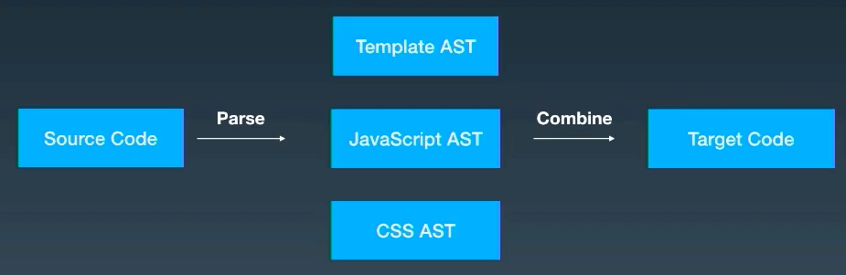

## Technical study: AST

### Introduction

While developing a CMS update dialog, I needed to parse Markdown into tokens and then convert those tokens to JSON. A discussion with the team revealed that existing tools already support Markdown-to-JSON conversion.
I had only a basic understanding of `AST`, yet ASTs are used extensively in frontend development. That motivated a more systematic study, which led to this article.

### Concepts

`AST` stands for `Abstract Syntax Tree`.
**Abstract:** an abstraction of the syntactic structure of source code.
**Syntax tree:** a tree representation of a programming language's syntax, where each node represents a structure in the source code.

Why is `AST` an unavoidable concept in frontend engineering?

```md
Most people don't really have to think about compilers in their day
jobs. However, compilers are all around you, tons of the tools you use are based
on concepts borrowed from compilers.
```

It appears in **many stages of the engineering workflow**, for example:

1. Typescript => Javascript (typescript)
2. SASS/LESS => CSS (sass/less)
3. ES6+ => ES5 (babel)
4. Formatting JavaScript code (eslint/prettier)
5. Recognizing JSX in React projects, which is not native JavaScript syntax
6. Vue SFCs (single-file components)
7. js uglify
8. Tree shaking: removing unused functions through AST analysis to reduce bundle size

**Vue SFC**



**js uglify**

```javascript
1. 代码精简
// 对两个数求和
function sum (first, second) {
  return first + second;
}
// ----------去除空格注释换行----------
function sum(first,second){return first+second}
// ----------压缩变量名，函数名及属性名----------
function s(x,y){return x+y}

2. 合并声明
// 压缩前
const a = 3;
const b = 4;

// 压缩后
const a = 3, b = 4;

3. 布尔简化
// 压缩前
!b && !c && !d && !e

// 压缩后
!(b||c||d||e)

4. 预计算
// 压缩前
const ONE_YEAR = 365 * 24 * 60 * 60

// 压缩后
const ONE_YAAR = 31536000

// 压缩前
function hello () {
  console.log('hello, world')
}

hello()

// 压缩后
console.log('hello, world')
```

---

**Language transformation is essentially manipulation of an AST.**

1. Code -> AST (Parse): parse the source.
2. AST -> AST (Transform): transform it into the AST of another language.
> For example, convert TypeScript to a TypeScript AST, then transform that into a JavaScript AST.
3. AST -> Code (Generate): generate the resulting code.

Here is a code sample and its corresponding AST:

```javascript
// Code
const a = 4

// AST
{
  "type": "Program",
  "start": 0,
  "end": 11,
  "body": [
    {
      "type": "VariableDeclaration",
      "start": 0,
      "end": 11,
      "declarations": [
        {
          "type": "VariableDeclarator",
          "start": 6,
          "end": 11,
          "id": {
            "type": "Identifier",
            "start": 6,
            "end": 7,
            "name": "a"
          },
          "init": {
            "type": "Literal",
            "start": 10,
            "end": 11,
            "value": 4,
            "raw": "4"
          }
        }
      ],
      "kind": "const"
    }
  ],
  "sourceType": "module"
}
```

Different languages use different parsers.
For example, the `Javascript` parser used by Babel differs entirely from the `CSS` parser used by postcss.
Even the same language can have several parsers that generate different AST representations:
for example, `babel` and `espree`.

[AstExplorer](https://astexplorer.net/)

### Generating an AST

Generating an AST is a highly complex process known as **parsing**.
> It can be understood as part of converting one programming language into another, usually from a higher-level language to a lower-level language.

Parsing has two stages:

1. **Lexical analysis**
2. **Syntactic analysis**

#### Lexical analysis

**Lexical units:** the words that make up a language, its smallest units.
**Lexical analysis:** convert code into a `Token` stream and maintain an array of tokens.
> Think of independent words in code, such as var, for, if, and while.
> The lexer reads the code, recognizes each word and its type, and combines them into tokens according to predefined rules.
> It also removes whitespace and comments, ultimately producing a token array.
> This stage converts source code expressed as a string into a **token stream**.

This is analogous to breaking Markdown content into small pieces for the CMS update dialog.

```javascript
// code
const a = 10;

// token
[
  { type: "KEYWORD_CONST", value: "const" },
  { type: "VARIABLE", value: "a" },
  { type: "OPERATOR_EQUAL", value: "=" },
  { type: "INTEGER", value: "10" }
  ...
]
```

**Applications:**

1. Code checking, such as `eslint`: for example, checking for a semicolon token to determine whether a statement ends with a semicolon, even when its AST is otherwise unchanged.
2. Syntax highlighting with `highlight.js / prism.js`.
3. Template syntax, such as `ejs`; see the [ejs](https://ejs.bootcss.com/) templates used by [hexo](https://hexo.io/).

---

#### Syntactic analysis

**Syntax:** the format used to express logic; source programs organize that logic according to a defined structure.
**Syntactic analysis:** convert the `Token` stream into a structured `AST`, a tree-shaped data structure that is easier to manipulate.
This is analogous to turning the individual pieces of the CMS dialog's content into `json`.

### Studying the source code

❌ Reading the source of `babel` to understand compilers can be intimidating.

✅ James Kyle, one of Babel's maintainers, created the open-source `the-super-tiny-compiler`, which had more than 21.5k stars at the time of writing. Excluding comments, it is roughly 200 lines long. Despite its size, it demonstrates many important compiler concepts and offers a systematic introduction to compilation.

#### the-super-tiny-compiler

Link: [the-super-tiny-compiler](https://github.com/jamiebuilds/the-super-tiny-compiler)

all written in js
Convert `Lisp`-style function calls into `C`-style calls, without implementing every language feature.
Suppose we have `add` and `subtract` functions. The two styles look like this:

|             | **Lisp style**           | **C style**              |
| ----------- | ---------------------- | ---------------------- |
| 2 + 2       | (add 2 2)              | add(2, 2)              |
| 4 - 2       | (subtract 4 2)         | subtract(4, 2)         |
| 2 + (4 - 2) | (add 2 (subtract 4 2)) | add(2, subtract(4, 2)) |

**Review:**

```javascript
/**
 *  1. input  => tokenizer   => tokens
 *  2. tokens => parser      => ast
 *  3. ast    => transformer => newAst
 *  4. newAst => generator   => output
 */
function compiler(input) {
  // 拆分成tokens
  let tokens = tokenizer(input);
  // tokens解析成ast
  let ast = parser(tokens);
  // ast => ast
  let newAst = transformer(ast);
  // generate new ast
  let output = codeGenerator(newAst);

  // output
  return output;
}
```

```javascript
[
 { type: 'paren',  value: '(' },
 { type: 'name',   value: 'add' },
 { type: 'number', value: '2' },
 { type: 'paren',  value: '(' },
 { type: 'name',   value: 'subtract' },
 { type: 'number', value: '4' },
 { type: 'number', value: '2' },
 { type: 'paren',  value: ')' },
 { type: 'paren',  value: ')' },
]
```

##### step1 input  => tokenizer  => tokens

```javascript
function tokenizer(input) {

  let current = 0;

  let tokens = [];

  while (current < input.length) {

    let char = input[current];
   // 括号处理
    if (char === '(') {

      tokens.push({
        type: 'paren',
        value: '(',
      });

      current++;

      continue;
    }
   // 括号处理
    if (char === ')') {
      tokens.push({
        type: 'paren',
        value: ')',
      });
      current++;
      continue;
    }
   // 空白符号处理
    let WHITESPACE = /\s/;
    if (WHITESPACE.test(char)) {
      current++;
      continue;
    }
   // 对于数字处理
    let NUMBERS = /[0-9]/;
    if (NUMBERS.test(char)) {

      let value = '';

      while (NUMBERS.test(char)) {
        value += char;
        char = input[++current];
      }

      tokens.push({ type: 'number', value });

      continue;
    }
  // (concat "foo" "bar")
    if (char === '"') {
      let value = '';

      char = input[++current];

      while (char !== '"') {
        value += char;
        char = input[++current];
      }

      char = input[++current];

      tokens.push({ type: 'string', value });

      continue;
    }
   // 对于字母处理
    let LETTERS = /[a-z]/i;
    if (LETTERS.test(char)) {
      let value = '';

      while (LETTERS.test(char)) {
        value += char;
        char = input[++current];
      }

      tokens.push({ type: 'name', value });

      continue;
    }
   // unrecognized
    throw new TypeError('I dont know what this character is: ' + char);
  }

  return tokens;
}
```

```javascript
{
 type: 'Program',
 body: [{
   type: 'CallExpression',
   name: 'add',
   params: [{
     type: 'NumberLiteral',
     value: '2',
   }, {
     type: 'CallExpression',
     name: 'subtract',
     params: [{
       type: 'NumberLiteral',
       value: '4',
     }, {
       type: 'NumberLiteral',
       value: '2',
     }]
   }]
 }]
}
```

##### step2  tokens => parser => ast

```javascript
function parser(tokens) {

  let current = 0;

  // use recursion, so we use walk instead of a while loop
  function walk() {

    let token = tokens[current];

    // number
    if (token.type === 'number') {

      current++;

      return {
        type: 'NumberLiteral',
        value: token.value,
      };
    }

    // string
    if (token.type === 'string') {
      current++;

      return {
        type: 'StringLiteral',
        value: token.value,
      };
    }

    // open
    if (
      token.type === 'paren' &&
      token.value === '('
    ) {

      token = tokens[++current];

      let node = {
        type: 'CallExpression',
        name: token.value,
        params: [],
      };

      token = tokens[++current];

      //   [
      //     { type: 'paren',  value: '('        },
      //     { type: 'name',   value: 'add'      },
      //     { type: 'number', value: '2'        },
      //     { type: 'paren',  value: '('        },
      //     { type: 'name',   value: 'subtract' },
      //     { type: 'number', value: '4'        },
      //     { type: 'number', value: '2'        },
      //     { type: 'paren',  value: ')'        }, <<< Closing parenthesis
      //     { type: 'paren',  value: ')'        }, <<< Closing parenthesis
      //   ]

      // !close
      while (
        (token.type !== 'paren') ||
        (token.type === 'paren' && token.value !== ')')
      ) {

        // recursion
        node.params.push(walk());
        token = tokens[current];
      }

      current++;

      return node;
    }

    throw new TypeError(token.type);
  }

  // init
  let ast = {
    type: 'Program',
    body: [],
  };

  while (current < tokens.length) {
    ast.body.push(walk());
  }

  return ast;
}
```

##### step3  ast => transformer => newAst

###### The visitor pattern

**Definition:**
Define new operations by modifying the `Visitor` itself without changing the original objects.
This resembles implementing a `polyfill`.
For example, treat the target browser version as a visitor and implement the behavior needed by that visitor.

**Transformation requires depth-first traversal of the AST:**

Program: start at the AST root.
CallExpression (add): enter the first child of the Program node's body.
NumberLiteral (2): enter the first child of the add node's params.
CallExpression (subtract): enter the second child of the add node's params.
NumberLiteral (4): enter the first child of the subtract node's params.
NumberLiteral (2): enter the second child of the subtract node's params.

The visitor pattern can be used as follows:

1. Create a visitor object like the one below, with methods for visiting different data types.

```javascript
var visitor = {
    NumberLiteral() {},
    CallExpression() {},
}
```

2. While traversing the `AST`, invoke the visitor's method whenever a node of the matching type is encountered. Pass both the current node and its parent so the visitor has the context it needs, somewhat like the structure used for resumable traversal in `react fiber`.

```javascript
var visitor = {
    NumberLiteral(node, parent) {},
    CallExpression(node, parent) {},
}
```

3. Traversal includes entering nodes and exiting branches. During depth-first traversal, each node therefore has enter and exit operations.

```javascript
- Program
 - CallExpression
   - NumberLiteral
   - CallExpression
    - NumberLiteral
    - NumberLiteral

/** -------------------------- **/

-> Program (enter)
  -> CallExpression (enter)
    -> Number Literal (enter)
    <- Number Literal (exit)
    -> Call Expression (enter)
       -> Number Literal (enter)
       <- Number Literal (exit)
       -> Number Literal (enter)
       <- Number Literal (exit)
    <- CallExpression (exit)
  <- CallExpression (exit)
<- Program (exit)
```

Change the data structure to:

```javascript
const visitor = {
  NumberLiteral: {
    enter(node, parent) {},
    exit(node, parent) {},
  },
  CallExpression: {
    enter(node, parent) {},
    exit(node, parent) {},
  },
}
```

```javascript
function traverser(ast, visitor) {
 // 遍历数组节点
  function traverseArray(array, parent) {
    array.forEach(child => {
      traverseNode(child, parent);
    });
  }

  // 遍历节点，参数为当前节点及其父节点
  function traverseNode(node, parent) {

    let methods = visitor[node.type];

    if (methods && methods.enter) {
      methods.enter(node, parent);
    }

    // Next we are going to split things up by the current node type.
    switch (node.type) {

      case 'Program':
        traverseArray(node.body, node);
        break;

      case 'CallExpression':
        traverseArray(node.params, node);
        break;

      // no child nodes to visit, just break.
      case 'NumberLiteral':
      case 'StringLiteral':
        break;

      default:
        throw new TypeError(node.type);
    }

    if (methods && methods.exit) {
      methods.exit(node, parent);
    }
  }

  traverseNode(ast, null);
}
```

###### transformer

```javascript
/* ----------------------------------------------------------------------------
 *   Original AST                     |   Transformed AST
 * ----------------------------------------------------------------------------
 *   {                                |   {
 *     type: 'Program',               |     type: 'Program',
 *     body: [{                       |     body: [{
 *       type: 'CallExpression',      |       type: 'ExpressionStatement',
 *       name: 'add',                 |       expression: {
 *       params: [{                   |         type: 'CallExpression',
 *         type: 'NumberLiteral',     |         callee: {
 *         value: '2'                 |           type: 'Identifier',
 *       }, {                         |           name: 'add'
 *         type: 'CallExpression',    |         },
 *         name: 'subtract',          |         arguments: [{
 *         params: [{                 |           type: 'NumberLiteral',
 *           type: 'NumberLiteral',   |           value: '2'
 *           value: '4'               |         }, {
 *         }, {                       |           type: 'CallExpression',
 *           type: 'NumberLiteral',   |           callee: {
 *           value: '2'               |             type: 'Identifier',
 *         }]                         |             name: 'subtract'
 *       }]                           |           },
 *     }]                             |           arguments: [{
 *   }                                |             type: 'NumberLiteral',
 *                                    |             value: '4'
 * ---------------------------------- |           }, {
 *                                    |             type: 'NumberLiteral',
 *                                    |             value: '2'
 *                                    |           }]
 *  (sorry the other one is longer.)  |         }
 *                                    |       }
 *                                    |     }]
 *                                    |   }
 * ----------------------------------------------------------------------------
 */
```

```javascript
function transformer(ast) {

  // init
  let newAst = {
    type: 'Program',
    body: [],
  };

  // （引用类型）通过 _context 引用，更新新旧节点
  ast._context = newAst.body;

  // ast and a visitor
  traverser(ast, {
   // NumberLiteral
    NumberLiteral: {
      enter(node, parent) {
        parent._context.push({
          type: 'NumberLiteral',
          value: node.value,
        });
      },
    },

    // StringLiteral
    StringLiteral: {
      enter(node, parent) {
        parent._context.push({
          type: 'StringLiteral',
          value: node.value,
        });
      },
    },

    // 函数调用
    CallExpression: {
      enter(node, parent) {

        // create a new node CallExpression with a nested Identifier
        let expression = {
          type: 'CallExpression',
          callee: {
            type: 'Identifier',
            name: node.name,
          },
          arguments: [],
        };

        // _context 引用参数，供子节点使用
        node._context = expression.arguments;

        if (parent.type !== 'CallExpression') {

          // 顶层函数调用本质上是一个语句，写成特殊节点 ExpressionStatement？why
          expression = {
            type: 'ExpressionStatement',
            expression: expression,
          };
        }

        parent._context.push(expression);
      },
    }
  });

  return newAst;
}
```

##### step4 newAst => generator   => output

```javascript
function codeGenerator(node) {

  switch (node.type) {

    case 'Program':
      return node.body.map(codeGenerator) // item => codeGenerator(item)
        .join('\n');

    // 顶层
    case 'ExpressionStatement':
      return (
        codeGenerator(node.expression) +
        ';' // << (...because we like to code the *correct* way)
      );

    case 'CallExpression':
      return (
        codeGenerator(node.callee) +
        '(' +
        node.arguments.map(codeGenerator)
          .join(', ') +
        ')'
      );

    case 'Identifier':
      return node.name;

    case 'NumberLiteral':
      return node.value;

    case 'StringLiteral':
      return '"' + node.value + '"';

    default:
      throw new TypeError(node.type);
  }
}

```

**end**

```javascript
add(2, subtract(4, 2))
```

#### Babel

Now take a brief look at `babel`:

1. `@babel/parser`
2. `@babel/traverse` and `@babel/types`
3. `@babel/generate`

Using the preceding concepts, implement a transformation from var to let.

```javascript
const parser = require('@babel/parser');
const traverse = require('@babel/traverse');
const generator = require('@babel/generator');

const code = `const a = 1
var b = 2
let c = 3
var d = 4`;

const transToLet = code => {
  // 1. 解析成ast
  const ast = parser.parse(code);
  // 定义访问者
  const visitor = {
    // 遍历声明表达式
    VariableDeclaration(path) {
      // 类型 = 变量声明
      if (path.node.type === 'VariableDeclaration') {
        // 替换
        if (path.node.kind === 'var') {
          path.node.kind = 'let';
        }
      }
    },
  };
  // 2. 遍历ast
  traverse.default(ast, visitor);
  // 生成代码
  const newCode = generator.default(ast, {}, code).code;
  return newCode;
};

console.log(transToLet(code))
```

### Summary

1. Understand what `AST` means and where it is used.
2. Gain a systematic understanding of the architecture and principles of most compilers.
3. Learn from the visitor pattern used in compilers.
4. Apply lessons from `the-super-tiny-compiler` to a simple Babel transformation.
