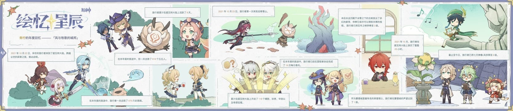
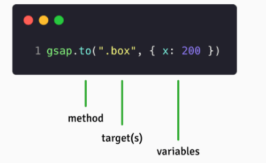

## Technical exploration: GSAP

### Introduction

After the Genshin Impact 3.1 update, I came across an event page offering Primogems.
I was curious about how it worked, so I investigated and wanted to share what I learned.
...

### The result

（h5）
 [Memories of the Stars](https://webstatic.mihoyo.com/ys/event/e20220928review_data/index.html?game_biz=hk4e_cn&mhy_presentation_style=fullscreen&mhy_auth_required=true&mhy_landscape=true&mhy_hide_status_bar=true&utm_source=mkt&utm_medium=weibo&utm_campaign=arti)



### Analysis

A quick inspection of network traffic showed many image assets and skeletal animation parameters. The fixed animations used `spine`; an animation library called `GSAP (GreenSock Animation Platform)` could reproduce most of the other effects.

### Overview

`Animate.css` is a well-known CSS animation library. It offers more than 60 effects, including fades and flashes, that cover common webpage needs. More complex scenarios still require JavaScript—for example, starting an animation when an element scrolls into view, dragging, or dynamically adjusting elements as a page scrolls.

Implementing these behaviors manually is not especially difficult: listen for scrolling, then add an animated `CSS` class when the element enters view, or animate it directly with JavaScript.
However, responsive layouts and differing element heights can introduce compatibility issues. A mature animation framework is a useful option in those cases.

#### A brief introduction

**GSAP**
Link: [https://greensock.com](https://greensock.com/docs/)
The `GreenSock` Animation Platform (GSAP) is a well-known toolkit used on more than 11 million websites, including over half of award-winning sites. In any framework, `GSAP` can animate anything accessible to `JavaScript`, including `UI`, `SVG`, `Three.js`, and `React` components.
[74-second introduction on YouTube](https://www.youtube.com/watch?v=RYuau0NeR1U)
Features:

1. Small `javascript` files
2. Compatibility across all major browsers
3. Easier to use than `css` animations
4. Described by its creators as the most powerful animation library on Earth
5. High performance and a broad range of applications

I think of it as an animation framework because its ecosystem is so complete: simple animations, dragging, scroll triggers, and more. Almost any webpage animation I can imagine can be built with this single framework.

Despite its capabilities, I have found relatively little material about it in Chinese. Perhaps its many features make it appear complicated, while an ordinary page often needs only the effects already offered by Animate.css.

#### The core library

The core library contains everything needed to create fast, cross-browser animations.
A short introduction to the core: [https://greensock.com/get-started/](https://greensock.com/get-started/)

1. Combine a method, a target, and animation variables.


2. Use camelCase, similar to `style` in `react` (【-】 indicates a minus sign, while 【20%】 indicates a percentage/modulo expression).
3. Write more concise animation code.
4. Animate `css` properties, `svg` properties, and objects such as arrays and colors.

#### Scroll-based animations

Beyond the core, plugins support scroll-based animations, draggable interactions, morphing, and more.

The following examples focus on scroll-based animations.
[https://greensock.com/scrolltrigger](https://greensock.com/scrolltrigger)
VIDEO：
[https://www.youtube.com/watch?v=X7IBa7vZjmo&t=452s](https://www.youtube.com/watch?v=X7IBa7vZjmo&t=452s)

`**scrolltrigger**`

```html
<!DOCTYPE html>
<html lang="en">

<head>
  <meta charset="UTF-8">
  <meta http-equiv="X-UA-Compatible" content="IE=edge">
  <meta name="viewport" content="width=device-width, initial-scale=1.0">
  <link rel="stylesheet" href="./index.css" />
  <title>gasp</title>
  <script src="https://cdnjs.cloudflare.com/ajax/libs/gsap/3.11.3/gsap.min.js"></script>
  <script src="https://cdnjs.cloudflare.com/ajax/libs/gsap/3.11.3/ScrollTrigger.min.js"></script>
</head>

<body>
  <div class="container">
    <div class="box a">a</div>
    <div class="box b">b</div>
    <div class="box c">c</div>
  </div>
  <script src="./index.js"></script>
</body>

</html>
```

```css
.container {
  display: flex;
  flex-direction: column;
  row-gap: 100vh;
}

.box {
  width: 100px;
  height: 100px;
  display: flex;
  justify-content: center;
  align-items: center;
  font-size: 30px;
}

.a {
  background-color: bisque;
}

.b {
  background-color: cadetblue;
}

.c {
  background-color: yellowgreen;
}
```

```javascript
// step1
// gsap.to(".a", {
//   x: 400,
//   rotation: 360,
//   duration: 3
// })

// step2: finished
// gsap.to(".c", {
//   x: 400,
//   rotation: 360,
//   duration: 3
// })

// step3: so,register pulgin scrollTrigger to top level
// gsap.registerPlugin(ScrollTrigger)
// gsap.to(".c", {
//   scrollTrigger: ".c",
//   x: 400,
//   rotation: 360,
//   duration: 3
// })

// but back it's still work down

// step4: let me talk about toggle actions
// toggleAction key words can be (play, pause, resume, reverse, restart, reset, complete, none)

// gsap.to(".b", {
//   scrollTrigger: {
//     trigger: ".b",
//     toggleActions: "play none none none"
//   },
//   x: 400,
//   rotation: 360,
//   duration: 3
// })

// gsap.to(".b", {
//   scrollTrigger: {
//     trigger: ".b",
//     toggleActions: "restart none none none"
//   },
//   x: 400,
//   rotation: 360,
//   duration: 3
// })

// gsap.to(".b", {
//   scrollTrigger: {
//     trigger: ".b",
//     toggleActions: "restart pause none none"
//   },
//   x: 400,
//   rotation: 360,
//   duration: 3
// })

// gsap.to(".b", {
//   scrollTrigger: {
//     trigger: ".b",
//     toggleActions: "restart pause resume none"
//   },
//   x: 400,
//   rotation: 360,
//   duration: 3
// })

// gsap.to(".b", {
//   scrollTrigger: {
//     trigger: ".b",
//     toggleActions: "restart pause reverse none"
//   },
//   x: 400,
//   rotation: 360,
//   duration: 3
// })

// gsap.to(".b", {
//   scrollTrigger: {
//     trigger: ".b",
//     toggleActions: "restart pause reverse pause"
//   },
//   x: 400,
//   rotation: 360,
//   duration: 3
// })

// start, markers

// gsap.to(".b", {
//   scrollTrigger: {
//     trigger: ".b",

//     // trigger element, and screen position(ex: top, center, bottom, px)
//     start: "top center",

//     // show: markers
//     markers: true,

//     // end, just like start
//     // end: "bottom 100px",

//     // relative to start
//     // end: "+=300",

//     // support a function return
//     // end: () => "+=" + document.querySelector(".b").offsetWidth,
//     toggleActions: "restart pause reverse pause"
//   },
//   x: 400,
//   rotation: 360,
//   duration: 3
// })

// step5: scrub

// gsap.to(".b", {
//   scrollTrigger: {
//     trigger: ".b",
//     start: "top center",
//     end: "top 100px",
//     scrub: true,
//     markers: true
//   },
//   x: 400,
//   rotation: 360,
//   duration: 3
// })
```

##### Demo

WebGL：[https://codepen.io/motionharvest/pen/WNQYJyM](https://codepen.io/motionharvest/pen/WNQYJyM)
DragSVG：[https://codepen.io/creativeocean/pen/zYrPrgd](https://codepen.io/creativeocean/pen/zYrPrgd)

### Summary

1. Learning the basics of `GSAP` gave me a better understanding of frontend animation.
2. `GSAP` is an excellent animation library. Even a brief introduction makes its capabilities clear.
3. I like the resulting effects and would be interested in trying them in our campaign development work.
