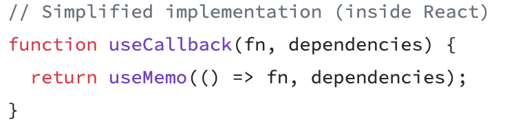

# Preact

## Introduction

**React:** introduced concepts such as JSX, virtual DOM, components, and synthetic events.

**P (Performance)react:** a lightweight alternative to React.

Studying Preact also helps explain the underlying principles of React.


Link: https://preactjs.com/

（Fast 3kB alternative to React with the same modern API）

Example: Taro began supporting PReact in v3.4. Compared with React's nearly **100k** size, Preact is about **3k**. Under the strict bundle-size limits of mini programs, that space saving is especially valuable.


## Features

### Closer to the DOM

Preact provides a very thin virtual DOM abstraction over the DOM. It diffs the real DOM, registers native event handlers, and works well with other libraries.

### Small size: 3KB

Most UI frameworks are relatively large and account for much of an application's JavaScript. Preact is small enough that your business code remains the largest part of the application. Its gzipped bundle is about 3kb, much smaller than React.
This means less JavaScript to download, parse, and execute, which can improve performance and the user experience.

### High performance

Preact is fast for reasons beyond its size. A simple, predictable diff implementation makes it one of the fastest virtual DOM libraries.
It batches updates automatically, and its team works with browser engineers to optimize performance.

### Portable and embeddable

Preact's small size lets you bring a powerful virtual DOM component model to other environments.
Build portions of an application without complex integration. Embed Preact in a widget or use it to build a complete application.

### Instantly productive

Preact includes conveniences that simplify development without sacrificing productivity, such as:
1. Passing props, state, and context to render().
2. Using standard HTML attributes such as class and for.

### Ecosystem compatibility

Thousands of React ecosystem components can be used seamlessly. Adding the small preact-compat compatibility layer even allows complex React components to work in a Preact application.

......


## Differences from React

### Preact does not implement every React feature

Preact does not aim to reimplement React completely. There are differences, although most are subtle and can be removed through [preact-compat](https://github.com/developit/preact-compat).

### Version evolution

When React announces new features, the Preact team considers whether they align with the project's goals. Features are adopted when they make sense for Preact.


## Implementation details

### JSX

How can a `DOM` structure be described in `JS`?

Use browser `DOM` APIs directly, or wrap them in a **factory function (h)** that accepts input and produces the corresponding `DOM`, for example:

```javascript
h("a", {
  class: "click",
  href: "#",
  onclick: function onclick(e) {
    alert('you are 1,000,000th visitor!');
    e.preventDefault();
  }
}, "click here to win a prize");
```

This is not especially developer-friendly. React probably would not have become what it is today with that approach alone. Developers prefer an HTML-like description of the DOM, which led to JSX.

**JSX => factory function (h) => native `DOM` structure**

The `React` team originally provided the JSX-to-function-call transformation. As `babel` became more capable, this evolved into the core `@babel/plugin-transform-react-jsx` plugin.

[Babel transformation](https://babeljs.io/repl/#?browsers=&build=&builtIns=false&corejs=3.21&spec=false&loose=true&code_lz=PQKhAIAECsGcA9wAtwmAKHQHgGYHs9xgA-Abk1wPACMBDAJwF4AiOgL2fDwDsBTRgN4BGAL5EyFAK4AbYunDgs0gJbEA8nyzAVchUtUAVAO54tO7MBkSKtdAEgAxtNqxYLJ8ocBrTknq8cFgBiZnseD29BHEluBwAXZR4ACl4ASnABeQVwO1ppXno4pIByAE88SXAGXnAhABoABibGpriUADdlWGU4vHoAQmLUrIU7XgA6AAd_dt5uOIARANoZIuHs8BERdF1wCK9kApre8CNlbirwaeU2XgtaYiA&debug=false&forceAllTransforms=false&shippedProposals=false&circleciRepo=&evaluate=false&fileSize=false&timeTravel=false&sourceType=module&lineWrap=true&presets=react%2Ces2015-loose&prettier=false&targets=&version=7.20.6&externalPlugins=&assumptions=%7B%7D)

### Vritual DOM

The factory function (h) produces a Virtual DOM that describes the DOM structure using a tree of objects.

Why is this useful? It combines DOM updates and supports multiple platforms.

```html
<p class="big">Hello World!</p>
```

```javascript
// virtual DOM
let vdom = {
  type: 'p',         // a <p> element
  props: {
    class: 'big',    // with class="big"
    children: [
      'Hello World!' // and the text "Hello World!"
    ]
  }
}
```

### Event

**React:** implements synthetic events.

**Preact:** uses the browser's native event system rather than synthetic events, reducing its size. Like React, it defines event props in camelCase.

```jsx
function clicked() {
  console.log('clicked')
}
const myButton = document.getElementById('my-button')
myButton.addEventListener('click', clicked)

function clicked() {
  console.log('clicked')
}
<button onClick={clicked}>
```
### Diffing, components, lifecycle methods...

### Hooks: the main focus

`hook` support is imported separately from the `preact/hook` module. It maintains two important module-level variables:

1. `currentIndex`: records the hook position currently used by the function component.

2. `currentComponent`: records the component being rendered.


### options

`Preact hook` runs its logic through hooks exposed on `Preact.options` at the appropriate initialization and update stages: `_render` => `diffed` => `_commit` => `umount`.

1. _render：

> Initialize each render: run or clean up unfinished effects, reset the hook index to 0, and obtain the current component instance.

2. diffed

> After a vnode is diffed, enqueue its `_pendingEffects` so they run before the next frame is drawn.

3. _commit

> After an initial or updated render, execute `_renderCallbacks`. In `preact`, these are synchronous post-render callbacks, including the second cb argument to `setState`, post-render lifecycle methods, and `forceUpdate` callbacks.

4. unmount

> Clean up `effect`s after a component unmounts.


### Component state

Hooks add a __hook property to a Preact component. Function components are otherwise stateless; hooks give them state.

```typescript
export interface ComponentHooks {
	/** The list of hooks a component uses */
	_list: HookState[];
	/** List of Effects to be invoked after the next frame is rendered */
	_pendingEffects: EffectHookState[];
}

export interface Component extends PreactComponent<any, any> {
	__hooks?: ComponentHooks;
}
```


Each `useXxx` call first invokes `getHookState` to retrieve that hook's state.

```javascript
function getHookState(index) {
  if (options._hook) options._hook(currentComponent);
  const hooks =
    currentComponent.__hooks ||
    (currentComponent.__hooks = { _list: [], _pendingEffects: [] });

  // 初始化的时候，创建一个空的hook
  if (index >= hooks._list.length) {
    hooks._list.push({});
  }
  return hooks._list[index];
}
```


`currentIndex` starts at 0 for every `render` and increments after each `useXxx`. Hook state across renders is matched by its order in `currentComponent.__hooks`. If a conditional skips a hook on one render, the ordering of subsequent hooks becomes misaligned.


After the first render, `__hooks = [hook1,hook2,hook3]`. On the second render, if `const [state2, setState2] = useState();` is skipped, `const [state3, setState3] = useState();` retrieves `hook2` through `currentIndex`.

```JavaScript
const Component = () => {
  const [state1, setState1] = useState();
  // 假设condition第一次渲染为true，第二次渲染为false
  if (condition) {
    const [state2, setState2] = useState();
  }
  const [state3, setState3] = useState();
};
```


### PReact Hooks source code

The hooks most commonly used in development can be divided into three groups.

#### MemoHookState

`useMemo` 、`useCallback`、`useRef`

```javascript
export function useMemo(factory, args) {
  // 当前hook状态
	const state = getHookState(currentIndex++, 7);
  // 判断依赖项是否改变
	if (argsChanged(state._args, args)) {
    // 存储本次数据值
		state._pendingValue = factory();
		state._pendingArgs = args;
		state._factory = factory;
		return state._pendingValue;
	}
	return state._value;
}

export function useCallback(callback, args) {
	currentHook = 8;
	return useMemo(() => callback, args);
}

export function useRef(initialValue) {
	currentHook = 5;
	return useMemo(() => ({ current: initialValue }), []);
}
// 为什么要有current？
```

`useCallback` can be viewed as syntactic sugar for `useMemo`.



 #### ReducerHookState

 `useReducer` 、`useState`

useReducer resembles redux.

`useState` is an implementation of `useReducer` with a specific `reducer`.

```javascript
export function useState(initialState) {
	currentHook = 1;
	return useReducer(invokeOrReturn, initialState);
}

/**
 *  function invokeOrReturn(arg, f) {
 *		return typeof f == 'function' ? f(arg) : f;
 *	}
**/

export function useReducer(reducer, initialState, init) {
	const hookState = getHookState(currentIndex++);
	if (!hookState._component) {
		hookState._component = currentComponent;

		hookState._value = [
			!init ? invokeOrReturn(undefined, initialState) : init(initialState),
			action => {
				const nextValue = reducer(hookState._value[0], action);
				if (hookState._value[0] !== nextValue) {
					hookState._value[0] = nextValue;
					hookState._component.setState({});
				}
			}
		];
	}
  // ...
	return hookState._value;
}
```


#### EffectHookState

`useLayoutEffect` 、`useEffect`

A `useEffect` callback runs after the current render and before the next render.

`useLayoutEffect` runs synchronously after layout and before painting. It blocks the visual update to avoid flicker.

`_pendingEffects` runs after the current repaint and before the next. In the `options.differed` hook, after component diffing, `afterPaint(afterPaintEffects.push(c))` places components with `_pendingEffects` into the global `afterPaintEffects` queue.

`_renderCallbacks` runs in `_commit`. These callbacks execute after rendering, when the DOM has been updated but the browser has not yet painted the next frame.

```javascript
export function useEffect(callback, args) {
	const state = getHookState(currentIndex++, 3);
	if (!options._skipEffects && argsChanged(state._args, args)) {
		state._value = callback;
		state._pendingArgs = args;

		currentComponent.__hooks._pendingEffects.push(state);
	}
}

export function useLayoutEffect(callback, args) {
	const state = getHookState(currentIndex++, 4);
	if (!options._skipEffects && argsChanged(state._args, args)) {
		state._value = callback;
		state._pendingArgs = args;

		currentComponent._renderCallbacks.push(state);
	}
}
```


`useContext`

```javascript
export function useContext(context) {
  // 每个Preact组件的context属性都保存着当前全局context的Provider引用，不同的context都有一个唯一id。获取当前组件的Context Provider
	const provider = currentComponent.context[context._id];
	const state = getHookState(currentIndex++, 9);
	state._context = context;
	if (!provider) return context._defaultValue;
	if (state._value == null) {
    // 初始化时订阅当前组件Provider的value变化
    // 当Provider的value变化时，重新渲染当前组件
		state._value = true;
		provider.sub(currentComponent);
	}
	return provider.props.value;
}
```


## Demo

https://github.com/Whiskeyi/React-PReact


## Analysis and summary

Preact is an excellent framework and worth considering, with several points to keep in mind:

### Stability

React's stability has been tested across many projects and billions of users. Preact may suit new projects, particularly campaign and mobile pages. Existing React projects, especially large ones, need sufficient validation and testing before adopting it.

###React's ongoing improvements

React has continued to improve its performance and development model. For example, React 16 reduced loading time by nearly one third compared with React 15, narrowing the gap with Preact.

### Identify the actual performance bottleneck

Is slow loading really caused by React's bundle size? If not, switching to Preact is unnecessary. Spend time addressing the most important bottleneck rather than replacing libraries and resolving compatibility issues.
