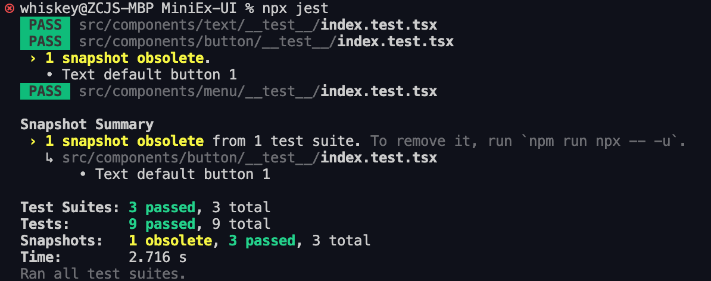
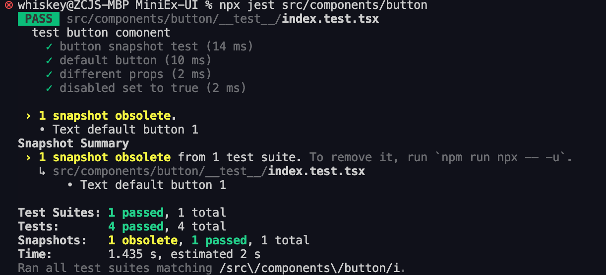
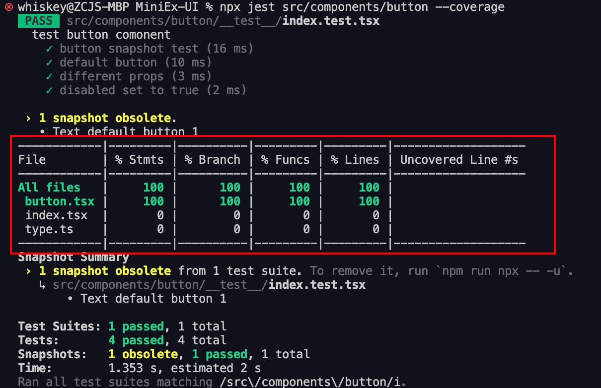
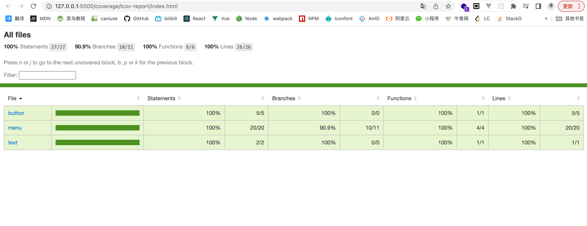
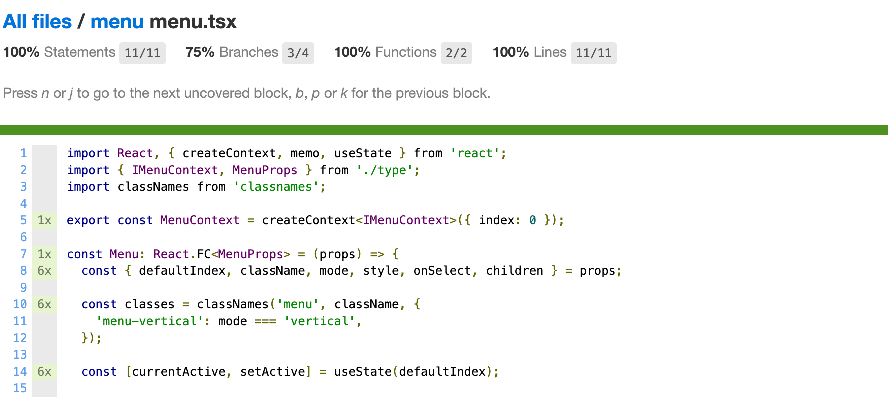

## Unit Testing

### What is unit testing?

In computer programming, **unit testing** tests individual units of source code—a collection of one or more program modules together with their associated control data, usage procedures, and operating procedures—to determine whether they are fit for use. [In a component library, these units are the individual components.]

> The definition above is adapted from Wikipedia.

This article focuses on **unit testing component libraries**.

### Why do component libraries need unit tests?

Unit testing is an unavoidable part of building high-quality custom components. Thorough test cases help ensure component usability, and measuring test coverage is also an essential step.

Most well-maintained component libraries include unit tests in their source code. This raises the first question: **why do component libraries need unit tests?**

Here are the reasons as I understand them:

1. Verify code correctness and provide greater confidence whenever you or someone else changes the code.
2. Locate hidden bugs, reduce their number, and prevent regressions and unnecessary manual investigation.
3. Automate checking: write tests once and run them repeatedly to save time on repeated verification.
4. Make refactoring component libraries safer.

### The purpose of unit tests

**The purpose is not to raise coverage blindly, but to test critical behavior in critical code, reduce the likelihood of bugs, and prevent regressions.**

Unlike many general-purpose libraries, UI components involve substantial rendering and DOM interaction. We should therefore ensure that:

- Rendering remains stable, and any changes are intentional.
- Component behavior works correctly, including events, the DOM, and internal state.
- Component logic is thoroughly tested, with coverage approaching 100% where practical.

### Core testing principles

1. **Focus on granularity, boundary values, and core logic; not every detail needs a unit test.**

  Update tests when component logic changes. Tests that are too broad cannot guarantee quality or stability; tests that are too narrow are easily disrupted by requirement changes and incur unnecessary maintenance costs. Testing every implementation detail consumes time and effort and misses the purpose of unit testing.

2. **For each test case, focus on inputs and outputs.**

  Check the input and output, and ensure that repeated execution produces consistent results. This is a foundation of unit testing.

3. **Give each test a single responsibility.**

  Each case should verify one responsibility.

4. **Do not write tests for dependencies themselves, such as API responses or dependency packages.**

  Focus on your own source code and verify that its logic is correct.

### Writing unit tests for a component library

The examples below use [jest](https://jestjs.io/zh-Hans/) and [@testing-library/react](https://testing-library.com/).

#### Installing and configuring jest

[jest configuration guide](https://jestjs.io/zh-Hans/docs/getting-started)

#### Writing test scripts

Component libraries usually create a `__tests__` directory inside each component folder to hold test scripts.

Create an `index.test.tsx` file there and write the test cases in it.

For example: `__tests__/index.test.tsx`.

```js
// 引入测试组件
import React from 'react';
import { ComponentName } from '..';
// 使用@testing-library/react渲染对应组件
import { render } from '@testing-library/react';

// 测试用例编写，此为伪代码
describe('ComponentName', () => {
  // it('', ...)第一个参数字符串内描述测试用例，请用英文描述准确、清晰
  it('test case1 for title text', () => {
    // container.firstChild为React渲染的对应DOM节点
    const { container } = render(<ComponentName title='123' {...props} />);
    // toMatchSnapshot为执行快照对比
    expect(container.firstChild).toMatchSnapshot();
  });
  it('test case2 for click', () => {
    const onClick = jest.fn();
    const { container } = render(<ComponentName title='123' {...props} />);
    container.firstChild.click();
    expect(onClick).toBeCalled();
  });
  ...
});
```

> `test()` and `expect()` are global methods exposed by `jest`. See the complete [API](https://jestjs.io/zh-Hans/docs/api) and [Expect](https://jestjs.io/zh-Hans/docs/expect) documentation.

#### Snapshot testing

[Snapshot testing documentation](https://jestjs.io/zh-Hans/docs/snapshot-testing)

As shown above, `.toMatchSnapshot()` compares snapshots when the test runs. Snapshot tests help detect unexpected UI changes. The first run creates a snapshot file in `__snapshots__`; subsequent runs compare against that file. A successful comparison passes the test.

Example generated snapshot code, describing the rendered DOM UI:

```js
// Jest Snapshot v1, https://goo.gl/fbAQLP

exports[`ComponentName test case1 for title text 1`] = `
<div>
  123
</div>
`;
```

**Additional notes on snapshot testing**

1. Treat snapshots as code. Commit `__snapshots__` files as source code and review them in `PR`s. Do not simply regenerate snapshots whenever a comparison fails; investigate and resolve the cause first.

2. Describe each snapshot clearly so that others can understand it later.

3. Handle snapshot failures carefully. For small changes, update the snapshot contents accordingly. For extensive changes, you can remove the snapshot contents and rerun the test to regenerate them, but review the result manually.

### Related scripts

#### Run all tests

Run `npx jest`. `jest` scans the project's `__tests__` folders and executes the cases inside them.



The screenshot shows the details of this test run.

#### Run specific tests

Run `npx jest src/components/button`, where `src/components/button` is the component's relative path. After changing a single component, running only its tests can substantially reduce test time.



#### Measure code coverage

Run `npx jest --coverage`. Coverage results appear in the terminal, and a `coverage` folder is generated at the project root.


Open `coverage/**/index.html` to view coverage in the browser; the VS Code `Live Server` extension is one option.

The result looks like this:



Click a component to inspect execution details and counts for individual lines.


