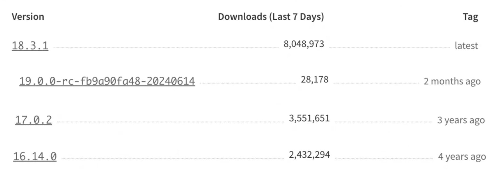
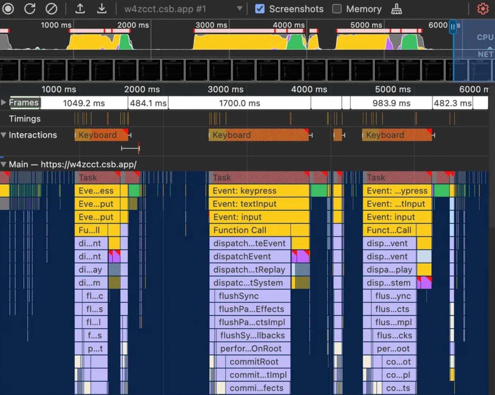
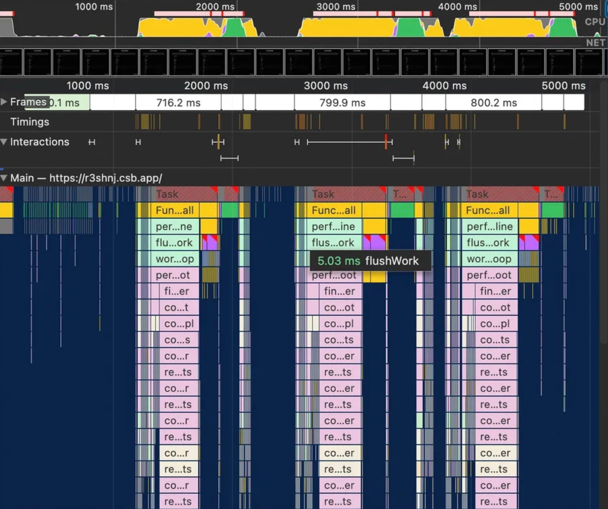
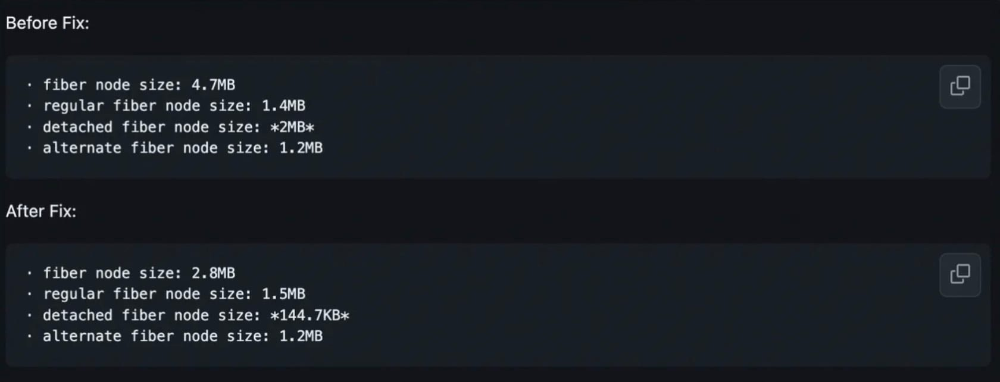
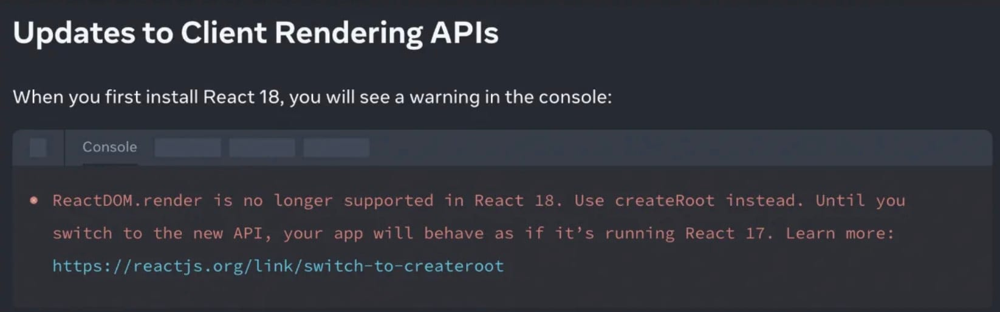
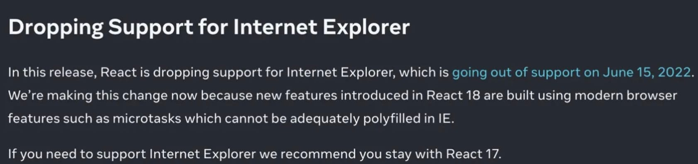

# React 19 Features

## **React Compiler**

One of the biggest topics around React 19 is support for React Compiler.
Headlines often promise that you will never need to write `React.memo`, `useCallback`, or `useMemo` again.

### **Why Is It Called React Compiler?**

React Compiler was originally named React Forget, introduced by Xuan Huang at React Conf 2021.
A compiler analyzes React code and generates different code with equivalent functionality.

### **Why React Compiler Was Created**

Rerendering in React cascades. Changing a component's state can trigger rendering of that component, its children, their children, and so on through the component tree.

Developers generally optimize this by manually telling React which components or computations can be reused. Less experienced developers may overlook this or find `React.memo`, `useMemo`, and `useCallback` difficult to use correctly.

### **What Is React Compiler?**

React Compiler is a build-time tool, integrated here as a Babel plugin with a corresponding ESLint plugin to check whether code can be transformed safely.

In simple terms, it improves update performance while preserving rendering behavior. It is already used on some production interfaces, including [instagram.com](http://instagram.com/).
It automatically memoizes code to reduce repeated computation and rendering, achieving effects similar to `useMemo`, `useCallback`, and `React.memo` through lower-level primitives.

Its memoization work mainly covers optimizing rerenders, caching expensive computations, and research into effects.

#### **Optimizing Rerenders**

```javascript
function FriendList({ friends }) {
  const onlineCount = useFriendOnlineCount();
  if (friends.length === 0) {
    return <NoFriends />;
  }
  return (
    <div>
      <span>{onlineCount} online</span>
      {friends.map((friend) => (
        <FriendListCard key={friend.id} friend={friend} />
      ))}
      <MessageButton />
    </div>
  );
}
```

The code above has three problems:

1. Updating the `friends` prop rerenders `<MessageButton />` unnecessarily.
2. Updating `onlineCount` rerenders `<FriendListCard />` and `<MessageButton />` unnecessarily.
3. When `friends` changes, `<FriendListCard />` cannot be reused.

The optimized code:

```javascript
const MemoizedMessageButton = React.memo(MessageButton);

export const FriendList = React.memo(({ friends }) => {
  const onlineCount = useFriendOnlineCount();

  const renderFriendListCard = React.useCallback(
    (friend) => <FriendListCard key={friend.id} friend={friend} />,
    []
  );

  const friendList = React.useMemo(
    () => friends.map(renderFriendListCard),
    [friends, renderFriendListCard]
  );

  if (friends.length === 0) {
    return <NoFriends />;
  }

  return (
    <div>
      <span>{onlineCount} online</span>
      {friendList}
      <MemoizedMessageButton />
    </div>
  );
});
```

The optimized code becomes more complicated, adding cost and burden for developers.

**Actual React Compiler Output**

We can inspect the compiled code with the online [React Compiler Playground](https://playground.react.dev/#N4Igzg9grgTgxgUxALhAMygOzgFwJYSYAEAYjHgpgCYAyeYOAFMEWuZVWEQL4CURwADrEicQgyKEANnkwIAwtEw4iAXiJQwCMhWoB5TDLmKsTXgG5hRInjRFGbXZwB0UygHMcACzWr1ABn4hEWsYBBxYYgAeADkIHQ4uAHoAPksRbisiMIiYYkYs6yiqPAA3FMLrIiiwAAcAQ0wU4GlZBSUcbklDNqikusaKkKrgR0TnAFt62sYHdmp+VRT7SqrqhOo6Bnl6mCoiAGsEAE9VUfmqZzwqLrHqM7ubolTVol5eTOGigFkEMDB6u4EAAhKA4HCEZ5DNZ9ErlLIWYTcEDcIA). React Compiler still generates JSX, as shown below:

```javascript
function FriendList(t0) {
  // 初始化缓存
  // _c是React Compiler的hook(useMemoCache)，会创建一个可缓存元素的数组，9代表缓存数组长度是9
  const $ = _c(9);
  const { friends } = t0;
  const onlineCount = useFriendOnlineCount();
  /** 缓存NoFriends场景 **/
  if (friends.length === 0) {
    let t1;
    // symbol.for在不同全局作用于下传入键相同值一定相同，相反与Symbol()
    // $[x]默认值为Symbol.for("react.memo_cache_sentinel")，如果相等说明缓存没有被初始化
    if ($[0] === Symbol.for("react.memo_cache_sentinel")) {
      t1 = <NoFriends />;
      // 缓存NoFriends
      $[0] = t1;
    } else {
      // 缓存无变化，直接使用缓存值
      t1 = $[0];
    }
    return t1;
  }
  /** 缓存onlineCount **/
  let t1;
  // 不等于或未初始化，更新缓存
  if ($[1] !== onlineCount) {
    t1 = <span>{onlineCount} online</span>;
    $[1] = onlineCount;
    $[2] = t1;
  } else {
    t1 = $[2];
  }
  /** 缓存friends列表 **/
  let t2;
  if ($[3] !== friends) {
    t2 = friends.map(_temp);
    $[3] = friends;
    $[4] = t2;
  } else {
    t2 = $[4];
  }
  /** 缓存MessageButton **/
  let t3;
  if ($[5] === Symbol.for("react.memo_cache_sentinel")) {
    t3 = <MessageButton />;
    $[5] = t3;
  } else {
    t3 = $[5];
  }
  let t4;
  /** 组合缓存组件 **/
  if ($[6] !== t1 || $[7] !== t2) {
    t4 = (
      <div>
        {t1}
        {t2}
        {t3}
      </div>
    );
    $[6] = t1;
    $[7] = t2;
    $[8] = t4;
  } else {
    t4 = $[8];
  }
  return t4;
}
function _temp(friend) {
  return <FriendListCard key={friend.id} friend={friend} />;
}
```

#### **Memoizing Expensive Computations**

```javascript
function expensivelyCalc() {
  /* ... */
}

// 此为React Component
function Component({ items }) {
  const data = expensivelyCalc(items);
  // ...
}
```

Note: React Compiler memoizes only React components and hooks, and does not share caches across components or hooks.

#### **Memoizing Effects: An Open Research Area**

Changing how a previously manually memoized value is memoized can cause problems. If the value is a dependency of `useEffect` or `useLayoutEffect`, introducing React Compiler can make effects run too often, too rarely, or even loop indefinitely.

React Compiler currently checks statically whether automatic memoization matches existing manual memoization. If equivalence cannot be established, it safely skips that component or hook.

Therefore, retain existing `useMemo()` and `useCallback()` calls in current code, while aiming to write new code without depending on them.

### **Conclusion**

React Compiler relies on components producing the same output (JSX) for the same inputs (props). Each component is an independently analyzable module without needing to consider every relationship between components.

This analysis suggests potential issues:

1. **Memory usage:** memoization and caching trade memory for computation. Applications handling large amounts of data should monitor device memory.
2. **Debugging:** compilation adds an abstraction between written and executed code. Debugging compiled code can be more demanding and requires understanding how React Compiler works.

The team also needs to balance optimization against breaking changes. As mentioned, it skips certain components or hooks to preserve existing behavior. Nadia Makarevich tested the performance benefits in this [article](https://www.developerway.com/posts/i-tried-react-compiler), finding that the compiler is relatively conservative in its optimizations.

For more about React Compiler, watch this [video](https://www.youtube.com/watch?v=PYHBHK37xlE).

## **New Features**

### **Client API**

**Actions**

The Client API mainly introduces Actions—functions using asynchronous transitions—with asynchronous form submission as a core use case.

```javascript
// Before
function UpdateName({}) {
  const [name, setName] = useState("");
  const [error, setError] = useState(null);
  const [isPending, setIsPending] = useState(false);

  const handleSubmit = async () => {
    setIsPending(true);
    const error = await updateName(name);
    setIsPending(false);
    if (error) {
      setError(error);
      return;
    }
    redirect("/path");
  };

  return (
    <div>
      <input value={name} onChange={(event) => setName(event.target.value)} />
      <button onClick={handleSubmit} disabled={isPending}>
        Update
      </button>
      {error && <p>{error}</p>}
    </div>
  );
}

// After1
// 使用react18的useTransition和react19的Asynchronous transitions
function UpdateName({}) {
  const [name, setName] = useState("");
  const [error, setError] = useState(null);
  const [isPending, startTransition] = useTransition();

  const handleSubmit = () => {
    startTransition(async () => {
      const error = await updateName(name);
      if (error) {
        setError(error);
        return;
      }
      redirect("/path");
    });
  };

  return (
    <div>
      <input value={name} onChange={(event) => setName(event.target.value)} />
      <button onClick={handleSubmit} disabled={isPending}>
        Update
      </button>
      {error && <p>{error}</p>}
    </div>
  );
}

// After2
// 使用react19的actions和useActionState
function ChangeName({ name, setName }) {
  const [error, submitAction, isPending] = useActionState(
    async (previousState, formData) => {
      const error = await updateName(formData.get("name"));
      if (error) {
        return error;
      }
      redirect("/path");
      return null;
    },
    null
  );

  return (
    <form action={submitAction}>
      <input type="text" name="name" />
      <button type="submit" disabled={isPending}>
        Update
      </button>
      {error && <p>{error}</p>}
    </form>
  );
}
```

- **Asynchronous transitions**

  `startTransition` can accept asynchronous functions.

```javascript
startTransition(async () => {
  await updateData();
};

```

- **useActionState**

  A new hook updates state based on actions and handles common Action scenarios.

```javascript
const [state, submitAction, isPending] = useActionState(
  actionFunction,
  initialState
);
```

- **action and formAction props**

  Automatically manages form elements such as inputs and buttons, integrating actions into forms.

```javascript
<form action={action} >
<button formAction={action}>

```

- **useFormStatus**
  Obtains the status of form actions, somewhat like antd's `const [form] = Form.useForm()`.

```javascript
const { data, pending, method, action } = useFormStatus();
```

- **useOptimistic**

  Updates the UI before an action completes: optimistic updates provide immediate feedback by assuming success during server interaction. If the operation fails, the UI rolls back to its previous state.

```javascript
// 在updateName请求进行时立即渲染optimisticName。当更新完成或出错时，React将自动切换回currentName值。
function ChangeName({ currentName, onUpdateName }) {
  const [optimisticName, setOptimisticName] = useOptimistic(currentName);

  const submitAction = async (formData) => {
    const newName = formData.get("name");
    setOptimisticName(newName);
    const updatedName = await updateName(newName);
    onUpdateName(updatedName);
  };

  return (
    <form action={submitAction}>
      <p>Your name is: {optimisticName}</p>
      <p>
        <label>Change Name:</label>
        <input
          type="text"
          name="name"
          disabled={currentName !== optimisticName}
        />
      </p>
    </form>
  );
}
```

**Other updates:**

- **use**

  This API is not a hook. It can only be called during rendering, but unlike hooks it can be used conditionally. It consumes resources; more resource types may be supported later. In React 19 it reads Promise and context values.

```javascript
// use promise
function Comments({ promise }) {
  // 使用use会等待promise被resolve，在未被resolve前显示suspense
  const resolvedData = use(promise);
  return <span>{resolvedData}</span>;
}

function Page({ promise }) {
  return (
    <Suspense fallback={<div>Loading...</div>}>
      <Comments promise={promise} />
    </Suspense>
  );
}

// use context
import ThemeContext from "./ThemeContext";

function Heading({ children }) {
  if (children == null) {
    return null;
  }

  // useContext在前置返回时异常
  const theme = use(ThemeContext);
  return <h1 style={{ color: theme.color }}>{children}</h1>;
}
```

- **Preloading APIs**

  Supports loading and preloading browser resources.

```javascript
// From
function Component() {
  preinit("https://.../script.js", { as: "script" });
  preload("https://.../stylesheet.css", { as: "style" });
  prefetchDNS("https://../");
  preconnect("https://.../");

  return ...
}

// To
<head>
  <link ref="prefetch-dns" href="https://..." />
  <link ref="preconnect" href="https://..." />
  <link ref="preload" as="font" href="https://.../font.woff" />
  <script async="" src="http://.../script.js"></script>
</head>

```

### **Improvements**

- **ref as a props**

  Function components can accept `ref` as a prop; `forwardRef` is planned for removal in a future version.

```javascript
// Before
import { forwardRef } from "react";
const Input = forwardRef((props, ref) => {
  return <input ref={ref} ... />
})

// After
function Input({ ref }) {
  return <input ref={ref} ... />
}

// 可以支持一些事件监听等，来优化内存
<div
  ref={ref => {
    ...
    retrun () => {
      ref.removeEventHandler('change', handleInputChange)
    }
  }}
/>

```

- **Document metadata & Stylesheet support**

  Components can use document metadata tags or render stylesheets.

```javascript
// From
function BlogPost({ post }) {
  return (
    <title>{post.title}</title>
    <meta name="author" content={post.author} />
    <meta property="og:image" content={post.image} />
  )
}

// To
<html>
  <head>
    <title>xxx</title>
    <meta name="author" content="xxx" />
    <meta name="og:image" content="xxx" />
  </head>
</html>

```

```javascript
// From
function Component() {
  return (
    <div>
      <link rel="stylesheet" href="/styles/styles.css" precedence="default" />
      <link rel="stylesheet" href="/styles/button.css" precedence="default" />
      <link rel="stylesheet" href="/styles/article.css" precedence="high" />
      <article>...</article>
    </div>
  );
}

// To
<html>
  <head>
    <link ref="stylesheet" href="/style/styles.css" />
    ...
  </head>
  <body>
    <div>
      <article>...</article>
    </div>
  </body>
</html>;
```

### **Server API: Briefly**

- **React Server Component**
- **Server Actions**

## **React 19 Summary**

React 19's main additions are:
- useMemo, useCallback, memo -> React Compiler
- forwardRef -> ref is a prop
- useContext -> use(Context)
- throw promise -> use(promise)
- ...

React 19 starts supporting React Compiler, primarily for performance optimization. It is valuable but still has a long way to go.

New APIs around Actions and HTML `<head>` improve developer convenience.

There are more changes than those covered here. Read the [official article](https://19.react.dev/blog/2024/04/25/react-19) or watch [React Conf 2024](https://19.react.dev/blog/2024/05/22/react-conf-2024-recap) for more details.

# **Upgrading a Project Across Major React Versions**

## **The State of React Versions**

At the time of writing, the latest version is React 19 RC and the latest stable release is React 18.3.1.

A few React release labels:

| **Release label** | **Explanation** |
| ------------ | ------------------------------------------------------------------------ |
| RC | Release Candidate |
| Canary | Named after coal-mine canaries used to detect toxic gases; an early-warning, experimental release |

**NPM download reference: data from August 12, 2024:**
https://www.npmjs.com/package/react?activeTab=versions

The chart shows the three most popular releases in versions 16, 17, 18, and 19. The latest stable release, 18.3.1, is the most popular, but 17.0.2 and 16.14.0 from three or four years earlier still see substantial usage—nearly half of projects use versions below React 18.



## **Which Version Should You Upgrade To?**

Before choosing a version, understand React's architecture and how it changed across releases.

**State updates and rendering are mainly implemented by these modules:**

- **Reconciler:** handles differences between virtual and actual DOM trees so the displayed elements match virtual DOM state.
- **Renderer:** renders the virtual representation into the host environment, such as React DOM, React Native, or React ART.
- **Scheduler:** orders tasks by priority and timing before they enter the reconciler, improving performance and experience. Introduced in React 16 as a separate package: https://github.com/facebook/react/blob/1fb18e22ae66fdb1dc127347e169e73948778e5a/packages/scheduler/README.md. It resembles `requestIdleCallback`, but React implements its own approach for compatibility and other reasons.

### **React15**

No scheduler; the core is efficient UI rendering through the virtual DOM.

Problem: mounting and updating recursively process child components. Deep recursion cannot be interrupted and can cause jank because JavaScript and rendering compete for the main thread.

### **React16**

Introduces the scheduler and moves from [Stack Reconciler to Fiber Reconciler](https://legacy.reactjs.org/docs/codebase-overview.html#fiber-reconciler): uninterruptible recursion becomes interruptible traversal.

The Fiber architecture is the basis for later interruptibility, enabling priority scheduling and interruptible work for better performance.

### **React17**

Officially described as a [stepping-stone release](https://legacy.reactjs.org/blog/2020/10/20/react-v17.html). It introduces no major architectural change and focuses on stability and backward compatibility.

### **React18**

- The main change is introducing [experimental concurrent features](https://react.dev/blog/2022/03/29/react-v18). Concurrency is an underlying design rather than just a feature, moving updates from synchronous, uninterruptible work toward asynchronous, interruptible work.
- Automatic batching combines multiple state updates into one render to improve performance. It is a breaking change, but can reduce render counts.
- New hooks include `useId`, `useTransition`, and `useDeferredValue`.
- ...

### **React19**

As noted earlier, this is an RC at the time of writing, without a stable release yet.

## **Evaluating an Upgrade**

Consider benefits and costs together before deciding whether to upgrade.

- **Benefits:** does the new version provide needed features or performance improvements?
- **Costs:** what is its impact on the existing codebase, and how much migration work is required?

## **Upgrade Benefits**

### **1. Performance Improvements**

The main performance benefits come from React 18's automatic batching and concurrent rendering.

**How does React 18 improve performance?**

Some browser internals help explain this.

JavaScript executes on the main thread, which also handles user interaction, network events, timers, animations, layout, and painting.

A single thread processes tasks sequentially, so other work waits while one task runs. A [long task](https://web.dev/long-tasks-devtools/#what-are-long-tasks), lasting over 50 ms, can cause jank by blocking higher-priority work such as user interaction.

Here are two examples: a long list rendered from state managed with `useState`, and another using `useTransition`, a React 18 concurrency hook.

- Ordinary `useState` example: https://w4zcct.csb.app/

In the Performance panel, each click produces a long task with noticeable blocking.



React 18 adds a concurrent renderer. APIs such as `useTransition` and `useDeferredValue` mark some rendering as nonurgent. During such work, React can yield back to the main thread about every 5 ms, depending on scheduler decisions, to check for more important tasks such as user input or an urgent component update.

- `useTransition` example: [https://r3shnj.csb.app/](https://r3shnj.csb.app/%E3%80%82)

The Performance panel shows work divided into more units with more opportunities for interleaving, and substantially less blocking.



Reports of upgrades from React 16 to 18, with automatic batching and concurrency enabled, also show useful performance gains:

1. The New York Times team reported that [upgrading from React 16 to 18](https://open.nytimes.com/enhancing-the-new-york-times-web-performance-with-react-18-d6f91a7c5af8) halved rerenders and reduced INP by 30%. INP measures responsiveness from interaction, such as clicking a button, to the next visible paint reflecting it.
2. Airbnb reported significant performance improvements after [upgrading from React 16 to 18](https://medium.com/airbnb-engineering/how-airbnb-smoothly-upgrades-react-b1d772a565fd).

React 18 also [improves memory usage](https://github.com/facebook/react/pull/21039) by clearing more internal fields on unmount, mitigating the impact of possible application memory leaks.



### **2. Developer Experience**

- Explicit React imports are no longer required.
  - Before React 17, Babel transformed JSX into `React.createElement` calls.
  - From React 17, the automatic JSX runtime is supported.
- New hooks include `useId`, `useTransition`, and `useDeferredValue` in React 18.
- Type changes and deprecated invalid approaches can improve overall readability and maintainability.

## **Upgrade Approaches and Costs**

### **The React Team's Gradual Upgrade Strategy**

**The old gradual upgrade approach: React 17**

Modes discussed across React versions:

1. Legacy mode: `ReactDOM.render(<App />, rootNode)`.
2. Blocking mode: concurrency disabled but new features such as automatic batching enabled, using `ReactDOM.createBlockingRoot(rootNode).render(<App />)`.
3. Concurrent mode: concurrency enabled through `ReactDOM.createRoot(rootNode).render(<App />)`.

Community feedback found this older approach problematic. Concurrency provides much of the new architecture's benefit by addressing CPU and I/O bottlenecks, but a root mode change affects the whole application. Different render methods can also coexist. Replacing the entry point's render method changes the application's mode and may expose many incompatibilities.

**The new gradual upgrade approach: React 18**

Updates are synchronous by default, with concurrent updates enabled when concurrent features are used.

This means upgrading without using concurrent update features does not automatically introduce their breaking changes. The following examples determine the execution mode from the specific code.

```javascript
const App = () => {
  const [count, setCount] = useState(0);
  const [isPending, startTransition] = useTransition();

  const onClick = () => {
    // 使用并发特性useTransition
    startTransition(() => {
      // 并发更新
      updateCount((count) => count + 1);
    });
  };

  const onClickCompare = () => {
    // 同步更新
    updateCount((count) => count + 1);
  };

  return <div onClick={onClick}>{count}</div>;
};
```

### **1. Configuration Changes**

- Upgrade React-related dependencies such as `react` and `react-dom`.
  - Change the `react-dom` import for React 18.

```javascript
// From
import ReactDOM from "react-dom";
// To
import ReactDOM from "react-dom/client";
```

- Upgrade TypeScript typings, including `@types/react` and `@types/react-dom`.
  - Estimated work: upgrading typings in our large monorepo of about two million lines produced nearly 5,000 errors to resolve.
  - A notable difference: component props must declare `children` explicitly; see https://github.com/DefinitelyTyped/DefinitelyTyped/pull/56210.

```javascript
interface ButtonProps {
  color: string;
  children?: React.ReactNode;
}
```

### **2. Adjust Incompatible Code**

**Dependency changes:**

Handle third-party libraries that use React directly or indirectly and are incompatible with React 18. Upgrade them while verifying functionality, or find alternatives.

**API changes:**

Some APIs are no longer supported in newer React versions, so existing usages need replacements.

I recommend the official automated migration tool, Codemods (https://github.com/reactjs/react-codemod). For example, remove string refs with:

```bash
npx codemod@latest react/19/replace-string-ref
```

This tool also helps with the TypeScript changes mentioned earlier.

- **ReactDOM.render and unmountComponentAtNode**
  - Removed in React 19.
  - Why deprecated? New APIs enable concurrent rendering and additional features.
  - Replacement: `createRoot()`, `root.render()`, and `root.unmount()`.



```javascript
// Before
import { render } from "react-dom";
const container = document.getElementById("app");
render(<App tab="home" />, container);

// After
import { createRoot } from "react-dom/client";
const container = document.getElementById("app");
const root = createRoot(container);
root.render(<App tab="home" />);
```

- **componentWillMount**
  - Why deprecated? When using modern features such as [Suspense](https://zh-hans.react.dev/reference/react/Sus%E2%80%8B%E2%80%8Bpense), `componentWillMount` does not guarantee that the component will mount. If rendering is aborted, React discards the in-progress tree and starts building it again on the next attempt.
  - Replacement: `componentDidMount`, the constructor, or [UNSAFE_componentWillMount](https://zh-hans.react.dev/reference/react/Component#unsafe_componentwillmount).
- **componentWillReceiveProps**
  - Why deprecated? For the same reason as above.
  - Replacement: `getDerivedStateFromProps`, `componentDidUpdate`, or refactor the class into a function component using hooks; alternatively, [UNSAFE_componentWillReceiveProps](https://zh-hans.react.dev/reference/react/Component#unsafe_componentwillreceiveprops).
- **componentWillUpdate**
  - Why deprecated? For the same reason as above.
  - Replacement: `getSnapshotBeforeUpdate` or [UNSAFE_componentWillUpdate](https://zh-hans.react.dev/reference/react/Component#unsafe_componentwillupdate).
- **findDomNode**
  - Removed in React 19.
  - Why deprecated? It returns a component's mounted DOM node, but the connection between JSX and the code operating on that node is implicit, making `findDOMNode` usage fragile.
  - Replacement: use refs, passed through props or forwarded with `forwardRef`.

```javascript
// Before
class MyComponent extends React.Component {
  componentDidMount() {
    const domNode = ReactDOM.findDOMNode(this);
    // 操作 DOM 节点
  }

  render() {
    return <div>Example</div>;
  }
}

// After
class MyComponent extends React.Component {
  constructor(props) {
    super(props);
    this.myRef = React.createRef();
  }

  componentDidMount() {
    const domNode = this.myRef.current;
    // 操作DOM节点
  }

  render() {
    return <div ref={this.myRef}>Example</div>;
  }
}
```

- **String Refs**
  - Removed in React 19.
  - Why deprecated? Global string names complicate sharing refs and maintenance.
  - Replacement: `React.createRef()`.

```javascript
// Before
class MyComponent extends React.Component {
  render() {
    return <div ref="myDiv" />;
  }

  componentDidMount() {
    const node = this.refs.myDiv;
    // ...可以对DOM节点node做操作
  }
}

// After
class MyComponent extends React.Component {
  constructor(props) {
    super(props);
    this.myDiv = React.createRef();
  }

  render() {
    return <div ref={this.myDiv} />;
  }

  componentDidMount() {
    const node = this.myDiv.current;
    // ...可以对DOM节点node做操作
  }
}
```

- **Legacy Context**
  - Removed in React 19.
  - Why deprecated? Easy to misuse, such as passing incorrect data, and can create maintenance problems.
  - Replacement: replace legacy `childContextTypes` and `getChildContext` with `React.createContext()`.

```javascript
// Before
class MyProvider extends React.Component {
  getChildContext() {
    return { value: this.props.value };
  }

  render() {
    return this.props.children;
  }
}
MyProvider.childContextTypes = {
  value: PropTypes.string,
};

class MyConsumer extends React.Component {
  render() {
    return <div>{this.context.value}</div>;
  }
}
MyConsumer.contextTypes = {
  value: PropTypes.string,
};

// After
const MyContext = React.createContext(defaultValue);

class MyProvider extends React.Component {
  render() {
    return (
      <MyContext.Provider value={this.props.value}>
        {this.props.children}
      </MyContext.Provider>
    );
  }
}

class MyConsumer extends React.Component {
  render() {
    return (
      <MyContext.Consumer>{(value) => <div>{value}</div>}</MyContext.Consumer>
    );
  }
}
```

- **useRef() and createContext() Require an Argument**
  - Changed in React 19.
  - Why changed? This simplifies type signatures. Refs are now mutable, avoiding cases where their values cannot be changed.
  - Replacement: `useRef(undefined)` and `createContext(undefined)`.

```javascript
// @ts-expect-error: Expected 1 argument but saw none
useRef();
// Passes
useRef(undefined);
// @ts-expect-error: Expected 1 argument but saw none
createContext();
// Passes
createContext(undefined);
```

### **3. Compatibility**

**Browser compatibility**

React 18 relies on modern browser features, including capabilities that cannot be supplied in Internet Explorer through global polyfills. Upgrading to React 18 or later therefore ends IE support.



### **4. Testing Cost**

If your project uses React 16, the main upgrade benefit is improved performance through React 18's automatic batching and concurrency. These are described as breaking changes, so aim for full regression coverage. If a complete test pass is impractical, follow [Airbnb's upgrade approach](https://medium.com/airbnb-engineering/how-airbnb-smoothly-upgrades-react-b1d772a565fd) of separating versions with module aliases to reduce each testing increment's cost.

## **Conclusion**

React 19's main changes here are performance improvements associated with React Compiler and APIs that simplify development.

If you plan to upgrade, weigh the benefits and costs described above. At the time of writing, I recommend React 18.3.1 for its adoption and upgrade benefits.

Thank you for reading this far. Corrections are welcome if anything is inaccurate. That's a wrap! 🎉

**Selected References**


> 1. https://www.youtube.com/watch?v=lGEMwh32soc
2. https://www.youtube.com/watch?v=PYHBHK37xlE
3. https://www.youtube.com/watch?v=T8TZQ6k4SLE
4. https://github.com/reactwg/react-compiler
5. https://www.developerway.com/posts/i-tried-react-compiler
6. https://tonyalicea.dev/blog/understanding-react-compiler/
7. https://github.com/facebook/react/blob/main/CHANGELOG.md
8. https://legacy.reactjs.org/blog
9. https://react.dev/blog
10. https://vercel.com/blog/how-react-18-improves-application-performance
11. https://react.dev/reference/react/legacy
12. *Principles of React Design*
