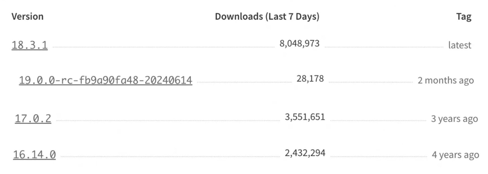
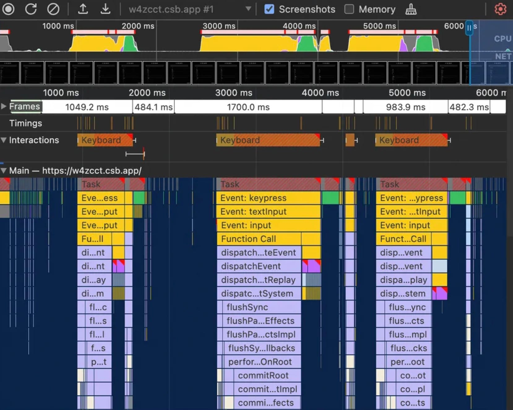
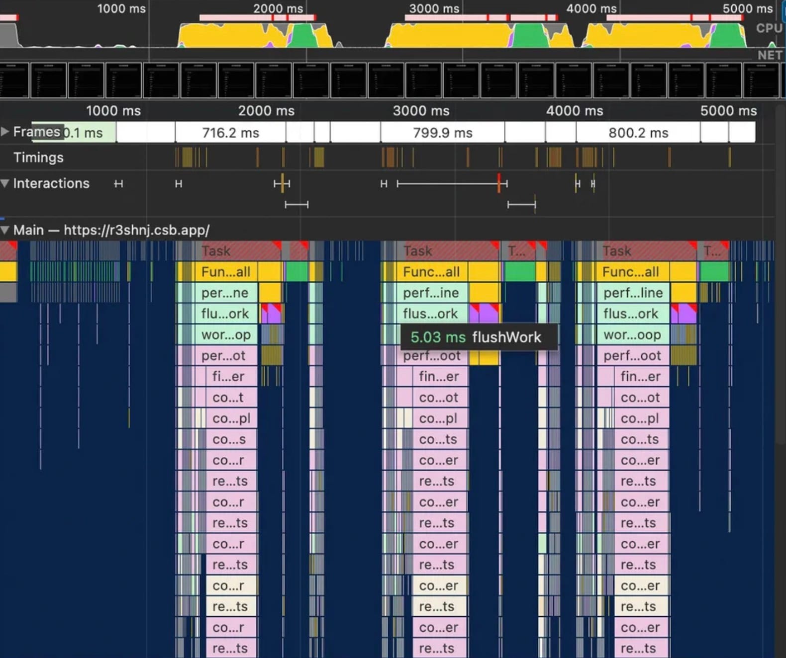
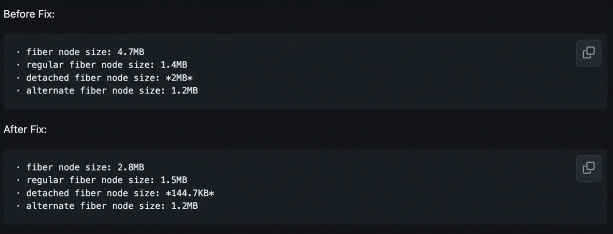
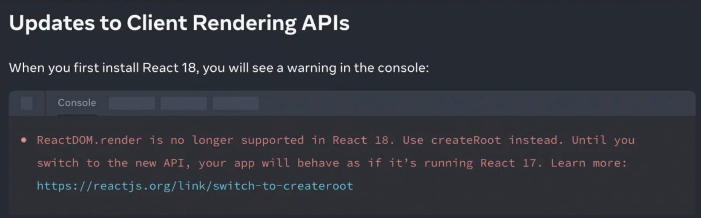
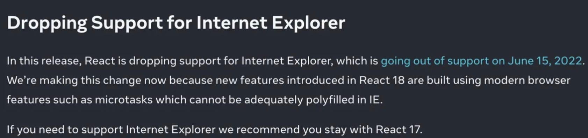

# React19 新功能

## **React Compiler**

React19 最大的热度是支持使用 React Compiler。
比如经常看到这样的文章名：震惊！再也不用写 React.memo、useCallback、useMemo 了。

### **为什么取名为 React Compiler（编译器）**

其实 React Compiler 原名是 React Forget（由黄玄在 React Conf 2021 介绍）。
Compiler 定义上指的是对 React 代码进行分析并生成不同但功能等效的代码的程序。

### **React Compiler 诞生背景**

React  中的重新渲染是级联的。每次更改  React  组件中的状态时，都会触发该组件、其内部的每个组件、这些组件内部的组件等的重新渲染，直到组件树的末尾。

一般开发者需要手动告诉 React 哪些组件/函数应该重新渲染/调用来优化重新渲染。但对于一些经验不足的开发者并不一定会关注到或者说正确使用（React.memo、useMemo、useCallback）较难。

### **什么是 React Compiler**

React Compiler 是一款构建时工具（目前以 babel  插件的形式集成在代码中使用，并配套对应的 eslint 插件检测代码转换合法性）。

简单来说，他是在保证渲染无异常下，提升更新性能的工具。React Compiler  目前已在一些生产界面（[instagram.com](http://instagram.com/)）使用。
React Compiler 功能是自动记忆代码（类似 useMemo、useCallback、React.memo 效果，但是使用的是低级原语），来减少重复计算和渲染成本等。

React Compiler 的记忆化主要包括以下三种：优化重新渲染、记忆昂贵计算、记忆 effects。

#### **优化重新渲染**

```javascript
function FriendList({ friends }) {
  const onlineCount = useFriendOnlineCount();
  if (friends.length === 0) {
    return <NoFriends />;
  }
  return (
    <div>
      <span>{onlineCount} online</span>
      {friends.map((friend) => (
        <FriendListCard key={friend.id} friend={friend} />
      ))}
      <MessageButton />
    </div>
  );
}
```

上述代码有三个问题：

1. props friends 更新后，<MessageButton />会无意义重新渲染
2. onlineCount 更新后，<FriendListCard />、<MessageButton />被无意义重新渲染
3. friends 改变后<FriendListCard />不能复用

优化后的代码：

```javascript
const MemoizedMessageButton = React.memo(MessageButton);

export const FriendList = React.memo(({ friends }) => {
  const onlineCount = useFriendOnlineCount();

  const renderFriendListCard = React.useCallback(
    (friend) => <FriendListCard key={friend.id} friend={friend} />,
    []
  );

  const friendList = React.useMemo(
    () => friends.map(renderFriendListCard),
    [friends, renderFriendListCard]
  );

  if (friends.length === 0) {
    return <NoFriends />;
  }

  return (
    <div>
      <span>{onlineCount} online</span>
      {friendList}
      <MemoizedMessageButton />
    </div>
  );
});
```

可以看到，在优化后代码变得比较混乱，同时给开发者带来了额外的成本和负担

**React Compiler 实际编译**

我们可以使用在线的代码编译转换工具：[React Compiler Playground](https://playground.react.dev/#N4Igzg9grgTgxgUxALhAMygOzgFwJYSYAEAYjHgpgCYAyeYOAFMEWuZVWEQL4CURwADrEicQgyKEANnkwIAwtEw4iAXiJQwCMhWoB5TDLmKsTXgG5hRInjRFGbXZwB0UygHMcACzWr1ABn4hEWsYBBxYYgAeADkIHQ4uAHoAPksRbisiMIiYYkYs6yiqPAA3FMLrIiiwAAcAQ0wU4GlZBSUcbklDNqikusaKkKrgR0TnAFt62sYHdmp+VRT7SqrqhOo6Bnl6mCoiAGsEAE9VUfmqZzwqLrHqM7ubolTVol5eTOGigFkEMDB6u4EAAhKA4HCEZ5DNZ9ErlLIWYTcEDcIA)，来看 React Compiler 编译后的代码。可以看到 React Compiler  生成的仍然是  JSX，如下：

```javascript
function FriendList(t0) {
  // 初始化缓存
  // _c是React Compiler的hook(useMemoCache)，会创建一个可缓存元素的数组，9代表缓存数组长度是9
  const $ = _c(9);
  const { friends } = t0;
  const onlineCount = useFriendOnlineCount();
  /** 缓存NoFriends场景 **/
  if (friends.length === 0) {
    let t1;
    // symbol.for在不同全局作用于下传入键相同值一定相同，相反与Symbol()
    // $[x]默认值为Symbol.for("react.memo_cache_sentinel")，如果相等说明缓存没有被初始化
    if ($[0] === Symbol.for("react.memo_cache_sentinel")) {
      t1 = <NoFriends />;
      // 缓存NoFriends
      $[0] = t1;
    } else {
      // 缓存无变化，直接使用缓存值
      t1 = $[0];
    }
    return t1;
  }
  /** 缓存onlineCount **/
  let t1;
  // 不等于或未初始化，更新缓存
  if ($[1] !== onlineCount) {
    t1 = <span>{onlineCount} online</span>;
    $[1] = onlineCount;
    $[2] = t1;
  } else {
    t1 = $[2];
  }
  /** 缓存friends列表 **/
  let t2;
  if ($[3] !== friends) {
    t2 = friends.map(_temp);
    $[3] = friends;
    $[4] = t2;
  } else {
    t2 = $[4];
  }
  /** 缓存MessageButton **/
  let t3;
  if ($[5] === Symbol.for("react.memo_cache_sentinel")) {
    t3 = <MessageButton />;
    $[5] = t3;
  } else {
    t3 = $[5];
  }
  let t4;
  /** 组合缓存组件 **/
  if ($[6] !== t1 || $[7] !== t2) {
    t4 = (
      <div>
        {t1}
        {t2}
        {t3}
      </div>
    );
    $[6] = t1;
    $[7] = t2;
    $[8] = t4;
  } else {
    t4 = $[8];
  }
  return t4;
}
function _temp(friend) {
  return <FriendListCard key={friend.id} friend={friend} />;
}
```

#### **记忆昂贵计算**

```javascript
function expensivelyCalc() {
  /* ... */
}

// 此为React Component
function Component({ items }) {
  const data = expensivelyCalc(items);
  // ...
}
```

注意：React Compiler 只记忆 React 组件和 hooks 且不会在组件和 hooks 间共享

#### **记忆 effects（开放的研究领域）**

当之前以某种方式记忆（手动记忆）的不再以完全相同的方式记忆（引入 React Compiler 后）时，这可能会导致问题。（即将记忆结果作为依赖项用于 useEffect、useLayoutEffect 的 dependency 中，这可能会影响 effect 执行过度/不足/甚至无限循环）

目前，React Compiler 会静态验证自动记忆是否与任何现有的手动记忆相匹配。如果无法证明它们相同，则会安全地跳过该组件或钩子。

因此，在实际开发中建议保留现存的 useMemo()、useCallback()，写新代码时建议不依赖任何 useMemo()、useCallback。

### **总结**

React Compiler 建立的基础是 React 组件在相同输入（props）获得相同输出（JSX）。即每个组件都是可独立静态分析的模块，不需要考虑之间的联系。

通过以上分析可以发现 React Compiler 可能会存在一些问题：

1. 内存占用。记忆化和缓存通常意味着用内存换取处理能力。如果在应用中处理大量数据，可能需要注意关注设备内存情况。
2. 调试问题。编译是编写代码和实际运行代码的一个抽象，在 React Compiler 编译后会让我们的代码调试成本提升（需要充分了解 React Compiler 工作原理）。

同时 React Compiler 团队应该处理好性能优化和破坏性变更之间的平衡。就前所述，一些场景会跳过该组件或钩子，以保证原来代码的正确执行。程序员 Nadia Makarevich 有做过性能提升相关测试（详情可见[文章](https://www.developerway.com/posts/i-tried-react-compiler)），React Compiler 实际在性能优化上表现比较保守。

如果你想了解更多 React Compiler 相关的信息可以观看[视频](https://www.youtube.com/watch?v=PYHBHK37xlE)。

## **New Features**

### **Client API**

**Actions**

Client API 主要在引入 Actions（使用 async transitions 的方法）概念，核心场景是异步表单提交

```javascript
// Before
function UpdateName({}) {
  const [name, setName] = useState("");
  const [error, setError] = useState(null);
  const [isPending, setIsPending] = useState(false);

  const handleSubmit = async () => {
    setIsPending(true);
    const error = await updateName(name);
    setIsPending(false);
    if (error) {
      setError(error);
      return;
    }
    redirect("/path");
  };

  return (
    <div>
      <input value={name} onChange={(event) => setName(event.target.value)} />
      <button onClick={handleSubmit} disabled={isPending}>
        Update
      </button>
      {error && <p>{error}</p>}
    </div>
  );
}

// After1
// 使用react18的useTransition和react19的Asynchronous transitions
function UpdateName({}) {
  const [name, setName] = useState("");
  const [error, setError] = useState(null);
  const [isPending, startTransition] = useTransition();

  const handleSubmit = () => {
    startTransition(async () => {
      const error = await updateName(name);
      if (error) {
        setError(error);
        return;
      }
      redirect("/path");
    });
  };

  return (
    <div>
      <input value={name} onChange={(event) => setName(event.target.value)} />
      <button onClick={handleSubmit} disabled={isPending}>
        Update
      </button>
      {error && <p>{error}</p>}
    </div>
  );
}

// After2
// 使用react19的actions和useActionState
function ChangeName({ name, setName }) {
  const [error, submitAction, isPending] = useActionState(
    async (previousState, formData) => {
      const error = await updateName(formData.get("name"));
      if (error) {
        return error;
      }
      redirect("/path");
      return null;
    },
    null
  );

  return (
    <form action={submitAction}>
      <input type="text" name="name" />
      <button type="submit" disabled={isPending}>
        Update
      </button>
      {error && <p>{error}</p>}
    </form>
  );
}
```

- **Asynchronous transitions**

  可以在 startTransition 中使用 async

```javascript
startTransition(async () => {
  await updateData();
};

```

- **useActionState**

  新 hook，根据 actions 来更新 state，处理  Actions  的常见情况

```javascript
const [state, submitAction, isPending] = useActionState(
  actionFunction,
  initialState
);
```

- **action and formAction props**

  自动管理表单项（inputs、buttons），将 action 整合于表单中

```javascript
<form action={action} >
<button formAction={action}>

```

- **useFormStatus**
  获取表单 actions 的状态，有点类似 antd 的 const [form] = Form.useForm();

```javascript
const { data, pending, method, action } = useFormStatus();
```

- **useOptimistic**

  在 action 完成前更新 UI，即实现乐观更新（一种用户体验优化策略，常用于客户端应用中，在与服务器交互时立即更新 UI，假设操作会成功，从而提供即时反馈，即使实际的服务器响应可能稍后才到达。如果操作失败，再回滚到之前的状态）

```javascript
// 在updateName请求进行时立即渲染optimisticName。当更新完成或出错时，React将自动切换回currentName值。
function ChangeName({ currentName, onUpdateName }) {
  const [optimisticName, setOptimisticName] = useOptimistic(currentName);

  const submitAction = async (formData) => {
    const newName = formData.get("name");
    setOptimisticName(newName);
    const updatedName = await updateName(newName);
    onUpdateName(updatedName);
  };

  return (
    <form action={submitAction}>
      <p>Your name is: {optimisticName}</p>
      <p>
        <label>Change Name:</label>
        <input
          type="text"
          name="name"
          disabled={currentName !== optimisticName}
        />
      </p>
    </form>
  );
}
```

**其它更新：**

- **use**

  非 hook（仅能在 render 中调用，不同于 hook 可以在条件判断中使用），用于消费资源（官方说未来会支持更多资源类型），目前在 react19 可以读 promise 和 context 的值。

```javascript
// use promise
function Comments({ promise }) {
  // 使用use会等待promise被resolve，在未被resolve前显示suspense
  const resolvedData = use(promise);
  return <span>{resolvedData}</span>;
}

function Page({ promise }) {
  return (
    <Suspense fallback={<div>Loading...</div>}>
      <Comments promise={promise} />
    </Suspense>
  );
}

// use context
import ThemeContext from "./ThemeContext";

function Heading({ children }) {
  if (children == null) {
    return null;
  }

  // useContext在前置返回时异常
  const theme = use(ThemeContext);
  return <h1 style={{ color: theme.color }}>{children}</h1>;
}
```

- **Preloading APIs**

  支持加载和预加载浏览器资源

```javascript
// From
function Component() {
  preinit("https://.../script.js", { as: "script" });
  preload("https://.../stylesheet.css", { as: "style" });
  prefetchDNS("https://../");
  preconnect("https://.../");

  return ...
}

// To
<head>
  <link ref="prefetch-dns" href="https://..." />
  <link ref="preconnect" href="https://..." />
  <link ref="preload" as="font" href="https://.../font.woff" />
  <script async="" src="http://.../script.js"></script>
</head>

```

### **Improvements(改进)**

- **ref as a props**

  使用 ref 作为函数式组件的 props，未来将废除移除 forwardRef

```javascript
// Before
import { forwardRef } from "react";
const Input = forwardRef((props, ref) => {
  return <input ref={ref} ... />
})

// After
function Input({ ref }) {
  return <input ref={ref} ... />
}

// 可以支持一些事件监听等，来优化内存
<div
  ref={ref => {
    ...
    retrun () => {
      ref.removeEventHandler('change', handleInputChange)
    }
  }}
/>

```

- **Document metadata & Stylesheet support**

  能够在组件中使用文档 metadata 的标签或者渲染样式表（stylesheet）

```javascript
// From
function BlogPost({ post }) {
  return (
    <title>{post.title}</title>
    <meta name="author" content={post.author} />
    <meta property="og:image" content={post.image} />
  )
}

// To
<html>
  <head>
    <title>xxx</title>
    <meta name="author" content="xxx" />
    <meta name="og:image" content="xxx" />
  </head>
</html>

```

```javascript
// From
function Component() {
  return (
    <div>
      <link rel="stylesheet" href="/styles/styles.css" precedence="default" />
      <link rel="stylesheet" href="/styles/button.css" precedence="default" />
      <link rel="stylesheet" href="/styles/article.css" precedence="high" />
      <article>...</article>
    </div>
  );
}

// To
<html>
  <head>
    <link ref="stylesheet" href="/style/styles.css" />
    ...
  </head>
  <body>
    <div>
      <article>...</article>
    </div>
  </body>
</html>;
```

### **Server API（略）**

- **React Server Component**
- **Server Actions**

## **React19 总结**

React19 的新主要体现在：
- useMemo, useCallback, memo -> React Compiler
- forwardRef -> ref is a prop
- useContext -> use(Context)
- throw promise -> use(promise)
- ...

React19 开始支持 React Compiler，主要用于性能优化方面，它有很大的价值，但还有较长的路要走。

React19 围绕“Actions”和“html <head>”等新增了一些 API 来增加开发者的便利。

React19 实际上调整的并不只有这些，如果想要了解 React19 更多内容可以阅读[官方文章](https://19.react.dev/blog/2024/04/25/react-19)或者观看[React Conf(2024)](https://19.react.dev/blog/2024/05/22/react-conf-2024-recap)视频。

# **项目 React 大版本升级之路**

## **React 各版本情况**

目前 React 最新的版本是 React19 RC，最新的正式版是 React 18.3.1。

这里科普一下 React 的一些版本别名：

| **版本别名** | **解释**                                                                 |
| ------------ | ------------------------------------------------------------------------ |
| RC           | Release Candidate 版本，即发行候选版                                     |
| Canary       | 来源于煤矿中用于检测有毒气体的金丝雀，引申意为早期预警系统，即实验性版本 |

**NPM 下载量参考（2024.08.12 数据）：**
https://www.npmjs.com/package/react?activeTab=versions

这里截取了16、17、18、19最受欢迎的三个版本下载量，可以看到React最新的正式版18.3.1是当下最受欢迎的版本，3、4年前的17.0.2和16.14.0仍有很大的使用量（即现有近一半的项目使用的是React18以下的版本）。



## **选择什么版本升级？**

在选择具体版本前需要对 React 和其各版本有一定宏观的了解。

**React 状态更新和渲染主要是以下模块实现的：**

- Reconciler（协调器）：处理虚拟 DOM 与实际 DOM 之间的差异(diff)，以确保页面上的元素与虚拟 DOM 的状态保持一致。
- Renderer（渲染器）：负责将虚拟 DOM 渲染替换成实际的 DOM，即将 UI 渲染到宿主环境（ReactDOM、ReactNative、ReactArt）。
- Scheduler（调度器）：负责调度任务的执行顺序，确保任务按照优先级和合适的时间顺序进入 Reconciler，以实现最佳的性能和用户体验。（Scheduler 在 React16 引入，独立于 React 库https://github.com/facebook/react/blob/1fb18e22ae66fdb1dc127347e169e73948778e5a/packages/scheduler/README.md。类似浏览器requestIdleCallbackAPI，但是由于兼容性等考虑React自己实现了一套）

### **React15**

无 Scheduler，核心是基于虚拟 DOM 进行高效的 UI 渲染

问题：mount 和 update 时会递归更新子组件，当层级深无法中断，造成卡顿（渲染线程和 JS 线程互斥）。

### **React16**

引入了 Scheduler，并将[Stack Reconciler ⇒ Fiber Reconciler](https://legacy.reactjs.org/docs/codebase-overview.html#fiber-reconciler)（不可中断递归  ⇒  可中断遍历）

核心是引入了 Fiber 架构（这是后续一切可中断的核心），它允许 React 实现优先级调度，以可中断的方式执行工作，从而达到更好的性能。

### **React17**

官方称为[”垫脚石”版本](https://legacy.reactjs.org/blog/2020/10/20/react-v17.html)。无新架构调整，更多关注于稳定性和向后兼容。

### **React18**

- 最主要更新是引入[实验性功能并发模式](https://react.dev/blog/2022/03/29/react-v18)（Concurrent Mode），Concurrent Mode 不是新功能而是个底层设计，将 React 的更新模式从同步不可中断  ⇒  异步可中断。
- 引入了一些新功能，例如自动批处理（Automatic Batching），可以自动将多个状态更新批量处理为单个重新渲染，从而提高性能。这是一个 breaking change，但是能在一定程度上减少应用 render。
- 新 hooks：useId、useTransition、useDeferredValue…
- ...

### **React19**

如前文所述，目前是 RC 版本，未发布正式

## **版本升级评估**

升级前需要对升级收益和代价进行综合考量，再去判断是否应该升级

- **升级收益:**  评估 React 新版本是否提供了一些需要的新功能或性能改进。
- **升级代价**:  对现有代码库的影响以及可能需要的迁移工作量。

## **升级收益**

### **一、性能提升**

升级的收益主要体现在性能提升上，而性能提升主要是 React18 自动批处理（Automatic Batching）和并发模式（Concurrent Mode）带来的。

**那么 React18 是怎么带来性能提升的？**

这里需要对浏览器原理有一定了解。

首先 JavaScript 引擎是在单线程环境（主线程）中执行的。主线程还负责用户交互、网络事件、计时器、动画以及重排和重绘等等。

单线程需要逐个处理任务，当处理某个任务时，所有其他任务都必须等待。这个时候如果遇到较长的长任务（执行时间超过 50ms 的任务都被称为“[长任务](https://web.dev/long-tasks-devtools/#what-are-long-tasks)”），用户则会产生卡顿（阻塞了一些优先级更高的如用户交互任务执行）。

下面有两个例子，一个是使用 useState 管理状态渲染的长列表；一个使用 useTransition（React18  并发 hook）管理状态渲染的长列表。

- 正常使用 useState 表现：https://w4zcct.csb.app/

在 performance 面板中可以看到，每次点击事件都是一个长任务，在点击后有明显阻塞。



React18 引入了一个后台运行的并发渲染器。此渲染器提供了一些方法（useTransition、useDeferredValue）让我们可以将某些渲染标记为非紧急。在非紧急渲染场景下 React 将每  5 ms 返回主线程一次（可用于处理更高优先级的任务，具体处理根据 Scheduler 调度的结果），以查看是否有更重要的任务需要处理，例如用户输入，甚至渲染另一个紧急的 React 组件状态更新。

- 使用 useTransition 的表现：[https://r3shnj.csb.app/。](https://r3shnj.csb.app/%E3%80%82)

在 performance 面板中可以看到，任务被拆分较多单元，列上并发执行任务增加，阻塞时间明显减少。



在阅读一些国外的升级文章也可以看到从 React16 升级到 18（开启自动批处理和并发）性能提升效果不错：

1. 纽约时报团队称在[从 React16 升级 React18](https://open.nytimes.com/enhancing-the-new-york-times-web-performance-with-react-18-d6f91a7c5af8)（开启自动批处理和并发）后重新渲染次数减少了一半，INP（用户首次与页面交互(如单击按钮)到此交互在屏幕上可见(即下一次绘制)的时间，衡量页面响应能）分数下降 30%。
2. Airbnb（爱比迎）团队称从[React16 升级到 React18](https://medium.com/airbnb-engineering/how-airbnb-smoothly-upgrades-react-b1d772a565fd)，有很好的性能提升。

React18 同时也[改进了内存使用](https://github.com/facebook/react/pull/21039)：在卸载时清理更多的内部字段，从而减轻应用程序代码中可能存在的未修复内存泄漏的影响。



### **二、开发相关**

- 无需显示导入 React
  - React17 前，JSX 会被 Babel 转换成 React.createElement 函数调用
  - React17 后，支持自动运行时绑定（Automatic Runtime）
- 新 hooks：userId、useTransition、useDeferredValue（React18）…
- 由于类型变更以及一些不合法的方法废弃，可以让整体项目代码可读、可维护性增强

## **升级方案  /  代价**

### **React 团队的渐进升级方案**

**旧“渐进升级”（React17）方案**

React 各版本的几种模式：

1. Legacy 模式，通过 ReactDOM.render(<App />, rootNode)创建。
2. Blocking 模式（未开启并发模式，但使用了新特性，如 Automatic Batching），通过 ReactDOM.createBlockingRoot(rootNode).render(<App />)创建。
3. Concurrent 模式（开启并发模式），通过 ReactDOM.createRoot(rootNode).render(<App />)创建。

但是在社区中沟通发现旧“渐进升级”策略并不好：开发者从新架构收益主要由于并发特性（解决 CPU 瓶颈和 I/O 瓶颈），但模式变更影响整个应用，而且应用内也可以互相调用不同的 render 方法。如果将入口文件的 render 方法替换后，会使整个应用模式变更，触发很多并发不兼容的错误。

**新“渐进升级”（React18）方案**

默认场景使用同步更新，使用并发特性时再开启并发更新。

这对我们带来的好处是如果项目升级了 React18 但未使用并发更新的一些特性时，并不会对原有造成破坏性变更。如以下场景，会根据具体代码来判断运行模式。

```javascript
const App = () => {
  const [count, setCount] = useState(0);
  const [isPending, startTransition] = useTransition();

  const onClick = () => {
    // 使用并发特性useTransition
    startTransition(() => {
      // 并发更新
      updateCount((count) => count + 1);
    });
  };

  const onClickCompare = () => {
    // 同步更新
    updateCount((count) => count + 1);
  };

  return <div onClick={onClick}>{count}</div>;
};
```

### **一、配置调整**

- 升级 React 相关依赖（如 react、react-dom  等）
  - react-dom 导入变更（react18 变更）

```javascript
// From
import ReactDOM from "react-dom";
// To
import ReactDOM from "react-dom/client";
```

- 升级 ts 包，包括  @types/react  和  @types/react-dom
  - 大概工作量：尝试将我们项目（大型 monorepo，大约 200w code lines）ts 升级后发现近 5000errors 需要处理
  - 明显差异：组件 props 的 children 必须明确声明列出（具体详见https://github.com/DefinitelyTyped/DefinitelyTyped/pull/56210 ）

```javascript
interface ButtonProps {
  color: string;
  children?: React.ReactNode;
}
```

### **二、调整高版本不兼容的代码**

**依赖调整：**

需要处理直接或间接使用了 React 但与 React18 不兼容的第三方库，尝试升级新版本（需要保证功能可用），或者使用其它代替方案。

**API 调整：**

将项目升级到 React 高版本，部分 React API 不在高版本支持。需要对现在代码进行替换。

这里推荐使用官方推荐的自动化迁移工具 Codemods（https://github.com/reactjs/react-codemod）如移除 string refs 可执行：

```bash
npx codemod@latest react/19/replace-string-ref
```

这个工具对于前文提到的 ts 类型也同样适用

- **ReactDOM.render 和 unmountComponentAtNode**
  - 移除版本：React19
  - 为什么被废弃？新 api 提供新的渲染模式（并发），并支持了一些新特性
  - 解决方案：替换为 createRoot(),render 和 root.unmount()



```javascript
// Before
import { render } from "react-dom";
const container = document.getElementById("app");
render(<App tab="home" />, container);

// After
import { createRoot } from "react-dom/client";
const container = document.getElementById("app");
const root = createRoot(container);
root.render(<App tab="home" />);
```

- **componentWillMount**
  - 为什么被废弃？如果你的应用程序使用  [Suspense](https://zh-hans.react.dev/reference/react/Sus%E2%80%8B%E2%80%8Bpense)等新式的  React  功能时，componentWillMount  不保证组件将被挂载。如果渲染尝试被中止，那么  React  将丢弃正在进行的树，并在下一次尝试期间尝试从头开始构建组件。
  - 解决方案：替换为 componentDimMount 或者 constructor / [UNSAFE_componentWillMount](https://zh-hans.react.dev/reference/react/Component#unsafe_componentwillmount)
- **componentWillReceiveProps**
  - 为什么被废弃？原因同上。
  - 解决方案：替换为 getDerivedStateFromProps、componentDidUpdate  或者将  class  组件重构为使用  React Hooks  的函数式组件。 / [UNSAFE_componentWillReceiveProps](https://zh-hans.react.dev/reference/react/Component#unsafe_componentwillreceiveprops)
- **componentWillUpdate**
  - 为什么被废弃？原因同上。
  - 解决方案：替换为 getSnapshotBeforeUpdate / [UNSAFE_componentWillUpdate](https://zh-hans.react.dev/reference/react/Component#unsafe_componentwillupdate)
- **findDomNode**
  - 移除版本：React19
  - 为什么被废弃？可以返回组件挂载到 dom 上的实例。 JSX  节点与操作相应的  DOM  节点的代码之间的联系不是显式的，因此使用  findDOMNode  的代码非常脆弱
  - 解决方案：使用 refs 替代，可以通过 props 传递、Forwarding Refs…

```javascript
// Before
class MyComponent extends React.Component {
  componentDidMount() {
    const domNode = ReactDOM.findDOMNode(this);
    // 操作 DOM 节点
  }

  render() {
    return <div>Example</div>;
  }
}

// After
class MyComponent extends React.Component {
  constructor(props) {
    super(props);
    this.myRef = React.createRef();
  }

  componentDidMount() {
    const domNode = this.myRef.current;
    // 操作DOM节点
  }

  render() {
    return <div ref={this.myRef}>Example</div>;
  }
}
```

- **String Refs**
  - 移除版本：React19
  - 为什么被废弃？涉及到全局的字符串命名，影响共享 ref 和可维护性
  - 解决方案：使用 React.createRef()替换

```javascript
// Before
class MyComponent extends React.Component {
  render() {
    return <div ref="myDiv" />;
  }

  componentDidMount() {
    const node = this.refs.myDiv;
    // ...可以对DOM节点node做操作
  }
}

// After
class MyComponent extends React.Component {
  constructor(props) {
    super(props);
    this.myDiv = React.createRef();
  }

  render() {
    return <div ref={this.myDiv} />;
  }

  componentDidMount() {
    const node = this.myDiv.current;
    // ...可以对DOM节点node做操作
  }
}
```

- **Legacy Context**
  - 移除版本：React19
  - 为什么被废弃？容易被误用（如错误传递数据），并且可能导致维护上的问题
  - 解决方案：将过时的 apichildContextTypes 和 getChildContext  替换为新的 API React.createContext()

```javascript
// Before
class MyProvider extends React.Component {
  getChildContext() {
    return { value: this.props.value };
  }

  render() {
    return this.props.children;
  }
}
MyProvider.childContextTypes = {
  value: PropTypes.string,
};

class MyConsumer extends React.Component {
  render() {
    return <div>{this.context.value}</div>;
  }
}
MyConsumer.contextTypes = {
  value: PropTypes.string,
};

// After
const MyContext = React.createContext(defaultValue);

class MyProvider extends React.Component {
  render() {
    return (
      <MyContext.Provider value={this.props.value}>
        {this.props.children}
      </MyContext.Provider>
    );
  }
}

class MyConsumer extends React.Component {
  render() {
    return (
      <MyContext.Consumer>{(value) => <div>{value}</div>}</MyContext.Consumer>
    );
  }
}
```

- **useRef()和 createContext()需要一个参数**
  - 变更版本：React19
  - 为什么被变更？能够简化其类型签名。并且改变后所有 ref 都为 mutable，不会遇到无法更改 ref 的问题
  - 解决方案：替换为 useRef(undefined)、createContext(undefined)。

```javascript
// @ts-expect-error: Expected 1 argument but saw none
useRef();
// Passes
useRef(undefined);
// @ts-expect-error: Expected 1 argument but saw none
createContext();
// Passes
createContext(undefined);
```

### **三、兼容性问题**

**浏览器兼容**

React18 建立在现代浏览器功能之上，并引入了在 IE 中无法通过捆绑全局 polyfill 解决的功能。因此升级到 React18 以上版本将不再支持 IE。



### **四、测试成本**

如果您项目的 React 版本在 16 并打算升级，那么升级 React 版本收益的核心是享受性能提升。而性能提升意味着需要引入 React18 中的自动批处理（Automatic Batching）和并发模式（Automatic Batching），这在官方描述下属于破坏性变更，所以项目需要尽可能全量回归（如果单次全量不允许，可以像[Airbnb 团队升级 React 版本](https://medium.com/airbnb-engineering/how-airbnb-smoothly-upgrades-react-b1d772a565fd)一样，通过模块别名分割版本来降低单次测试的成本）。

## **总结**

React19 的更新主要是 React Compiler 带来的性能提升和一些便捷开发者的 API。

如果您最近打算升级项目的 React 版本，可以参考文章中的收益和代价综合考量。这里建议将项目的 React 版本升级到 18.3.1（使用人数最多，且收益最大化）。

最后，感谢您能看到这个地方，文章中如有不正确的内容欢迎指出。完结撒花～ 🎉

**文章部分内容参考**


> 1. https://www.youtube.com/watch?v=lGEMwh32soc
2. https://www.youtube.com/watch?v=PYHBHK37xlE
3. https://www.youtube.com/watch?v=T8TZQ6k4SLE
4. https://github.com/reactwg/react-compiler
5. https://www.developerway.com/posts/i-tried-react-compiler
6. https://tonyalicea.dev/blog/understanding-react-compiler/
7. https://github.com/facebook/react/blob/main/CHANGELOG.md
8. https://legacy.reactjs.org/blog
9. https://react.dev/blog
10. https://vercel.com/blog/how-react-18-improves-application-performance
11. https://react.dev/reference/react/legacy
12. 《React 设计原理》
