# Implementing Complex React Tables: Design and Lessons Learned

# Introduction

I have worked on table-related products for a year and a half. This article organizes that experience, shares useful table designs, and examines existing implementations to help guide future development.

Before discussing implementation, it helps to understand tables themselves.

# An overview of tables

A table **organizes information or data**. A basic table consists of headers, rows, columns, and cells.

# Types of tables

We can divide tables into one-dimensional and multidimensional forms.

## One-dimensional tables

**A one-dimensional table is a detail table:** each field is an attribute and each row a record. In the example, a row describes how much someone spent at a particular time and place.

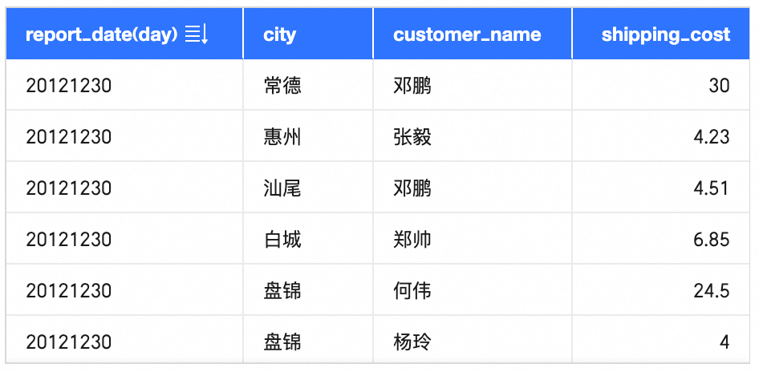

## Multidimensional tables

**A multidimensional table, also called a crosstab or pivot table,** represents **hierarchical data**. It adds relationships among fields to the detail-table structure. In the example, xxK values aggregate profit\_amt by province and year. This makes it well suited to analysis.

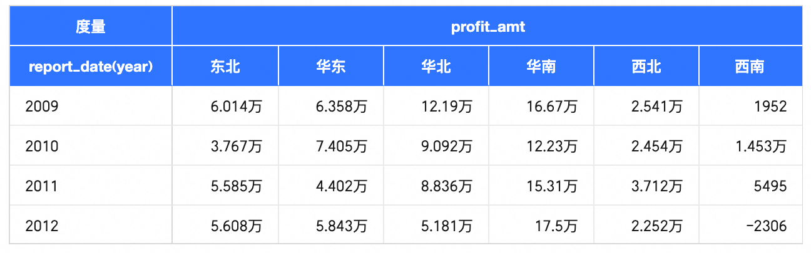

A detail table has a row or column header, and its records can still make sense without headers. Multidimensional values, however, lose their meaning when the row and column headers are removed.

Informally, one-dimensional tables show details, while multidimensional tables show aggregated statistics.

# Capabilities of a visual table

What capabilities should such a table provide?

## Data

Large datasets: render many rows and columns, including merged cells, and support formatting and aggregation.

Multiple types: display text, links, images, sparklines, and other content.

## Logic

Include complex data retrieval, rendering decisions, corrections, and transformations.

## Styling

Responsive design: adapt row heights and column widths and support desktop and mobile displays.

Properties: dimensions, border colors, fonts, text alignment, and backgrounds.

Granularity: cells, rows, columns, regions such as headers or merged cells, and the whole table.

## Interaction

Support horizontal and vertical scrolling, frozen rows and columns, selection highlighting, drag selection, arrow-key navigation, and copying content.

More complete tables also support conditional formatting, pagination, sorting, column reordering and resizing, hidden columns, field filtering, and grouped fields.

A visual table is therefore **heavy in data, logic, styling, and interaction**.

# Technical implementation

Given these requirements, which technology suits a table? Most implementations use DOM or Canvas. Which scenarios favor each?

First, compare choices made by BI products:

| **BI product** | **Canvas** | **DOM** |
| --- | --- | --- |
| Quick BI |  | ✓ |
| FBI |  | ✓ |
| Power BI |  | ✓ |
| Tableau |  | ✓ |
| Fine BI |  | ✓ |
| Guandata | | ✓ |
| Smart BI | ✓ |  |
| DataWind | ✓ |  |
| DeepInsight | ✓ |  |

Tables in other products:

| **Other product** | **Canvas** | **DOM** |
| --- | --- | --- |
| [Ant Design Table](https://ant-design.antgroup.com/components/table-cn) |  | ✓ |
| Tables in document tools such as DingTalk, Yuque, and Notion | | ✓ |
| [TanStack Table](https://github.com/TanStack/table)（Headless） |  | ✓ |
| [handsontable](https://github.com/handsontable/handsontable) |  | ✓ |
| [VTable](https://www.visactor.io/vtable/guide/introduction) | ✓ |  |
| [AntV S2](https://s2.antv.antgroup.com/) | ✓ |  |
| [DingTalk Excel](https://zhuanlan.zhihu.com/p/340423350) | ✓ | |

Neither approach dominates every scenario. Both have advantages and disadvantages.

## Dom

DOM builds table structures **declaratively** with HTML elements such as `<table>`, `<tr>`, and `<td>`. The browser handles layout and styling as nodes change.

**Advantages of DOM:**

1. **Reuse and accessibility:** DOM elements integrate easily with frontend frameworks and are straightforward to organize. Native browser selectors, debugging tools, and performance tools can inspect and manipulate them, making development easier.

2. **Development efficiency and interaction:** DOM provides rich elements, attributes, native behaviors, and event handling. CSS handles styling, layout, and responsiveness. Canvas is lower level, usually requiring more code and manual handling of events, layout, drawing state, and repainting.

3. **SEO:** standards-based DOM content can be crawled and indexed, although this is not a major concern for BI products.


## Canvas

Canvas tables draw every part **imperatively** through the canvas drawing API.

A simple Canvas table implementation:

[https://codesandbox.io/p/sandbox/mgphzh](https://codesandbox.io/p/sandbox/mgphzh)

At a higher abstraction level, API calls adjust the display by updating data, changing themes, selecting cells, and so on.

**Advantages of Canvas:**

1. **Performance with many rendered elements:** pixel-level rendering avoids maintaining a complex DOM tree. Tables require many elements and frequent operations, while the browser's DOM pipeline supports capabilities a table may not need. Rendering and layout can therefore be expensive in DOM tables.

2. **Graphical flexibility:** pixel-level control makes complex graphics easier to draw. DOM may require additional work, although embedded canvases or icons can cover many cases.

3. **Sharing:** Canvas output can easily become an image. DOM requires additional processing, such as html2canvas, to produce a portable format.


## Summary

Canvas is lower level and usually more complex to implement, but suits scenarios displaying many elements simultaneously.

DOM offers development and interaction advantages. Although its rendering pipeline has overhead, virtualization, caching, and algorithmic improvements can provide good performance at suitable display sizes.

| **Scenario** | **Performance** | **Graphical flexibility** | **Accessibility** | **Development efficiency** | **Interaction** |
| --- | --- | --- | --- | --- | --- |
| Canvas | ✓ | ✓ |  |  |  |
| Dom |  |  | ✓ | ✓ | ✓ |

**The best choice depends on the scenario.** Document tables often favor DOM because they need rich interactions without vast visible datasets. DingTalk Excel favors Canvas because many relatively simple cells must be rendered together.

# Table development in Quick BI

Quick BI table components currently use React DOM, excluding the Canvas-based spreadsheet module.

## Table types

### Detail table

A one-dimensional table showing detailed records.

### Crosstab

A multidimensional table and one of the most frequently used BI charts. Row-column intersections reveal complex field relationships and aggregated results.

### Trend analysis table

A multidimensional table showing metric trends and details at date-based granularity.

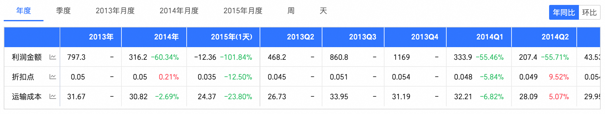

### Multidimensional analysis table

Extends trend tables with slices across several dimensions to show corresponding trends and details.

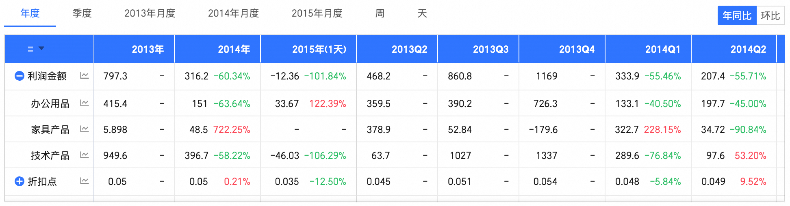

### Spreadsheet

WebExcel, built on the DingTalk Excel Canvas SDK, is outside this article's scope.

## Architecture

Quick BI tables use the internally developed **MatrixTable foundation**. Rankings, dataset tables, data inspection, and upload previews also use it. MatrixTable provides rendering, scrolling, and row/column capabilities. Each table type has separate desktop and mobile code because display and interaction differ, plus its own styling and logic. Shared constants and data-processing utilities support all types.

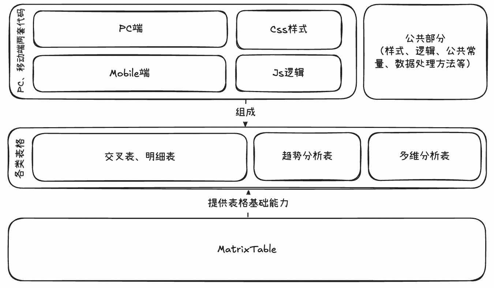

## Foundation capabilities

Some capabilities provided by MatrixTable:

### Nine-region layout and regional scrolling

We use **div elements to create nine regions**, rather than native HTML table layout. Regions are absolutely positioned and cells are relatively positioned, supporting frozen first/last rows and columns. Native scrolling alone does not suit every region—for example, top-header and main-content must scroll horizontally together—so we combine simulated and native scrolling.

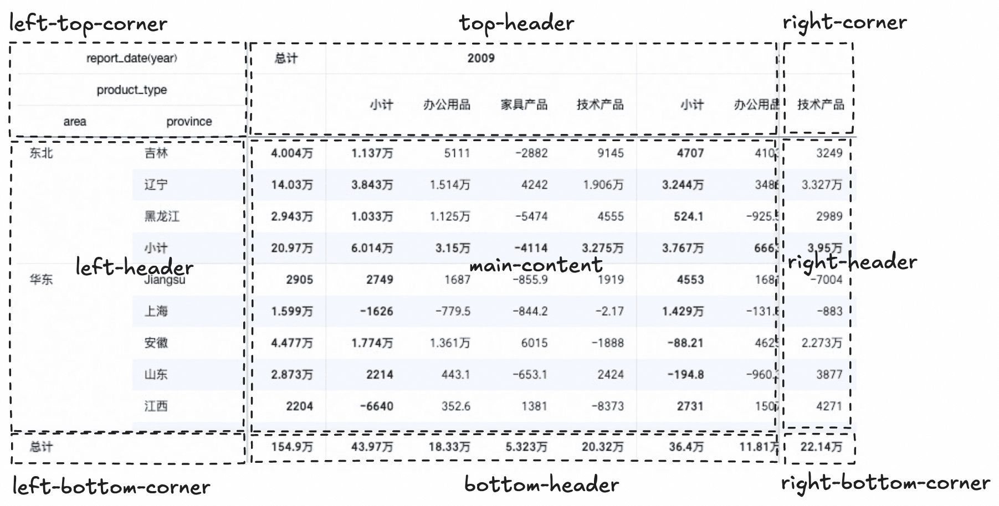

### Horizontal and vertical virtualization

High-performance DOM tables need virtualization to avoid rendering too many elements. **The rendered region follows the visible area and scroll position.** Overscan adds a buffer for sudden scrolling and prevents blank regions.

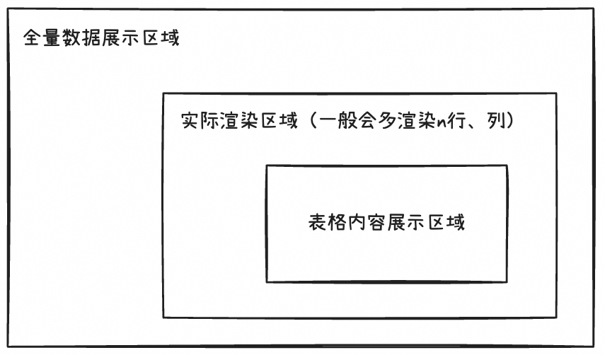

### Row-height and column-width calculation

Each layout update **calculates column widths before row heights**, using the dimensions of cell DOM content identified by row and column IDs. It must account for fixed dimensions, merged cells, expanded content, and the table container.

Calculations include **visible-column widths, visible-row heights, and merged-cell alignment**.

Column widths are **adjusted to the container width**; a wide container with few columns can distribute the available width among them.

```jsx
updateTableLayout() {
  if (this.state.renderStage === RenderStage.InitialStage) {
    // 计算列宽
    const newTableLayout = TableLayout.getViewTableColumnWidths(...);
    this.setStatÏe({
      tableLayout: newTableLayout,
      renderStage: newStage,
      ...
    });
  } else if (this.state.renderStage === RenderStage.ColumnCalculated) {
    // 计算行高
    const newTableLayout = TableLayout.getViewTableRowHeights(...);
    this.setState(
      {
        tableLayout: newTableLayout,
        // 标记渲染完成
        renderStage: RenderStage.FullFilled,
        ...
      }
    )
  }
}
```

Because measurements reflect currently rendered content, a newly virtualized row containing a wide cell can suddenly change column widths. We introduce a **hidden row** that predicts the widest cells and uses their content to establish widths.

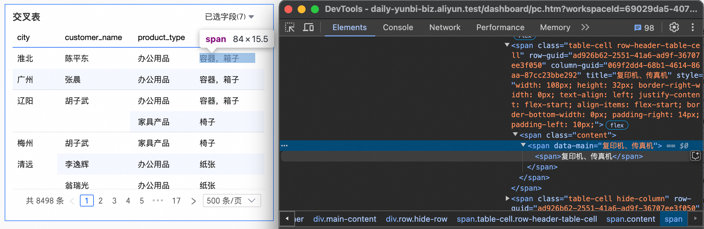

## Advanced features

Specific charts extend the foundation with more advanced table behavior.

### Display modes

**Behavior:** switch between **flat and tree** layouts.

**Implementation:** generate tree nodes and transform the data accordingly.

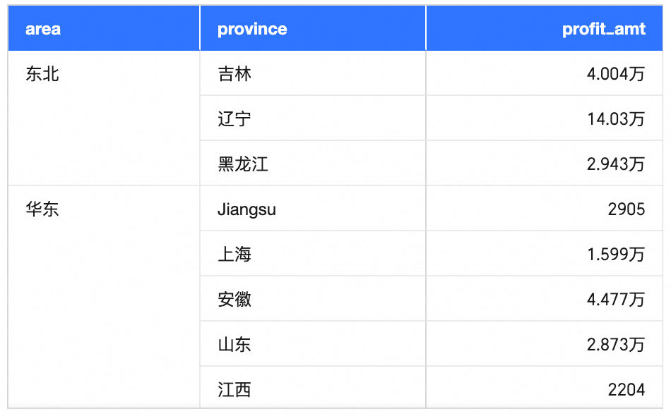

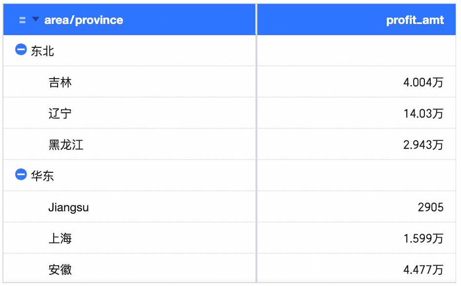

### Complex conditional formatting

**Behavior:** configure **text/background, icons, color scales, and data bars**. Compare against other fields, dynamic fields, percentages, or averages, and apply results to entire rows or columns.

**Implementation:** combine **custom rendering** with retrieval of the row/column values needed by the field and formatting rules.

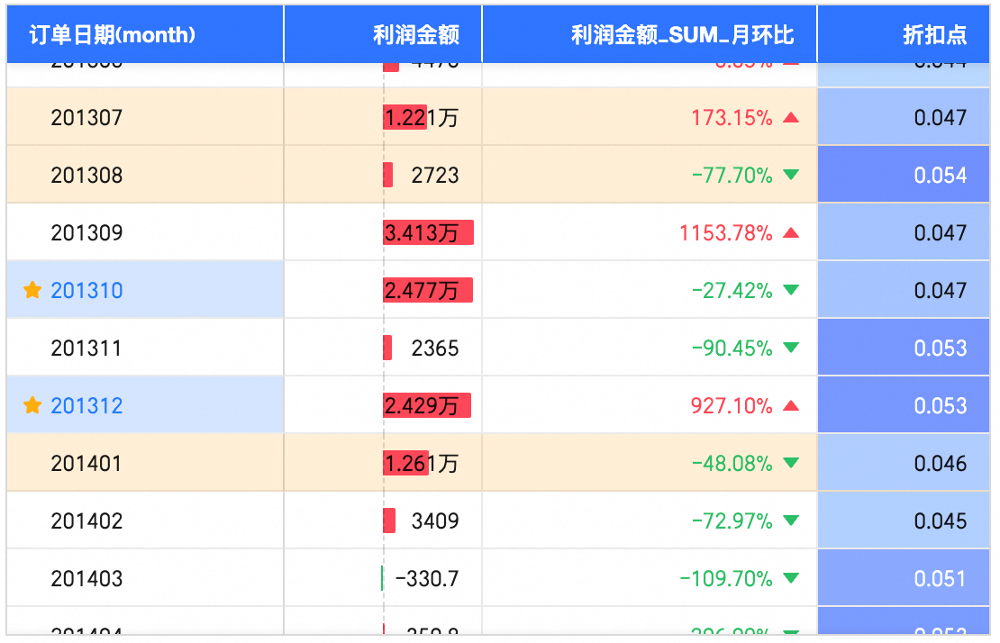

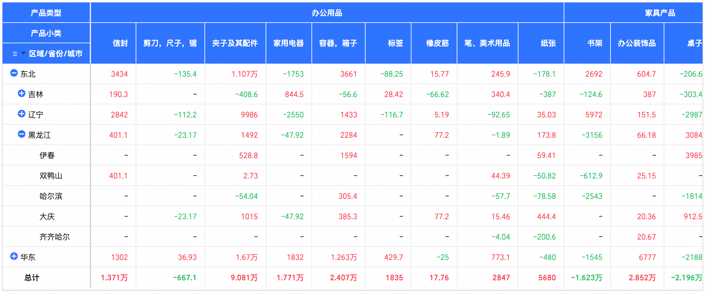

### Interactive analysis

**Behavior:** click text to **drill down, link charts, or navigate**.

**Implementation:** obtain cell or selection information from clicks or drag selections, then execute the configured analysis action.

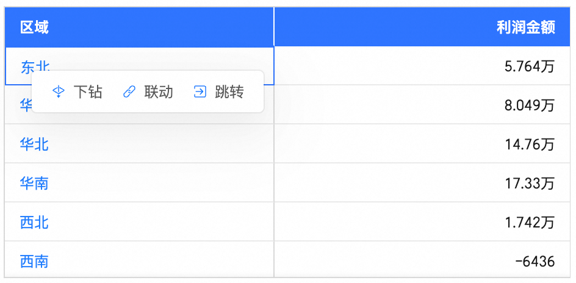

### Exporting chart data

**Behavior:** export table contents to **Excel, images, or PDF**.

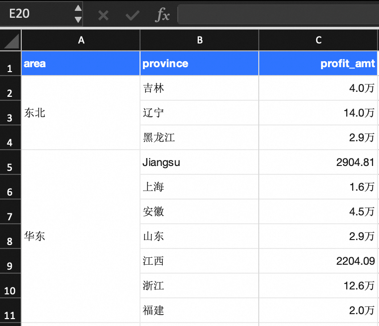

**Implementation:** Excel export follows Microsoft's [open-xml-sdk](https://learn.microsoft.com/en-us/office/open-xml/open-xml-sdk?view=openxml-3.0.1) specification. Images and PDFs are generated after processing the DOM with **html2canvas**.

### Incremental data retrieval

**Behavior:** multidimensional analysis tables support **initial and incremental fetching** when large datasets exceed retrieval limits.

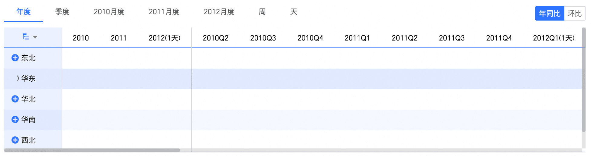

**Implementation:** fetch data from the dimensions, measures, and values of expanded tree nodes, then merge it with existing data.

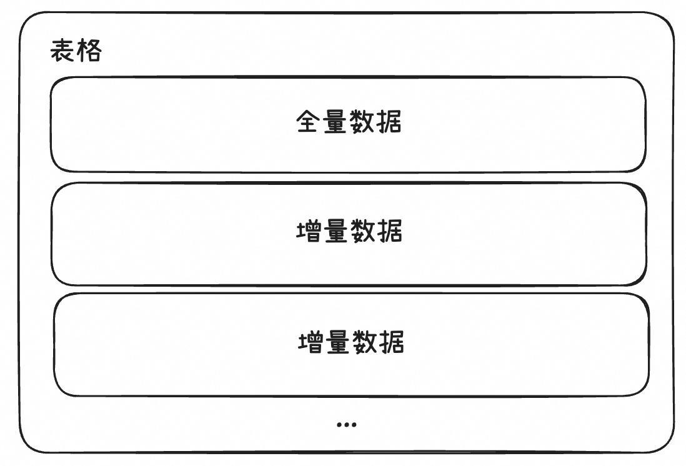

### Asynchronous data loading

**Behavior:** crosstabs and detail tables render image resources asynchronously.

**Implementation:** account for exporting, rendering updates, and request volume. The approximate flow is:

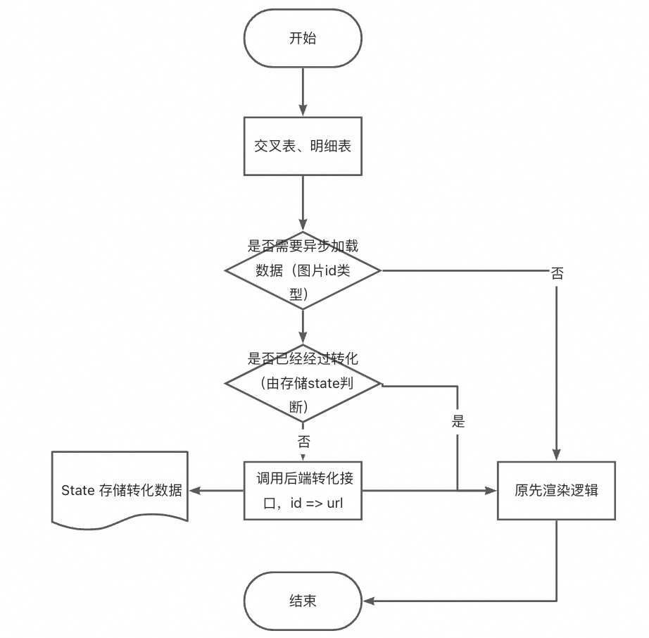

## Challenges and solutions

### Maintainability

Growing features and configuration options make maintainability increasingly difficult.

* **Code size:** the crosstab alone has more than 50 top-level configuration options, over 30,000 lines of code, and nearly 100 files.

* **Display and behavior diversity:** configuration combinations can produce tens of thousands of appearances. Cell rendering has complex nested conditions for headers, formatting, dimension/measure alignment, and other cases; styles are also extensive.


**Solutions:**

* Gradually separate code by feature and extract reusable parts.

* Refactor styles and unify portions of rendering.


### High testing costs

Complex DOM structures need broad coverage. A rendering change may affect many combinations, and edge cases are easy to miss. Drill-down, navigation, and linked analysis require interactions, which increase test execution costs.

**Solutions:**

* Create reports for quick regression testing across scenarios.

* Add screenshot comparison tests and E2E automation for interactive analysis.


### Performance

Tables support large-scale data analysis and inevitably face performance challenges.

* **Complex scenarios:** conditional formatting needs actual row/column data, and tree and flat modes have different requirements.

* **Data scale:** support rendering tens of thousands of rows and columns.

* **Varied algorithms:** DFS for tree processing, backtracking for parent data during incremental fetching, row/column construction, keyboard navigation, and merged-cell calculations.


At this scale, JavaScript logic needs careful attention to performance. Examples:

1. Data processing for 50,000 rows: replacing spread operations \[...arrs, arr\] with Array.prototype.push() or assignment reduced execution from 27.9s to 0.19s.

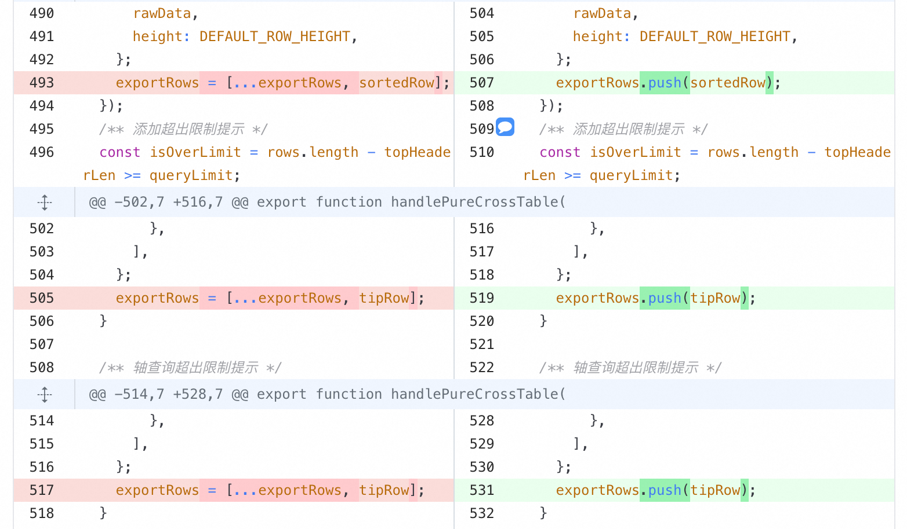

2. Tree construction for 50,000 rows and at most three levels: replacing recursion with iteration reduced execution from 3,000ms to 0.7ms.

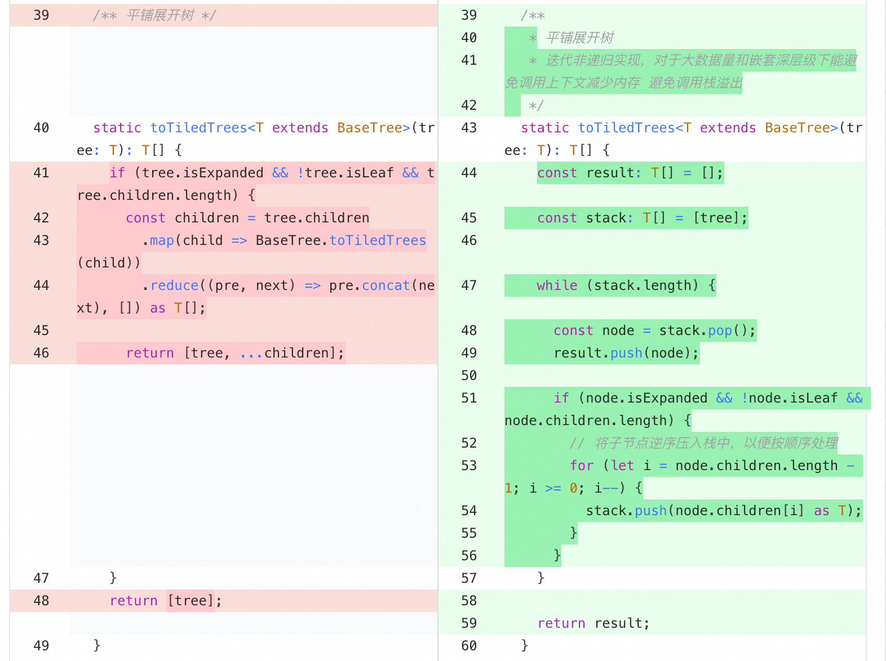

3. Map caching for 50,000 rows reduced execution from 38.195s to 0.055s.


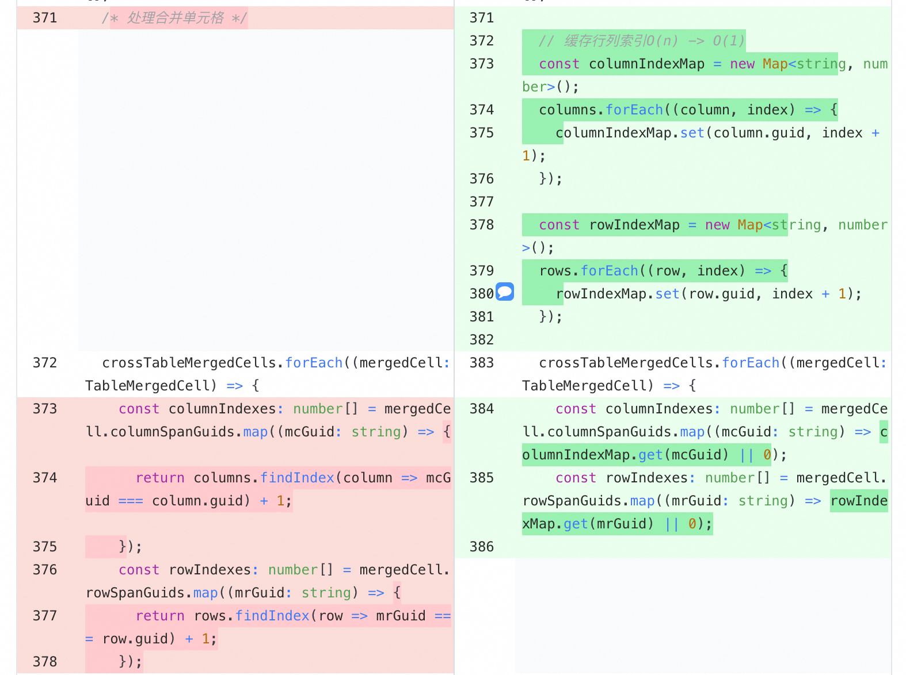

**Solution:**

Optimize continuously across scenarios: **reduce unnecessary reference-type copies, repeated computation, and rendering, and add caching where useful**.

## Remaining issues

Studying open-source table implementations and our current components reveals several areas to improve.

### Technology choice

The old Quick BI crosstab used Canvas. Display limitations and its partly external implementation helped motivate a move to DOM.

We will **retain DOM**. Most mainstream BI products and open-source tables use it, although some newer products choose Canvas.

Migrating to Canvas would have high cost and limited benefit: DOM has no major disadvantage in the required display behavior, and Canvas is less suitable in several respects.

### Problems and proposed solutions

| **Component** | **Problem** | **Approach** |
| --- | --- | --- |
| **Table foundation** | Frequent redundant cell rendering | Embed a cellRender function component and introduce fine-grained cell-render caching |
| | Basic foundation capabilities leave selection, copying, and hiding columns duplicated across table types | Add an advanced table layer with shared public capabilities and consider modular/plugin architecture |
| **Crosstab and detail table** | Class components with roughly 3,700 lines in the main file are difficult to maintain | 1. Extract lengthy logic into methods<br><br>2. Migrate handlers toward hooks and function components<br><br>3. Simplify buildTable<br><br>4. Separate and simplify rendering and nested conditions |
| | Missing TS definitions for core data such as row.rowConfig and column.config | Define each table's data types and override MatrixTable's base types |
| | Many state values are scattered across the code | Use useTableState hooks to manage updates in a unified data flow |
| **Trend and multidimensional analysis tables** | Complex dependencies make useEffect updates trigger nested state changes | Trigger updates through an explicit allowlist |

# Summary and outlook

Tables combine intensive data, logic, styling, and interaction. Their business context makes them complex, demanding disciplined development. I welcome discussion with others interested in table components.

> All table images were created with Quick BI. Their data is simulated and should not be treated as real reference values.
