# 复杂表格组件（React）的实现与思考

# 前言

从入职到现在做表格相关业务已经1年半了，写这篇文档的初衷一方面是对自己做的业务的梳理（同时给大家分享一些表格组件中的优秀设计），另一方面是分析表格组件现状同时汲取行内中优秀的表格组件设计来调整后续表格组件的发展方向。

在正文开始前，我认为先了解一下表格是很有必要的。

# 表格概述

表格是一种**整理信息或数据**的形式。基础表格一般由表头、行、列、单元格组成。

# 表格类型

首先我们梳理一下表格类型，我们将分成一维表格和多维表格：

## 一维表格

**一维表是明细表**，表中每一字段都是属性，每一行都是一条记录（如图每一行记录表示在具体时间具体地点的人花费了多少钱）。

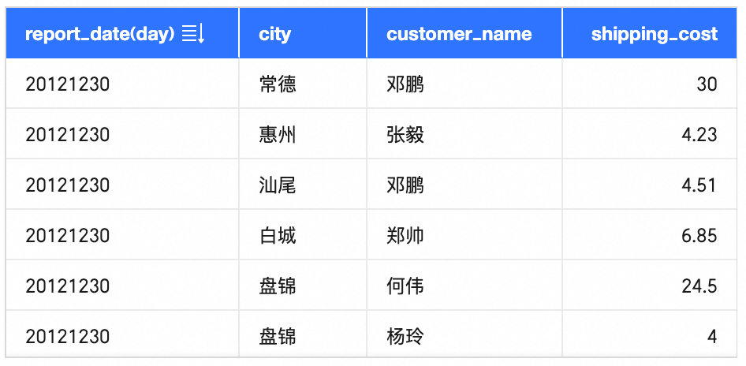

## 多维表格

**多维表格也称交叉表或者透视表**，用于表现有一定**层级结构的数据**。它在“一维表格”基础上增加了额外的字段关系（如下图，表格中xxK数据反应的是profit\_amt在某一省份和年的汇总聚合）。由此可见，多维表格非常善于用作数据分析。

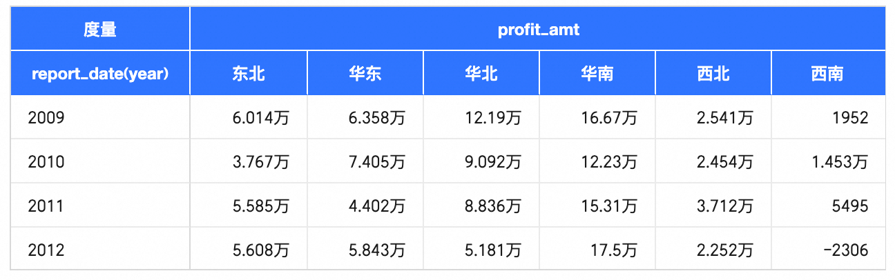

多维表和一维表的差别是：一维表仅存在行表头或列表头，因此移除表头看数据是有意义的，而当我们移除多维表表头看数据时会发现此时并没有意义。

我们通俗认为一维表是明细表，多维表是聚合（统计汇总）表。

# 可视化表格能力

在了解完表格后，那么一个可视化表格需要具备哪些能力呢？

## 数据

大数据：能够将海量行列和合并单元格数据渲染，支持各类数据处理如数据格式化、聚合计算等。

多类型：支持文本、链接、图片、迷你图等各类型数据在表格展示。

## 逻辑

内置较复杂的取数逻辑、渲染判断和数据订正和处理逻辑

## 样式

响应式设计：行高列宽自适应及支持PC/Mobile端展示

类型：包括宽高、边框线颜色、字体样式、文本对齐方式、背景颜色等。

粒度：单元格、行、列、区块（行/列表头区域、合并单元格）以及整体。

## 交互

支持横向纵向滚动、行列冻结、高亮选区、圈选、方向键切换选择单元格、内容复制等功能。

而一个更完善的表格在这些之外还有条件格式、分页、排序、列字段拖拽换位、列宽拖拽调整、列隐藏、字段筛选、字段分组展示等功能。

由以上可见，可视化表格是一个**重数据、逻辑、样式、交互**的组件。

# 表格的技术实现

在了解了一个可视化表格**重数据、样式、交互**的诉求后，什么样的技术实现适合表格？目前市面上的表格基本是DOM或者Canvas实现，那么什么场景下选择DOM还是Canvas更好呢？

先来看看各个BI产品是怎么选的：

| **BI 产品** | **Canvas** | **Dom** |
| --- | --- | --- |
| Quick BI |  | ✓ |
| FBI |  | ✓ |
| Power BI |  | ✓ |
| Tableau |  | ✓ |
| Fine BI |  | ✓ |
| 观远 |  | ✓ |
| Smart BI | ✓ |  |
| DataWind | ✓ |  |
| DeepInsight | ✓ |  |

其它产品表格：

| **其它产品** | **Canvas** | **Dom** |
| --- | --- | --- |
| [Ant Design Table](https://ant-design.antgroup.com/components/table-cn) |  | ✓ |
| 钉钉、语雀、Notion等文档工具中表格 |  | ✓ |
| [TanStack Table](https://github.com/TanStack/table)（Headless） |  | ✓ |
| [handsontable](https://github.com/handsontable/handsontable) |  | ✓ |
| [VTable](https://www.visactor.io/vtable/guide/introduction) | ✓ |  |
| [AntV S2](https://s2.antv.antgroup.com/) | ✓ |  |
| [钉钉Excel](https://zhuanlan.zhihu.com/p/340423350) | ✓ |  |

由此可见表格的技术选型比没有一边倒，Canvas和DOM各有利弊，下面来分析一下这两者的利弊：

## Dom

Dom采用HTML元素（如`<table>`、`<tr>`、`<td>`等）**声明式**地构建表格结构，依赖浏览器的渲染引擎根据DOM节点更新自动处理布局和样式。

**Dom优势：**

1.  **复用性、可访问性：**DOM元素结合前端框架**更易实现复用**以及组织和管理；DOM**天生支持可访问性**，能够直接被浏览器选择器、调试工具、performance**访问和操作**，对于开发者更友好且效率更高；
    
2.  **开发效率、交互性：** DOM本身提供了丰富的标签和属性，也提供了内置功能（如节点访问、属性）和事件处理（如点击），此外DOM元素可以方便地通过CSS控制样式、布局和响应式设计。Canvas 相比DOM更底层，因此Canvas在相同实现上代码通常更复杂，需要手动处理更多细节，例如事件、布局等，同时需要手动管理绘图状态和重绘逻辑。
    
3.  **SEO友好：** DOM符合Web标准并且DOM中的内容能够被搜索引擎抓取和索引（这对BI产品不是主要考虑）。
    

## Canvas

Canvas表格是使用canvas绘图API基于**命令式**绘制表格的每一个部分。

Canvas表格的简易实现：

[https://codesandbox.io/p/sandbox/mgphzh](https://codesandbox.io/p/sandbox/mgphzh)

在Canvas表格高度抽象后，最终会以各类API命令式地去调整表格呈现（如更新行列数据、更新主题、选中某单元格...）

**Canvas优势：**

1.  **高性能**：Canvas 在**大量元素渲染上性能**优于DOM实现（像素级渲染画布，无需维护复杂的DOM树），这是底层实现和浏览器决定的。表格组件在呈现上决定了一定会由较多元素组合且有较多对元素（DOM）的直接操作。**浏览器的DOM渲染管线复杂**，较多DOM 模型支持的能力，表格组件是用不到的。实际表格在渲染中浏览器渲染和重排的开销较大。
    
2.  **图形灵活性**：Canvas为像素级控制，能够直接**绘制复杂图形**，有更好的灵活性，相较于DOM在实现复杂时图形可能需要大量额外工作。（场景不多，Dom可基于内嵌Canvas、图标实现）
    
3.  **共享性**：Canvas**对外展示相对灵活**（如很容易转换为图像格式）。而DOM渲染环境受限，通常需要二次处理（如html2canvas）后转换为通用的格式。
    

## 总结

Canvas因为更底层，在整体实现上会比表格更加复杂，适用于大量元素需要同时展现的场景（性能更好）。

DOM在开发效率及交互上更占优势，由于浏览器DOM渲染复杂会有一定的性能问题，但在一定元素呈现量结合一些虚拟滚动、缓存、逻辑优化等性能优化手段也能够让DOM在性能上有良好体验。

| **场景** | **性能** | **图形灵活性** | **可访问性** | **开发效率** | **交互性** |
| --- | --- | --- | --- | --- | --- |
| Canvas | ✓ | ✓ |  |  |  |
| Dom |  |  | ✓ | ✓ | ✓ |

**技术选型并没有最佳的只有最合适的。**对于像在线文档表格这种有较多交互逻辑但是展示数据量要求不高的选择DOM实现是必然的，而像钉钉Excel这种注定会有大量单元格同时渲染且渲染内容相对简单的场景选择Canvas是必然的。

# Quick BI表格实践

目前Quick BI表格组件都是基于React Dom实现的（不包括基于Canvas实现的电子表格模块）。

## 表格类型

### 明细表

一维表，能够展示数据的明细。

### 交叉表

多维表，是BI中使用频率最高的图表之一，能够通过行列交叉组合清晰地展示复杂的字段关系，获得数据聚合结果。

### 趋势分析表

多维表，按日期粒度反映指标趋势和详情。

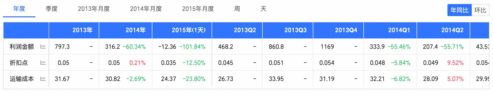

### 多维分析表

多维表，在趋势分析表基础上以多个维度对数据进行切片，反映各维度下的指标趋势和详情。

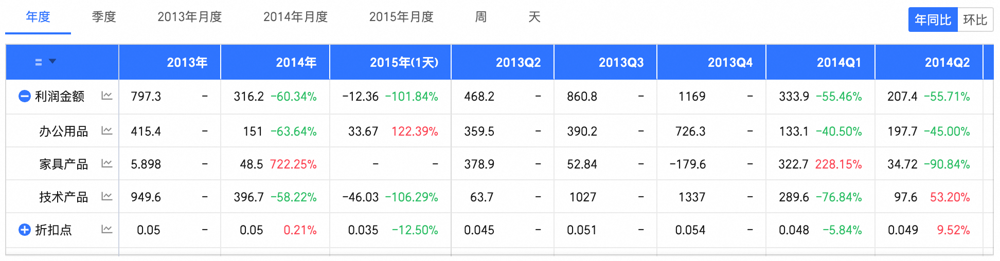

### 电子表格

WebExcel，基于钉钉Excel（Canvas）SDK能力研发，本文不作介绍。

## 表格架构

Quick BI的表格组件实现均**基于内部自研表格底座MatrixTable**，此外排行榜组件、数据集表格、查看数据、文件上传预览数据等业务场景也使用MatrixTable。在实际场景中，表格底座提供表格基础能力，如内容渲染、滚动、行列展示等，每种表格组件均存在PC、移动端两套代码（移动端的展示和交互逻辑区别于PC）以及自己的样式和逻辑代码。此外每种表格均依赖表格的公共代码（如一些公共常量、公共数据处理方法等）。

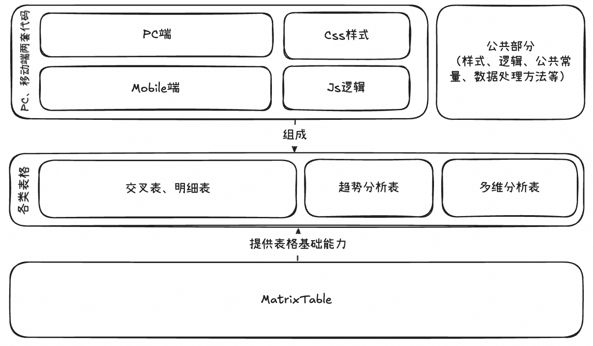

## 表格底座能力

下面来介绍一些MatrixTable提供的能力：

### 九宫格布局、区域滚动

区别于html原生table元素，我们自己使用**div元素实现了表格内部的九宫格布局**，九宫格布局下表格九个区块绝对定位，区块中的单元格相对定位，以此实现了首/末行冻结、首/末列冻结；而由于九宫格布局导致表格内容展示的分区，部分布局的原生滚动已不适用（如横向滚动时top-header和main-content需同步滚动），我们通过**JS模拟原生滚动和原生滚动**结合的方式来给用户带来更好的体验。

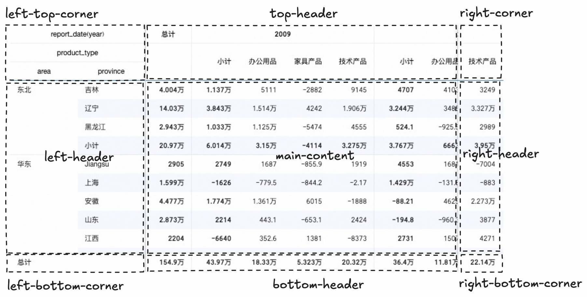

### 横向/纵向虚拟滚动

虚拟滚动是所有高性能DOM表格必备的功能，如果没有实现此在大量DOM元素同时渲染的场景下，表格必然会有卡顿。虚拟滚动的实现即**表格的实际渲染区和可视范围（结合横向纵向滚动）绑定**。实际渲染区域的多渲染是为了给突然的横向纵向滚动预留缓冲区，以防止组件的白屏。

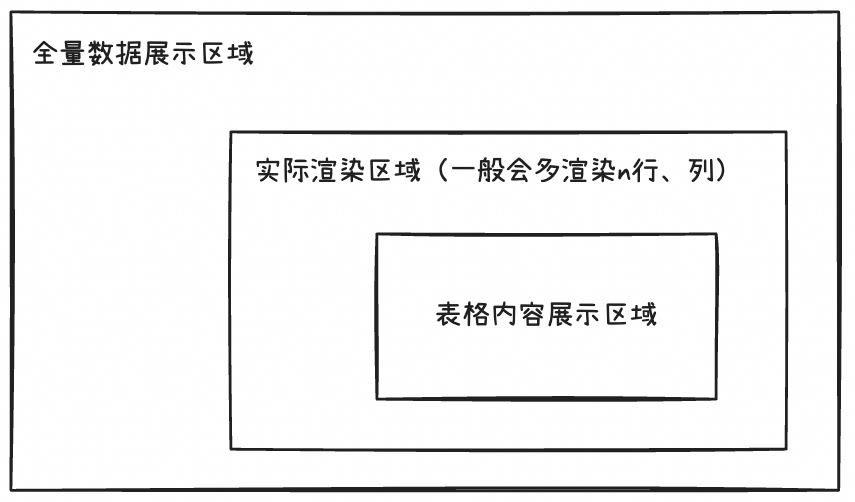

### 统高统宽算法

每次更新表格布局时，先**计算表格列宽再计算行高**。实现核心是根据行列ID获取其中具体单元格**DOM节点的内容宽高**再进行计算。需要考虑固定行高列宽、合并单元格、拓展内容、表格宽高等场景。

计算包括：**当前可视区域内列的宽度、可视区域内行的高度、合并单元格宽度对齐**。

计算后的列宽会**依据表格容器宽度动态调整**（若表格很宽但列数较少时会将表格宽度对列平分）。

```jsx
updateTableLayout() {
  if (this.state.renderStage === RenderStage.InitialStage) {
    // 计算列宽
    const newTableLayout = TableLayout.getViewTableColumnWidths(...);
    this.setStatÏe({
      tableLayout: newTableLayout,
      renderStage: newStage,
      ...
    });
  } else if (this.state.renderStage === RenderStage.ColumnCalculated) {
    // 计算行高
    const newTableLayout = TableLayout.getViewTableRowHeights(...);
    this.setState(
      {
        tableLayout: newTableLayout,
        // 标记渲染完成
        renderStage: RenderStage.FullFilled,
        ...
      }
    )
  }
}
```

由于计算的行高列宽均为当前可视区域内元素的宽高，实际在表格数据渲染时可能因为虚拟滚动新增的行某单元格特别宽导致列宽的突然变化，为此我们引入**隐藏行**的概念（构造隐藏行会“预测”表格数据中最宽单元格，用其数据内容撑开表格列宽）。

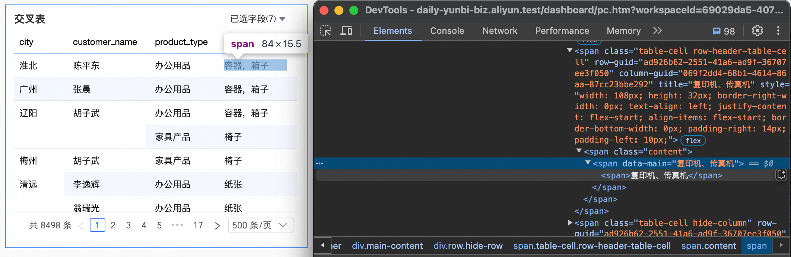

## 表格高级功能

在表格底座的基础上我们在特定图表拓展了表格高级功能。

### 展示形式

**表现：**支持**平铺、树形**两种展示形式的切换。

**实现：**涉及**树型节点数据生成、数据处理等**。

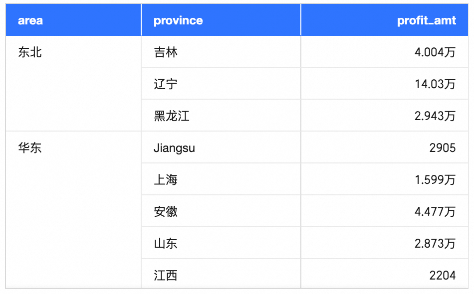

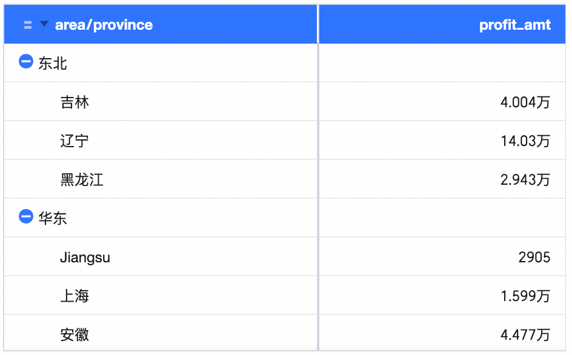

### 复杂条件格式

**表现：**支持配置**文本/背景、图标、色阶、数据条类型**的条件格式。支持依据其它字段、与动态字段对比、作用于整行/列、百分比对比、与均值对比等比较方法。

**实现：**组合**自定义渲染能力**以及能够根据字段和条件格式配置**获取需要比较的行列数据**。

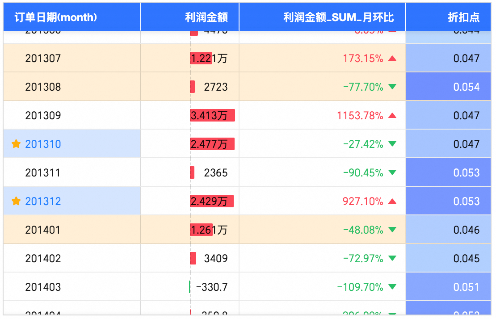

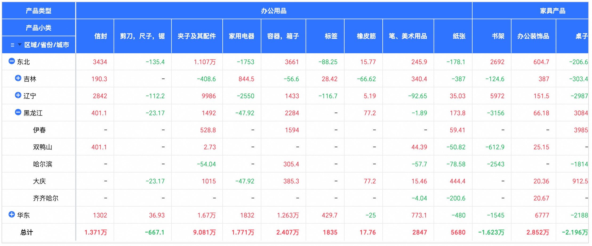

### 交互式分析

**表现：**支持点击文本进行**下钻、联动、跳转**等交互式分析操作。

**实现：**点击或圈选能够**获取单元格或选区内容信息**，根据交互式配置执行对应操作。

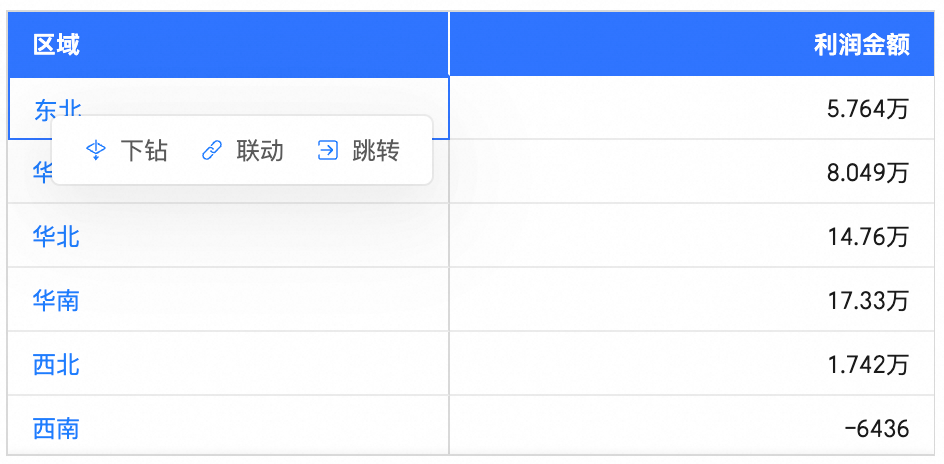

### 图表数据导出

**表现：**支持将表格内容数据导出为**Excel**（下图）**、图片、pdf**的形式。

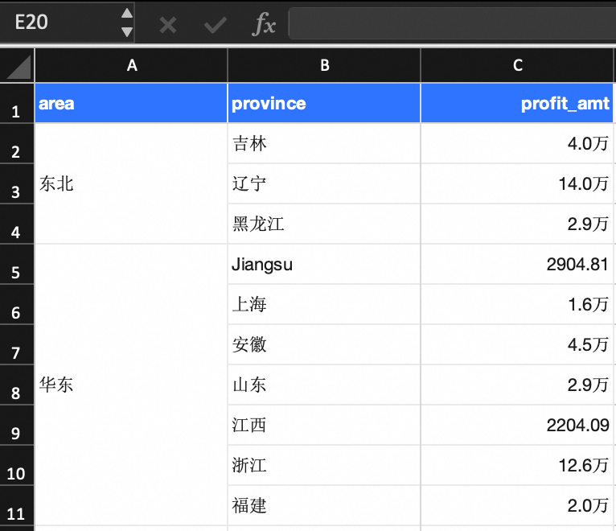

**实现：**其中Excel导出实现依据微软[open-xml-sdk](https://learn.microsoft.com/en-us/office/open-xml/open-xml-sdk?view=openxml-3.0.1)规范，图片、pdf在DOM元素上进行**html2canvas**处理后生成。

### 增量取数

**表现：**面向在大数据量展示下取数限制场景，多维分析表支持**全量+增量取数**。

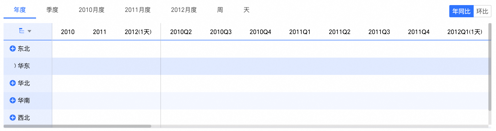

**实现：**依据树型展开节点对应维度、度量以及值进行取数和原有数据拼接。

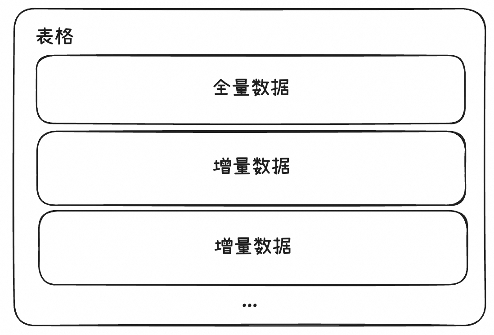

### 异步数据加载

**表现：**交叉表、明细表组件支持异步图片资源渲染，

**实现：**需要考虑导出、渲染更新、请求量等场景，大致流程图：

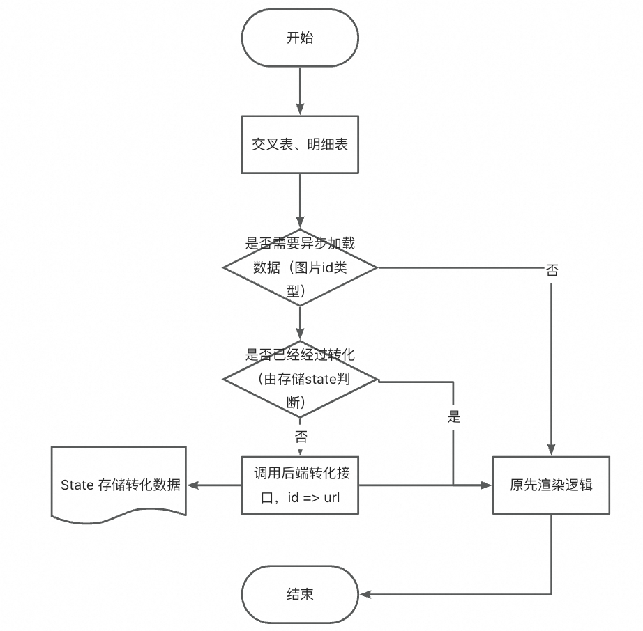

## 遇到的挑战与解决方案

### 可维护性

表格的功能和配置项日益增长一直对表格可维护性带来巨大挑战。

*   **代码量多：**据统计，仅交叉表组件的一级配置项超过50个，单组件总代码量超过 3w 行，文件数接近 100 个。
    
*   **展示形式、功能多样：**在表现上，表格在配置条件组合下能配出上万种不同的表现形式，因此表格在单元格渲染呈现上有较复杂的if嵌套判断（如表头行应该怎么渲染、数据行应该进行数据格式化、维度度量字段的文本对齐方式不同等等），且整体样式文件复杂。
    

**解决方案：**

*   在目前功能迭代下，我们逐渐对代码进行了功能细分，将部分可以公共的代码进行了抽离。
    
*   对表格样式文件进行了重构，对render方法进行了部分统一。
    

### 测试成本高

复杂的DOM结构需要进行全面的测试，表格样式展示的多样式导致一处内容渲染的调整需要考虑各种组合情况，比较容易出现某些场景漏覆盖的问题。一些交互式场景如下钻、跳转、联动，需要点击等交互式操作触发，表格中交互式场景很多，测试执行成本较高。

**解决方案：**

*   搭建各场景报表用于各场景测试的快速回归。
    
*   搭建了表格展示的截图对比测试以及E2E的交互式分析自动化测试。
    

### 性能

表格展示建立在大数据分析场景上，必然会遇到性能问题。

*   **场景复杂：**有复杂条件格式（需要拿到为实际渲染的某行/列数据）、树型平铺两种展示方式等场景
    
*   **数据量级：**表格在数据承载上需要支持上万行列数据渲染
    
*   **算法多样化：**内部数据代码中运用了各类算法（如树型数据处理时的DFS，增量取数获取点击节点父级信息的回溯、行列数据构造算法、方向键选中单元格位置计算算法、合并单元格计算算法等）
    

因为数据量级的原因各类JS逻辑在编写需要非常注重性能问题。举几个🌰：

1.  数据处理（5w行数据量），由拓展运算符\[...arrs, arr\]改为Array.prototype.push()或赋值形式，执行时间27.9s -> 0.19s
    
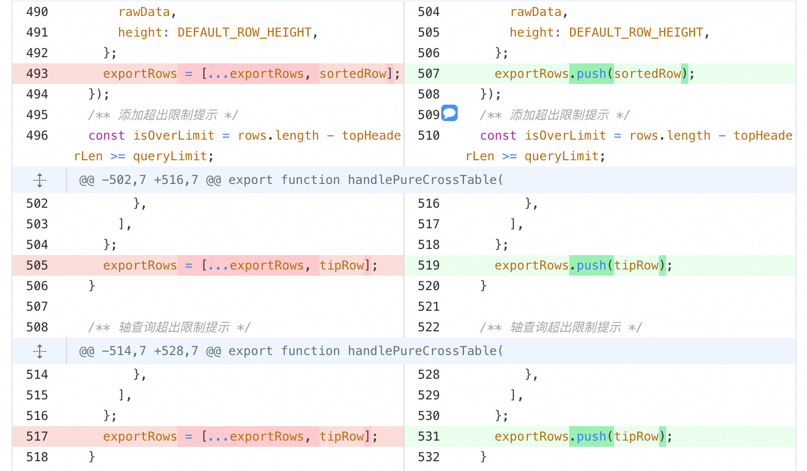
    
2.  树形的构造方法（5w行数据，最大3层），由递归改为迭代，执行时间3000ms -> 0.7ms
    
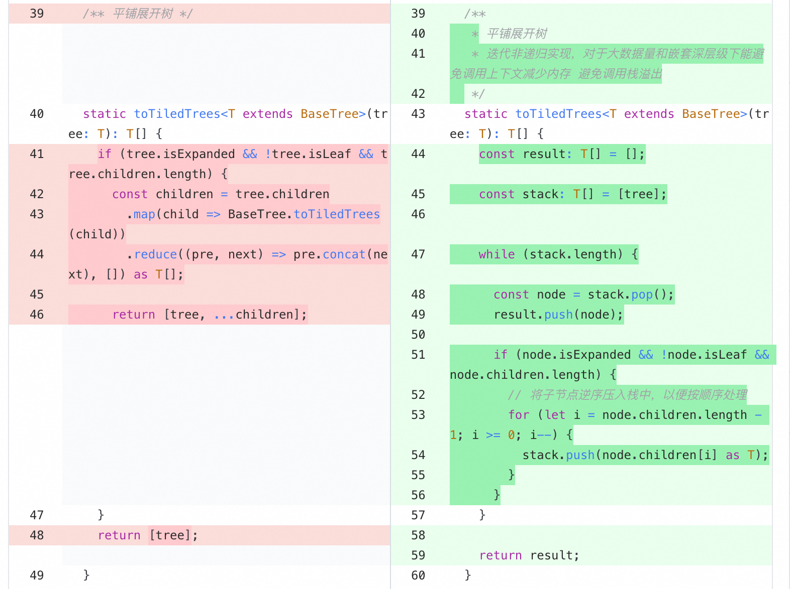
    
3.  Map缓存（5w行数据），执行时间38.195s -> 0.055s。
    

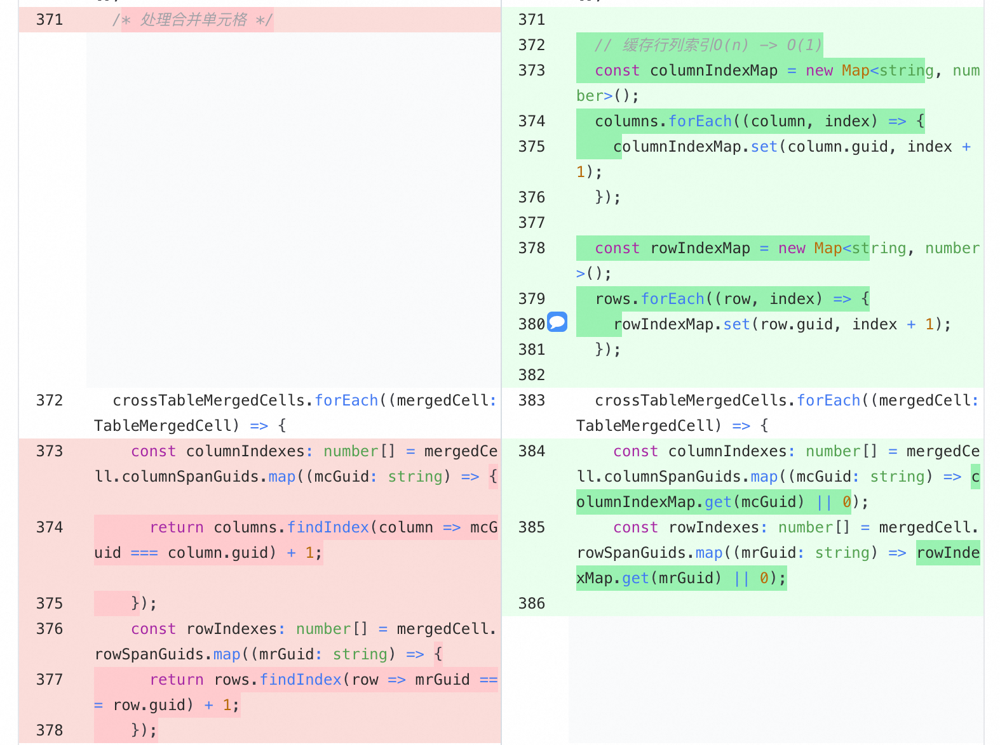

**解决方案：**

编码上注重性能，并在各类场景下持续优化性能（具体的思路包括：**减少不必要的引用类型拷贝、减少不必要的重复计算的成本、减少不必要的渲染、增加缓存等**）。

## 现存问题

看了比较多开源表格组件的源码，结合表格实际现状，可以发现目前表格组件的几个问题：

### 技术实现

QuickBI老交叉表是基于Canvas实现的，在实现表现效果不佳（原先非完全自研）等考量下我们转变为DOM。

表格技术实现上**维持DOM**。目前主流BI产品和开源表格在实现上大多采用DOM，一些新兴表格产品在实现上选择了Canvas。

整体上看迁移Canvas成本高收益少（DOM在表格组件效果呈现上并没有很大的劣势，Canvas在表现上也有很多不如DOM地方）。

### 问题和方案

| **表格** | **问题** | **方案** |
| --- | --- | --- |
| **表格底座** | 表格底座渲染单元格时存在较频繁的重复渲染 | 封装cellRender function组件内嵌表格底座并设计细粒度的单元格缓存渲染机制 |
|  | 表格底座能力很基础，而交叉表、明细表、趋势分析表、多维分析表在表格各自组件下实现了一些同样的功能（如圈选、数据复制、隐藏列等） | 考虑在表格底座和各组件之间封装一个进阶表格组件来提供一些表格的公共开放能力，并考虑模块化和插件化架构 |
| **交叉表、明细表** | 交叉表、明细表为Class组件，主文件代码行数在3700左右，整体不够简洁 | 1.  持续分离表格代码，抽离一些冗长逻辑为方法<br>    <br>2.  将表格handler文件向hooks转换，逐步向Function组件靠拢<br>    <br>3.  核心方法buildTable逻辑冗长需要梳理和简化<br>    <br>4.  render逻辑分离且if嵌套需要梳理和简化 |
|  | 开发体验上部分表格核心数据类型缺少TS定义（如row.rowConfig和column.config） | 各类表格自行定义数据类型并对MatrixTable原生类型覆盖 |
|  | state状态很多且游离各处 | 参考传统数据流方案，使用useTableState hooks统一管理更新状态 |
| **趋势分析表、多维分析表** | 由于内部状态依赖复杂，useEffect的依赖自动更新机制较容易导致状态嵌套更新 | 调整为白名单形式触发更新 |

# 总结和展望

表格组件是重数据、逻辑、样式、交互的组件，在其业务背景和使用场景下决定了他的复杂度，因此在组件编写上对开发者和规范性要求较高，如果大家有对表格感兴趣的可以一起探讨一下。

> 注：文中所有表格图片均为Quick BI表格创建，其中的数据为模拟值不具备实际参考意义
