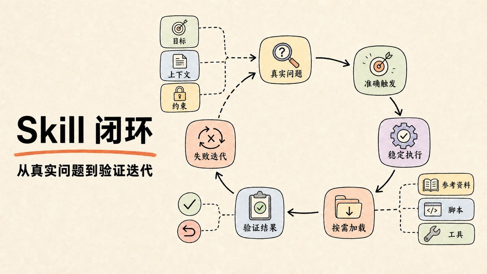
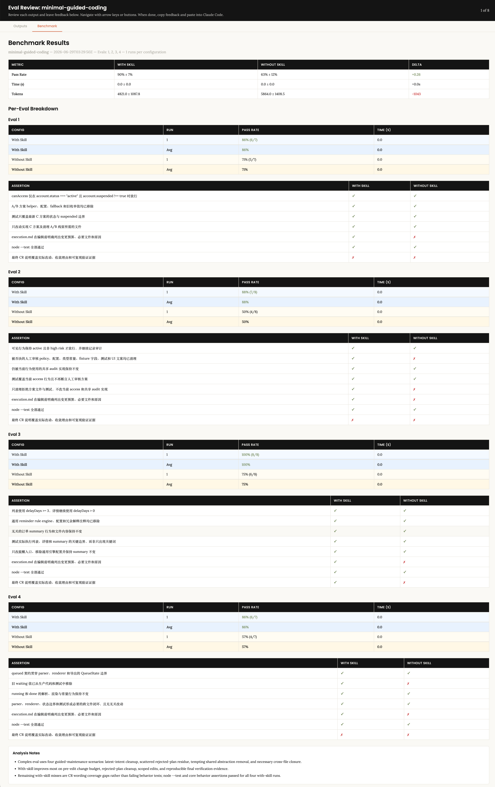
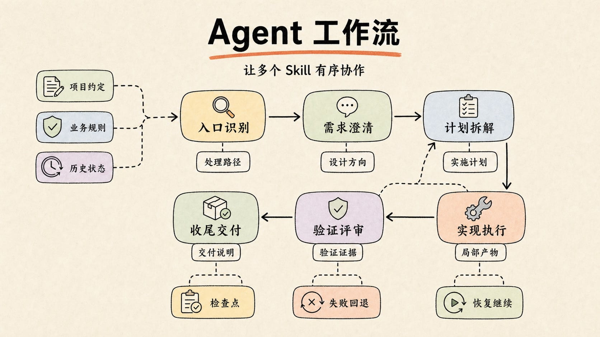

# Writing a High-Quality SKILL.md: From One Skill to an Agent Workflow

Turning everyday workflows into Skills usually presents two kinds of problems.

The first is not knowing where to start. Research, requirement clarification, execution order, and verification may already be stable in daily collaboration. Writing them into `SKILL.md` raises new questions: what belongs in it, how detailed the process should be, how to organize rules and examples, and what should move into external resources.

The second is inconsistent results after a Skill is written. It may trigger successfully without improving execution: critical steps are still missed, scope drifts, and results remain no more reliable than an ordinary prompt. The Skill has become a longer explanation rather than a reusable, verifiable method.

A Skill should address both problems by **turning stable, reusable, easily overlooked steps into a workflow that can be triggered, executed, and verified**.

I wrote a Skill for a recurring situation in my work: (https://github.com/Whiskeyi/minimal-guided-coding). It addresses leftover implementations polluting diffs and expanding scope across multiple conversation turns.

This article organizes those practical lessons, starting with individual Skills and then showing how to combine them into agent workflows.

## Where Skills fit in an agent

```text
Agent ≈ Model + Harness + Tools + Context/Memory + Skills
```

The Model reasons, the Harness orchestrates, Tools interact with external environments, and Context/Memory manages information. **Skills provide reusable procedures, rules, and resources for particular tasks.** Both long-running tasks and Loop Engineering ask how stable methods can be extracted from one-off conversations; Skills are a concrete vehicle for that knowledge.

## Clarify three things before writing a Skill

### Which scenarios suit a Skill?

Good candidates **recur often, follow stable processes, and are prone to missed critical steps**.

How Skills differ from related concepts:

| | Skill | Prompt | Knowledge base | MCP |
| :--------- | :---------------------- | :------------------- | :--------------- | :------------------- |
| Nature | Reusable execution method | Goals and constraints for the current task | Searchable facts and references | Interface to external capabilities |
| Question answered | How should this kind of task normally be done? | What should be done this time? | What information can be referenced? | Which capabilities can be called? |
| Example | Standard workflow for generating a PDF | Generate a project weekly report | Company API documentation | DingTalk, Notion, browser |

### Understand triggering, loading, and execution

Implementations vary across platforms, but Skills typically pass through three stages:

1. **Decide from metadata whether to trigger.** The runtime examines `name` and `description` rather than loading every Skill's full body into context.
2. **Load the rules.** After selection, read the procedures and constraints in `SKILL.md`.
3. **Load resources on demand.** Follow references to `scripts/`, `references/`, or `assets/` only when the current task needs them.

This makes `name` and `description` important:

Keep `name` short, clear, and searchable, usually using lowercase letters, digits, and hyphens.

`description` is a trigger, not a general introduction. Explain when to use the Skill, covering real trigger phrases, synonyms, tool names, and file types. Do not put the entire workflow there. Include a few negative examples for adjacent scenarios likely to cause false triggering.

Weak description:

```yaml
description: Helps create list pages.
```

Better description:

```yaml
description: Use when creating or imitating React + Antd backend list, query, management, or report pages with filters, tables, and pagination. Do not use for detail pages, form-only pages, dashboards, or isolated style changes to existing components.
```

The first describes functionality; the second specifies page types, typical structures, and confusing exclusions. These expressions should come from real user inputs rather than the author's assumptions.

### Define the problem it should solve

Before writing, ask what concrete problem the Skill solves.

It should explain at least three things:

- **Purpose:** what the AI should accomplish.
- **Trigger scenario:** when the user should use it.
- **Success criteria:** what a good result looks like.

A development-productivity Skill usually captures the execution path of a frequent task.

For an admin list page, the agent must coordinate filters, table columns, pagination, API transformations, and status displays. Re-explaining these rules turns a repeated task into repeated communication.

Make the Skill problem-driven: capture a reusable execution path around a real, frequent, error-prone task.

## Writing one Skill: establish the skeleton, then add boundaries, verification, and engineering support



A useful Skill need not cover everything initially. Start with a minimal skeleton defining when to use it, the action order, available resources, and completion criteria. Add details based on actual failures.

### A minimal usable SKILL.md

The goal is to turn experience into a reusable execution process for the next task.

Start with goals, trigger scenarios, the main workflow, resource routing, safety boundaries, and verification.

The following is a minimal `SKILL.md` skeleton. Begin here, then decide whether task complexity warrants separate `references/`, `scripts/`, or `assets/`:

```markdown
---
name: skill-name
description: Use when [actual triggering scenarios, common phrasing, and necessary context]. Do not use when [the most easily confused adjacent scenarios, and the Skill or approach to use instead]
---

# Skill Name

## Overview
State the problem this Skill solves and its core principle. Describe the default goal and completion criteria in one or two sentences.

## Scope
- After triggering, confirm here that the task still falls within this Skill's scope.
- For an adjacent scenario, identify the alternative Skill, tool, or direct handling approach.

## Workflow
1. Confirm inputs, goals, and constraints.
2. Follow the main workflow, stating the output or decision condition for each step.
3. When information is insufficient, proceed conservatively or ask the user; do not guess critical facts.
4. Move to Verification after execution.

## Resource Routing
- When [condition A] occurs, read `references/a.md`.
- When [task B] requires deterministic handling, run `scripts/b`.
- Load no extra resources by default; load them only when their conditions apply.

## Safety Boundaries
- Specify which scopes may be modified or affected.
- Identify files, data, and remote resources that are read-only or off-limits.
- Before operations with side effects such as deletion, publication, authorization, overwriting, or bulk changes, check the current state or confirm the risk.

## Verification
- Specify the commands, checks, or examples used to verify the result.
- If verification is impossible, explain the missing conditions and completed checks.
- Support the completion claim with evidence rather than merely saying it is done.
```

Keep the body simple enough for the agent to grasp the main path before getting lost in detail.

### Progressive loading: keep the main path in the body and load references when needed

Progressive loading keeps the main workflow clear: what to do by default, when to read extra material, and how to return to the main task afterward.

A common directory structure looks like this:

```text
my-skill/
  SKILL.md
  scripts/
  references/
  assets/
```

Separate responsibilities clearly:

- `SKILL.md`: core workflow, decision rules, resource entry points, and self-check criteria.
- `scripts/`: repeatable procedures that need deterministic execution.
- `references/`: APIs, business rules, field specifications, and longer examples.
- `assets/`: templates, sample projects, images, fonts, and other materials.

`SKILL.md` should establish the problem, default approach, common omissions, and conditions for reading extra resources. Long API documents, complete tutorials for multiple frameworks, excessive examples, and human-only background belong elsewhere.

Keep references flat. Important `references/` files should be linked directly from `SKILL.md` with explicit reading conditions. Avoid deep chains such as `SKILL.md -> references/a.md -> references/b.md`, or Skills that require reading each other first. References should hold information rather than direct increasingly complex workflows.

```markdown
## Resource Routing
- When the user provides a reference screenshot, read references/screenshot-parsing.md.
- When date-type fields are involved, read references/date-field-spec.md.
- The default workflow does not require extra resources from references/.
```

Without progressive loading, three problems commonly appear:

1. **Context growth:** putting APIs, long examples, and business rules into `SKILL.md` consumes context before execution and makes the main workflow easier to miss.
2. **Invisible resources:** key rules in `references/` may go unread if `SKILL.md` does not explain when to load them.
3. **Lost execution path:** nested or circular references can trap the agent in reading rather than producing the actual result.

### Writing instructions: action, reason, and boundary

Clear logic does not require every instruction to be a rigid command.

A good instruction usually has three parts:

```text
Action + Reason + Boundary
```

Weaker wording:

```markdown
Read every file before modifying code.
```

Better wording:

```markdown
Before editing, read relevant entry points, callers, and existing tests to understand project conventions and avoid changes that work locally but break overall compatibility. Unrelated directories do not require exhaustive scanning.
```

The latter explains the reason and the boundary, helping the AI generalize to new situations.

### Detail depends on task stability

**Core principle:** there is no universal level of detail. It depends on stability, error risk, and how much contextual judgment the executor needs.

**Decision criteria:**

| Scenario | Suggested wording | Reason |
| :----------------------------------------- | :--------------------------- | :-------------------------- |
| One correct result, such as a fixed format or protocol | State the format, steps, and checks explicitly | Reduce unnecessary improvisation |
| Several reasonable implementations, such as UI interaction or code organization | State goals, constraints, and success criteria | Allow contextual judgment |
| Stable workflow with changing implementation details, such as releases | Fix the workflow skeleton and derive details from the environment | Avoid missing critical steps |

### Safety boundaries: specify prohibited side effects

**Core principle:** describe both required actions and limits. Otherwise, achieving the goal may cause unexpected side effects.

AI searches for ways to complete a goal. Without boundaries, it might:

- Delete or rewrite unrelated files to fix a problem.
- Install dependencies and change lockfiles to complete setup.
- Start services or call external APIs to verify a result.
- Refactor out-of-scope code to unify style.

Example: a Skill for bulk replacement of internationalization message keys.

```markdown
## Goal
Replace hardcoded Chinese UI strings in the specified directory with existing i18n key references.

## Safety Constraints
- Modify only business code files within the specified scope.
- Locale resource files are read-only: do not add, delete, or change keys or translations.
- Replace only strings that clearly match an existing key.
- If the corresponding key is uncertain, add a TODO comment rather than guessing.
```

Without such constraints, it might add keys to locale files, change translations, or guess message keys.

Safety boundaries should constrain side effects such as unrelated edits, external requests, or guessed sensitive information. If the problem is output shape or inconsistent step order, use positive structure instead: define the artifact's sections, order, and acceptance criteria. Prohibitions set boundaries; templates and workflows shape the result.

### Evals: test triggering and effectiveness separately

After writing the Skill, evaluate two questions rather than only judging the document:

1. Does it trigger correctly for real tasks?
2. Does it improve execution after triggering?

These require separate evaluations. Trigger tests examine `name` and `description`; effectiveness tests examine the `SKILL.md` body.

**Trigger tests: can `name` and `description` select the Skill?**

Test metadata with realistic user inputs, without naming the Skill or telling the agent to use it. Observe whether the runtime loads it proactively.

Include at least two kinds of cases:

| Case type | Goal | Example |
| -------- | -------- | ---- |
| should-trigger | The task clearly belongs to the Skill without naming it | “Recreate this management page from the screenshot, including filters and pagination” |
| should-not-trigger | Similar wording, but the task is outside scope | “Adjust the button style on the detail page” |

If should-trigger cases fail, check whether metadata misses real user expressions. False positives in should-not-trigger cases indicate overly broad scope and a need for exclusions.

**Effectiveness tests: does loading the Skill improve the result?**

Run the same real tasks in a baseline without the Skill and an experimental group with it. Keep inputs, constraints, and expected artifacts consistent.

Cover these three categories:

| Case type | Goal | Example |
| -------- | -------- | ---- |
| Core task | Verify reliable completion of the main scenario | “Build an admin query page based on this reference” |
| Boundary task | Verify sensible clarification or conservative handling of incomplete information | “Build a list page; choose the fields yourself” |
| Regression task | Verify that an earlier failure does not recur | A real baseline input that previously missed verification |

Record observable differences rather than simply “expected” or “unexpected”:

- Were fewer steps omitted?
- Did the result follow project conventions better?
- Were the right resources loaded under the right conditions?
- Were verification results and completion evidence provided?
- Did user corrections and rework decrease?

When triggering works but results do not improve, the problem is usually in the workflow, resource routing, boundaries, or verification criteria rather than `description`.

Judge whether comparable tasks become more stable, better verified, and less prone to rework, rather than how complete the document looks.

### Running Evals and reviewing artifacts

`skill-creator` separates effectiveness evaluation from trigger evaluation; run them independently.

**1. Effectiveness evaluation**

Start with two or three real tasks in `evals/evals.json`. Run each case:

- `with_skill`: load the current Skill.
- `without_skill`: do not load it.
- When improving an existing Skill, use the previous version as a baseline.

Keep inputs, models, and tool permissions identical. Save actual outputs, `timing.json`, and `grading.json`; grades must include pass/fail decisions and supporting evidence.

Aggregate the results:

```
python -m scripts.aggregate_benchmark <iteration-dir> \
  --skill-name <skill-name>
```

This command generates `benchmark.json` and `benchmark.md`.

**2. Generate a review page**

```
python eval-viewer/generate_review.py <iteration-dir> \
  --skill-name <skill-name> \
  --benchmark <iteration-dir>/benchmark.json \
  --static <iteration-dir>/eval-review.html
```

`eval-review.html` includes:

- **Outputs:** compare baseline and with-skill outputs and grades.
- **Benchmark:** show differences in pass rates, duration, and token usage.

**3. Iterate based on results**

Submit review feedback to generate `feedback.json`. Modify the Skill using outputs, grades, and feedback, then create and run the next iteration. Add newly discovered failures to regression cases until results stabilize and feedback converges.

**4. Trigger evaluation**

Once effectiveness is stable, prepare real should-trigger and should-not-trigger inputs and optimize `description` with the following script:

```
python -m scripts.run_loop \
  --eval-set <trigger-evals.json> \
  --skill-path <skill-path> \
  --model <model-id> \
  --max-iterations 5 \
  --verbose
```

The script produces trigger-test reports and `best_description`. After updating `SKILL.md`, rerun effectiveness evaluation to check for regressions.

The image shows a benchmark of my `minimal-guided-coding` Skill. Pass rate increased from 63% to 90%, while token usage fell from approximately 5,864 to 4,821, a reduction of about 1,043. With Skill outperformed Without Skill in all four Evals, particularly Evals 2 and 4. The main improvement was more reliable execution in complex maintenance tasks. Remaining failures mostly involved peripheral items such as change-review wording, while core behavior and assertions passed.



Final artifacts include test cases, actual outputs, grading evidence, benchmarks, an HTML review page, and feedback files. These guide the next improvement and release decision.

### Design a loop to optimize your Skill

Evals can support an optimization loop rather than one-time acceptance. Compare each change against the same criteria: define the objective, run tests, analyze failures, modify the Skill, rerun evaluation, then keep or revert the change based on evidence. This is not unlimited rewriting.

An executable optimization loop can look like this:

```text
Define goals and acceptance criteria -> Run Eval -> Analyze failures -> Modify Skill -> Reevaluate -> Compare with previous version -> Keep or roll back
```

Specify three constraints before starting:

- **Optimization objective:** triggering accuracy, execution quality, verification completeness, or token/time cost.
- **Acceptance criteria:** target trigger rates, no false triggering on negative cases, improved effectiveness, and no decline in critical regressions.
- **Iteration boundaries:** maximum iterations, stopping conditions, and when to retain the previous stable version.

Address one principal failure mode per iteration. For trigger issues, change `name` and `description`; for execution issues, change the workflow, resource routing, boundaries, or verification. Add regression cases for repeated historical failures. Rerun the same Evals and compare benchmarks, feedback, and actual outputs. Keep changes only when target metrics improve, core cases remain stable, and cost changes are acceptable; otherwise revert.

Stop when acceptance criteria are met, several iterations yield no meaningful improvement, or the iteration limit is reached. Optimization then rests on reproducible tests, version comparison, and regression protection. Avoid overfitting a few current cases; derive reusable rules from failure causes.

### Engineering delivery: Git and version management

Evals establish effectiveness, but long-term team use also requires delivery and evolution. Manage a Skill's implementation, tests, and history through Git rather than keeping only a personal `SKILL.md`.

Use branches and code review. Explain the problem addressed, affected scenarios, and added or updated Evals in each change. This helps locate regressions in triggering, workflow, or resources.

When supported, use tags, releases, or platform versions and record their associated Git commits. A version change should correspond to a behavior change:

- Patch versions: wording fixes, additional boundaries, or corrections to unexpected behavior.
- Minor versions: compatible new scenarios, resources, or scripts.
- Major versions: incompatible changes to trigger scope, input/output contracts, or workflows.

Rerun trigger and effectiveness tests before every release. Retain the previous stable version for quick rollback after false triggers or execution regressions.

Git manages ongoing evolution. When a complex task requires multiple Skills, their triggering, execution order, and handoff protocols also need design.

## Advanced: organizing multiple Skills into an agent workflow

A minimal Skill now has triggers, an execution process, resource routing, safety boundaries, and verification. This is enough for most focused tasks.

When work spans research, design, implementation, testing, and delivery, packing everything into one `SKILL.md` makes triggering, loading, and maintenance harder. The task becomes coordinating multiple Skills: the agent loads them at appropriate stages rather than Skills actively calling one another.



### Expand capability boundaries to reflect the real workflow

Complex work requires describing which references and tools to use, how stages collaborate, and how task state passes between them.

There are four main categories:

- **References, knowledge, and external state:** project files, templates, business rules, and history may come from local files, knowledge bases, or MCP. All can supply Context. State requiring persistence, retrieval, and updates across stages or sessions is better described as Memory. Define when to read it, what to read, and whether updates are permitted.
- **Tools and deterministic operations:** existing CLIs, MCP, and `scripts/` can handle releases, tests, conversions, and bulk validation. Define invocation timing, parameter sources, permission boundaries, and result criteria rather than reimplementing them.

- **Other Skills and stage coordination:** split complex work into research, planning, implementation, verification, and delivery. Specify triggers, required inputs, and expected outputs before advancing.

- **State handoff and user confirmation:** pass state through concrete artifacts such as plans, task IDs, output paths, and test reports. Add user confirmation where information is missing, risk is high, or several reasonable directions exist.

For every capability, specify when to use it, its permitted scope, failure handling, and resulting artifacts. This prevents aimless switching between tools, references, and Skills.

### Separate responsibilities through layers

A few Skills can trigger independently through their metadata. As their number grows, responsibility boundaries become more important than the quality of each Skill alone.

A layered design should answer two questions:

1. **Who receives broad requests and routes them?**
2. **Who executes specific tasks with clear boundaries?**

Skills can be divided into three layers:

| Layer | Main responsibility | Trigger pattern | Typical output |
| ---------------- | ---------------------------------------------------- | ------------------------------------------ | ------------------------------ |
| Entry or domain Skill | Interpret broad, incomplete requests and choose the next path | “Build an admin page” or “Improve our development workflow” | Scenario classification, missing information, downstream Skill |
| Scenario Skill | Deliver a concrete task with stable inputs and outputs | “Create a React list page with filters, a table, and pagination” | Page, code, report, or another artifact |
| General capability Skill | Provide a reusable method at a particular stage | Test failures, review needs, or delivery preparation | Test evidence, review findings, debugging results |

Entry Skills provide classification and routing methods; the agent still makes the judgment. They should not also carry large implementations. Scenario Skills own concrete delivery rather than competing for every broad intention. General capabilities load when debugging, testing, review, or delivery signals warrant them.

A typical triggering path is:

```text
Broad request -> Entry Skill identifies scenario -> Scenario Skill executes -> General capability Skill verifies or finishes
```

### Coordinating multiple Skills as an agent workflow

Putting research, design, implementation, testing, release, and retrospective into one `SKILL.md` produces a giant prompt that is hard to trigger, load, and execute by stage.

Instead, split stable methods into Skills that the agent selects as needed. Each defines its stage's method, inputs, outputs, and acceptance criteria. For example:

| Stage | Skill responsibility | Input | Output |
| ---- | ---------- | ---- | ---- |
| Clarification | Understand the request and complete constraints | User goals and context | Confirmed design direction |
| Planning | Decompose work and identify dependencies | Design direction and code structure | Ordered plan with acceptance points |
| Implementation | Modify code or generate artifacts | One task and relevant files | Focused change |
| Verification | Run tests and check results | Changes and success criteria | Pass/fail evidence |
| Delivery | Explain results and next steps | Verification and final artifacts | User-facing delivery notes |

Clear collaboration requires three contracts:

1. **Trigger:** which stage and signals warrant the Skill.
2. **Input:** required information and unnecessary context to omit.
3. **Output:** artifacts downstream stages need.

For example:

```markdown
## Workflow Routing
- When a task requires planning before implementation, use `<actual planning Skill name>`. Inputs include only the user's goal, constraints, and necessary context; outputs must include tasks, dependencies, and acceptance criteria.
- When code editing begins, use `<actual implementation Skill name>`. Provide only the current task, relevant files, and constraints, rather than the entire conversation history.
- After implementation, use `<actual verification Skill name>`. Inputs are the change summary, test commands, and success criteria.
- Follow the current Skill's main workflow by default; enter a downstream Skill only when an explicit stage condition is met.
```

The next section uses superpowers as a more complex example. It separates entry recognition, design, isolation, planning, execution, verification, and completion into directional workflow nodes.

### Example: stable workflow nodes in superpowers

[superpowers](https://github.com/obra/superpowers), with 240K+ stars as of June 2026, illustrates this design: focused stages replace one giant Skill.

```text
Identify entry -> Clarify requirements -> Isolate work -> Break down plan -> Implement -> Verify and review -> Deliver
```

Four principles are worth adopting:

1. Each Skill owns one clearly bounded stage.
2. Upstream stages pass only the context needed downstream.
3. Each stage produces a concrete handoff artifact.
4. Appropriate verification gates separate planning, execution, and delivery.

A development Skill that keeps growing often needs to be split into stages rather than expanded into a larger prompt.

| Type | Representative Skill | Problem addressed | Handoff artifact |
| ---------- | ----------------------------------------------------------- | ------------------------------------------ | ---------------------------- |
| Entry | `using-superpowers` | Decide whether specialized Skills are needed | Selected Skill or processing path |
| Design | `brainstorming` | Clarify goals, constraints, and approach before implementation | Confirmed design direction |
| Isolation | `using-git-worktrees` | Create an independent workspace for complex development | Safe working environment |
| Planning | `writing-plans` | Decompose goals into executable, verifiable tasks | Plan, dependencies, acceptance points |
| Execution | `executing-plans` / `subagent-driven-development` | Advance tasks and delegate when appropriate | Focused changes, evidence, risks |
| Debugging | `systematic-debugging` | Investigate bugs, failures, or unexpected behavior systematically | Reproduction, root cause, repair direction |
| Discipline | `test-driven-development` | Establish implementation order around tests | Failing test, implementation, passing test |
| Verification | `requesting-code-review` / `verification-before-completion` | Check quality and evidence before declaring completion | Review findings, test results, residual risks |
| Completion | `finishing-a-development-branch` | Decide merging, PR creation, retention, or cleanup | User-facing delivery notes |

### Execution: concurrency and convergence

Several subtasks may be executable concurrently, but only when independent, clearly bounded, and capable of converging. Concurrency should not be the default.

**Step 1: decide whether concurrency is appropriate.**

Independent inputs, outputs, and nonoverlapping modification targets suit concurrency. Shared state and ordering dependencies generally do not.

**Step 2: isolate complex concurrent tasks with subagents.**

Tool-level concurrency suits lightweight operations such as reading several files. Subagents suit independent complex tasks, such as researching alternatives, modifying separate modules, or running evaluation groups.

Their value is isolation as well as speed:

- **Context isolation:** each receives only the information it needs, without the main conversation's long history.
- **Failure isolation:** one failure can remain local.
- **Responsibility isolation:** the main agent coordinates while each subagent completes a focused task.

**Step 3: converge after concurrency.**

Convergence is often overlooked. Without unified aggregation and verification, the agent may merely list subtask outcomes without establishing whether the overall objective is complete.

A simple concurrency section in `SKILL.md` could read:

```markdown
## Parallel Execution
- Run concurrently only when two or more tasks are independent, separately verifiable, and do not modify the same resources.
- Tasks with dependencies, shared state, or overlapping write targets must run sequentially.
- When the platform supports subagents, define each task's goal, inputs, constraints, outputs, and acceptance criteria.
- The main agent aggregates results, checks conflicts, and verifies the whole. Do not declare completion without evidence for critical acceptance criteria.
```

### Reliability: resumable workflows

Small tasks need little recovery machinery. Long tasks, bulk changes, remote writes, concurrent agents, and asynchronous processes should define how to inspect state after interruption, where to resume, and which operations must not be repeated.

Record inspectable state at important checkpoints to reduce dependence on chat history.

Define three things:

1. **Checkpoints:** record completed reads, dispatched tasks, created remote resources, and passed verification at specified stages.
2. **Recovery entry:** inspect evidence before deciding where to resume.
3. **Idempotency boundaries:** identify repeatable operations and those requiring a current-state check or user confirmation first.

A simple recovery section in `SKILL.md` could read:

```markdown
## Recovery

- After each stage, record its status, key artifact paths, external resource IDs, verification results, and remaining work.
- When resuming an interrupted task, read existing state and artifacts before deciding where to continue; do not start over by default.
- Before resuming operations with side effects such as creation, deletion, publication, authorization, or submission, query the current state to check whether they already occurred.
- If an operation's outcome is uncertain, pause and explain the risk to the user rather than repeating it.
- At delivery, distinguish work completed in this run from work recovered from earlier state.
```

## Start with one small Skill

Choose a real, frequent, frustrating task that needs repeated explanation, then write a minimal version rather than designing an entire Skill system at once:

```
Trigger scenarios + Main workflow + Resource entry points + Self-check list
```

Run it on two or three real requests. Observe missed steps, repeated corrections, and incorrectly loaded references, then decide whether to split `references/`, add `scripts/`, or expand Evals.

A Skill is an execution method calibrated through repeated real use. Its value is visible in more stable execution, better verification, and less rework on the next task.

## Summary: turn experience into a reusable execution loop

A Skill turns stable, repeated, easily overlooked experience into a method that can be executed and verified repeatedly.

A reliable Skill usually forms this loop:

```text
Real problem -> Accurate triggering -> Stable execution -> Load resources as needed -> Verify results -> Iterate based on failures
```

## References

Some methods draw on `@anthropics/skill-creator` and `superpowers:writing-skills`, together with development-productivity practice and production Skills.
