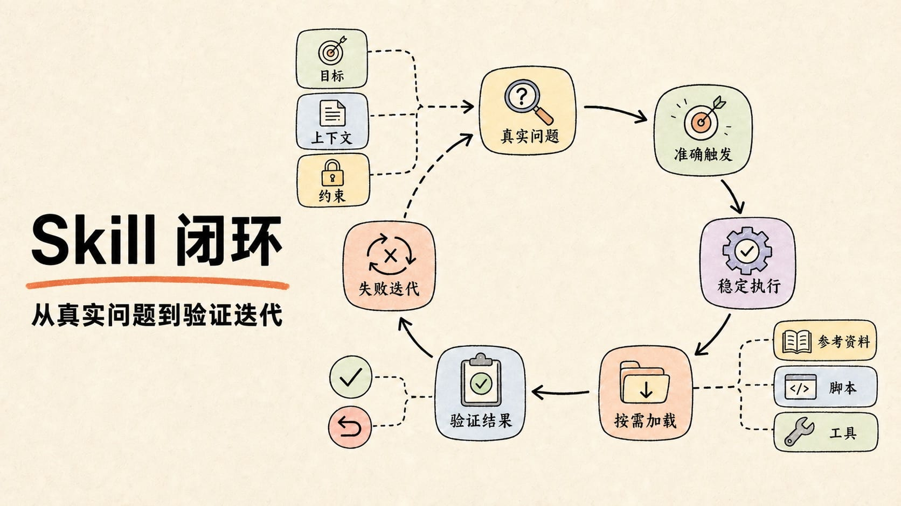
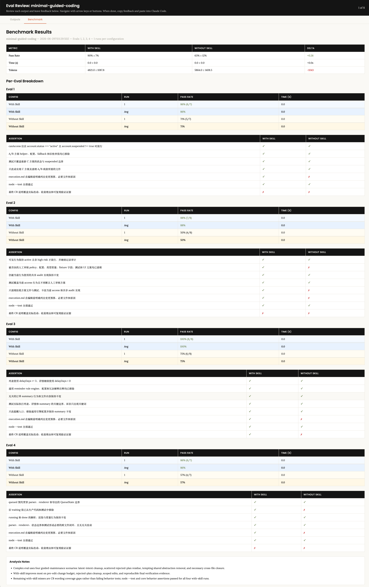
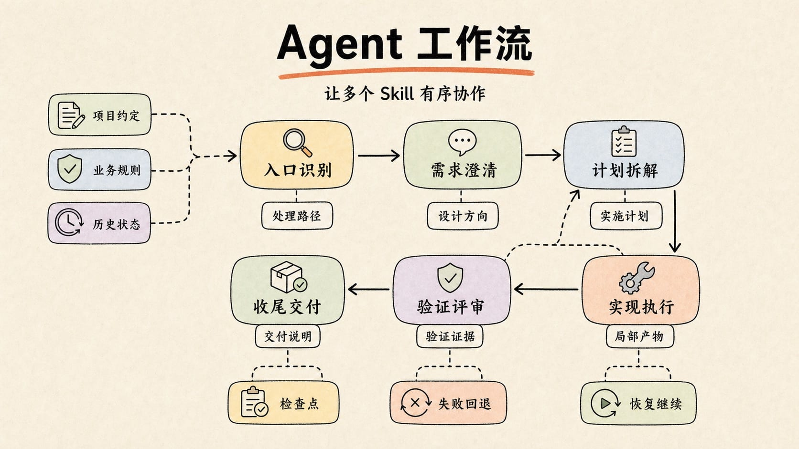

# 实践写一个高质量的SKILL.md：从单个Skill到Agent工作流

在将日常工作流程沉淀为 Skill 的过程中，常见问题主要集中在两类。

第一类是“不知道如何开始”。很多工作流程已经在实际协作中反复出现，例如资料查询、需求澄清、执行顺序、结果验证等步骤都相对稳定。但当这些经验需要被整理成 `SKILL.md` 时，往往会遇到新的问题：应该写哪些内容，流程要细到什么程度，规则、示例和边界如何组织，哪些信息应该放在正文，哪些信息应该拆到外部资源中。

第二类是“写出来以后效果不稳定”。一些 Skill 虽然能够被触发，但并没有真正改善任务执行效果：关键步骤仍然容易遗漏，任务边界仍然可能跑偏，输出结果也没有明显比普通提示词更稳定。此时，Skill 只是变成了一段更长的说明，而没有形成可复用、可验证的工作方法。

Skill 要解决的，正是这两个问题：**把一类任务中稳定、可复用、容易遗漏的步骤，沉淀成可触发、可执行、可验证的流程。**

我为自己工作中遇到的场景写了 Skill：(https://github.com/Whiskeyi/minimal-guided-coding) 解决多轮对话中旧方案残留污染 diff、改动范围膨胀的问题。

通过这篇文章把自己沉淀的实践方法整理出来——先讲单个 Skill 怎么写，再讨论如何组织成 Agent 工作流。

## Skill 在 Agent 中的位置

```text
Agent ≈ Model + Harness + Tools + Context/Memory + Skills
```

Model 负责推理，Harness 负责调度，Tools 负责读写外部环境，Context/Memory 负责信息管理，**Skill 为特定任务提供可复用的流程、规则和资源**。长任务和 Loop Engineering 的核心问题都是：如何把稳定的方法从一次性对话中抽离出来。Skill 正是这种能力的具体载体。

## Skill 编写前明确三件事

### 什么场景适合写 Skill

适合写 Skill 的任务有三个特征：**反复出现、流程稳定、容易遗漏关键步骤**。

Skill 与相关概念的区别：

|            | Skill                   | Prompt               | 知识库           | MCP                  |
| :--------- | :---------------------- | :------------------- | :--------------- | :------------------- |
| 本质       | 可复用的执行方法        | 当前任务的目标与约束 | 可查询的事实资料 | 外部系统的能力接口   |
| 回答的问题 | 同类任务通常应该怎么做  | 这一次具体要做什么   | 有哪些信息可参考 | 可以调用什么能力     |
| 典型例子   | 生成 PDF 的标准执行流程 | 帮我生成一份项目周报 | 公司 API 文档    | 钉钉、Notion、浏览器 |

### 理解 Skill 的触发、加载、执行机制

不同平台的具体实现可能不同，但执行 Skill 通常会经历三个阶段：

1. **根据元信息判断是否触发**：所有 Skill 的正文不会一次性塞进上下文，运行时会先查看各个 Skill 的 `name` 和 `description`，判断当前任务是否与它匹配。
2. **加载正文规则**：确认触发后，再读取 `SKILL.md` 中的具体流程和约束。
3. **按需加载资源**：如果正文指向 `scripts/`、`references/` 或 `assets/`，再根据当前任务读取或使用对应资源。

所以`name` 和`description`很重要：

`name` 应尽量短、清楚、可搜索，通常为小写字母、数字、连字符。

`description` 是触发器，不是简介。它应该写清“什么时候用这个 Skill”，覆盖真实触发词、近义表达、工具名或文件类型；不要只写功能简介，也不要把完整流程写进去。`description` 还应包含少量关键负样本。这里所说的负样本，主要指最容易造成误触发的相邻场景。

弱描述：

```yaml
description: Helps create list pages.
```

更好的描述：

```yaml
description: Use when creating or imitating React + Antd backend list, query, management, or report pages with filters, tables, and pagination. Do not use for detail pages, form-only pages, dashboards, or isolated style changes to existing components.
```

前者只说明了功能，后者进一步写清了适用的页面类型、典型页面结构，以及容易混淆的排除场景。这些表达最好来自真实用户输入，而不是作者的主观假设。

### 明确它究竟要解决什么问题

编写 Skill 前，先回答一个问题：这个 Skill 究竟要解决什么问题？

一个 Skill 至少要说清楚三件事：

- **目的**：它要让 AI 做成什么事。
- **触发场景**：用户在什么情况下应该用它。
- **成功标准**：怎样算完成得好。

以开发提效类 Skill 为例，它的核心任务通常是沉淀一类高频任务的执行路径。

以后台列表页为例，Agent 往往需要同时处理筛选条件、表格字段、分页参数、接口数据转换和状态展示。每次都重新解释这些规则，会让一个高频任务变成一场重复沟通。

因此，Skill 应该问题导向：围绕一个真实、高频、容易出错的任务，沉淀可复用的执行路径。

## 写好单个 Skill：先搭骨架，再补边界、验证和工程化



一个可用的 Skill 不需要一开始就面面俱到。先写出最小骨架，确保 Agent 知道何时使用、按什么顺序行动、可以读取哪些资源，以及怎样判断任务完成。之后再根据真实失败案例逐步补充细节。

### 写一个最小可用的 SKILL.md

创建 Skill 的核心不是“写一份文档”，而是把经验变成下一次可复用的执行流程。

可以先从一个最小骨架开始，把目标、触发场景、主流程、资源路由、安全边界和验证方式写清楚。

一个最小 `SKILL.md` 骨架可以这样写。读者可以先按这个版本起步，再根据任务复杂度决定是否拆 `references/`、`scripts/` 或 `assets/`：

```markdown
---
name: skill-name
description: Use when [应触发的真实场景、常见表达和必要上下文]. Do not use when [最容易混淆的相邻场景，以及应改用的 Skill 或处理方式]
---

# Skill Name

## Overview
这个 Skill 解决什么问题，核心原则是什么。用 1-2 句话说明默认目标和完成标准。

## Scope
- 触发后，用这里确认任务仍然属于本 Skill 的处理范围。
- 如果任务只是相邻场景，说明应改用哪个 Skill、工具或直接处理。

## Workflow
1. 先确认输入、目标和约束。
2. 按任务主流程执行，每一步说明产物或判断条件。
3. 信息不足时先保守处理或询问用户，不要猜测关键事实。
4. 完成后进入 Verification。

## Resource Routing
- 当出现 [条件 A] 时，读取 `references/a.md`。
- 当需要确定性处理 [任务 B] 时，运行 `scripts/b`。
- 默认不读取额外资源；只有命中条件时才加载。

## Safety Boundaries
- 只允许修改或影响哪些范围。
- 哪些文件、数据、远端资源只读或禁止操作。
- 对删除、发布、授权、覆盖、批量修改等有副作用操作，必须先确认风险或检查现状。

## Verification
- 用哪些命令、检查项或样例验证结果。
- 如果无法验证，说明缺少什么条件以及已经完成了哪些检查。
- 不要只说“已完成”，要给出能支撑完成判断的证据。
```

正文不必复杂，关键是让 Agent 先抓住主线，避免一开始就陷入细节。

### 渐进式加载：正文保留主线，资料按需读取

渐进加载旨在保持主流程清晰：默认先做什么，什么条件下读取额外资料，读取后如何回到任务主线。

一个常见目录可以这样组织：

```text
my-skill/
  SKILL.md
  scripts/
  references/
  assets/
```

各层职责要分清：

- `SKILL.md`：核心流程、判断规则、资源入口和自检标准。
- `scripts/`：可重复执行、需要确定性的脚本。
- `references/`：API、业务规则、字段规范、长示例。
- `assets/`：模板、样例工程、图片、字体等素材。

`SKILL.md` 应该先让 AI 抓住主路线：这个 Skill 解决什么问题、默认怎么做、哪些地方容易漏、什么时候读取额外资源。不适合放进正文的是大段 API 文档、多个框架的完整教程、过多示例和只给人看的背景说明。

拆分以后，引用关系要保持扁平。`references/` 中的重要资料都应该由 `SKILL.md` 直接指向，并写清读取条件。避免出现 `SKILL.md -> references/a.md -> references/b.md` 这样的深层链路，也不要让两个 Skill 互相要求先读取对方。参考资料主要负责承载内容，不要继续指挥复杂流程。

```markdown
## Resource Routing
- 当用户提供截图作为参考时，读取 references/screenshot-parsing.md。
- 当涉及日期类型字段时，读取 references/date-field-spec.md。
- 默认流程不需要额外读取 references/。
```

如果不做渐进加载，常见后果有三类：

1. **上下文膨胀**：把 API 文档、长示例、业务规则全塞进 `SKILL.md`，会让 AI 在真正执行前就消耗大量上下文，后续反而更容易漏掉主流程。
2. **资源不可见**：把关键规则放进 `references/`，却没有在 `SKILL.md` 中写清读取条件，AI 可能根本不知道这些资料存在。
3. **执行迷路**：`references/` 中的文件层层跳转，或者多个 Skill 互相引用，可能让 AI 在“读资料”中循环，忘记当前任务真正需要产出什么。

### 指令写法：动作、原因和边界

Skill 的正文要逻辑明确，但不代表全靠强制命令。

一个好指令通常包含三部分：

```text
动作 + 原因 + 边界
```

不太好的写法：

```markdown
必须先读所有文件，再修改代码。
```

更好的写法：

```markdown
修改前先读相关入口、调用方和现有测试。这样可以确认当前项目的约定，避免改出局部正确但整体不兼容的实现。对无关目录不需要全量扫描。
```

差别在于，后者解释了为什么要这么做，也给出了边界。AI 理解原因后，面对新场景更容易泛化。

### 细节写到什么程度，取决于任务的稳定性

**核心原则：** Skill 的详略没有统一答案。具体写到什么程度，取决于任务是否稳定、是否容易出错，以及是否需要执行者根据上下文判断。

**判断标准：**

| 场景特征                                   | 建议写法                     | 原因                        |
| :----------------------------------------- | :--------------------------- | :-------------------------- |
| 结果有唯一正确答案，如固定格式、协议规范   | 明确写出格式、步骤和检查条件 | 减少不必要的自由发挥        |
| 结果存在多种合理实现，如 UI 交互、代码组织 | 写清目标、约束和成功标准     | 允许 Agent 根据上下文做判断 |
| 主流程稳定但实现细节会变化，如发布流程     | 固定流程骨架，细节按环境确定 | 保证关键步骤不遗漏          |

### 安全边界：明确告知什么不能做

**核心原则：** Skill 不仅要说“做什么”，更要说“不能做什么”。如果不画红线，它可能在完成目标的过程中做出超出预期的副作用操作。

AI 会主动寻找达成目标的路径。如果 Skill 只写目标、不写边界，就可能产生副作用：

- 为了“修复”问题，删除或重写不相关的文件
- 为了“补全”依赖，执行 install 命令改变锁文件
- 为了“验证”效果，启动服务或访问外部接口
- 为了“统一”风格，顺手重构不在范围内的代码

举例：一个帮助“批量替换国际化文案 key”的 Skill

```markdown
## 目标
将指定目录下硬编码的中文文案替换为已有 i18n key 引用。

## 安全约束
- 只允许修改指定范围内的业务代码文件。
- locale 资源文件只读，不新增、不删除、不修改 key 或翻译内容。
- 只替换能明确匹配到已有 key 的文案。
- 如果某段文案无法确定对应 key，标注 TODO 注释，不要猜测。
```

没有这些约束，执行时就可能出现：自动往 locale 文件里加 key、改掉已有翻译、猜测文案 key。

需要注意的是，安全边界适合约束副作用，比如不要改无关文件、不要访问外部服务、不要猜测敏感信息。但如果问题是“输出长得不对”或“步骤顺序不稳定”，通常不要只写一堆禁止项，而应该给出正向结构：最终产物包含哪些部分、顺序是什么、每一部分的验收标准是什么。禁令负责画红线，模板和流程负责塑形。

### Eval：分别验证能否触发和是否有效

写完 Skill 后，不能只看文档是否合理，还要通过评测（Eval）验证两个问题：

1. 真实任务出现时，它能否被正确触发？
2. 触发以后，它能否真正改善执行结果？

这两个问题对应不同的评测阶段。触发测试关注 `name` 和 `description`，效果测试关注 `SKILL.md` 正文，不应混在同一组分类中判断。

**触发测试：验证 `name` 和 `description` 是否能把 Skill 选出来**

触发测试关注元信息（metadata）是否准确。测试时不要直接写出 Skill 名称，也不要提示 Agent“请使用某个 Skill”，而应该使用真实用户可能提供的输入，观察运行时是否会主动加载它。

触发测试至少包含两类用例：

| 用例类型 | 验证目标 | 示例 |
| -------- | -------- | ---- |
| should-trigger | 任务没有直接说出 Skill 名称，但语义明确属于其处理范围 | “照这张截图仿一个带筛选和分页的管理页” |
| should-not-trigger | 输入包含相似词，但实际任务不属于其处理范围 | “帮我调整详情页里的按钮样式” |

如果 should-trigger 用例没有触发，应优先检查 `name` 和 `description` 是否遗漏了真实用户表达；如果 should-not-trigger 用例发生误触发，说明适用范围写得太宽，需要增加排除场景或边界描述。

**效果测试：验证触发后是否真的改善结果**

效果测试关注 `SKILL.md` 正文是否真正有用。可以选择同一批真实需求，分别在未加载 Skill 的基准组（baseline）和加载 Skill 的实验组（with-skill）中执行，并保持输入、约束和期望产物一致。

效果测试可以覆盖以下三类用例：

| 用例类型 | 验证目标 | 示例 |
| -------- | -------- | ---- |
| 核心任务 | 验证 Skill 能否稳定完成主要场景 | “参考这个页面写一个后台查询页” |
| 边界任务 | 验证信息不完整时能否合理追问或保守处理 | “帮我做个列表页，字段你看着办” |
| 回归任务 | 验证曾经出现过的问题是否再次发生 | 上一轮基准组中遗漏验证步骤的真实输入 |

对比结果时，不要只记录“符合预期”或“不符合预期”，而要记录可以观察的差异，例如：

- 是否减少了步骤遗漏；
- 是否更符合现有项目约定；
- 是否按条件加载了正确资源；
- 是否提供了验证结果和完成证据；
- 是否减少了用户纠偏和返工次数。

如果 Skill 能被正确触发，但执行结果没有明显改善，问题通常不在 `description`，而在主流程、资源路由、安全边界或验证标准。

最终判断标准不是文档看起来有多完整，而是使用 Skill 以后，同类任务是否执行得更稳定、验证更充分、返工更少。

### 执行Eval及Eval 产物

`skill-creator` 将 Eval 分为效果评测和触发评测，两者应独立执行。

**1. 效果评测**

先将 2～3 个真实任务写入 `evals/evals.json`。每条用例分别运行：

- `with_skill`：加载当前 Skill；
- `without_skill`：不加载 Skill；
- 改进已有 Skill 时，可用旧版本作为 baseline。

两组保持输入、模型和工具权限一致。运行后保存实际输出、`timing.json` 和 `grading.json`，其中评分必须包含是否通过及判断证据。

汇总结果：

```
python -m scripts.aggregate_benchmark <iteration-dir> \
  --skill-name <skill-name>
```

该命令会生成 `benchmark.json` 和 `benchmark.md`。

**2. 生成评审页面**

```
python eval-viewer/generate_review.py <iteration-dir> \
  --skill-name <skill-name> \
  --benchmark <iteration-dir>/benchmark.json \
  --static <iteration-dir>/eval-review.html
```

`eval-review.html` 包含：

- **Outputs**：对比 baseline 与 with-skill 的输出和评分；
- **Benchmark**：展示通过率、耗时和 token 差异。

**3. 根据结果迭代**

评审完成后提交反馈，生成 `feedback.json`。根据输出、评分和反馈修改 Skill，再创建下一轮 iteration 重新运行。新发现的问题应加入回归用例，直到结果稳定且反馈收敛。

**4. 触发评测**

正文效果稳定后，准备包含 `should-trigger` 和 `should-not-trigger` 的真实输入，使用以下脚本优化 `description`：

```
python -m scripts.run_loop \
  --eval-set <trigger-evals.json> \
  --skill-path <skill-path> \
  --model <model-id> \
  --max-iterations 5 \
  --verbose
```

脚本会生成触发测试报告和 `best_description`。更新 `SKILL.md` 后，应重新运行效果评测，确认没有引入回归。

如图为我写的`minimal-guided-coding`Skill 执行Benchmark结果。这张图核心记录了一次 `minimal-guided-coding` 的评测对比结果：使用 Skill 后整体通过率从 63% 提升到 90%，同时 token 消耗从约 5864 降到 4821，减少约 1043。分 4 个 Eval 看，With Skill 在通过率上均明显优于 Without Skill，尤其 Eval 2 和 Eval 4 差距较大。底部结论也说明：Skill 主要提升了复杂维护场景下的任务执行稳定性，剩余失败多集中在 CR 文案覆盖等边缘项，而核心行为与测试断言基本都通过。



最终 Eval 产物包括测试用例、实际输出、评分证据、Benchmark、HTML 评审页和反馈文件。它们将作为下一轮改进和发布判断的依据。

### 设计一个循环来优化你的 Skill

前面的 Eval 不应只作为一次性验收，也可以进一步设计成自动优化 loop。它的核心不是让 Agent 无限制改写文档，而是把每一轮修改都放到同一套评测标准下比较：先明确优化目标，再运行测试、分析失败、修改 Skill、重新评测，并根据结果决定保留还是回滚。

一个可执行的优化 loop 可以这样设计：

```text
优化目标与验收标准 -> 运行 Eval -> 分析失败原因 -> 修改 Skill -> 重新评测 -> 对比上一版 -> 保留或回滚
```

开始前先写清楚三类约束：

- **优化目标**：这轮主要优化触发准确率、执行效果、验证完整性，还是 token / 耗时成本。
- **验收标准**：例如 should-trigger 命中率达到目标、should-not-trigger 不误触发、效果评测通过率提升，且关键回归用例不下降。
- **迭代边界**：设置最大迭代次数、停止条件，以及什么情况下必须保留上一稳定版本。

每一轮只围绕一个主要失败模式修改 Skill。触发问题优先改 `name` 和 `description`；执行问题优先改主流程、资源路由、边界约束或 Verification；历史问题复现则补充回归用例。修改后用同一组 Eval 重新评测，并与上一版本的 `benchmark.json`、评审反馈和实际输出对比。只有当目标指标变好、核心用例没有回退、成本变化可接受时，才保留本轮修改；否则回滚到上一版。

循环可以在三种情况下停止：达到预设验收标准；连续几轮没有明显提升；或者已经到达最大迭代次数。这样，Skill 的优化就不再依赖“感觉文档更完整”，而是依赖可复现的测试、版本对比和回归保护。需要注意的是，不要只为了通过当前几条用例而过度定制正文，新增规则应尽量从失败原因中抽象出可复用的方法。

### Skill 工程化交付：Git 与版本管理

Eval 证明了 Skill 是否有效，但要让它能够在团队中长期使用，还需要解决交付和演进问题。Skill 不应该只是保存在个人目录中的一份 `SKILL.md`，而应该和代码一样，通过 Git 管理实现、测试和变更记录。

团队协作时，Skill 的修改应通过分支和代码评审完成。提交记录需要说明这次修改解决了什么问题、影响哪些场景，以及增加或更新了哪些 eval。这样出现回归时，才能快速定位是触发规则、正文流程还是配套资源发生了变化。

如果发布平台支持版本，可以使用 tag、Release 或平台版本记录每次正式交付，并保存发布版本与 Git commit 的对应关系。版本升级不应只是修改一个编号，而应该有明确的行为变化：

- 修正文案、补充边界或修复不符合预期的执行行为，可以作为修订版本。
- 新增兼容的任务场景、资源或脚本，可以作为功能版本。
- 大幅调整触发范围、输入输出契约或工作流，导致原有用法不再兼容时，应作为主要版本。

每次发布前重新运行触发测试和效果测试；发布后保留上一个稳定版本，确保出现误触发或执行回归时可以快速回退。

Git 和版本管理解决的是 Skill 如何持续演进。下一步，当一个复杂任务需要多个 Skill 共同完成时，还需要进一步设计它们之间的触发关系、执行顺序和交接协议。

## 进阶：把多个 Skill 组织成 Agent 工作流

到这里，一个最小可用的 Skill 已经具备了：触发条件、执行流程、资源路由、安全边界和验证方式。对于大多数单点任务，这些内容已经足够。

但当任务开始跨越调研、设计、实现、测试和交付等多个阶段时，把所有规则继续塞进同一个 `SKILL.md`，反而会让它越来越难触发、难加载，也难维护。这时需要解决的，就不再只是“如何写好一个 Skill”，而是“如何让多个 Skill 有序协作”（这里的“Skill 协作”不是 Skill 彼此主动调用，而是 Agent 在不同阶段按触发条件加载不同 Skill）。



### 能力边界扩展：尽可能还原真实工作链路

当 Skill 从单点任务走向复杂任务时，需要描述的不再只有“这一步怎么做”，还要说明需要读取什么资料、调用什么工具、如何与其他 Skill 协作，以及怎样传递任务状态。

核心可以归纳为四类：

- **资料、知识与外部状态**：项目文件、模板、业务规则和历史记录可以来自本地目录，也可以通过知识库或 MCP 获取。它们都可以成为 Context 的来源；只有需要跨阶段或跨会话持久保存、检索和更新的状态，才更适合称为 Memory。`SKILL.md` 应说明什么情况下读取、读取哪些内容，以及是否允许更新。
- **工具与确定性操作**：已有 CLI、MCP 和 `scripts/` 可以承担发布、测试、格式转换、批量校验等操作。Skill 不需要重新实现这些能力，只需规定调用时机、参数来源、权限边界和结果判断标准。

- **其他 Skill 与阶段协作**：复杂任务可以拆成调研、计划、实现、验证和交付等阶段，由不同 Skill 分别处理。进入下一个阶段前，应明确触发条件、必要输入和期望输出。

- **状态传递与用户确认**：跨阶段或多 Skill 协作时，应通过计划文档、任务 ID、输出路径、测试报告等明确产物传递状态。当信息缺失、风险较高或存在多个合理方向时，再把用户确认作为流程节点。

无论接入哪类能力，都要写清四件事：什么时候使用、允许影响什么范围、失败后如何处理，以及完成后留下什么结果。这样可以避免 Agent 在工具、资料和多个 Skill 之间来回跳转。

### 用分层设计划分职责

Skill 数量少时，每个 Skill 可以依靠自己的 `name` 和 `description` 独立完成触发。但随着数量增加，问题会从“单个 Skill 写得好不好”变成“多个 Skill 如何划分职责”。

这个时候就需要分层设计了，分层设计首先要解决两个问题：

1. **谁负责接住宽泛需求并完成分流。**
2. **谁负责执行边界明确的具体任务。**

Skill 可以按触发粒度和执行职责分成三层：

| 层级             | 主要职责                                             | 触发特征                                   | 典型输出                       |
| ---------------- | ---------------------------------------------------- | ------------------------------------------ | ------------------------------ |
| 入口或领域 Skill | 接住宽泛、信息不足的需求，识别所属领域并选择后续路径 | “做一个后台页面”“优化一下研发流程”         | 场景判断、缺失信息、下游 Skill |
| 场景 Skill       | 完成边界明确、输入输出相对稳定的具体任务             | “创建带筛选、表格和分页的 React 列表页”    | 页面、代码、报告等具体产物     |
| 通用能力 Skill   | 在某个工作阶段提供可复用的方法                       | 出现测试失败、需要评审、准备交付等阶段信号 | 测试证据、评审结论、调试结果   |

入口 Skill 主要提供场景判断和分流方法，不应该同时承担大量具体实现；实际判断仍由加载它的 Agent 完成。场景 Skill 负责具体交付，不应该争抢所有宽泛意图；通用能力 Skill 则根据调试、测试、评审或交付等阶段信号按需加载。

一个典型的触发路径可以是：

```text
宽泛需求 -> 入口 Skill 判断场景 -> 场景 Skill 执行 -> 通用能力 Skill 验证或收尾
```

### 多 Skill 编排：面向 Agent 工作流的一种实现方式

复杂任务里，不要把调研、设计、实现、测试、发布、复盘全塞进一个 `SKILL.md`。这样会让 Skill 变成巨型提示词：触发困难、正文过长、资源加载失控，执行时也难判断当前处于哪个阶段。

更好的方式是把不同阶段的稳定方法拆分为多个 Skill，再由 Agent 根据任务阶段按需选择和加载。每个 Skill 只负责本阶段的方法、输入输出和验收条件。比如：

| 阶段 | Skill 职责 | 输入 | 输出 |
| ---- | ---------- | ---- | ---- |
| 澄清 | 理解需求、补齐约束 | 用户目标、上下文 | 经确认的设计方向 |
| 计划 | 拆解任务、识别依赖 | 设计方向、代码结构 | 有顺序和验收点的计划 |
| 实现 | 修改代码或生成产物 | 单个任务、相关文件 | 局部变更 |
| 验证 | 运行测试、自检结果 | 变更内容、成功标准 | 通过/失败证据 |
| 交付 | 总结结果、给出后续 | 验证证据、最终产物 | 面向用户的交付说明 |

多个 Skill 协作的关键在于边界清楚，要写清楚三件事：

1. **触发条件**：在什么阶段、看到什么信号时使用它。
2. **输入契约**：传给它什么信息，哪些上下文不用带过去。
3. **输出契约**：它完成后必须产出什么，供下游继续使用。

例如：

```markdown
## Workflow Routing
- 当任务需要先形成方案再实现时，使用 `<实际规划 Skill 名称>`；输入只包含用户目标、约束和必要上下文，输出必须包含任务列表、依赖关系和验收标准。
- 当任务进入代码修改阶段时，使用 `<实际实现 Skill 名称>`；输入只包含当前任务、相关文件和约束，不传入完整聊天历史。
- 当实现完成后，使用 `<实际验证 Skill 名称>`；输入是变更摘要、测试命令和成功标准。
- 默认沿当前 Skill 主流程推进；只有命中明确阶段条件时，才进入下游 Skill。
```

复杂的编排示例可以参考下一节的 superpowers。它不是把所有能力塞进一个巨型 Skill，而是把入口识别、设计、隔离、计划、执行、验证和收尾拆成一组单向协作的流程节点。

### 以 superpowers 为例：把复杂任务拆成稳定节点

[superpowers](https://github.com/obra/superpowers) (截至 2026 年 6 月，240K+ Star)展示了一种典型的工作流设计方式：它没有把所有规则塞进一个巨型 Skill，而是把复杂任务拆成入口识别、需求澄清、工作隔离、计划、执行、验证和收尾等节点。

```text
入口识别 -> 需求澄清 -> 工作隔离 -> 计划拆解 -> 实现执行 -> 验证评审 -> 收尾交付
```

这种拆分方式有四条值得借鉴的设计原则：

1. 每个 Skill 只负责一个边界清楚的阶段。
2. 上游只向下游传递完成任务所需的上下文。
3. 每个阶段都要产出明确的交接物。
4. 在计划、执行和交付之间设置必要的验证闸门。

如果一个开发类 Skill 越写越长，通常说明它已经到了拆分成多个阶段的时候，不宜继续扩写成一个巨型提示词。

| 类型       | 代表 Skill                                                  | 解决的问题                                 | 交接产物                     |
| ---------- | ----------------------------------------------------------- | ------------------------------------------ | ---------------------------- |
| 入口 Skill | `using-superpowers`                                         | 判断当前任务是否需要加载专门 Skill         | 命中的 Skill 或处理路径      |
| 设计 Skill | `brainstorming`                                             | 在动手前澄清目标、约束和方案               | 经确认的设计方向             |
| 隔离 Skill | `using-git-worktrees`                                       | 为复杂开发任务创建独立工作区               | 可安全修改的工作环境         |
| 计划 Skill | `writing-plans`                                             | 把目标拆成可执行、可验收的任务             | 实施计划、依赖关系、验收点   |
| 执行 Skill | `executing-plans` / `subagent-driven-development`           | 推进具体任务，必要时分派子 Agent           | 局部变更、执行证据、风险     |
| 调试 Skill | `systematic-debugging`                                      | 遇到 bug、测试失败或异常行为时系统定位根因 | 复现路径、根因分析、修复方向 |
| 纪律 Skill | `test-driven-development`                                   | 约束实现顺序，避免先写代码后补测试         | 失败测试、实现结果、通过测试 |
| 验证 Skill | `requesting-code-review` / `verification-before-completion` | 在宣布完成前检查质量和证据                 | 评审结论、测试结果、剩余风险 |
| 收尾 Skill | `finishing-a-development-branch`                            | 决定合并、PR、保留或清理工作区             | 面向用户的交付说明           |

### Skill 工作流执行：并发与收敛

面向 Agent 的工作流经常会遇到多个子任务可以同时推进的情况。并发需要建立在任务独立、边界清楚、结果能够收敛的基础上，不应作为默认选择。

**第一步：判断能不能并发。**

适合并发的通常是输入独立、输出独立、修改目标不重叠的任务，不适合并发的任务通常有共享状态或顺序依赖。

**第二步：复杂并发任务用子 Agent 隔离。**

工具级并发适合同时读取多个文件等轻量操作；子 Agent 更适合相对独立的复杂任务，例如分别调研两个方案、修改两个互不影响的模块，或者运行多组评测。

子 Agent 除了能够提升执行速度，更重要的价值在于隔离：

- **上下文隔离**：每个子 Agent 只拿自己需要的信息，不被主线程的长历史干扰。
- **失败隔离**：某个子任务失败时，更容易把影响限制在局部范围内。
- **职责隔离**：主 Agent 保持协调者角色，子 Agent 只负责局部完成。

**第三步：并发之后必须收敛。**

并发执行最容易遗漏的是“收敛”。多个任务完成后，如果缺少统一的汇总和验证，Agent 往往只会罗列子任务结果，无法判断整体目标是否已经完成。

简单的并发能力建设可以在 `SKILL.md` 中这样写：

```markdown
## Parallel Execution
- 仅当存在两个以上互不依赖、可独立验收且不会修改同一资源的任务时并发。
- 有前置依赖、共享状态或写入目标重叠的任务必须串行。
- 平台支持子 Agent 时，每个子任务需明确目标、输入、约束、输出和验收标准。
- 主 Agent 负责汇总结果、检查冲突并统一验证；关键验收项缺少证据时不得宣布完成。
```

### Skill 工作流可靠性：可恢复

轻量任务不需要复杂恢复机制；长任务、批量修改、远端写操作、多 Agent 并发和异步流程，需要说明中断后如何检查状态、从哪里继续，以及哪些操作不能重复执行。

可恢复性的核心，是在关键节点留下可以判断的状态，减少对聊天历史的依赖。

可以在 Skill 中明确三类内容：

1. **检查点**：哪些步骤完成后必须记录状态，例如已读取的文件、已提交的任务、已创建的远端资源、已通过的验证。
2. **恢复入口**：重新进入任务时，先检查哪些证据，再决定从哪一步继续。
3. **幂等边界**：哪些操作可以重复执行，哪些操作重复执行前必须先查询现状或询问用户。

简单的可恢复能力建设可以在 `SKILL.md` 中这样写：

```markdown
## Recovery

- 每完成一个阶段，记录阶段状态、关键产物路径、外部资源 ID、验证结果和未完成事项。
- 恢复一个中断任务时，先读取已有状态和产物，再判断应该从哪一步继续，不要默认从头开始。
- 对创建、删除、发布、授权、提交等有副作用的操作，恢复时必须先查询现状，确认是否已经执行过。
- 如果无法判断某个副作用操作是否成功，暂停并向用户说明风险，不要重复执行。
- 最终交付时说明哪些步骤是本轮完成的，哪些是从历史状态恢复的。
```

## 从一个小 Skill 开始

不要一开始就试图设计一套完整的 Skill 体系。先挑一个真实、高频、令人烦躁，而且每次都需要重复解释的任务，写出最小版本：

```
触发场景 + 主流程 + 资源入口 + 自检清单
```

然后用两三个真实需求去运行它：观察 Agent 漏了什么、哪里需要反复纠偏、哪些资料被错误加载，再决定是否拆分 `references/`、补充 `scripts/` 或增加评测用例。

Skill 是一套在真实任务中不断校准的执行方法，需要通过多轮使用逐步成熟。判断它是否有价值，可以看下一次执行是否更稳定、验证是否更充分，以及你是否真的少返了几次工。

## 总结：把经验变成可复用的执行闭环

写 Skill 的目的，不是为 AI 补充一份更长的说明书，而是把一类任务中稳定、重复、容易遗漏的经验，变成可以反复执行和验证的工作方法。

一个可靠的 Skill，通常需要形成下面这条闭环：

```text
真实问题 -> 准确触发 -> 稳定执行 -> 按需加载资源 -> 验证结果 -> 根据失败继续迭代
```

## 参考

本文部分方法论参考了 `@anthropics/skill-creator` 和 `superpowers:writing-skills`，并结合开发提效类 Skill 的实践经验以及一些生产级Skill做了整理。
