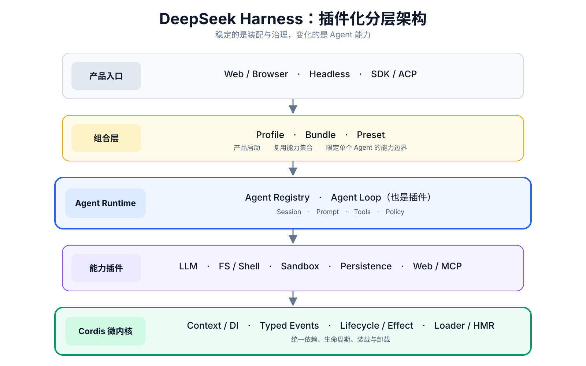
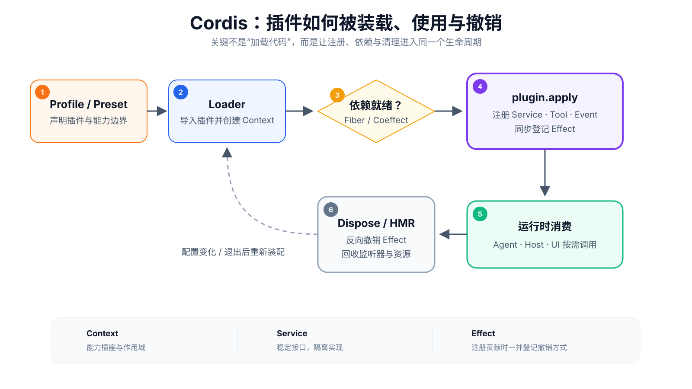
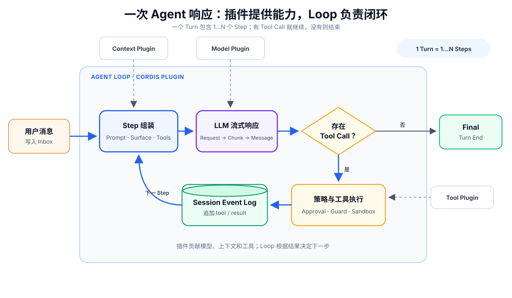

# Inside DeepSeek Harness: What I Learned from Its Source and Development Process

An Agent Harness is the infrastructure that organizes models, context, tools, execution environments, sessions, and UI into a working agent. Most harnesses center on a fixed Agent Loop. DSH centers on a plugin runtime and brings even the Loop under plugin governance.

## Key findings
- **DSH builds a platform for assembling agents.** Models, tools, context, permissions, storage, and UI can be combined into different products.
- **An agent becomes a set of composable capabilities rather than a hard-coded pipeline.** The foundation handles assembly, replacement, and cleanup; higher layers select capabilities for each scenario.
- **Even the Loop that directs the agent is a plugin.** DSH moves stable responsibilities into foundational capabilities and governance rules, leaving room for future agent designs.
- **More capabilities make loading everything into the model less practical.** Tools provide atomic actions, Skills explain their use, and the model discovers and combines them progressively.
- **DSH builds observability into the session itself.** Trajectory exposes execution paths, timing, and context changes alongside the answer rather than only in a separate tracing backend.
- **In the AI era, verification and deletion are scarcer than code generation.** Specifications, test gates, and continual simplification turn rapid generation into maintainable, mergeable progress.

## 1. Core architecture: dynamically composing plugins

Start with four layers: product entry points → composition → Agent Runtime → Cordis microkernel.

```text
Product entry points: Web · Headless · SDK · ACP
                    ↓
Composition layer: Bundle · Profile · Preset
                    ↓
Agent Runtime：Loop · LLM · Tools · Session · Policy
                    ↓
Cordis microkernel: reversible side effects · reactive dependencies · lifecycle
```




The key is that **the same composition mechanism applies to the Host, Agent Runtime, and Browser Client**.

### 1. Four layers

| Layer | Main components | Problem addressed |
|------|------------|---------------|
| Product entry points | Web, Headless, SDK, ACP | Where agents are used |
| Composition | Bundle, Profile, Preset | Which capabilities each product assembles |
| Agent Runtime | Loop, LLM, Session, Tools, Prompt, Policy | How an agent execution completes |
| Microkernel | Cordis Context, Service, Effect / Coeffect, Fiber, Loader | Plugin dependencies, cooperation, unloading, and hot updates |

Headless runs without an interactive UI; ACP is the Agent Client Protocol. A Bundle is a reusable plugin composition, a Profile defines product startup, and a Preset defines an agent's prompts, tools, and policies. A Capability Seam is an interface for replacing capabilities; HMR means hot module replacement.

The engineering foundation is **Node.js 22.19\+/24\+, TypeScript 6, ESM, and pnpm 11**. The browser uses React 18 and Vite 6, and packages are distributed through npm.

Five architectural foundations shape DSH: **microkernel-based plugins, layered capability contracts, event-based sessions, scoped composition, and unified tool governance**. The sections below examine each. Making the Loop a plugin follows from the first two.

### 2. Four moments of dynamic composition

| Moment | Composition mechanism | Result |
|------|------------|------|
| Host startup | Bundle \+ Profile | Choose Web, Headless, or other product forms and foundational providers |
| Agent creation | Preset \+ Agent Scope | Install tools, prompts, models, permissions, and subagent capabilities |
| Execution | Event / Middleware / Capability Seam | Apply approval, timeout, audit, compaction, and tool-interception policies to calls |
| Configuration changes | Loader Reconcile \+ HMR \+ Effect Dispose | Revoke or replace components from configuration differences; roll back on failure |

A more precise description is:
> **An agent is an execution process governed by the Host, with capabilities dynamically assembled at several stages.**

This does not mean that the model arbitrarily rewrites the system on every reasoning step, or that every plugin can be freely hot-swapped during execution.

### 3. What is Cordis?

**Cordis is DSH's plugin runtime and dynamic assembly kernel.** Through `Context`, a plugin declares its dependencies and registers cleanup alongside its side effects. Cordis coordinates activation and unloading when dependencies appear, disappear, or change.



| Term | Intuitive meaning | Engineering role |
|------|----------|----------|
| Context | Runtime environment and capability socket | Obtain dependencies and publish capabilities |
| Service | Standard interface | Decouple providers and consumers |
| Event / Waterfall | Collaboration channel | Notify, transform, intercept, or veto in sequence |
| Effect | Reversible contribution | Register cleanup alongside a capability |
| Coeffect | Reactive dependency | Coordinate component activation as dependencies appear, disappear, or change |
| Fiber | Component lifecycle unit | Aggregate Effects and Coeffects and dispose of them together |
| Loader / Include / HMR | Assembler | Turn configuration into plugins that can load, unload, and hot-update |

The paper describes Cordis in terms of **space—where plugins connect—and time—when they connect, change, and disconnect**.

| Dimension | Mechanism | Value for DSH |
|------|------|----------------|
| **Temporal composability** | Start, rebuild, or stop components as dependencies change, undoing their previous contributions | Dynamic loading, unloading, and HMR without orphaned tools, listeners, or resources |
| **Spatial composability** | Resolve local models, tools, and policies within separate Contexts / Agent Scopes | Run agents with different capability combinations without conflicts |

> **Boundary:** spatial composability isolates dependency and state scopes; it is not a container or security sandbox. Cordis cannot automatically undo network sends or external writes, which still require delayed commits or compensating operations.

### 4. Why can the Loop be a plugin?

Traditional harnesses often accumulate tools, permissions, compaction, and persistence inside a giant Loop. In Cordis, components declare dependencies, contribute capabilities, and follow a unified lifecycle. DSH can therefore make the Loop a replaceable orchestrator and place the stable center in **agent contracts, registries, and event protocols**:

```text
Web / SDK / ACP
      ↓
AgentRegistry → AgentFactory contract
                      ↑
              implemented and registered by the agent-loop plugin
```

- `dsh-agent` defines only `Agent`, `AgentFactory`, and the event protocol.
- `agent-loop` is an ordinary Host-level Cordis plugin that implements `AgentFactory` and registers it.
- UI, SDK, persistence, and tool policies depend on contracts and events rather than the particular Loop implementation.
- When the plugin unloads, the runtime unregisters its factory and stops and awaits the agents it created.

The separation has three parts: **Service Definition** specifies the contract, **Provider** implements it, and **Consumer** uses only the contract. For example, `dsh-agent` defines `AgentFactory`, `agent-loop` implements it, and Web, SDK, and ACP depend only on `ctx.agents`. The entire Loop implementation is replaceable, not just a few callbacks.

Future Loop implementations can thus replace the current one without rewriting higher-level products. However, **the repository currently has one concrete Loop**. It has a real replacement seam, but not yet a mature multi-Loop ecosystem. The Loop is not replaced on every Step: the Host selects its provider, the Preset binds each agent's surrounding capabilities, and each Step assembles a request from them.

With those boundaries established, we can examine how the plugins produce a real response together.

## 2. The execution path of an agent response: a Turn



A user input starts a **Turn**, which contains zero or more **Steps**. Each Step assembles context, calls the LLM, and processes the response. Tool results are written back to the Session and trigger another Step; the Turn finishes when no further tool calls are needed.

| Stage | System behavior | Plugin involvement |
|------|----------|------------|
| Receive input | Web / SDK writes a message to the Inbox and wakes the agent | Agent API, Inbox events |
| Prepare Step | Read history from the current Surface and combine prompts, tools, runtime context, and model configuration | Preset, Prompt, Context, `pre-step` |
| Request model | Agent Loop calls the LLM Provider and emits events for streamed chunks and final messages | Model Adapter, Routing, Retry, `llm/stream` |
| Tool loop | Apply permission, approval, timeout, and sandbox policies; store results in the Session and start the next Step | `tools/pre-execute`, Guard, Approval, Sandbox |
| Finish Turn | Write `turn/end` when no tools or messages remain and return the agent to idle | `turn-stopping`, Persistence, UI, Telemetry |

Tools from official plugins, MCP, or Agent Scopes all pass through the same `ToolRuntime`: **argument validation → approvals and guards → execution and timeout → result validation → Session recording**. Governance need not be scattered across tool implementations.

Each layer has a distinct role: the Loop advances Turns and Steps, the Preset defines the agent's capability boundary, and the Session Event Log records the process for UI, persistence, and auditing. A response is an event-driven feedback loop, not a single LLM request.

### Trajectory: observability inside the session

Many agent products show results in a chat and execution details in a separate tracing backend. **DSH makes Trajectory a native Web-session plugin: Chat and Trajectory read the same Session Event Log, keeping the answer aligned with its diagnostics.**

```text
One shared Session Event Log
        ├─→ Chat: what was ultimately said
        └─→ Trajectory: how this execution unfolded
```

This matters particularly in DSH: the model selects tools, loads Skills, and calls plugin capabilities Step by Step. The path cannot be fully predetermined, and Trajectory reconstructs it as an inspectable timeline.

| View | Main information | Main purpose |
|------|----------|----------|
| Overview | Input / Model / Tools lanes; TTFT, generation time, and tool duration | Locate bottlenecks, concurrency, and long-running calls |
| Ledger | Turns / Steps, Assistant, Tools / Subtools, Compaction | Reconstruct actual loops and invocation order |
| Inspector | Prompts, tool schemas, inputs and outputs, tokens / cache, retries and errors | Inspect what the model saw, the cost, and failures |

- **Similar to Chrome DevTools:** timeline interaction resembles Performance, while individual request inspection resembles Network. The source calls it a “Chrome-Network-style overview.”
- **Different emphasis from external tracing platforms:** DSH focuses on immediate diagnosis of the current session; platforms such as LangSmith specialize in cross-run aggregation, evaluation, and distributed tracing.
- **Observation is itself a plugin:** Trajectory projects Session events read-only, without modifying Chat or consuming model context.

> **Boundary:** this profiles agent semantic events rather than CPU activity or APM. Internal plugin behavior is not shown unless recorded or mapped into the Session, and the data does not provide deterministic replay of external side effects.

Trajectory reveals what happened during execution. What the model can do next depends on which capabilities the current agent can discover.

## 3. Discovering and combining Skills, tools, and plugin capabilities

### 1. How does the LLM find capabilities?

DSH has no separate capability-search agent, vector search, or independent ranking stage. The runtime derives the capabilities visible to the current Agent Scope and presents tool schemas and Skill summaries as a **menu**. The LLM matches the task to names and descriptions using its own language understanding and produces calls; the runtime validates and executes them.

```text
Tool Registry  → request.tools：name + description + JSON Schema ─┐
Skill Registry → <available_skills>: name + description       ├→ LLM selection
                                                               ┘
                 ├─ Regular Tool → tool_call(name, args) → execution
                 └─ Skill → skill(name) → full instructions enter the next Step
```

| Capability | What the agent sees initially | How it is used |
|------|-------------------|----------|
| Tool | Name, description, and parameter JSON Schema in the LLM request | The model generates `tool_call(name, args)`, followed by permission, approval, timeout, and execution checks |
| Skill | Names and summaries in the Session's `<available_skills>` directory | Calling `skill(name)` adds the full `<skill_content>` to the next Step; users can also inject it with `/skill-name` |

The mechanism has three steps:

1. **Set boundaries when creating the agent.** The Preset binds prompts, visible tools, policies, and Skill sources to the Agent Scope. Plugins and MCP can register additional capabilities in the same Tool Registry.
2. **Present the menu on each Step.** The Loop includes visible tool schemas in the LLM request. `pre-step` writes Skill summaries into the Session as a persistent user-role reminder. When the directory changes, it is replaced as a whole; full Skill contents remain unloaded.
3. **Let the model choose and the runtime validate.** Selection comes from the LLM's semantic judgment rather than keyword routing. Execution rechecks visibility in the same Scope, followed by guards, approvals, sandbox policies, and result validation, preventing calls to unexposed capabilities.

This is **progressive capability disclosure**: tools remain atomic, while Skills store procedural knowledge about when and how to combine them. Even as the ecosystem grows, the model loads only the detailed instructions it currently needs, reducing fixed context costs.

### 2. Basic tools of the default Web Coding Agent

Web uses the `standard` Preset by default.

| Category | Default tools |
|------|------------|
| Files and code | `read`, `read_image`, `write`, `edit`, `glob`, `grep` |
| Shell and jobs | `bash` / `pwsh`, `job_output`, `job_list`, `job_kill` |
| Planning and workflows | `create_goal`, `get_goal`, `update_goal`, `todo_write`, `workflow`, `ralph` |
| Multiple agents | `subagent`, `subagent_fork`, `send_message`, `list_agents`, `interrupt_agent` |
| External knowledge | `web_search`, `skill` |
| Human collaboration | `ask_user_question`, `exit_plan_mode` |

`web_search` is enabled by default, but `web_fetch` is not. Other compositions can enable terminal, LSP, Session Query, Schedule, MCP, E2B, and related capabilities.

`workflow` is a batch orchestration tool called by the Agent Loop, rather than a separate Loop:

```text
Agent Loop → workflow tool → Worker script → multiple subagents → aggregate results → next Step
```

Ordinary tasks use the Loop to execute, observe, and decide incrementally. Capabilities remain atomic, and Skills and knowledge load on demand. Workflow is appropriate when a task decomposes reliably and benefits from parallel or pipeline execution.

### 3. Four Web Presets

These are four predefined capability combinations for Web, not four Loop implementations.

| Preset | Capabilities visible to the model | Use case |
|------|---------------------|------------|
| `standard` | Complete native toolset | Default Coding Agent |
| `code` | Primarily `run_code`, which invokes tools through a generated TS SDK | Organize multistep calls in code |
| `cordis` | Standard \+ tools to define, run, and stop Cordis plugins dynamically | Self-modification and experiments |
| `minimal` | Shell \+ `str_replace_editor` only | Minimal execution surface |

The Preset is bound at agent creation. During execution, the model composes tools and policies within that boundary, rather than reinstalling the Preset or arbitrarily switching plugins each Step. Profile defines product startup, Bundle provides reusable plugin combinations, and Preset defines an individual agent's prompts, tools, and policies.

### 4. Six categories of plugins

| Category | Representative capabilities |
|------|------------|
| Kernel and protocols | Agent, Session, Tools, Context, Hooks, types, diagnostics |
| Models and context | LLM Provider, Prompt, Compaction, attachments, routing |
| Agent orchestration | Goal, Plan, Skill, Subagent, Workflow, Todo, Guard |
| Tools and execution | FS, Shell, Jobs, Terminal, LSP, MCP, Web, Code Runtime |
| Data and security | Persistence, Storage, Credentials, Approval, Sandbox, Subprocess |
| Products and extensions | Host/API, SDK, ACP, Browser Client, Bundle, Extensions |

At the time of analysis, `packages/` contains **219 public first-party leaf packages across 49 domain groups**. This is neither the full workspace package count nor 219 installable user plugins: it also includes protocols, providers, bundles, UI leaf packages, and test support.

### 5. A plugin ecosystem: from official capabilities to community collaboration
- **Ecosystem value:** stable Service Definitions, replaceable implementations, distribution, and compatibility governance matter more than plugin counts. Models, tools, and runtimes change too quickly for one team to cover every need. Widely used contracts and plugins may eventually become de facto standards.
- **Foundation for collaboration:** Service Definitions, Capability Seams, and a unified lifecycle let third parties implement providers or consumers without changing the Agent Loop.
- **Distribution:** plugins can be packaged as out-of-tree Bundles, installed through npm, Git, local directories, or tarballs, and assembled through Profiles. The GitHub `dsh-plugin` Topic supports discovery.
- **Scope of contribution:** plugins can extend models, tools, sandboxes, storage, MCP, Host APIs, Browser UI, and even complete product Profiles.

The README invites feedback, plugin publication, and collaboration through GitHub Discussions, the dsh-plugin Topic, and Discord. DSH is moving toward a community-extensible platform, but remains a Developer Preview. Compatibility mainly relies on npm peer dependencies and semantic versioning; trust, quality certification, and discovery still need work.

Capabilities can keep growing, but model context cannot. The next section explains how DSH separates the complete session from the current reasoning view.

## 4. Managing model context as sessions grow

How can the system preserve a complete interaction history without repeatedly sending all of it to the model?

```text
Session Event Log (continuously appended session events)
        ↓ incremental derivation
Surface (messages currently visible to the model)
        ↓ excessive context pressure
Compaction (summary + replacement event)
        ↓
New Surface
        ↓
Prompt + Tools + Runtime Context → next LLM request
```

- **The log is not the context itself.** The Session Event Log stores interaction records; the Surface is the model's current view.
- **Surfaces are derived incrementally.** Each Step uses the current Surface without replaying the complete log.
- **Compaction changes the view while preserving original events.** Summaries and replacements are appended as new events. Old events remain available for auditing and recovery, while the model sees the compacted view.
- **Retrieval is optional.** Default persistence uses JSONL + zstd. Plugins can add SQLite FTS, Session Query, or RAG, but DSH has no built-in unified vector knowledge base or automatic long-term memory.

Many mature agents summarize or trim context. DSH's distinction is treating compaction as a replayable, replaceable runtime protocol:

| Common harness approach | DSH |
|---|---|
| The Loop holds the current message array | Session Log is the source of truth; Surface is a derived view |
| Compaction rewrites or trims current context | Append replacement events and retain original events in the log |
| Memory and RAG are coupled to the agent implementation | Compaction, retrieval, and persistence evolve through independent plugins |
| UI and storage use separate callbacks | Chat, Trajectory, Persistence, and auditing derive from the same Session event stream |

Provider prompt/KV caches reuse model computation; they are not session-memory mechanisms.

After capability composition and context governance, the next task is packaging the runtime into a usable, deployable product.

## 5. From runtime to product: execution, interaction, and security boundaries

DSH is **Web local-first**: the browser handles interaction, and a local Node Host runs agents, tools, files, and processes.

| Choice | Rationale | Main boundary |
|------|-------------|----------|
| Node.js + TypeScript Runtime | Plugin lifecycles, typed contracts, npm distribution, local files, processes, and PTYs | Delegate CPU-intensive work and strong isolation to workers, native components, or remote providers |
| Web local-first | Browser UI with a local Node Host; HTTP POST upstream and separate downstream-only WebSockets for Session and Host events avoid SSE consuming HTTP/1.1 same-origin connections | No Electron currently; TUI was removed from the core repository. Cloud deployment must also move the Host, workspace, and authentication |
| Local execution guardrails | Default `workspace-write` restricts writes to the workspace and temporary directories; isolation can be replaced by remote providers | Mainly prevents accidental writes; it does not restrict reads, networking, or system calls. Multitenancy still needs containers or remote sandboxes |

TUI products such as Claude Code and Pi target terminals; Electron products such as VS Code, Cursor, and Qoder target desktops. DSH currently delivers Web, keeping low-latency access to the project through a local Node Host. Web also supports dense, zoomable diagnostic views such as Trajectory. In cloud deployment, the browser remains the interaction layer, while the Host, workspace, and sandbox must move to the server.

Architecture explains how the system runs; repository governance explains its rapid iteration.

## 6. 65 days and 12,293 commits: governing rapid development

```text
AGENTS.md / Spec
  → parallel implementation by Coding Agents
  → Unit / Snapshot / Browser E2E / package release tests
  → Gate DAG / CI
  → rapid iterations that can be verified and merged
  → promptly delete paths without real consumers
```

### 1. Interpret the metrics correctly

| Metric | Reachable history at the analyzed revision |
|------|------------------|
| Development span | June 10–August 13, 2026: 65 calendar days |
| Commits | 12,293: 5,610 merge \+ 6,683 non-merge |
| Mainline | Only 972 first-parent nodes |
| Decisions and gates | 683 English Agent Notes, 123 root scripts, 15 CI workflows, 28 documentation checks |

The 12,293 commits reflect highly parallel branches, batch merging, and intensive review, not 12,293 separate features.

### 2. Encoding the development protocol in the repository

| Layer | Artifact | Purpose |
|------|------|------|
| Long-term rules | `AGENTS.md` | Plugin boundaries, lifecycles, validation, and documentation principles |
| Decisions / specifications | Agent Notes | Background, proposals, alternatives, acceptance, and consequences |
| Reusable procedures | Skills | Standardize review, simplification, release, and other workflows |
| Mechanical checks | Tests, Snapshots, Gates, CI | Prevent drift among implementation, documentation, and generated artifacts |

This is **spec-driven development**: Markdown does not generate every line of code, but nontrivial changes require decisions, implementation, and acceptance criteria to evolve in the same PR.

The analyzed HEAD also shows the scale of this investment:

| Content | Files | Size / lines |
|------|---------|---------------|
| Markdown | 2,355 | 16.9 MB / 169,000 lines |
| Approximate non-test production source | 1,569 | 11.4 MB / 266,000 lines |
| All program source | 2,644 | 24.7 MB / 574,000 lines |

The precise conclusion is that **Markdown exceeds non-test source in file count and size, but does not exceed all code files or code line counts**. Of those Markdown files, 1,078 are bilingual mirrors.

### 3. Why can iteration be so fast?
- **Coding agents are the main producers:** the quality-gate documentation states this explicitly.
- **Contracts come first:** teams or agents can develop providers and consumers in parallel around Service Definitions.
- **Rules are executable:** Agent Notes, Skills, and CI reduce repeated explanations and make review less arbitrary.
- **Dense branching and review:** the Git graph shows stacked development, batch replay, and concentrated merging.
- **Whole lines of work can be deleted:** experiments without real consumers are not protected by sunk costs.
- **Testing drives development:** 759 specs and 268,000 test-code lines, exceeding 228,000 src lines, cover unit tests, snapshots, real APIs, browser E2E, and released packages. A gate DAG and CI turn generation speed into sustainable, mergeable progress.

Codex has the strongest visible footprint: 195 PR merges from `codex/` branches and 65 titles mentioning “Codex review,” compared with three visible `claude/` PR merges. Git establishes workflow traces, not the proportion of AI-written code or exclusive use of a tool.

### 4. Institutionalizing code deletion in the AI era

| Metric | Result |
|------|------|
| Non-merge commits with net line deletion | 860 / 6,683, approximately 12.9% |
| Titles mentioning refactoring, cleanup, removal, or simplification | 904 / 6,683, approximately 13.5% |
| Large deletions | 210 commits removing 100\+ net lines, including 41 removing more than 1,000 |
| Simplification decisions | 48 active, 27 archived |

Examples of removing complete lines of work: roughly **27,500** net lines for TUI, **17,400** for ACP, and **14,800** for unreleased SDK project tooling.

The repository includes a `dsh-find-simplifications` Skill that seeks dead, duplicated, speculative, and overbuilt implementations. This shows that deletion is a regular engineering activity. Git history cannot prove that AI caused every instance of code growth.

### 5. Why remove TUI but retain Web?

| Decision | Rationale |
|------|------|
| Remove the in-repository TUI | After roughly 18 days it still had no officially released composition, yet required product-level rendering, interaction adaptation, and snapshot maintenance. Removing the TUI package alone deleted about 20,600 lines |
| Retain Web | It had an official Profile, real product consumers, E2E acceptance, and a role in validating Browser plugins |

The principle is: **the core repository maintains product surfaces with clear deployment and acceptance responsibilities; other forms should use independent Bundles**.

### 6. “Everything is a plugin” began on day one

| Time | Change |
|------|------|
| Root commit | States that the project is based on Cordis |
| About 14 minutes after repository creation | Explicitly introduces `everything is a plugin` |
| The next day | Implements Cordis, abstract service packages, and a pluggable Agent Loop |

This was an initial architectural principle, implemented the next day rather than a later slogan. It still has a kernel: service definitions, event protocols, and lifecycle rules provide stable boundaries.

### 7. Major architectural evolution

| Stage | Main change | Motivation |
|------|------------|------------|
| June 10–20 | Microkernel, Cordis, service contracts, Agent Loop, event-based Session | Establish replaceable boundaries first |
| July 9–21 | Agent Scope, multiple agents, TUI | Explore per-agent isolation and multiple frontends |
| July 22–August 4 | Web/Host/Client plugins; remove TUI | Converge from technical demos toward products with deployment responsibilities |
| August 6–13 | Bundle, Profile, Preset, npm releases | Turn internal modules into a distributable platform |

Before drawing conclusions, compare DSH with mainstream frameworks and products.

## 7. Differences from LangChain, LangGraph, Pi, and Claude Code

| Project | Main strength | Main difference from DeepSeek Harness |
|------|---------|------------------------------------|
| LangChain | Models, tools, retrievers, and integrations | More of an application component library; DSH brings Loop, permissions, Session, Host, and UI into the plugin lifecycle |
| LangGraph | Explicit state graphs, durable execution, recovery, and human-in-the-loop | More oriented toward graph workflows; DSH emphasizes microkernel design, replaceable capabilities, and complete product assembly |
| Pi | Minimal, terminal-first, extensible coding harness | Pi extends a stable Agent Loop through tools, context, providers, sessions, and TUI; DSH also makes the Loop itself part of Cordis plugin assembly |
| Claude Code | Mature coding product, terminal experience, Hooks, MCP, and plugin marketplace | More mature product and ecosystem; DSH is more transparent and replaceable, with pluggable Loop and Browser composition |
| DeepSeek Harness | Integrated plugin platform from runtime to Web/SDK/distribution | A more complete vertical stack, but still a Developer Preview with real complexity, compatibility, and ecosystem costs |

The comparison depends on the task:
- Assemble LLM applications and integrations quickly: consider **LangChain**.
- Build explicit, recoverable business state machines: consider **LangGraph**.
- Use a minimal, mature terminal coding agent adaptable to personal workflows: consider **Pi**.
- Use a mature coding agent directly: consider **Claude Code**.
- Operate multiple models, agents, execution environments, and product surfaces over time: **DeepSeek Harness's architecture is worth studying**.

These differences concern judgments about stable agent boundaries rather than a product ranking.

## 8. Five lessons I took away
1. **Put stable boundaries in foundational capabilities and governance rules.** Models, tools, and orchestration strategies keep changing.
2. **Plugin governance must manage both contributions and dependencies.** Effect defines cleanup, while Coeffect defines the conditions required to run.
3. **Let the model compose atomic capabilities and load procedures progressively.** Tools provide actions and Skills provide methods, reducing fixed context costs.
4. **Derive multiple views from one session source of truth.** Chat, Trajectory, model Surface, persistence, and recovery each consume what they need. Compaction, memory, and retrieval should remain distinct concepts.
5. **Verification and simplification are scarce skills in the AI era.** Specs, tests, and gates convert generation speed into merge speed; features, abstractions, and product surfaces without real consumers should be removed promptly.

Useful for platform teams maintaining multiple agents, models, runtimes, and frontend products over the long term.

Less suitable to copy wholesale for small teams delivering a single business agent: 219 granular packages and full plugin governance impose significant cognitive and release costs.

> **The most valuable lesson from DSH is a judgment about architecture: the stable core of future agents may be composable atomic capabilities and unified governance rather than one particular Loop.**

## Main sources
- Cordis theory: [A Programming Paradigm for Spatiotemporal Composability (attached paper PDF)](https://github.com/cordiverse/paper/blob/main/paper.pdf)
- Architecture: [README](https://github.com/deepseek-ai/deepseek-harness/blob/master/README.md) · [Architecture](https://github.com/deepseek-ai/deepseek-harness/blob/master/docs/architecture.md) · [Cordis Primer](https://github.com/deepseek-ai/deepseek-harness/blob/master/docs/cordis-primer.md) · [Trajectory](https://github.com/deepseek-ai/deepseek-harness/tree/master/packages/client/ui-trajectory)
- Trajectory comparisons: [Chrome Performance](https://developer.chrome.com/docs/devtools/performance/reference) · [LangSmith Observability](https://docs.langchain.com/langsmith/observability-concepts) · [OpenAI Agents Tracing](https://openai.github.io/openai-agents-python/tracing/) · [Claude Code Monitoring](https://code.claude.com/docs/en/monitoring-usage)
- Tools and security: [Tool Catalog](https://github.com/deepseek-ai/deepseek-harness/blob/master/docs/tool-catalog.md) · [Sandbox boundaries](https://github.com/deepseek-ai/deepseek-harness/blob/master/packages/sandbox/sandbox/README.md)
- Engineering governance: [AGENTS.md](https://github.com/deepseek-ai/deepseek-harness/blob/master/AGENTS.md) · [Agent Notes](https://github.com/deepseek-ai/deepseek-harness/blob/master/.agents/notes/README.md) · [Quality Gates](https://github.com/deepseek-ai/deepseek-harness/blob/master/.agents/notes/implemented/process/2026-06-11-quality-gates.md) · [Simplification Skill](https://github.com/deepseek-ai/deepseek-harness/blob/master/.agents/skills/dsh-find-simplifications/SKILL.md) · [TUI removal decision](https://github.com/deepseek-ai/deepseek-harness/blob/master/.agents/notes/implemented/simplification/2026-08-04-remove-tui-package.md)
- Comparisons: [LangChain](https://docs.langchain.com/oss/python/langchain/overview) · [LangGraph](https://docs.langchain.com/oss/python/langgraph/overview) · [Pi Agent Core](https://github.com/earendil-works/pi/blob/main/packages/agent/src/agent.ts) · [Pi Extensions](https://github.com/earendil-works/pi/blob/main/packages/coding-agent/docs/extensions.md) · [Claude Code](https://code.claude.com/docs/en/how-claude-code-works)
