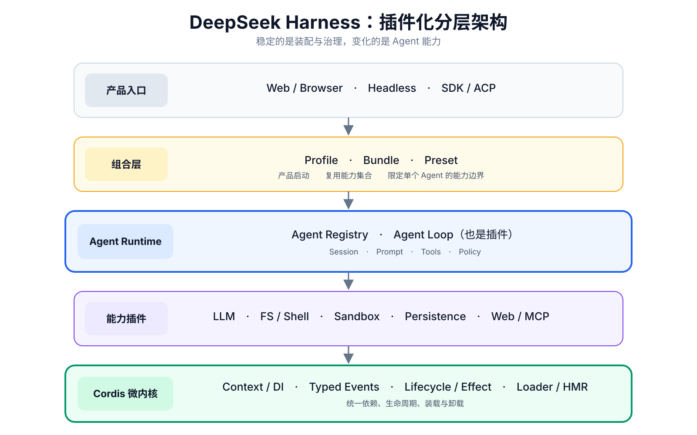
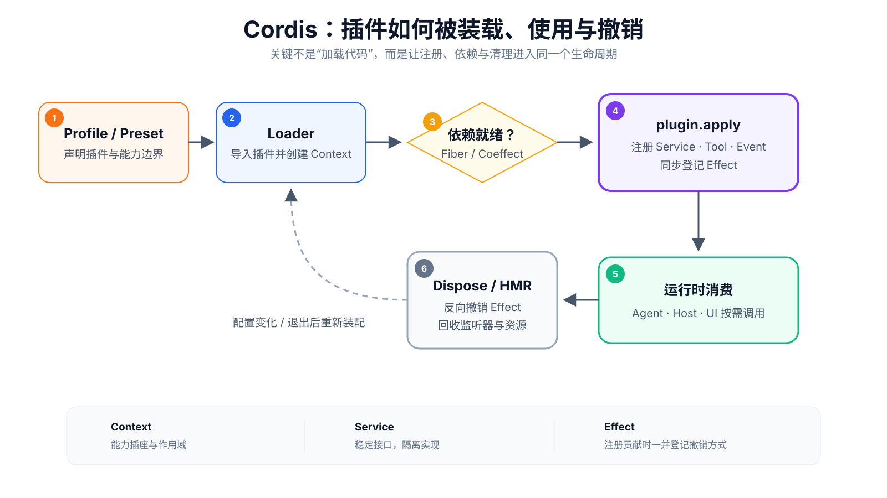
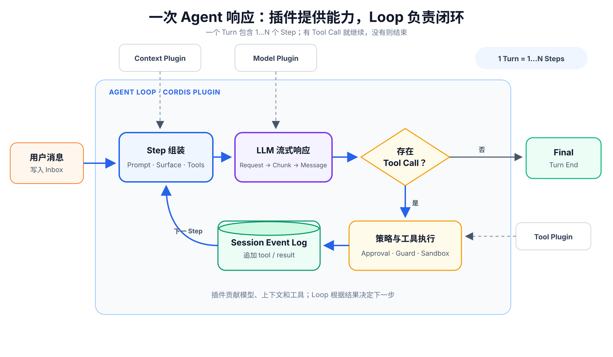

# 深入 DeepSeek Harness 源码和开发过程——我学到了什么

Agent Harness 不是模型本身，而是把模型、上下文、工具、执行环境、会话和 UI 组织成可运行 Agent 的系统底座。多数 Harness 以固定 Agent Loop 为中心；DSH 则以插件运行时为中心，连 Loop 也纳入插件治理。

## 先说结论
- **DSH 不是在造一个 Agent，而是在造“组装 Agent 的平台”。** 模型、工具、上下文、权限、存储和 UI 都可以组合成不同产品。
- **Agent 不再是一条写死的流水线，而是一组可组合的原子能力。** 底层负责统一装配、替换和回收，上层按场景选择能力。
- **连指挥 Agent 的 Loop 也只是一块插件。** DSH 把真正稳定的部分下沉到基础能力与治理规则，为未来不同 Agent 形态留出空间。
- **能力越多，越不能一次全部塞给模型。** Tool 提供原子动作，Skill 提供使用方法，模型根据任务逐步发现和组合。
- **DSH 把可观测性直接做进会话，而不只把 Trace 输出到后台。** Trajectory 将动态执行路径、耗时和上下文变化与回答放在一起诊断。
- **AI 时代，代码生成不再稀缺，验证和删除才稀缺。** DSH 用 Spec、测试门禁和持续减法，把高生成速度转化为可合并、可维护的迭代速度。

## 一、核心架构：插件如何动态组合

先用四层看主干：产品入口 → 组合层 → Agent Runtime → Cordis 微内核。

```text
产品入口：Web · Headless · SDK · ACP
                    ↓
组合层：Bundle · Profile · Preset
                    ↓
Agent Runtime：Loop · LLM · Tools · Session · Policy
                    ↓
Cordis 微内核：可逆副作用 · 响应式依赖 · 生命周期
```




图中的关键不是“插件很多”，而是**同一套组合机制同时作用于 Host、Agent Runtime 和 Browser Client**。

### 1\. 四层结构

| 层级 | 主要内容 | 解决的问题 |
|------|------------|---------------|
| 产品入口 | Web、Headless、SDK、ACP | Agent 从哪里被使用 |
| 组合层 | Bundle、Profile、Preset | 不同产品装配哪些能力 |
| Agent Runtime | Loop、LLM、Session、Tools、Prompt、Policy | 一次 Agent 执行如何完成 |
| 微内核 | Cordis Context、Service、Effect / Coeffect、Fiber、Loader | 插件如何依赖、协作、卸载和热更新 |

其中，Headless 是无交互界面的运行模式，ACP 是 Agent Client Protocol；Bundle 是可复用的插件组合，Profile 决定整个产品如何启动，Preset 决定某个 Agent 使用哪些 Prompt、工具和策略。Capability Seam 指能力替换接口，HMR 指热更新。

工程底座是 **Node.js 22.19\+/24\+、TypeScript 6、ESM、pnpm 11**；浏览器端使用 React 18 与 Vite 6，包通过 npm 发行。

从源码看，真正决定 DSH 形态的五个架构基座是：**微内核插件化、能力契约分层、事件式会话、作用域组合和统一工具治理**。后文分别展开；“Loop 也是插件”是前两项共同作用的结果。

### 2\. “动态组合”发生在四个时点

| 时点 | 组合机制 | 结果 |
|------|------------|------|
| Host 启动 | Bundle \+ Profile | 选择 Web、Headless 等产品形态及基础 Provider |
| Agent 创建 | Preset \+ Agent Scope | 为该 Agent 安装工具、Prompt、模型、权限和子代理能力 |
| 执行过程中 | Event / Middleware / Capability Seam | 按调用执行审批、超时、审计、压缩、工具拦截等策略 |
| 配置变化 | Loader Reconcile \+ HMR \+ Effect Dispose | 按配置差异撤销、替换；失败时回滚旧组件 |

因此，更准确的说法是：
> **Agent 是一个由 Host 治理、在多个阶段动态装配能力的执行过程。**

它不是让模型在每轮推理时任意改写系统，也不等于“所有插件都能运行中随意热切换”。

### 3\. Cordis 是什么

通俗地说，**Cordis 是 DSH 的插件运行时与动态装配内核**，不是 Agent 的大脑。插件通过 `Context` 声明“运行需要什么”，并在产生副作用时同时登记“退出时如何撤销”；依赖出现、消失或更换后，Cordis 再协调相关组件激活或卸载。



| 名词 | 通俗理解 | 工程作用 |
|------|----------|----------|
| Context | 运行环境与能力插座 | 插件从这里取得依赖、发布能力 |
| Service | 标准接口 | Provider 与 Consumer 不必互相硬编码 |
| Event / Waterfall | 协作通道 | 按顺序通知、改写、拦截或否决 |
| Effect | 可撤销的贡献 | 注册能力时同步登记清理函数 |
| Coeffect | 响应式依赖 | 依赖出现、消失或替换时协调组件启停 |
| Fiber | 组件生命周期单元 | 聚合 Effect 与 Coeffect，并负责整体销毁 |
| Loader / Include / HMR | 装配器 | 将配置变成可加载、卸载和热更新的插件组合 |

论文把 Cordis 的核心能力概括为：**空间解决“插件插在哪里”，时间解决“插件何时插入、替换和拔出”。**

| 维度 | 机制 | 对 DSH 的价值 |
|------|------|----------------|
| **时间可组合性** | 依赖出现、替换或消失时，组件随之启动、重建或退出，并撤销旧贡献 | 支持动态加载、卸载和 HMR，不遗留 Tool、监听器与资源 |
| **空间可组合性** | 不同 Context / Agent Scope 分别解析本地的模型、工具和策略实现 | 多个 Agent 可以采用不同能力组合，同时运行而互不冲突 |

> **边界：**空间可组合性是依赖与状态的作用域隔离，不是容器或安全沙箱。Cordis 也不能自动撤回网络发送、外部写入等副作用，仍需延迟提交或业务补偿。

### 4\. 为什么 Loop 也能成为插件

传统 Harness 往往把工具、权限、压缩、持久化等能力不断堆进一个“巨型 Loop”。在 Cordis 中，组件只需声明依赖、贡献能力并接受统一生命周期治理，因此 DSH 可以把 Loop 从系统唯一中心降为可替换的编排器，把稳定中心下沉为 **Agent 契约、Registry 与事件协议**：

```text
Web / SDK / ACP
      ↓
AgentRegistry → AgentFactory 契约
                      ↑
              agent-loop 插件实现并注册
```

- `dsh-agent` 只定义 `Agent`、`AgentFactory` 和事件协议。
- `agent-loop` 是普通的 Host 级 Cordis 插件，实现 `AgentFactory` 后注册到 Registry。
- UI、SDK、持久化和工具策略依赖契约与事件，不直接依赖这个具体 Loop。
- 插件卸载时，运行时会注销 Factory，并停止、等待它创建的 Agent。

这里采用的是清晰的三段式：**Service Definition** 定义能力契约，**Provider** 提供实现，**Consumer** 只通过契约调用。例如 `dsh-agent` 定义 `AgentFactory`，`agent-loop` 提供实现，而 Web、SDK 与 ACP 只依赖 `ctx.agents`。因此可替换的不是几处回调，而是整套 Loop 实现。

这意味着未来可以替换 Loop 实现，而不必重写上层产品。需要注意：**当前仓库只有一个具体 Loop**；它已经建立了真实替换缝，但还不是成熟的“多 Loop 生态”。Loop 也不是每个 Step 临时更换：Host 选择 Loop Provider，Preset 为每个 Agent 绑定周边能力，每个 Step 再从这些能力中组装请求。

架构边界明确后，下一步看这些插件如何共同完成一次真实响应。

## 二、一次 Agent 响应（Turn）的流程链路



一次用户输入会启动一个 **Turn**；一个 Turn 包含 0～N 个 **Step**。每个 Step 完成一次“组装上下文 → 调用 LLM → 处理响应”：如果模型发起工具调用，结果会写回 Session，并进入下一 Step；没有工具调用时，Turn 才结束。

| 阶段 | 系统行为 | 插件参与点 |
|------|----------|------------|
| 接收输入 | Web / SDK 将消息写入 Inbox，唤醒 Agent | Agent API、Inbox 事件 |
| 准备 Step | 从当前 Surface 取历史，组合 Prompt、Tools、Runtime Context 与模型配置 | Preset、Prompt、Context、`pre-step` |
| 请求模型 | Agent Loop 调用 LLM Provider，并把流式 chunk 与最终消息事件化 | Model Adapter、Routing、Retry、`llm/stream` |
| 工具回环 | 工具调用经过权限、审批、超时和 Sandbox 策略；结果写回 Session 后开始下一 Step | `tools/pre-execute`、Guard、Approval、Sandbox |
| 完成 Turn | 没有待执行工具或新消息时写入 `turn/end`，Agent 回到 idle | `turn-stopping`、Persistence、UI、Telemetry |

无论工具来自官方插件、MCP 还是 Agent Scope，最终都经过同一个 `ToolRuntime`：**参数校验 → 审批与 Guard → 执行与超时 → 结果校验 → Session 记录**。治理规则因此不必散落在每个工具实现中。

三层各司其职：Loop 推进 Turn / Step，Preset 绑定 Agent 的能力边界，Session Event Log 记录过程并供 UI、Persistence 和审计共同消费。因此，一次响应不是单次 LLM 请求，而是工具结果持续驱动的事件闭环。

### 轨迹：DSH 把可观测性做进会话

多数 Agent 产品是“聊天页看结果、后台 Trace 查过程”。**DSH 的特别之处是把 Trajectory 做成 Web 会话的原生插件：Chat 与 Trajectory 读取同一份 Session Event Log，回答与诊断始终对齐。**

```text
同一份 Session Event Log
        ├─→ Chat：最终说了什么
        └─→ Trajectory：这次执行如何发生
```

这对 DSH 尤其重要：模型会逐 Step 选择 Tool、加载 Skill，并调用插件能力；执行路径无法完全预先确定，Trajectory 负责把实际路径还原成可检查的时间线。

| 视图 | 重点信息 | 主要用途 |
|------|----------|----------|
| Overview | Input / Model / Tools 泳道，TTFT、生成与工具耗时 | 找瓶颈、并发和长耗时调用 |
| Ledger | Turn / Step、Assistant、Tool / Subtool、Compaction | 还原真实回环与调用顺序 |
| Inspector | Prompt、Tool Schema、输入输出、Token / 缓存、重试与错误 | 检查模型当时看到的内容、成本和异常 |

- **像 Chrome DevTools：**时间轴交互接近 Performance，单次请求检查接近 Network；源码也直接称其为 “Chrome-Network-style overview”。
- **不同于外部 Trace 平台：**DSH 优先解决当前会话的即时诊断；LangSmith 等平台更擅长跨运行聚合、评测和分布式追踪。
- **观测本身也是插件：**Trajectory 只读投影 Session 事件，不改写 Chat，也不占用模型上下文。

> **边界：**它是 Agent 语义事件剖析器，不是 CPU / APM；没有写入 Session 或没有轨迹映射的插件内部行为不会自动显示，也不能据此确定性重放外部副作用。

轨迹把执行中已经发生的事情摊开；模型接下来能做什么，则取决于当前 Agent 能发现哪些能力。

## 三、Agent 如何发现并组合 Skill、Tool 与插件能力

### 1\. LLM 如何找到能力

DSH 没有额外的“能力搜索 Agent”，也不做向量检索或独立排序。运行时先从当前 Agent Scope 计算出可见能力，再把 Tool Schema 和 Skill 摘要作为**菜单**交给 LLM；模型依靠自身的语言理解，将任务与名称、描述进行语义匹配并产生调用，Runtime 只负责校验和执行。

```text
Tool Registry  → request.tools：name + description + JSON Schema ─┐
Skill Registry → <available_skills>：name + description          ├→ LLM 选择
                                                               ┘
                 ├─ 普通 Tool → tool_call(name, args) → 执行
                 └─ Skill → skill(name) → 完整说明进入下一 Step
```

| 能力 | Agent 最初看到什么 | 如何使用 |
|------|-------------------|----------|
| Tool | LLM 请求中的名称、描述和参数 JSON Schema | 模型直接产生 `tool_call(name, args)`，再经过权限、审批、超时和执行流水线 |
| Skill | Session 中 `<available_skills>` 目录里的名称与简短说明 | 模型调用 `skill(name)` 后，完整 `<skill_content>` 才进入下一 Step；用户也可用 `/skill-name` 直接注入 |

具体机制分三步：

1. **Agent 创建时定边界。** Preset 将 Prompt、可见工具、策略和 Skill 来源绑定到 Agent Scope；插件与 MCP 也可以向同一 Tool Registry 注册新能力。
2. **每个 Step 把菜单呈现给模型。** Agent Loop 将可见 Tool Schema 放进 LLM 请求；`pre-step` 把 Skill 摘要目录作为持久的用户角色提醒写入 Session。目录变化时整体替换，正文仍不提前加载。
3. **模型选择，Runtime 校验。** 选择来自 LLM 的语义判断，不是 Harness 的关键词路由；但真正执行时仍按同一个 Scope 再检查可见性，并经过 Guard、Approval、Sandbox 和结果校验，避免模型调用未暴露的能力。

这是一种**渐进式能力披露**：Tool 保持原子化，Skill 保存“什么时候、按什么步骤组合工具”的程序性知识。生态规模扩大时，模型仍只加载当前需要的详细说明，减少固定上下文成本。

### 2\. 默认 Web Coding Agent 的基础工具

Web 默认使用 `standard` Preset。

| 类别 | 默认工具 |
|------|------------|
| 文件与代码 | `read`、`read_image`、`write`、`edit`、`glob`、`grep` |
| Shell 与任务 | `bash` / `pwsh`、`job_output`、`job_list`、`job_kill` |
| 规划与工作流 | `create_goal`、`get_goal`、`update_goal`、`todo_write`、`workflow`、`ralph` |
| 多 Agent | `subagent`、`subagent_fork`、`send_message`、`list_agents`、`interrupt_agent` |
| 外部知识 | `web_search`、`skill` |
| 人机协作 | `ask_user_question`、`exit_plan_mode` |

默认有 `web_search`，但不开 `web_fetch`。终端、LSP、Session Query、Schedule、MCP、E2B 等能力可通过其他组合启用。

`workflow` 不是另一套 Loop，而是 Agent Loop 可以调用的批量编排工具：

```text
Agent Loop → workflow 工具 → Worker 脚本 → 多个子 Agent → 聚合结果 → 下一 Step
```

普通任务默认由 Agent Loop 边执行、边观察、边决策：能力保持原子化，Skill 和知识按需加载，模型逐 Step 组合下一步。只有任务能够稳定拆分，并且需要并行或流水线处理时，才适合使用 Workflow。

### 3\. 四种 Web Preset

这四种并不是四套 Loop，而是 Web 为 Agent 预置的四套能力组合模板。

| Preset | 模型看到的能力 | 适用场景 |
|------|---------------------|------------|
| `standard` | 完整原生工具集 | 默认 Coding Agent |
| `code` | 主要暴露 `run_code`，内部通过生成的 TS SDK 调工具 | 让模型用代码组织多步调用 |
| `cordis` | Standard \+ 动态定义、运行和停止 Cordis 插件的工具 | 自修改与实验 |
| `minimal` | 仅 Shell \+ `str_replace_editor` | 最小执行面 |

Agent 创建时绑定 Preset，执行过程中模型只在其能力边界内按 Step 组合工具与策略；Preset 通常不会每 Step 重新安装或任意切换插件。Profile 决定产品如何启动，Bundle 是可复用插件组合，Preset 则决定单个 Agent 的 Prompt、工具和策略。

### 4\. 当前插件可分为六类

| 分类 | 代表能力 |
|------|------------|
| 内核与协议 | Agent、Session、Tools、Context、Hooks、类型与诊断 |
| 模型与上下文 | LLM Provider、Prompt、Compaction、附件、路由 |
| Agent 编排 | Goal、Plan、Skill、Subagent、Workflow、Todo、Guard |
| 工具与执行 | FS、Shell、Jobs、Terminal、LSP、MCP、Web、Code Runtime |
| 数据与安全 | Persistence、Storage、Credentials、Approval、Sandbox、Subprocess |
| 产品与扩展 | Host/API、SDK、ACP、Browser Client、Bundle、Extensions |

当前 `packages/` 下有 **219 个公开第一方叶包、49 个领域组**。这不是整个 workspace 的包数，也不等于 219 个用户可安装插件；其中还包含协议包、Provider、Bundle、UI 叶包和测试支持。

### 5\. 插件生态：从官方能力走向社区共建
- **生态价值：** 生态不是插件数量，而是稳定的 Service Definition、可替换实现、分发与兼容治理。模型、工具和运行环境变化太快，单一团队无法覆盖全部长尾需求；被广泛依赖的头部契约和插件还可能逐渐成为事实标准。
- **共建基础：** Service Definition、Capability Seam 和统一生命周期让第三方只实现自己的 Provider 或 Consumer，不必修改 Agent Loop。
- **分发路径：** 插件可打包为 out-of-tree Bundle，通过 npm、Git、本地目录或 tarball 安装，再由 Profile 组合；GitHub 的 `dsh-plugin` Topic 负责发现。
- **共建范围：** 插件不仅能增加模型和工具，也能扩展 Sandbox、存储、MCP、Host API、Browser UI，甚至形成新的产品 Profile。

README 已通过 GitHub Discussions、dsh-plugin Topic 和 Discord 主动邀请反馈、插件发布与社区协作。这说明 DSH 希望从“官方提供大量能力包”继续走向“社区共同扩展平台”。但当前仍是 Developer Preview：接口兼容主要依赖 npm peer dependency 与语义化版本，插件信任、质量认证和发现机制仍需完善。

能力可以持续扩展，但模型上下文不能无限增长；下一章看 DSH 如何把完整会话与当前推理视图分开治理。

## 四、会话增长时，DSH 如何控制模型上下文

核心问题是：历史不断增加时，如何既保留完整会话记录，又避免把全部内容反复发送给模型？

```text
Session Event Log（持续追加会话事件）
        ↓ 增量派生
Surface（模型当前可见消息）
        ↓ 上下文压力过高
Compaction（摘要 + replacement 事件）
        ↓
新的 Surface
        ↓
Prompt + Tools + Runtime Context → 下一次 LLM 请求
```

- **日志不直接充当上下文。** Session Event Log 保存会话交互记录；Surface 才是模型当前看到的视图。
- **Surface 增量派生。** 每个 Step 使用当前 Surface，不需要反复重放完整日志。
- **Compaction 改视图、不删除原事件。** 摘要和 replacement 作为新事件追加，旧事件仍可审计和恢复，模型只看到压缩后的版本。
- **检索是可选能力。** 默认会话持久化使用 JSONL + zstd；SQLite FTS、Session Query 或 RAG 可以通过插件接入，但 DSH 没有内置统一向量知识库或自动长期记忆。

与其他 Agent 的差异不在于“有没有摘要压缩”——多数成熟 Agent 都会做摘要或裁剪，而在于 DSH 把它做成可回放、可替换的运行时协议：

| 许多 Harness 的常见做法 | DSH |
|---|---|
| Loop 直接持有当前消息数组 | Session Log 是事实源，Surface 是派生视图 |
| 压缩直接改写或裁剪当前上下文 | 追加 replacement 事件，原始事件仍留在日志中 |
| Memory、RAG 与 Agent 实现绑定 | Compaction、检索和持久化通过插件独立演进 |
| UI 与存储各接一套回调 | Chat、Trajectory、Persistence 和审计从同一 Session 事件流派生 |

Provider Prompt/KV Cache 只复用模型计算，不属于会话记忆机制。

运行时已经解决了能力组合与上下文治理，下一步才是把它包装成可使用、可部署的产品。

## 五、从 Runtime 到产品：运行环境、交互与安全边界

DSH 采用 **Web local-first**：浏览器负责交互，本地 Node Host 负责运行 Agent、工具、文件和进程。

| 选择 | 为什么这样做 | 主要边界 |
|------|-------------|----------|
| Node.js + TypeScript Runtime | 同时适合插件生命周期、类型契约、npm 分发，以及本地文件、进程和 PTY 操作 | CPU 密集计算与强隔离交给 Worker、原生组件或远程 Provider |
| Web local-first | 浏览器负责 UI，本地 Node Host 运行 Agent；HTTP POST 负责上行，两条只下行 WebSocket 分离 Session 与 Host 事件，避免 SSE 长连接挤占 HTTP/1.1 同源连接 | 当前没有 Electron，TUI 已移出核心仓；云端部署时 Host、工作区与鉴权也要一起迁移 |
| 本地执行护栏 | 默认 `workspace-write`，把文件写入限制在工作区和临时目录；隔离实现可替换为远程 Provider | 主要防误写，不限制文件读取、网络和系统调用；多租户仍需容器或远程沙箱 |

产品形态上，TUI（如 Claude Code、Pi）面向终端，Electron（如 VS Code、Cursor、Qoder）面向桌面；DSH 当前正式交付的是 Web，并通过本地 Node Host 保持对项目环境的低延迟访问。Web 也更适合承载 Trajectory 这类高密度、可缩放和可检查的诊断界面，而不只是聊天壳。部署到云端时，浏览器仍只是交互层，但 Node Host、工作区和沙箱也必须一起迁到服务器侧。

技术架构解释了系统如何运行；仓库治理则解释了团队为什么能如此快地迭代。

## 六、65 天、12,293 次提交：高速开发如何被控制

```text
AGENTS.md / Spec
  → Coding Agents 并行实现
  → Unit / Snapshot / Browser E2E / 发布包测试
  → Gate DAG / CI
  → 可验证、可合并的快速迭代
  → 无真实消费者的路径及时删除
```

### 1\. 先看正确口径

| 指标 | 当前可达历史 |
|------|------------------|
| 开发跨度 | 2026-06-10 至 08-13，共 65 个日历日 |
| 提交 | 12,293：5,610 merge \+ 6,683 non-merge |
| 主线 | first-parent 仅 972 个节点 |
| 决策与门禁 | 683 份英文 Agent Note、123 个根脚本、15 条 CI 工作流、28 项文档检查 |

12,293 次提交反映的是高并行分支、批量合并和密集评审，不等于 12,293 个独立功能。

### 2\. 团队把开发协议编译进仓库

| 层级 | 载体 | 作用 |
|------|------|------|
| 长期规则 | `AGENTS.md` | 规定插件边界、生命周期、验证和文档原则 |
| 决策 / Spec | Agent Notes | 记录背景、方案、备选、验收与后果 |
| 可复用流程 | Skills | 固化评审、简化、发布等工作流 |
| 机械裁判 | Tests、Snapshots、Gates、CI | 阻止实现、文档和生成物漂移 |

这是一种 **Spec-driven development**：Markdown 不直接生成全部代码，但非平凡变更必须让决策、实现和验收在同一 PR 中同步演进。

当前 HEAD 的规模也说明了这种投入：

| 内容 | 文件数 | 体积 / 行数 |
|------|---------|---------------|
| Markdown | 2,355 | 16.9 MB / 16.9 万行 |
| 非测试生产源码近似口径 | 1,569 | 11.4 MB / 26.6 万行 |
| 全部程序源码 | 2,644 | 24.7 MB / 57.4 万行 |

准确结论是：**Markdown 的文件数和体积超过非测试源码，但没有超过全部代码文件，更没有超过代码行数。** 其中 1,078 个 Markdown 是双语镜像。

### 3\. 为什么可以迭代这么快
- **Coding Agents 是主要生产者：** 质量门禁文档对此有明确说明。
- **契约先行：** 小团队或多个 Agent 可以围绕 Service Definition 并行开发 Provider 与 Consumer。
- **规则可执行：** Agent Notes、Skills 和 CI 减少重复解释，也降低评审的随机性。
- **高密度分支与评审：** Git 图显示明显的堆叠开发、批量重放和集中合并特征。
- **敢于整条删除：** 试验没有真实消费者时，不用沉没成本保护它。
- **测试驱动：** 759 个 spec、26.8 万行测试代码（高于 22.8 万行 src），覆盖 Unit、Snapshot、真实 API、Browser E2E 和发布包；配合 Gate DAG/CI，把 AI 生成速度转化为可合并、可持续的迭代速度。

公开历史中 Codex 痕迹最强：195 次来自 `codex/` 分支的 PR merge，65 个标题含 “Codex review”；可见 `claude/` 合并 PR 为 3 个。Git 只能证明工作流痕迹，不能据此计算 AI 写了多少代码，也不能推断唯一使用的工具。

### 4\. AI 时代，删除代码被制度化

| 指标 | 结果 |
|------|------|
| 非合并提交中整提交净删行 | 860 / 6,683，约 12.9% |
| 标题涉及重构、清理、删除或简化 | 904 / 6,683，约 13.5% |
| 大删除 | 210 次净删 100\+ 行，其中 41 次超过 1,000 行 |
| 简化决策 | 48 份生效、27 份归档 |

代表性整线收缩：TUI 净删约 **2.75 万行**，ACP 收缩约 **1.74 万行**，未发布 SDK 项目工具链净删约 **1.48 万行**。

仓库还提供专门的 `dsh-find-simplifications` Skill，主动寻找 dead、duplicated、speculative 和 over-built 实现。它证明的是“删除已成为固定工程环节”；“AI 导致了每一处膨胀”则无法从 Git 历史直接证明。

### 5\. 为什么删除 TUI，却保留 Web

| 决策 | 依据 |
|------|------|
| 删除仓内 TUI | 加入约 18 天后仍无正式发布组合，却承担产品级 Renderer、交互适配和快照维护；删除时仅 TUI 包移除约 2.06 万行 |
| 保留 Web | 已有正式 Profile、真实产品消费者和端到端验收，同时验证 Browser 插件体系 |

结论不是“终端无价值”，而是：**核心仓只长期维护有明确部署与验收责任的产品面；其他形态应走独立 Bundle。**

### 6\. “一切皆插件”从第一天形成

| 时间 | 变化 |
|------|------|
| 根提交 | 只写明项目基于 Cordis |
| 建仓约 14 分钟后 | 明确提出 `everything is a plugin` |
| 次日 | Cordis、抽象服务包和插件化 Agent Loop 连续落地 |

它不是后期包装的口号，而是首日确定、次日进入实现的架构原则；但“一切皆插件”不等于没有内核，服务定义、事件协议与生命周期规则就是稳定边界。

### 7\. 主要架构演进

| 阶段 | 核心变化 | 背后考量 |
|------|------------|------------|
| 6/10—6/20 | 微内核、Cordis、服务契约、Agent Loop、事件式 Session | 先建立可替换边界 |
| 7/9—7/21 | Agent Scope、多 Agent、TUI | 验证按 Agent 隔离与多前端可能性 |
| 7/22—8/4 | Web/Host/Client 插件体系；删除 TUI | 从技术 Demo 收敛到有部署责任的产品面 |
| 8/6—8/13 | Bundle、Profile、Preset、npm 发行 | 把内部模块体系变成可分发平台 |

在形成最终判断前，再把 DSH 放回主流框架与产品中比较。

## 七、与 LangChain、LangGraph、Pi、Claude Code 的区别

| 项目 | 最强项 | 与 DeepSeek Harness 的主要差异 |
|------|---------|------------------------------------|
| LangChain | 模型、工具、Retriever 与集成生态 | 更偏应用组件库；Harness 把 Loop、权限、Session、Host 和 UI 都纳入插件生命周期 |
| LangGraph | 显式状态图、持久执行、恢复与 Human-in-the-loop | 更适合图式工作流；Harness 更强调微内核、能力替换和完整产品装配 |
| Pi | 极简、终端优先且高度可扩展的 Coding Harness | Pi 以稳定 Agent Loop 为中心，通过 Extension 扩展工具、上下文、Provider、Session 与 TUI；Harness 再向内一步，把 Loop 本身纳入 Cordis 插件装配 |
| Claude Code | 成熟 Coding 产品、终端体验、Hooks、MCP 与插件市场 | 产品和生态更成熟；Harness 更白盒、更可替换，Loop 与 Browser 都可由插件组合 |
| DeepSeek Harness | 从运行时到 Web/SDK/发行的一体化插件平台 | 纵向链路更完整，但仍是 Developer Preview，复杂度、兼容性和生态成熟度是现实成本 |

这不是简单的“谁更全面”：
- 快速组装 LLM 应用与集成：优先看 **LangChain**。
- 明确、可恢复的业务状态机：优先看 **LangGraph**。
- 极简、成熟、可按个人工作流深度改造的终端 Coding Agent：优先看 **Pi**。
- 直接使用成熟 Coding Agent：优先看 **Claude Code**。
- 长期经营多模型、多 Agent、多执行环境和多产品面：**DeepSeek Harness 的架构更值得研究**。

这些差异最终指向的不是产品排名，而是 DSH 对 Agent 稳定边界的不同判断。

## 八、我真正学到的五件事
1. **把稳定边界放在基础能力和治理规则，而不是具体 Loop。** 模型、工具和编排策略会持续变化。
2. **插件治理必须同时管理贡献与依赖。** Effect 回答“退出时如何撤销”，Coeffect 回答“具备什么条件才能运行”。
3. **让模型组合原子能力，而不是预加载完整流程。** Tool 提供动作，Skill 提供方法，渐进披露可以降低固定上下文成本。
4. **让一份会话事实派生多种视图。** Chat、Trajectory、模型 Surface、持久化与恢复各取所需；Compaction、Memory 和外部检索也不应混成一个概念。
5. **AI 时代的稀缺能力是验证与减法。** Spec、测试和 Gates 把生成速度变成可合并速度；没有真实消费者的功能、抽象和产品面应及时删除。

适合借鉴：需要长期维护多 Agent、多模型、多执行环境、多前端产品的平台团队。

不宜照搬：只需快速交付单一业务 Agent 的小团队；219 个细粒度包和完整插件治理会带来明显认知与发布成本。

> **DSH 最值得学习的不是某个工具实现，而是一个判断：未来 Agent 的稳定核心可能不是某一种 Loop，而是可组合的原子能力与统一治理规则。**

## 主要依据
- Cordis 理论：[《A Programming Paradigm for Spatiotemporal Composability》论文 PDF（附件）](https://github.com/cordiverse/paper/blob/main/paper.pdf)
- 架构：[README](https://github.com/deepseek-ai/deepseek-harness/blob/master/README.md) · [Architecture](https://github.com/deepseek-ai/deepseek-harness/blob/master/docs/architecture.md) · [Cordis Primer](https://github.com/deepseek-ai/deepseek-harness/blob/master/docs/cordis-primer.md) · [Trajectory](https://github.com/deepseek-ai/deepseek-harness/tree/master/packages/client/ui-trajectory)
- 轨迹对比：[Chrome Performance](https://developer.chrome.com/docs/devtools/performance/reference) · [LangSmith Observability](https://docs.langchain.com/langsmith/observability-concepts) · [OpenAI Agents Tracing](https://openai.github.io/openai-agents-python/tracing/) · [Claude Code Monitoring](https://code.claude.com/docs/en/monitoring-usage)
- 工具与安全：[Tool Catalog](https://github.com/deepseek-ai/deepseek-harness/blob/master/docs/tool-catalog.md) · [Sandbox 边界](https://github.com/deepseek-ai/deepseek-harness/blob/master/packages/sandbox/sandbox/README.md)
- 研发治理：[AGENTS.md](https://github.com/deepseek-ai/deepseek-harness/blob/master/AGENTS.md) · [Agent Notes](https://github.com/deepseek-ai/deepseek-harness/blob/master/.agents/notes/README.md) · [Quality Gates](https://github.com/deepseek-ai/deepseek-harness/blob/master/.agents/notes/implemented/process/2026-06-11-quality-gates.md) · [Simplification Skill](https://github.com/deepseek-ai/deepseek-harness/blob/master/.agents/skills/dsh-find-simplifications/SKILL.md) · [TUI 删除决策](https://github.com/deepseek-ai/deepseek-harness/blob/master/.agents/notes/implemented/simplification/2026-08-04-remove-tui-package.md)
- 对比：[LangChain](https://docs.langchain.com/oss/python/langchain/overview) · [LangGraph](https://docs.langchain.com/oss/python/langgraph/overview) · [Pi Agent Core](https://github.com/earendil-works/pi/blob/main/packages/agent/src/agent.ts) · [Pi Extensions](https://github.com/earendil-works/pi/blob/main/packages/coding-agent/docs/extensions.md) · [Claude Code](https://code.claude.com/docs/en/how-claude-code-works)
